# Viewport Avatar Toolset

Pose and animate Second Life's Bento avatar on a timeline, then export a `.anim` file that uploads as it is.

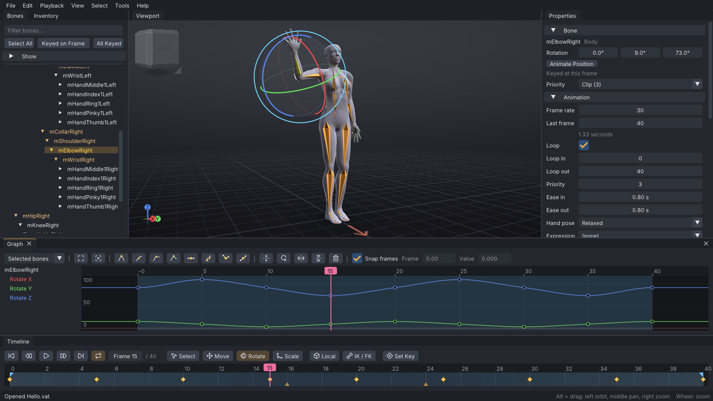

[](LICENSE)
[](.github/workflows/ci.yml)


## What it is

Viewport Avatar Toolset (VATs) is a free, open-source animation editor for Second Life avatars. You pose the full Bento skeleton (133 joints, 47 attachment points and 26 collision volumes) on a timeline, preview the result on the Linden avatar or on a mesh body from a devkit, and export a `.anim` file written the way the viewer writes its own, or a BVH file for other tools. Motion can also come in from BVH, glTF and FBX files made for other rigs, or live from motion-capture apps over your local network. VATs runs on Linux and Windows and is licensed under the LGPL-2.1.

The same editor also runs inside the [SoapStorm](https://github.com/soapyf/soapstorm) viewer, on your own avatar in-world: see [In Second Life](#in-second-life) below and the [Releases page](https://github.com/squeedledorf/viewport-avatar-toolset/releases).

VATs is original software. It was inspired by the work being done on [Hexton Second Life Animator](https://parxofficial.gumroad.com/l/HexAnim) by Parx Oran, another talented Second Life creator.

## Highlights

- **Posing that keys itself.** Rotate, move and scale gizmos with local, world and gimbal axes; every move is a key on the current frame. Type exact degrees and metres in the Properties panel, mirror live to the other side, try a scratch pose before keying it, or pick bones on an outline of the body.
- **IK on every limb.** Arms, legs, fingers, spine, hind legs and wings, each switchable between IK and FK at any frame without a jump, with pole targets for elbows and knees. A hand target dragged out of reach can lean the spine and pull the hips after it.
- **Pins.** Hold a hand, foot or attachment point still in the world, or bind it to another bone so a glass passes from hand to hand or both hands stay on a grip. Pins drive limbs through IK and are baked to plain keys on export.
- **Timeline, graph editor and dope sheet.** Loop and ease markers, frame ranges, a tween slider for breakdowns, blocking with stepped keys and key tags, and curves with six tangent types, easing presets, box select, scaling, an Euler filter and time and value flips. The dope sheet retimes keys across many bones at once; motion paths draw the arc a bone travels.
- **Loop and time tools.** Find the best loop points, close the seam, fit a loop to the beat, take the travel out of a walk (or put it back at a set speed) and check it on a treadmill; retime with markers dragged on the ruler; split a long dance at the beats into parts under 60 seconds.
- **Motion capture, face tracking and clean-up.** Receive the VMC protocol, Rokoko Studio Live and iFacialMocap over UDP, watch the motion on the avatar, record takes with a countdown, punch-in and edge blending, and turn 52 ARKit blendshapes into Bento face-bone motion. One-Euro, Savitzky-Golay and Butterworth filters calm the take, Simplify Curves turns a key on every frame back into a few editable keys, and Motion Quality shows shake, foot slide, hip drift, keys and bytes before and after each step.
- **Face animation and lip sync.** Sliders for the ARKit shapes and VRM presets, a layer of blinks, eye darts and a look-at target, lip sync from the loaded audio or a Rhubarb Lip Sync file, and expression packs: one short face-only `.anim` per expression, ready for a HUD.
- **Retargeting.** Import BVH, glTF, GLB and FBX animations made for Mixamo, CMU and Rokoko, the Unreal mannequin, VRM and Unity Humanoid, or Rigify rigs, or a whole folder at once, corrected for rest pose, with heel-and-toe foot contacts held by IK, and trimmed until they fit Second Life's 250,000-byte and 60-second limits.
- **Dynamics, ragdoll and layers.** Spring chains for tails, ears and hair, jiggle on collision volumes, a ragdoll for the whole body or selected limbs, an idle layer of loop-safe breathing and sway, and overlap that gives a keyed chain follow-through, all baked into keys.
- **Balance.** The centre of mass drawn over the feet's support polygon, red when the pose would topple; Auto-Balance moves the hips back over the feet across a range, and Jump Arc keys the hips on a free-fall parabola.
- **Couples, groups and AO sets.** Several actors in one project on one shared timeline, each with its own body and placement; bind one actor's hand to another's bone; export one `.anim` per actor with a sit-target note and ready-made AVsitter2 and nPose lines. Several clips per project export in one go, with a Firestorm AO or ZHAO-II notecard written for them.
- **Props and mesh bodies.** COLLADA and FBX props, static or rigged, with a starter set; import a devkit body so IK, pins and the export fit its proportions. VATs never copies or uploads devkit files.
- **Export that matches the viewer.** Per-bone priority, hand pose, expression, loop and ease settings; key reduction per bone or by a distance anywhere on the body; a live upload meter with Fit to 250 KB; naming patterns, mirrored copies and copies baked for other avatar heights; files the viewer would reject are refused with the reason.
- **Check it before you upload.** Preview as SL Plays It plays the exported bytes back on the body, with a table of how far each bone strays; the Animation Check lints for loop pops, feet in the floor, frozen bones, body parts passing through each other and more, each with a one-click fix; the Priority Planner shows which animation wins each bone against an AO, a dance or a pose.
- **Reference and listing media.** A picture or a numbered picture sequence behind the avatar or on a plane in the scene, saved with the project; an animated GIF or PNG frames of the finished animation, with an optional turntable, for a listing.
- **Familiar controls.** Industry (Maya-style), Blender, QAvimator and Second Life presets, an orthographic view, lighting presets and a plain backdrop, an audio track with beat markers, onion skinning with pinned ghosts, a hand poser, a pose and clip library, autosave with crash recovery, and built-in help.

## In Second Life

The same editor runs inside the [SoapStorm](https://github.com/soapyf/soapstorm) viewer, on your own avatar, in-world. These are recordings from a live session (click a clip for the full-quality video).

| | |
|---|---|
| [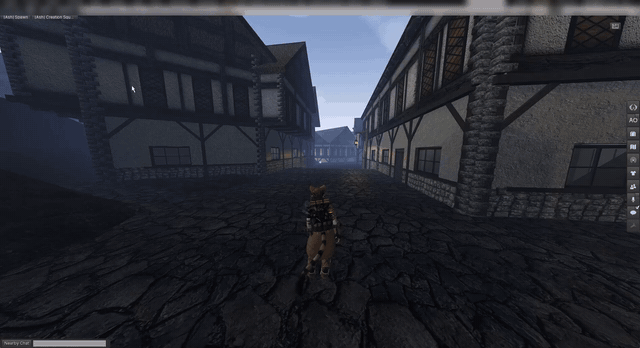](docs/media/showcase/01-open-editor.mp4) | [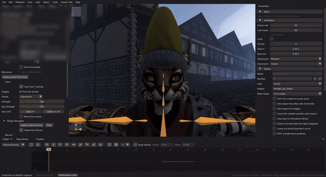](docs/media/showcase/02-face-blink.mp4) |
| **Opening the editor.** Avatar > VATs Editor, and the editor takes over your own avatar, locally. | **Face tracking.** An iPhone drives the face live, blinks included. |
| [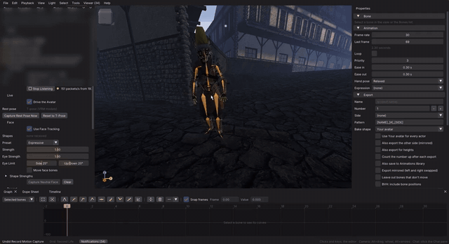](docs/media/showcase/03-body-mocap-dab.mp4) | [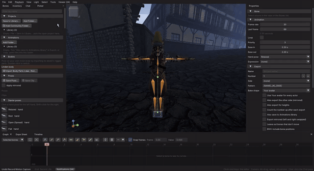](docs/media/showcase/04-sword-in-hand.mp4) |
| **Body capture.** A wave and a dab over the VMC protocol, straight onto the avatar. | **Props.** A hand pose, then the starter sword into the fist, placed with the gizmo. |
| [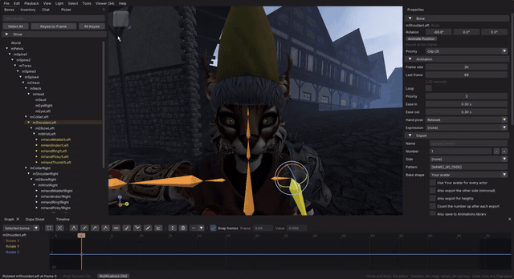](docs/media/showcase/05-face-sliders.mp4) | [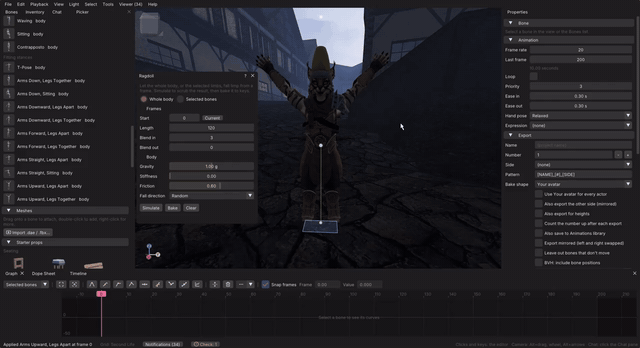](docs/media/showcase/06-ragdoll.mp4) |
| **Face by hand.** The Face window's sliders on a mesh head. | **Ragdoll.** A fall simulated and baked to keys, then uploaded and played in-world. |

## In motion

| | |
|---|---|
| 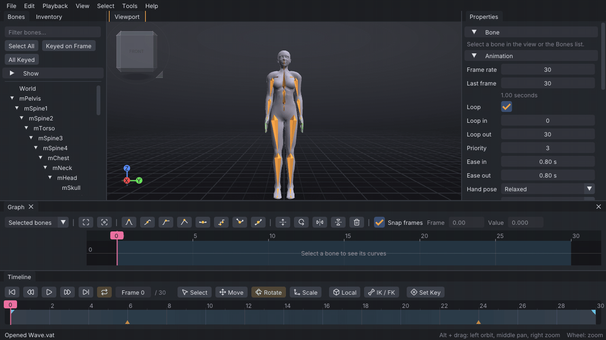 | 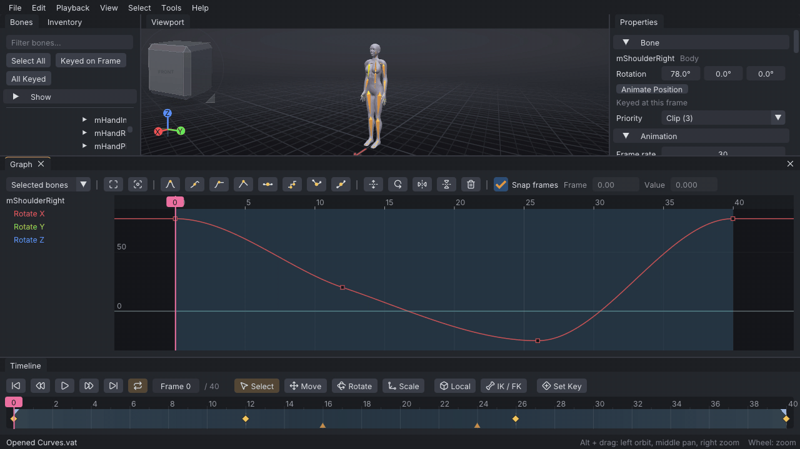 |
| **Posing.** Rotate and move bones with the gizmo; each edit keys the bone and a diamond appears on the timeline. | **Graph editor.** Shape a curve by picking a tangent type and dragging its handles. |
| 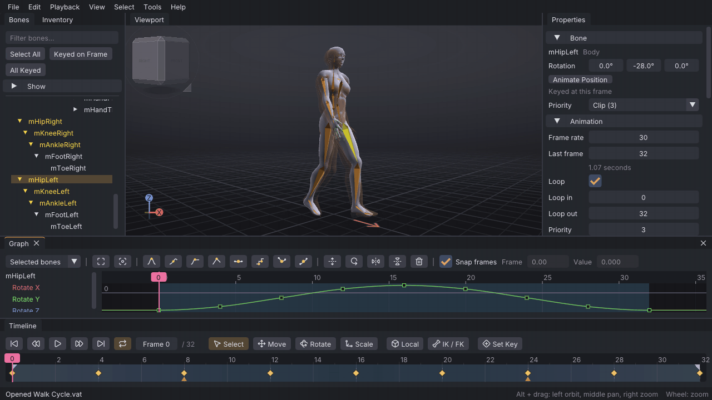 | 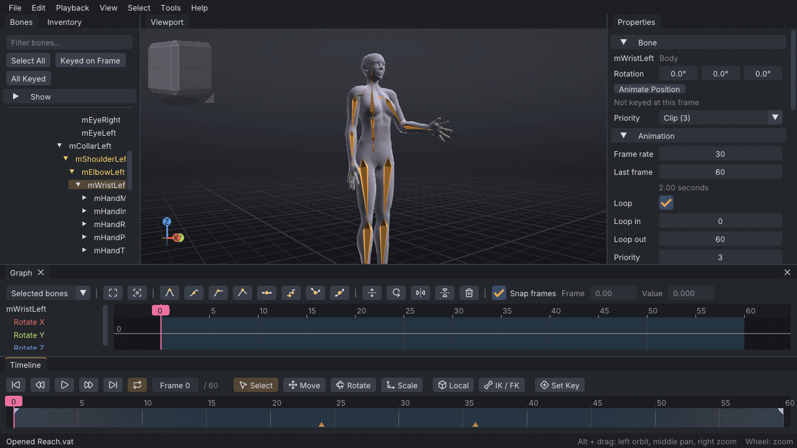 |
| **Playback and onion skin.** A walk loop plays with ghosts of the nearby frames. | **IK and pins.** A pinned hand stays put while the body moves; the arm follows through IK. |
| 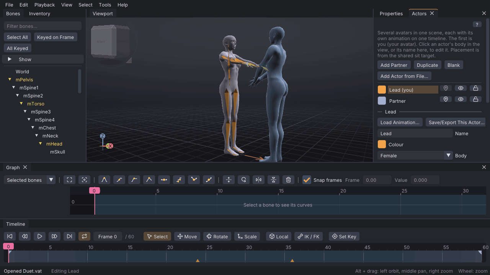 | 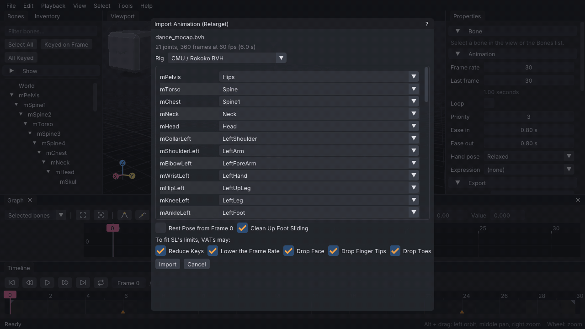 |
| **Couples.** Two actors on one timeline; the partner uses the default body. | **Retargeting.** A BVH or FBX motion from another rig, mapped onto the Second Life skeleton. |
| 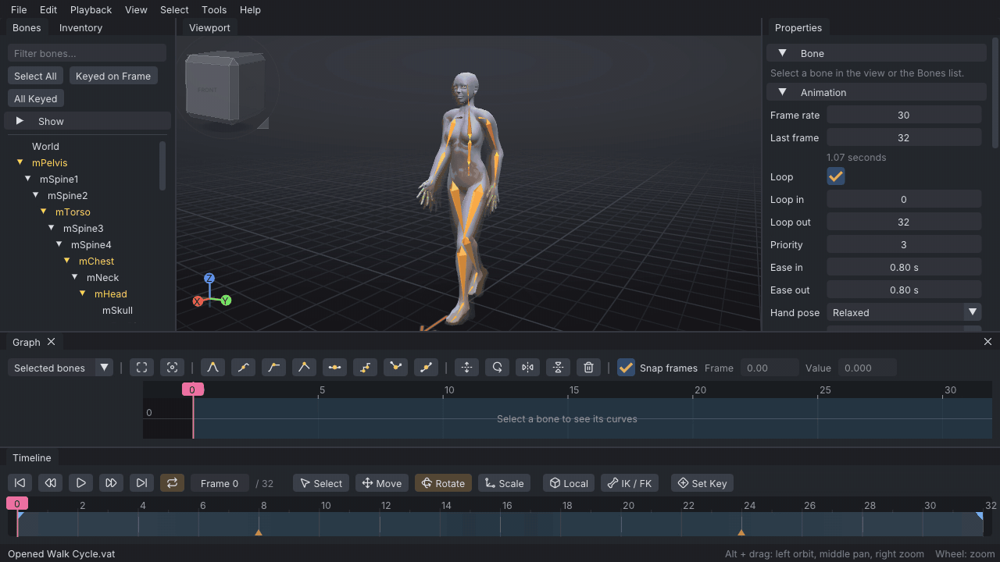 | 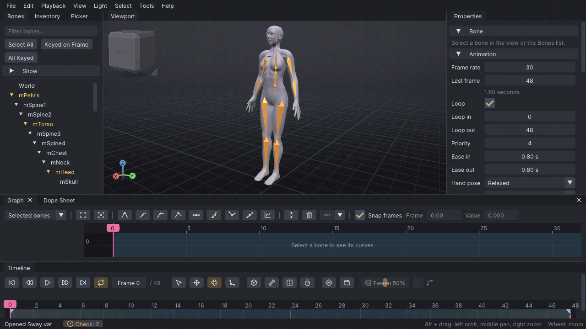 |
| **Help.** Press F1 for the built-in help, with contents and search. | **Animation Check.** Finds a loop that pops and feet off the floor; each Fix is one undo step. |
| 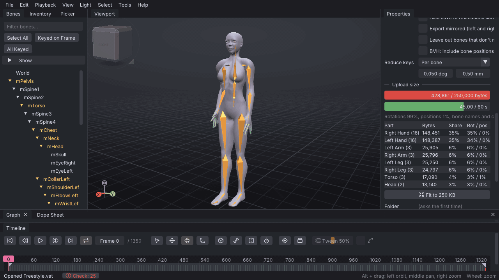 | 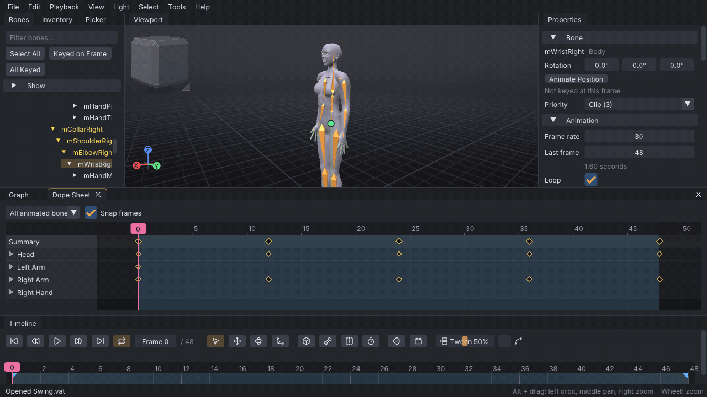 |
| **Preview as SL plays it.** The exported bytes play on the body over a green ghost, with a per-bone table; Fit to 250 KB fixes the size. | **Dope sheet.** Box-select keys across bones, move and stretch them in time, and show a motion path. |
| 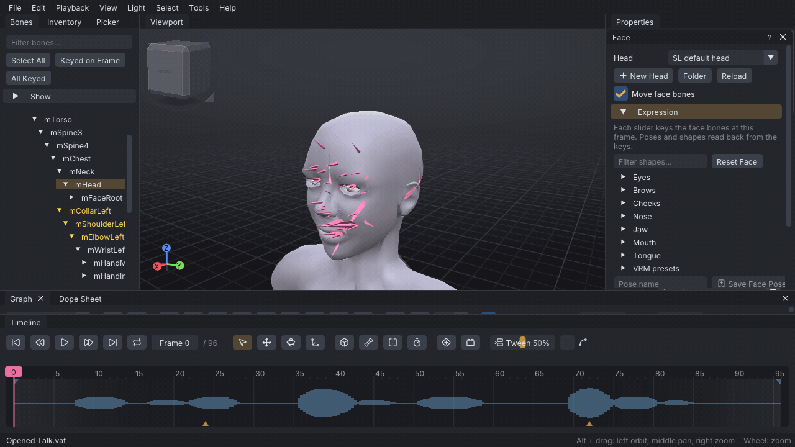 | 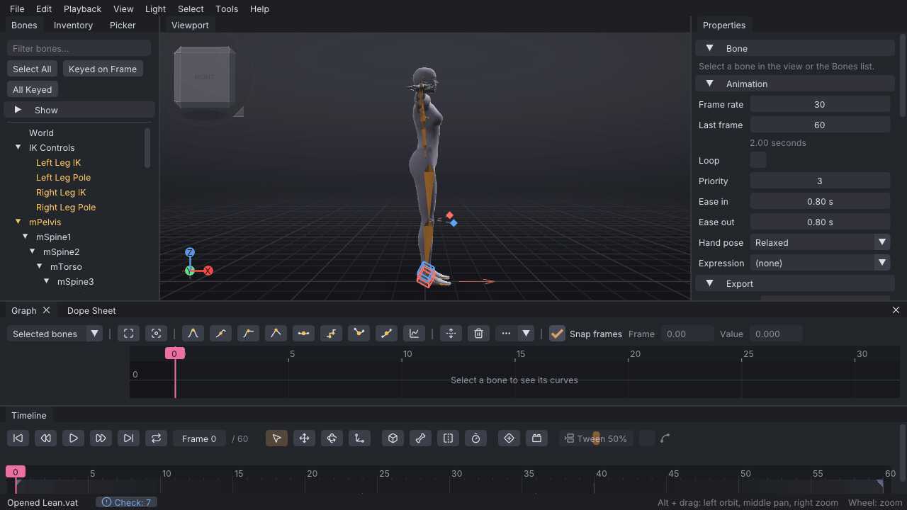 |
| **Face and lip sync.** Sliders set the expression; lip sync from audio puts mouth shapes on the timeline. | **Balance.** The centre of mass turns red outside the feet; Auto-Balance brings it back over them. |
| 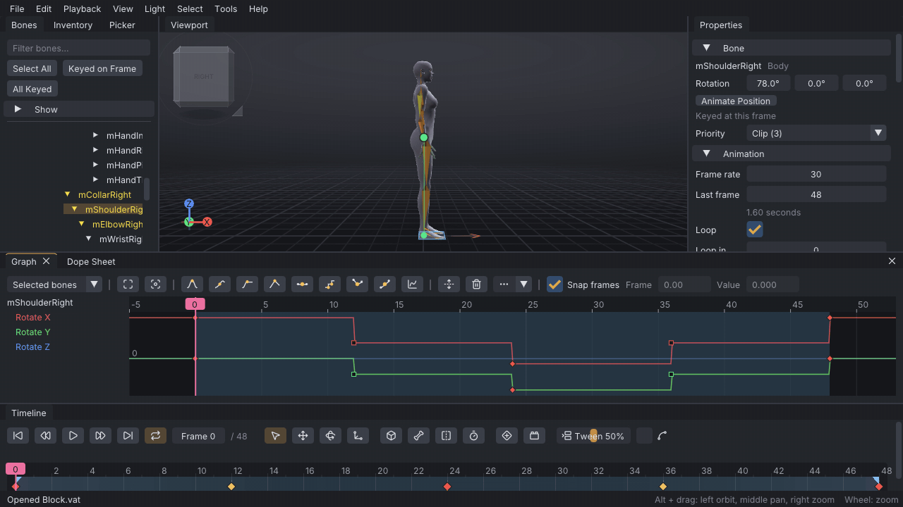 | |
| **Blocking and tweening.** Stepped key poses, a breakdown from the Tween slider, then Convert Blocking to Spline. | |

## Download and install

Builds for Linux and Windows are on the [Releases](../../releases) page. VATs is a folder you unpack and run: nothing needs administrator rights, and nothing is written outside your home folder unless you ask for it.

**Requirements:** a graphics driver with OpenGL 3.3 (core profile) or newer. Linux: x86_64, glibc 2.35 or newer (Ubuntu 22.04 and later), X11 or Wayland. Windows: 64-bit. A macOS build is not yet available.

**Linux** (`viewport-avatar-toolset-<version>-linux-x86_64.tar.xz`): built on Ubuntu 22.04 so it runs on older distributions too, with SDL3 included as `bin/libSDL3.so.0`.

```sh
tar -xf viewport-avatar-toolset-<version>-linux-x86_64.tar.xz -C ~/Applications
~/Applications/viewport-avatar-toolset-<version>-linux-x86_64/bin/vats
```

The folder holds `bin/vats`, `share/viewport-avatar-toolset/` (skeleton data, fonts, starter props, help pages and desktop files), `share/icons/` and an `INSTALL.txt` with the commands for a menu entry and file associations. Keep the folders together: VATs looks for its data beside the executable. **Edit → Preferences → Project files → Open .vat Files with VATs** does the same registration from inside the app.

**Windows** (`viewport-avatar-toolset-<version>-windows-x64.zip`): unpack anywhere and run `bin\vats.exe`. SDL3 ships beside it. The same Preferences button registers `.vat` files for the current user.

**Updating:** unpack the new version over the old folder, or next to it. Settings, libraries and autosaves live in your home folder (`~/.config/viewport-avatar-toolset/` and `~/.local/share/viewport-avatar-toolset/` on Linux, `%APPDATA%\viewport-avatar-toolset\` on Windows), so every version finds them.

## Build from source

You need CMake 3.20 or newer, Ninja, and a C++20 compiler: GCC 11+, Clang 14+ or MSVC 2022. SDL3 is used from the system when `find_package(SDL3)` finds it and otherwise built from its pinned release (3.4.16) as a shared library beside the app; Dear ImGui (1.92.9, docking branch) is fetched at configure time. ufbx and the audio decoders are vendored in `third_party/`.

```sh
cmake -S . -B build -G Ninja -DCMAKE_BUILD_TYPE=Release
cmake --build build
./build/tests/vats_tests
./build/app/vats
```

Options:

| Option | Default | Effect |
|---|---|---|
| `VATS_BUILD_APP` | `ON` | Build the standalone editor (needs SDL3 and OpenGL) |
| `VATS_BUILD_UI` | `ON` | Build the editor UI library, `vats_ui` |
| `VATS_BUILD_TESTS` | `ON` | Build the core tests, `vats_tests` |
| `VATS_FBX` | `ON` | Read FBX files with the vendored ufbx |

`cmake --install build --prefix <dir>` produces the same layout as the release archives. `-DVATS_BUILD_APP=OFF` builds only the core and its tests, with no SDL3 needed.

The code is in three parts: `core/` is the animation engine in plain C++20 with no UI or rendering; `ui/` is every panel, menu and tool window in Dear ImGui, talking to its host through one interface; `app/` is the standalone host, an SDL3 window with OpenGL 3.3 and its own scene renderer. See [CONTRIBUTING.md](CONTRIBUTING.md) for how the pieces fit and how to send changes.

## Documentation

- **Built-in help.** Press **F1** (**Help → Help Contents**) in the app for the full manual with contents and search. **Help → Controls** lists every key and mouse control of the active preset.
- **The same pages in the repository:** [`docs/wiki/`](docs/wiki/vats.md), starting with [Installation](docs/wiki/installation.md), [First steps](docs/wiki/first-steps.md) and [Interface](docs/wiki/interface.md). Reference pages cover the [`.anim` format](docs/wiki/anim-format.md), the [project file format](docs/wiki/project-file-format.md), the [skeleton](docs/wiki/skeleton.md), [keyboard shortcuts](docs/wiki/keyboard-shortcuts.md) and the [command line](docs/wiki/command-line.md).
- **Feature list by area:** [`docs/FEATURES.md`](docs/FEATURES.md).
- **Changes:** [`CHANGELOG.md`](CHANGELOG.md).

## Roadmap

Not built yet, in no fixed order: a macOS build; rigging and weight painting for meshes made elsewhere; video files as reference (a numbered picture sequence works now); an animesh preview; SL-native constraints on export; interface translations; a visible undo history. None of these is in this release.

## Contributing

Bug reports and pull requests are welcome. [CONTRIBUTING.md](CONTRIBUTING.md) covers the layout of the code, the tests and the rules for changes. For a bug report, include the VATs version (**Help → About**), your system and graphics driver, the control preset, exact steps, and the `.vat` project or exported file where it matters; the [Troubleshooting](docs/wiki/troubleshooting.md) page has the full checklist.

## Licence

VATs is free and always will be. Get it only from the [Releases page](https://github.com/squeedledorf/viewport-avatar-toolset/releases); if you paid for it, you were misled. The names "Viewport Avatar Toolset" and "VATs" are covered by [TRADEMARK.md](TRADEMARK.md): forks are welcome under a name of their own.

VATs is licensed under the GNU Lesser General Public License, version 2.1 only; see [LICENSE](LICENSE). The licence covers VATs' own code and data, not the animations you make with it: what you animate is yours.

Bundled third-party code and data are under their own licences, listed in [THIRD_PARTY_LICENSES.md](THIRD_PARTY_LICENSES.md) and [app/assets/props/CREDITS.md](app/assets/props/CREDITS.md).

## Acknowledgements

VATs is built on these open-source projects:

- [Dear ImGui](https://github.com/ocornut/imgui) (MIT), the user interface.
- [SDL3](https://github.com/libsdl-org/SDL) (zlib), the window, input and audio output of the standalone app.
- [ufbx](https://github.com/ufbx/ufbx) (MIT or Unlicense), FBX import.
- [dr_wav, dr_mp3 and dr_flac](https://github.com/mackron/dr_libs) (Unlicense or MIT-0) and [stb_vorbis](https://github.com/nothings/stb) (MIT or Unlicense), audio decoding.
- [Lucide](https://lucide.dev) (ISC; Feather-derived icons also MIT), the icons.
- [Inter](https://rsms.me/inter/) (SIL Open Font License), the interface font.
- The Second Life viewer by Linden Research, Inc. (LGPL-2.1), for the skeleton, attachment points, avatar meshes and shape data in `data/character/`.
- Starter props by [Kenney](https://kenney.nl), Quaternius, CreativeTrio and jeremy (CC0 1.0), and Poly by Google (CC BY 3.0); see `app/assets/props/CREDITS.md`.
