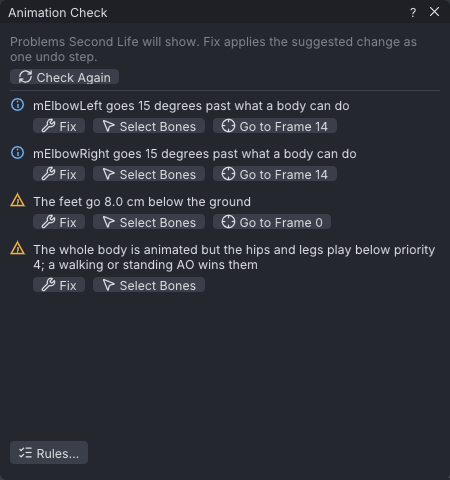

# Animation check

The Animation Check looks for problems that show only once an animation plays in Second Life: a loop
that pops, feet in the floor, bones that freeze other people's tails, a file too big to upload. Each
finding names the bones and frames it is about and, where it can, offers a **Fix** that makes the usual
correction as one undo step.

> Related articles: [[Export to Second Life]], [[Loop tools]], [[Animation priority]], [[Ragdoll]]

## Usage

### Open the check

Choose **Tools → Animation Check...**. The status bar shows **Check: N** while there are findings, in
the colour of the worst one (red, amber or blue); click it to open the window. With no findings the
badge is hidden and the window says "No problems found."

*The [[Retargeting]] example's walk: four findings, and **Rules...** at the bottom.*

The check runs by itself: half a second after the last edit, once no drag, field edit or playback is
running. It runs at once when a project is opened or imported, after a **Fix**, and after a rule is
switched on or off. It checks the animation as **Export SL .anim** would write it: with IK, pins and the
bake shape, and with the project's key reduction.

**Check Again** runs it now. Use it after changing the body, the **Bake shape** or, in the viewer, the
worn avatar: the check notices changes to the animation, not to those.

### Read a finding

Each finding has a severity icon and a message:

| Icon | Severity | Meaning |
|---|---|---|
| Red circle with a cross | Error | Second Life refuses the file or cannot play it as it is. |
| Amber triangle | Warning | It plays, but not as it looks in VATs. |
| Blue ring with an i | Info | Often a mistake, sometimes meant (a sit, a fall). |

Under the message:

- **Fix** applies the suggested change; its tooltip names it. It is one undo step with the same name,
  so **Ctrl+Z** takes it back. If you edited the animation since the last check, the click checks it again
  first and applies the fix for the problem as it is now. The status bar names the fix and how many problems
  are left. It is greyed out when the finding has no automatic fix.
- **Select Bones** selects the bones the finding names.
- **Go to Frame N** moves to the first frame of the next stretch of frames the finding is on (frames in a
  row count as one stretch, so a held pose flagged on every frame goes to its first frame). Click it again to
  step through the other stretches; the tooltip says how many there are.

### The rules

| Rule (as in **Rules...**) | Finds | Fix |
|---|---|---|
| Loop seam jumps | With **Loop** on, channels whose value at **Loop out** differs from **Loop in** by more than 0.5° or 1 mm (the hips' forward and sideways travel is the next rule). Warning. | **Make Loop Seamless**, as in [[Loop tools]], with no blend. |
| Hips travel over the loop | With **Loop** on, the hips end the loop more than 1 mm from where they start along the ground, so they jump back each time it repeats. Warning. | **Remove Hip Travel (In Place)**. |
| Loop range reversed or shorter than the eases | **Loop in** at or after **Loop out** (Error), or a loop shorter than ease in plus ease out (Warning). | **Swap Loop In and Loop Out** (the same frame twice becomes the whole animation), or **Shorten the Eases to Fit**, which scales both eases down together. |
| Ease longer than the animation | With **Loop** off, ease in plus ease out longer than the animation. Warning. | **Shorten the Eases to Fit**. |
| Zero ease pops | Ease in or ease out of 0: the avatar snaps into the first pose or back when it stops. Info. | **Set the Zero Ease to 0.30 s**, less when the loop or the animation is too short for that. |
| Keys between frames | Keys more than 0.1 frame from a whole frame. Second Life plays whole frames only and never shows them. Warning. | **Snap Keys to Whole Frames**. A key that lands on a frame that already has a key replaces it. |
| Turns over 90 degrees between keys | A bone that turns more than 90° between two keys the export keeps. Second Life blends rotations in a way that runs uneven over such a turn. Warning. | **Add Keys Along the Turn** keys the bone's rotation curves, without changing their shape, so each step turns 45° or less; export keeps every keyed frame. No fix when the turn happens within one frame, or when IK turns the bone. |
| Whole body below priority 4 | The torso, head or arms and the hips or legs are animated, and the hips or legs play below priority 4. A walking or standing AO then wins them. Not for a clip with an **AO state** (see [[Clips]]) other than Typing or Always: the AO plays one animation per state and stops the one before, so its own stands and walks never compete with it. A Typing or Always clip plays over them, and the message says so. Warning. | **Set Priority 4**: the clip's priority becomes 4 if it was lower, and bone priorities below 4 on the hips and legs are removed. See [[Animation priority]]. |
| Hip and leg position keys | Position keys that move `mSpine1`, the hips or any bone below them. They change the leg length, so the avatar pops up or down as the animation starts. Warning. | **Remove Their Position Keys**. |
| Bones that never move | Tail, wing, face or finger bones (not the eyes) exported with rotation keys only, that stay within the rotation reduction tolerance of rest on every frame. They freeze the wearer's own tail, wings, face or hands. Warning. | **Leave Out Bones That Don't Move**: turns on that export setting; see [[Export to Second Life#Bones that don't move]]. |
| Face position keys on the default face | Face bones exported with position keys while **Bake shape** is not **Your avatar**. The keys hold the SL Default face's joint positions and pull a mesh head towards it. Warning. | **Remove the Face Position Keys**. In the viewer, **Bake shape: Your avatar** is the other way out. |
| Eyes keyed | Keys on `mEyeLeft`, `mEyeRight`, `mFaceEyeAltLeft` or `mFaceEyeAltRight`. They fight the viewer's look-at. Warning. | **Remove the Eye Keys**. |
| Expression with face bones | An **Expression** is set while face bones are keyed. Warning. | **Set Expression to None**. |
| Hand pose with finger bones | A **Hand pose** other than Relaxed is set while finger bones are keyed. Warning. | **Set Hand Pose to Relaxed**. |
| Joints past their limits | A joint that goes more than 5° past the joint limits the [[Ragdoll]] uses, on any frame. Info. | **Key the Joint Inside Its Limits** keys the joint at its limit on each frame it is past it. |
| Feet off the ground | The lowest point of the soles (the back of each heel, the ball and the toe tip, where the body's soles are) compared with where it is at rest, on the bake shape, so a heel that sinks while the toes lift counts too. More than 2 cm below on any frame is a Warning; never coming within 2 cm of it is Info. | **Raise the Hips by N cm** or **Drop the Hips by N cm**: every hip height key moves by that much (one held key is added when there are none), and so do the height keys of legs in IK. |
| Body parts pass through each other | Two body parts overlap by more than 1 cm on a frame, measured with the [[Ragdoll]]'s capsules (one rounded rod per major bone: head, neck, chest, torso, hips, and each upper arm, forearm, hand, thigh, shin and foot). A bone and the one it hangs from are not compared, nor parts that already touch in the rest pose, such as the two thighs or the chest and the head: those are never compared with each other. With a mesh body shown, the check uses its proportions and also tests the capsules against its collision volumes. One finding per pair, naming both bones. Info: capsules are not the mesh, so this is a hint, not a guarantee. | **Push Out**, when one of the two is a shoulder, elbow or wrist: on each listed frame the hand is moved away from the other part through the arm's IK, by the overlap plus 5 mm, and again (up to four times) while the two still overlap by more than 1 cm. An arm in IK gets its target keyed; an arm in FK gets its shoulder, elbow and wrist keyed with the rotations IK finds. No fix when neither is an arm. |
| Actors pass through each other | In a scene with two actors or more, the body of the actor you edit against each other actor's, on every frame: the same capsules as the rule above, capsule against capsule. One finding per other actor, naming the deepest pairs. Info: a hug or a handshake meets on purpose. | None: judge which of the two should give way, and move it. |
| Upload size | A file of 250,000 bytes or more, which Second Life refuses. Error. | **Thin Out Keys** re-keys every keyed bone from its own samples with linear keys, at the smallest tolerance that fits: twice the export's rotation tolerance, doubled until it fits (1 cm of position per degree). |
| Duration | An animation longer than 60 s, which Second Life refuses. The other rules wait until it fits. Error. | **Trim to 60 s**: the last frame becomes 60 s; loop points past it move in. |

### See where body parts pass through each other

The frames of every **Body parts pass through each other** finding are marked with short red lines at the
foot of the timeline strip. On such a frame, the two bones of the finding are drawn red in the view, unless
they are selected. Switching the rule off removes the marks and the colour.

The check looks at the animation as you edit it, not the mirrored copy **Export mirrored (left and right swapped)** writes.

## Configuration

**Rules...** at the bottom of the window lists every rule with a check box; clear one to stop that
check. The window notes how many are switched off. The choice is kept in `settings.json` as
`check_off`, a list of rule ids; see [[Preferences#Settings file]].

> **Note:** The VATs Editor in the viewer has the same window, menu item and badge. There a bake shape
> of **Your avatar** clears the face position rule.

## Troubleshooting

### A fix does not clear its finding

- **Key the Joint Inside Its Limits** and **Add Keys Along the Turn** key the bone's own rotation
  curves. When IK or a pin turns the bone, those keys are overridden: fix the pose through the IK
  handle, or switch the limb to FK.
- **Raise the Hips** or **Drop the Hips** does not move feet held by a pin.
- **Thin Out Keys** stops at a coarse tolerance; if the file is still too big, leave out bones or
  shorten the animation.
- **Push Out** keys only the frames the finding lists, so the frames around them can overlap a little
  once the keys change the curve; the check then lists those. A pin holding the hand wins over the new keys.

### The window says "Checking once the animation is still..."

An edit happened less than half a second ago, or a drag or playback is running. Stop, or press
**Check Again**.

## See also

- [[Export to Second Life]]
- [[Loop tools]]
- [[Animation priority]]
- [[Anim format]]

Category: Second Life
