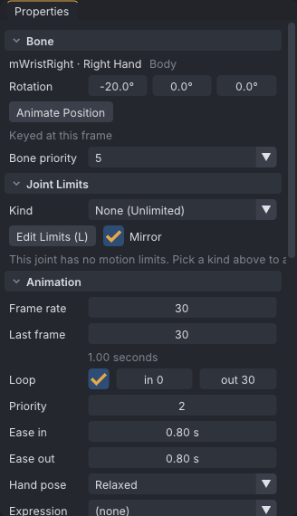
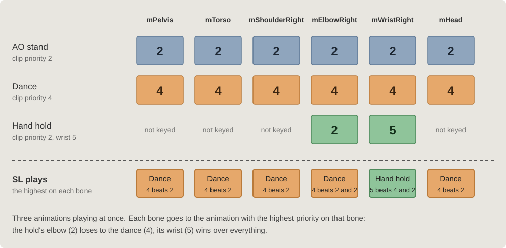

# Animation priority

When two animations play on one avatar and both move the same bone, Second Life plays the one with the
higher priority on that bone. VATs sets a priority for the whole clip and, when needed, for single
bones. This page also covers the other playback settings stored in the `.anim` header: loop, ease, hand
pose and expression.

> Related articles: [[Export to Second Life]], [[Anim format]], [[Keys and timeline]], [[Priority planner]]

## Usage

### Set the clip priority

Set **Properties → Animation → Priority** to a value from 0 to 6. The default is 3. At 5 or 6, the panel
shows `Some viewers treat priority above 4 as 4`.

| Priority | Typical use |
|---|---|
| 0–1 | Background motion that anything else may override |
| 2–3 | Stands and AO motions |
| 4 | Poses and dances that must override an AO |
| 5–6 | Overrides for single bones, such as a hand hold over any dance |

### Set a bone's own priority

Select a bone, then open **Properties → Bone → Priority**. The list offers **Clip (N)**, which follows
the clip priority, and 0 to 6. Values above 4 are marked `(overrides most animations)`. The bone's value
goes into the exported `.anim` only; BVH cannot carry it.

Use this to let a hand or the head win over other animations while the rest of the body stays low.

*A hand hold: the clip is priority 2, the wrist alone is 5.*

### How priorities stack per bone

Second Life decides bone by bone, not animation by animation. For each bone, every animation that has a
record for it is a candidate at its own priority for that bone: the clip's priority, or the bone's own
where one is set. The candidate with the highest priority moves the bone; the others are ignored on that
bone only, and still play on the bones where they win. On equal priority, the animation started most
recently wins the bone.

*The dance takes the body, including the hold's elbow; the hold keeps only the wrist, where its 5 beats the dance's 4.*

Two things follow from this:

- A low-priority clip can still take one bone. The hold above is priority 2, lower than the dance, but
  its wrist wins because that one bone is set to 5.
- Key only the bones you mean to take. Had the hold keyed the shoulder as well, the shoulder would have
  been a losing candidate against the dance, but a winning one against the AO whenever the dance
  stopped.

To check a clip against the animations it plays with, add them in **Tools → Priority Planner...**
([[Priority planner]]): it colours each bone by the animation that wins it and lists the bones yours loses.

### Know which bones an animation claims

An `.anim` claims every bone that has a record in the file, for the whole length of the animation, at
its priority. Key only the bones you mean to control.

- Keying one channel of a bone (for example only X rotation) claims the whole bone.
- A bone with only position keys still gets rotation keys in the file, so it claims the bone's
  rotation as well.
- A bone without keys is not written, and other animations keep control of it.

### Loop

Tick **Properties → Animation → Loop** to make the animation repeat. **Loop in** and **Loop out** (frames)
set the part that repeats; the frames before **Loop in** play once. While **Loop out** is on the last frame
it follows **Last frame**, so lengthening the animation lengthens the loop too. Turning **Loop** on with **Loop
out** at 0 sets it to the last frame. Export warns `loop in is after loop out` when the range is reversed.

### Ease in and ease out

**Ease in** and **Ease out** (0 to 10 s, in steps of 0.05 s; 0.3 s in a new project) blend the animation in when
it starts and out when it stops. The avatar's other animations play through the blend.

With **Loop** off, the sum of the two must not be longer than the animation. If it is, export warns and
writes the values unchanged; a BVH upload in the viewer would scale both down to fit.

### Hand pose

**Properties → Animation → Hand pose** picks one of SL's 14 built-in hand shapes: **Spread**, **Relaxed**, **Point**, **Fist**, **Relaxed Left**, **Point Left**,
**Fist Left**, **Relaxed Right**, **Point Right**, **Fist Right**, **Salute Right**, **Typing**,
**Peace Right**, **Palm Right**. The default is **Relaxed**.

### Expression

**Properties → Animation → Expression** plays one of SL's facial expressions with the animation:
**(none)**, or `express_afraid`, `express_anger`, `express_bored`, `express_cry`, `express_disdain`,
`express_embarrased`, `express_frown`, `express_kiss`, `express_laugh`, `express_open_mouth`,
`express_repulsed`, `express_sad`, `express_shrug`, `express_smile`, `express_surprise`,
`express_tongue_out`, `express_toothsmile`, `express_wink`, `express_worry`. The misspelling
`embarrased` is SL's own name and must stay.

## Worked example: a hand hold that wins

[Open the example](example:priority-hand.vat), the hold from the picture above: a one-second loop with
keys on `mElbowRight` and `mWristRight` only.

1. **Properties → Animation → Priority** reads 2.
2. Select `mWristRight`: **Properties → Bone → Priority** reads 5. Select `mElbowRight`: it reads
   **Clip (2)**, so the elbow follows the clip.
3. Press **Ctrl+E**, then **Export .anim**. The status bar says "2 bones, 1.00 s, priority 2, 293
   bytes": only the two keyed bones are in the file, at the clip's priority 2, with the wrist's record
   carrying its own 5 (see [[Anim format#Joint records]]).
4. Worn with a priority-4 dance, this file moves the wrist and nothing else. Set the wrist back to
   **Clip (2)** and export again: now the dance takes the wrist too.

## Troubleshooting

### The animation does not override the AO

The AO plays the same bones at an equal or higher priority. Raise the clip priority to 4, or give the
contested bones their own higher priority.

### Priority 5 or 6 behaves like 4

Some viewers limit priority to 4, for the clip and for single bones. Nothing in the file can change
that; keep important motions at 4, and key fewer bones so that fewer contests arise.

### Other animations stop working on some bones

The animation claims bones it does not need. Delete the keys on those bones, including single-channel
and position keys, then export again.

## See also

- [Second Life Wiki: Animation Priority](https://wiki.secondlife.com/wiki/Animation_Priority)

Category: Second Life
