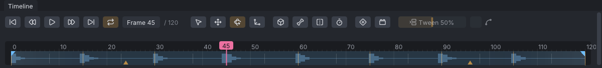

# Audio track

An animation can carry one audio track, so you can time a dance or a gesture to the music while you work. The waveform shows along the timeline and plays with the animation; beat markers and a beat grid help put keys on the beat. The audio stays in VATs: it is never put in the exported `.anim`.

> Related articles: [[Keys and timeline]], [[Time editing]], [[Lip sync]], [[Projects and files]], [[Export to Second Life]]

## Usage

### Loading and removing audio

**File → Load Audio...**, or right-click the timeline and choose **Load Audio...**, then pick a WAV, MP3, FLAC or Ogg Vorbis file. The status bar shows its name and length, for example "Loaded song.ogg (93.4 s)". Loading another file replaces the first.

Right-click the timeline and choose **Remove Audio** to take it out; it is greyed out with "Load an audio file first" when there is none.

### Playing and scrubbing

The audio plays with the animation from wherever the playhead is. While stopped, scrubbing plays short snippets, so you can find a beat by ear.

### Sliding the audio

- **Ctrl+drag** the timeline to slide the audio earlier or later. A tooltip shows where it starts, for example "Audio starts at 1.25 s".
- Or set **Start (s)** in the timeline's right-click menu (−600 to 600 s). A positive value starts the audio later than frame 0; a negative one starts partway into the song.

Marked beats slide with the audio.

### Audio settings

The timeline's right-click menu has an **Audio** section:

| Setting | What it does |
|---|---|
| **Volume** | 0–2, 1 by default; also scales the waveform |
| **Start (s)** | Where the audio starts on the timeline |
| **BPM** | A beat grid every 60/BPM seconds; 0 turns it off |
| **Beat Grid Starts Here** | Puts a beat of the grid on the current frame (needs a BPM) |
| **Mark a Beat Here** | Adds a beat marker at the current frame (**B**) |
| **Clear Marked Beats** | Removes every beat marker |
| **Snap to Beats** | Makes scrubbing, range picks and retime markers land on the nearest beat |

Each change is one undo step.

### Beats

There are two ways to get beats onto the timeline; they can be used together:

- **A beat grid**: type the song's **BPM**, scrub to a frame that is on a beat, and choose **Beat Grid Starts Here**. Grid lines appear every beat.
- **Tapped beats**: play the animation and press **B** on each beat. **Mark a Beat Here** marks the current frame, so it works while stopped too.

With **Snap to Beats** on, the playhead, **Shift+drag** ranges, [[Time editing#Retiming with markers|retime markers]] and the [[Dope sheet]]'s scale handles snap to a beat within 3 frames of the mouse.

The beat grid and the tapped beats show on the timeline and in the dope sheet whenever the track has them, even while its sound is not loaded (an example without the music, or a file that has moved).

*A 120 BPM click track at 30 fps: the waveform shows each click, and the grid puts a line every 15 frames.*

### Saving

The audio is saved in the project as a path to the file, relative to the project where possible (like props), together with its start, volume, BPM and beats. The sound itself is not copied into the project; keep the file with it. See [[Projects and files]].

## Worked example: keys on the beat

[Open the example](example:audio-beats.vat): four seconds at 30 fps, **BPM** already set to 120 with the grid starting at frame 0 and **Snap to Beats** on, and a head nod keyed on every beat. It comes with a 120 BPM click loop, `beat-120bpm.wav` (CC0), so it plays with sound at once.

1. The click loop's waveform runs along the timeline with a grid line every 15 frames: 60 / 120 BPM is 0.5 s, which is 15 frames at 30 fps. To use a song of your own instead, choose **File → Load Audio...**; the numbers below do not depend on it.
2. Scrub to frame 13 and let go: the playhead lands on 15, the nearest beat. The keys where the head dips sit on the grid lines, frames 0, 15, 30 and so on to 120; the keys in between (8, 23, ...) bring it back up.
3. Play. The head dips on each beat of the grid. If the song's own beat does not line up, **Ctrl+drag** the timeline until a beat of the song sits on a grid line, or set **Start (s)**; the marks slide with the audio.
4. Press **B** on a beat while it plays: a marker is added at the current frame, on top of the grid.

## Tips and tricks

- Set **Snap to Beats**, then key the big poses by scrubbing from beat to beat.
- To move keys that are already there onto the beat, use retime markers: turn on **Retime**, drop a marker on a pose and drag it to a beat line. See [[Time editing#Retiming with markers]].
- A dance over 60 seconds can go to Second Life in parts cut on the beat: **Tools → Split Dance at Beats...**, see [[Time editing#Split a dance]].
- Set the animation's frame rate so a beat lands on whole frames: at 120 BPM a beat is 0.5 s, which is 15 frames at 30 fps.
- To pair the sound with the animation in Second Life, upload the sound too and start both from the same script.
- [[Time editing]] moves keys but not the audio; slide the audio separately if you insert frames before it.
- For speech, [[Lip sync]] keys the jaw and lips from the loaded audio, or from a Rhubarb Lip Sync file made from
  it; its mouth shapes show on the timeline above the waveform.

## Troubleshooting

### "Audio not found"

The project refers to an audio file that has moved or been deleted. Put the file back where it was, or load it again with **File → Load Audio...**.

### "Could not load the audio"

The file is not a WAV, MP3, FLAC or Ogg Vorbis file VATs can decode. Convert it to one of these (WAV is the safest) and load it again.

### No sound while playing

Check the **Volume** in the timeline's right-click menu, and that the audio starts where you expect (**Start (s)**): before the audio's start, and after it ends, there is nothing to play.

### The uploaded animation has no sound

That is how Second Life works: animations carry no sound. Upload the sound separately and play it from a script.

## App and viewer

> **Note:** In the viewer the audio plays through the viewer's sound, heard by you only, at a volume up to
> 100 %; scrubbing plays no snippets.

## See also

- [[Keys and timeline]]
- [[Time editing]]
- [[Lip sync]]
- [[Export to Second Life]]

Category: Animating
