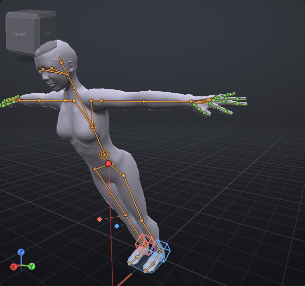
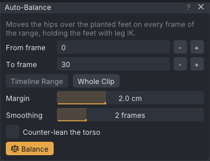
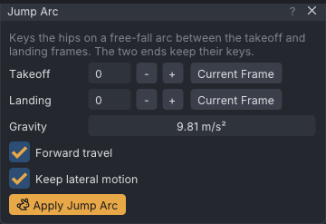

# Balance

VATs shows where the body's weight is: the centre of mass, dropped onto the ground, against the outline of the feet that stand on it. When the weight falls outside the feet, the pose would topple, and **Auto-Balance** moves the hips back over them. **Jump Arc** keys the hips on a real free-fall arc between a takeoff and a landing.

> Related articles: [[IK]], [[Hold and bind]], [[Ragdoll]], [[Posing]]

## Usage

### The centre of mass

**View → Centre of Mass** is on by default. While at least one foot is on the ground, the view draws:

- the **support polygon**: a light blue outline on the ground around the planted feet;
- the **centre of mass**: a dot at the body's balance point, about hip height;
- a line from it straight down to a second dot on the ground.

Both dots are green while the ground dot is inside the outline and red when it is outside. When no foot is on the ground (a jump, a sit on a raised prop, a fall) nothing is drawn.

*A 30° forward lean on planted feet: the centre of mass is red, 28 cm in front of the toes.*

How it is worked out:

- Contact height comes from the body mesh shown (a mesh body, or the standard avatar mesh), posed at this frame: the ground plane is at its lowest vertex. Each foot whose own lowest point is within 6 cm of that plane is planted, and its vertices within 2 cm of its own lowest point are its sole. With **Skeleton Only**, or in the viewer's world view without a swapped body, the ankles, feet and toes of the bones stand in for the mesh.
- The **support polygon** is drawn directly at that contact plane: it is the 2D convex hull of the planted soles. On a biped avatar it spans the soles of planted feet; on a quadruped or creature mesh it spans all supporting feet.
- The **centre-of-mass drop line** extends all the way down to this contact plane. The planted-feet markers of a body drag sit on it too.
- The ground grid is drawn at the shown body's lowest point in its rest pose, not this frame's, so it stays put while the body jumps or crouches. A mesh body whose soles rest below or above Second Life's ground (longer legs, a creature) stands on its own soles. In the viewer, a body swapped in by **View → Body** is raised or lowered by the same difference, so its soles stand on the world's ground where your avatar's would.
- The **centre of mass** weights each part of the body by its share of a body's mass, from de Leva's segment table (1996): the hips 11 %, the torso and chest 32 %, each thigh 14 %, the head 6 %, and so on. These are the [[Ragdoll]]'s bodies and masses.

The standing rest pose puts the centre of mass within a centimetre of the point between the ankles.

### Auto-Balance

1. Open **Tools → Auto-Balance...**.
2. Set **From frame** and **To frame**. **Timeline Range** takes the range Shift-dragged on the timeline; **Whole Clip** takes every frame.
3. Press **Balance**. It is one undo step, **Auto-Balance**.

*The **Auto-Balance** window.*

What it does:

1. The planted feet are held where they are with leg [[IK]], exactly as **Tools → Clean Up Foot Sliding** holds them over the range. A leg that already uses IK in the range is left as it is: its target already holds the foot.
2. Balance is judged on the same floor and soles the view draws (see above). On every frame of the range where the centre of mass is outside the support polygon shrunk by **Margin**, `mPelvis` moves sideways and forward or back (never up or down) by the smallest distance that brings it inside. The legs bend to keep the feet on their spots.
3. The corrections are averaged over **Smoothing** frames each side, so the hips glide instead of jumping; up to 12 passes run, the last four unsmoothed, until every frame is inside.

`mPelvis` is keyed on every frame of the range. The frames just before and after the range are keyed where the curves already were, and the curves outside the range keep their shape. A frame with no foot on the ground needs no correction of its own (smoothing may still carry a neighbour's to it). The status bar reports, for example, "Balanced frames 0-30: the hips moved up to 41.8 cm"; frames that could not be brought inside are counted: "..., 2 frame(s) still off balance".

### Jump Arc

1. Key the hips where the jump leaves the ground and where it lands: a crouch at takeoff and at landing, for example.
2. Open **Tools → Jump Arc...**.
3. Set **Takeoff** and **Landing** (at least 2 frames apart); **Current Frame** takes the frame you are on.
4. Press **Apply Jump Arc**. It is one undo step, **Jump Arc**.

*The **Jump Arc** window.*

`mPelvis`'s height is keyed on every frame between on the path a thrown body takes: it leaves the takeoff height fast enough to reach the landing height after the time between the two frames, slowing under **Gravity** (9.81 m/s², Earth's; 0.5–50). Over 0.6 s with the two ends level, the hips rise 44.1 cm, gravity × time² / 8. The window shows the time in the air and the rise before you apply it, and the status bar repeats it: "Jump Arc: 0.60 s in the air, the hips rise 44.1 cm".

- **Forward travel** (on): X runs at an even speed from the takeoff position to the landing position, as it does in the air. Off: X keeps its keys.
- **Keep lateral motion** (on): Y, side to side, keeps its keys. Off: Y runs at an even speed like X.

The takeoff and landing keys keep their values, and the curves before the takeoff and after the landing keep their shape. Only the hips move; pose the legs, arms and spine for the jump yourself.

### Worked example: a lean that tips over

[Open the example](example:balance-lean.vat): 30 frames. Both legs are in IK with their targets where the feet stand and their poles in front of the knees, and the whole body tips forward about the ankles, from upright at frame 0 to 30° at frame 30.

1. Scrub from 0 to 30. The centre of mass is green until frame 12 and red from frame 13: by then it has passed the toes.
2. Choose **Tools → Auto-Balance...**, press **Whole Clip**, then **Balance**. The status bar says "Balanced frames 0-30: the hips moved up to 41.8 cm".
3. Scrub again: the dot stays green, the hips slide back over the feet as the body tips, the knees bend, and the feet do not move.
4. **Edit → Undo** puts the lean back.

## Tips and tricks

- Tick **Counter-lean the torso** to let `mTorso` lean back towards the feet as well, by half the angle the hips' correction makes over the length of the spine. The hips then move less, which suits a character leaning over something.
- For a reach that should pull the whole body, give the hand's IK target a **Pull**: see [[IK#Full-body reach]].
- The support polygon counts the feet only. A hand on a wall or a knee on the floor is not a support; a crawl or a sit reads as off balance.

## Troubleshooting

### Nothing is drawn

No foot is within 5 cm of the ground at this frame, or **View → Centre of Mass** is off. A pose raised on a prop (standing on a box) has its feet above the rest pose's ground and counts as airborne.

### A foot that stands is not in the outline

Only feet within 6 cm of the lowest sole count as planted. A creature whose feet rest at different heights stands on the lowest ones: the test mech (`vats_make_test_body --mech`) has hind feet 12 cm above its front soles, so its outline is its front feet only, and since those boxes touch the ground at their toes, the rest pose reads as off balance. Lower the higher feet onto the floor (key the hind legs down), and the outline spans all four.

### "N frame(s) still off balance"

The hips cannot reach far enough: the legs straighten before the centre of mass gets over the feet, typically in a strong lean with straight legs held by IK. Lower the hips or bend the knees on those frames and balance again.

### The feet stopped sliding after Auto-Balance

Auto-Balance plants the feet with the foot-sliding clean-up first, so a foot that slid on the ground now stays where its contact started. See [[Retargeting]] for **Clean Up Foot Sliding**.

## App and viewer

> **Note:** The centre of mass, **Auto-Balance** and **Jump Arc** work the same in the viewer's VATs Editor, drawn over your avatar in the world. See [[VATs Editor (viewer)]].

## See also

- [[IK]]
- [[Hold and bind]]
- [[Ragdoll]]

Category: Animating
