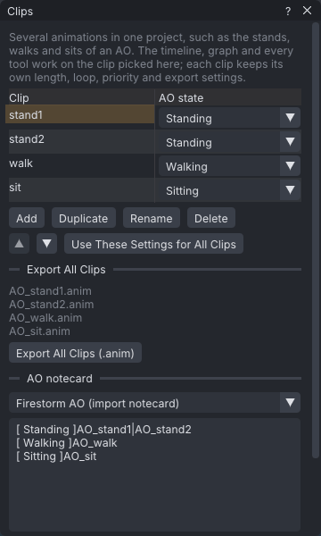

# Clips

A project can hold several named clips: the stands, walks, runs and sits of an AO set, or the takes of a
couples scene. One clip is edited at a time; the timeline, the graph and every tool work on it.
**Export All Clips** writes or uploads every clip in one go, and the **AO notecard** section writes the
notecard that loads them into Firestorm's AO or a ZHAO-II style AO.

> Related articles: [[Export to Second Life]], [[Projects and files]], [[Couples and groups]], [[Animation priority]]

## Usage

### Open the Clips window

Choose **Tools → Clips (AO Sets)...**. A new project has one clip, called `Clip`. The table lists every
clip with its **AO state**; the clip you are editing is highlighted.

### Add, switch and arrange clips

- **Add** puts a new, empty clip after the current one and switches to it. It takes the current clip's
  frame rate, length, loop and loop points, priority, eases, hand pose and export settings, but no keys,
  props or audio.
- **Duplicate** copies the current clip, keys and AO state included.
- Click a clip's name to edit it. Double-click the name, or press **Rename**, to type a new one; **Enter**
  or clicking elsewhere keeps it.
- **Delete** removes the current clip after asking; the clip above it (or below, for the first) becomes the
  current one. The last clip cannot be deleted.
- The up and down arrows move the current clip in the list.

Each of these, and each switch, is one undo step: **Ctrl+Z** after a switch goes back to the clip you were
on. Switching stops playback, and the frame moves to the new clip's last frame when it was past it.

New clips are named `Clip 2`, `Clip 3` and so on, and a duplicate of `stand` is `stand 2`.

### Worked example

[Open the example](example:ao-set.vat), a small AO set: `stand1` and `stand2` (**Standing**), `walk`
(**Walking**) and `sit` (**Sitting**), exported with **Name** `AO` and the pattern `[NAME]_[CLIP]`. Choose
**Tools → Clips (AO Sets)...**.

*Four clips with their AO states; **Export All Clips** lists `AO_stand1.anim` to `AO_sit.anim`.*

1. Click `walk`: the timeline is now 30 frames long and the legs swing. **Ctrl+Z** goes back to `stand1`.
2. Under **AO notecard** the Firestorm notecard reads `[ Standing ]AO_stand1|AO_stand2`, then
   `[ Walking ]AO_walk` and `[ Sitting ]AO_sit`.
3. Press **Export All Clips (.anim)** and pick a folder when asked: four files, one per clip.

### Settings per clip

Each clip keeps its own length, frame rate, loop, priority, eases, hand pose and export settings
(**Properties → Animation** and **Properties → Export** show the current clip's). **Use These Settings for All
Clips** gives every other clip the current clip's frame rate (keeping each clip's timing, as a frame-rate
change does), priority, eases, hand pose and export settings; each clip keeps its own export **Name** and
**Number**. Length and loop stay each clip's own.

### Clips and actors

In a project with several actors ([[Couples and groups]]), clips are takes of the whole scene: every actor
has its own animation in each clip, and switching the clip switches every actor. The actors of a clip share
its length and loop, as always; another clip can have another length.

### Export every clip

With two or more clips, the Clips window lists the file name of each clip under **Export All Clips**, and:

- **Export All Clips (.anim)** (also **File → Export All Clips (.anim)**) exports every clip, each with its
  own export settings, into the current clip's export folder. The status bar lists the files.
- **Upload All Clips...** (in the [[VATs Editor (viewer)]], also in the **File** menu) uploads every file,
  one after another, each with the viewer's price confirmation.

The **Export SL .anim** dialog has the same two buttons under **Every clip**. With several clips, every
export name includes the clip: `[CLIP]` in the pattern is the clip's name, and a pattern without it gets
`_` and the name at the end, before an actor's name. With the pattern `[NAME]_[CLIP]` and **Name** `AO`,
the clips `stand1` and `walk` export as `AO_stand1.anim` and `AO_walk.anim`.

### Write an AO notecard

1. Pick an **AO state** for each clip in the table: `Standing` for the stands, `Walking` for the walks, and
   so on. **(none)** leaves a clip out.
2. Under **AO notecard**, pick **Firestorm AO (import notecard)** or **ZHAO-II / Oracul**. The box shows the
   notecard; each clip appears under its export name without `.anim`, which is the name an uploaded
   animation gets in inventory.
3. Press **Copy**, or **Save as .txt...**.

Both formats are one line per state, `[ Standing ]AO_stand1|AO_stand2`, the states in Firestorm's order and
each state's animations in clip order. In a project with several actors the names are the current actor's.

| | Firestorm AO | ZHAO-II / Oracul |
|---|---|---|
| States | 26, including `Typing`, `Soft Landing` and `Always` | the 23 ZHAO-II tokens; the others are marked **(Firestorm only)** in the list |
| Animations per state | any number | several for `Standing`, `Walking`, `Sitting` and `Sitting On Ground`; one for the others |
| Long lines | one line per state | a line longer than 255 bytes continues on another line with the same token |

A clip the format cannot take is left out and a warning under the box says why: a state the format does not
have, a second animation for a one-animation ZHAO-II state, or a name with `,` or `|` (both formats read
`,` as animations played together).

To load the Firestorm notecard, upload the animations, put them and a notecard with this text in one inventory
folder, then in Firestorm's **Animation Overrider** choose to import and pick the notecard. The names must
match the animations exactly. For ZHAO-II, paste the text into the AO's animation notecard (usually
`Default`) and put the animations in the AO.

## Tips and tricks

- Set the pattern to `[NAME]_[CLIP]` and a **Name** on the first clip before you add the others: they take
  its export settings.
- Name clips after what they are in the AO (`stand1`, `walk`, `sit`): the names end up in inventory.

## Troubleshooting

### Every clip exported with the same name

The files replace each other when the pattern gives two clips the same name. With several clips VATs adds
the clip's name unless the pattern has `[CLIP]`; check that no two clips have the same name.

### Firestorm says an animation was not found

The notecard names the animations by their export names. An animation renamed in inventory, or uploaded under
another name, no longer matches: rename it back, or edit the notecard.

## See also

- [[Export to Second Life]]
- [[Project file format#clips]]
- [Firestorm wiki: Animation Overrider](https://wiki.firestormviewer.org/animation_overrider)

Category: Animating
