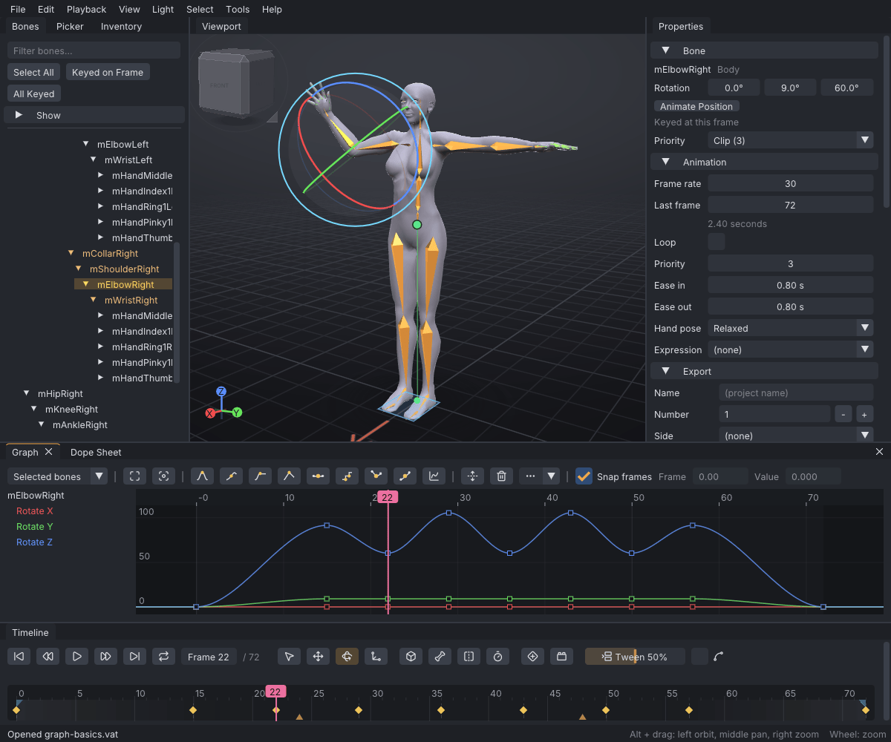

# Command line

VATs takes options and file names on the command line. Most options exist for scripted screenshots,
tests and benchmarks; `--data-dir` and file names are also useful day to day.

> Related articles: [[Projects and files]], [[Preferences]], [[Troubleshooting]]

## Usage

```
vats [options] [files]
```

On Windows the program is `bin\vats.exe`. Options and files are handled from left to right, after
the window and the skeleton have loaded; `--data-dir` and `--library-dir` are read first, before
anything loads.

### Files

Any argument that names an existing file is opened as if it were dropped on the window: `.vat`
opens as a project, `.anim` and `.bvh` are imported, `.dae` and `.fbx` are added as props,
`.gltf` and `.glb` open the retarget dialog, and `.wav`, `.mp3`, `.ogg` and `.flac` load as the audio
track. An
argument that is neither an option nor an existing file is skipped with
`ignoring unknown argument <arg>` on standard error.

Because arguments run in order, put the project before options that act on it:

```
vats walk.vat --frame 12 --select mPelvis
```

### Options

| Option | Effect |
|---|---|
| `--data-dir <dir>` | Keeps all user data in `<dir>`: `settings.json`, `layout.ini`, `autosave/` and `library/`. The folder is created if needed. See [[Projects and files#Data folders]]. |
| `--library-dir <dir>` | Uses `<dir>` for the pose, prop and mesh body libraries and their thumbnails instead of `library/` in the data folder. |
| `--light <name>` | Lights the view with a preset of the **Light** menu: `noon`, `key` (Three-Quarter Key), `rim`, `dusk`, `night` or `studio`. An unknown name prints `unknown light <name>`. |
| `--backdrop` | Shows **Light → Plain Backdrop**. |
| `--reference <file.png>` | Loads a PNG as the [[Reference images|reference image]], as **Load Picture...** in **View → Reference...**, and opens that window. |
| `--target <file>` | Loads a project (`.vat`) or a Second Life animation (`.anim`) as the [[Target ghost|target ghost]], as **View → Target Ghost → Load Target...** does: drawn in green over your avatar at the same frame. The open project is not changed. |
| `--listing <file>` | Once the first frames are drawn, writes [[Listing media]] with the window's first settings (512 x 512, the animation's frame rate, turntable on): an animated GIF, or numbered PNG pictures when `<file>` ends in `.png`. Prints `listing: <n> frames at <w> x <h>` on standard output. |
| `--preset <name>` | Selects a [[Control presets|control preset]]: `industry`, `blender`, `qavimator` or `secondlife`. An unknown name prints `unknown preset <name>`. |
| `--body <id>` | Shows a body for this run only: `sl-default`, `sl-default-male`, `female`, `male`, or `none` (also `off`) for the skeleton only. It replaces a mesh body too. The body saved in `settings.json` is kept unless you pick another in **View → Body**. Unknown ids are ignored. |
| `--frame <n>` | Moves to frame `<n>`, clamped to the animation's length. Fractions are allowed. |
| `--select <bone>` | Selects a bone by its skeleton name, for example `mPelvis` or `mHandLeft`. Unknown names are ignored. |
| `--select-all` | Runs **Select All**. |
| `--select-group <name>` | Selects a [[Picker]] group by its name as the picker's tooltips give it: `Right Arm`, `Left Leg`, `Head`, `Spine`, `Right Hand`, `Left Index finger`, `Knuckle row 2`, `Brows`, `Wings`, `Tail`, `Hind Limbs`, ... A hidden group is shown first. An unknown name prints `unknown picker group <name>`. |
| `--select-prop <n>` | Selects the project's prop number `<n>`, counting from 0. Out of range is ignored. |
| `--pose <slug>` | Applies a starter pose at the current frame, for example `body-sit` or `hand-fist`. An unknown slug prints `no built-in pose <slug>`. |
| `--tool <name>` | Picks a tool: `select`, `move`, `rotate` or `scale`. Any other value picks `rotate`. |
| `--focus` | Frames the selection once the first frame is drawn, as **Frame Selected**. |
| `--view <name>` | Runs a **View → Camera** menu command, with the camera already turned: `front`, `back`, `right`, `left`, `top` or `ortho` (**Orthographic**). Repeat it to combine, for example `--view ortho --view top`. An unknown name prints `unknown view <name>`. |
| `--distance <m>` | Sets the camera's distance from its target, in metres, on the first frame. |
| `--points` | Shows the attachment points, as **View → Bones → Show Attachment Points**. |
| `--tab <name>` | Brings a left panel to the front: `bones` for **Bones**; `poses` for **Inventory** scrolled to its poses; `props` for **Inventory** scrolled to its meshes and starter props; `actors` opens the **Actors** window instead, `check` the **Animation Check** window, `face` the **Face** window, `export` the **Export SL .anim** dialog, `sl-preview` **View → Preview as SL Plays It**; any other value for **Inventory**. |
| `--picker <page>[/<view>]` | Brings the **Picker** to the front at a page (`body`, `hands`, `face`, `extras`) and view (`front`, `back`; `back`, `palm`; `wings`, `tail`, `hind`), for example `hands/palm`. An unknown page prints `unknown picker page <page>`. |
| `--picker-style <name>` | The Picker's backdrop for this run: `silhouette`, `avatar` (following the pose) or `rest` (the avatar in its rest pose). It is not saved. |
| `--filter <text>` | Types `<text>` into the **Inventory**'s **Filter by name...** box, for example `fitting` for the [[Pose library#Fitting stances|fitting stances]]. |
| `--import-prop <file>` | Imports a `.dae` or `.fbx` file as a prop, as **File → Import Prop / Mesh (.dae, .fbx)...**. |
| `--retarget <file>` | Opens a motion file in the retarget dialog, as **File → Import Animation (Retarget)...**. |
| `--batch-retarget <folder>` | Opens **File → Batch Retarget Folder...** on the folder and runs it with the default settings, writing into `<folder>/retargeted/`. |
| `--plan-clip <file>` | Opens **Tools → Priority Planner...** and adds the `.anim` or `.vat` file as a clip; repeat it for more. |
| `--open-help <page>` | Opens the help at a page, by title or file name; `<page>#<heading>` opens it at a heading. |
| `--window <name>` | Opens a tool window: `graph`, `mocap` (**Motion Capture**), `actors`, `clips` (**Clips**), `dynamics`, `ragdoll`, `preferences`, `hands` (the hand poser), `export` (**Export SL .anim**), `controls`, `keys` (**Edit → Keyboard Shortcuts...**), `about`, `auto-balance` (**Auto-Balance**), `jump-arc` (**Jump Arc**), `foot-lock` (**Clean Up Foot Sliding**), `quality` (**Motion Quality**), `simplify` (the **Simplify Curves** dialog), `planner` (**Priority Planner**), `batch-retarget` (**Batch Retarget**), `help`, `reference` (**View → Reference...**), `listing-media` (**Export Listing Media**), `insert-frames` or `stretch-range` (the **Edit → Time** prompts), `split-dance` (**Split Dance at Beats**), `transition` (**Tools → Make Transition...**), `match-poses` (**Match Poses**, joining a copy of the open clip onto itself), `motion-path` (ticks **View → Motion Path → Show Motion Path**), `face-cam` (**View → Face Cam**), `check` (**Animation Check**), `idle` (**Idle Layer**, its first layer selected), `overlap`, `face`, `loop-assist` (**Loop Assist**, with **Find** pressed), `sit` (**Actors**, scrolled to **Sit systems (furniture)**), `sl-preview` (ticks **View → Preview as SL Plays It**), `treadmill` (ticks **View → Treadmill → Show Treadmill**). `properties`, `timeline`, `bones`, `picker`, `inventory` and `dope-sheet` bring that panel to the front. An unknown name prints `unknown window <name>`. |
| `--theme <name>` | Uses a colour theme for this run, by its name in **Preferences**: `Dusk` or `"Studio Grey"`. An unknown name prints `unknown theme <name>`. |
| `--size <W>x<H>` | Opens the window at this size, for example `1200x1000`, instead of maximised. |
| `--shot-rect <window>` | With `--screenshot`: prints the window's rectangle in the PNG as `shot-rect <x> <y> <w> <h>` (pixels) on standard output, for cropping. `<window>` is its title as shown, for example `Graph` or `Motion Capture`. |
| `--open-menu <menu>` | With `--screenshot`: opens a menu of the menu bar for the shot, by its name, for example `Tools`. A path separated by `/` also opens a sub-menu inside it that has an icon, for example `"Tools/Loop Tools"`. Names are matched exactly, as shown; an unknown name opens nothing. |
| `--screenshot <file.png>` | Runs without dialogs, draws 12 frames, saves the window as a PNG and quits. See [[Command line#Screenshots]]. |
| `--bench <seconds>` | Plays the animation with vsync off, times each part of the frame for `<seconds>`, prints the results and quits. See [[Command line#Benchmarks]]. |
| `--help`, `-h` | Prints a short list of the options and quits, without opening a window. |
| `--version` | Prints the version and quits, without opening a window. |

Starter pose slugs: body poses `body-stand`, `body-hips`, `body-arms-crossed`, `body-thinking`,
`body-wave`, `body-sit`, `body-contrapposto`; hand poses include `hand-relaxed`, `hand-rest`,
`hand-open`, `hand-flat`, `hand-fist`, `hand-loose-fist`, `hand-point`, `hand-peace`, `hand-thumbs-up`,
`hand-ok`, `hand-pinch`, `hand-grip` and `hand-pen`. A hand pose is applied to both hands. See
[[Pose library]].

### Screenshots

With `--screenshot`, VATs runs headless: no message boxes, no Welcome window,
no **Recover unsaved work** window, no autosave, no "Save changes?" prompt, and opened files are not
added to the recent list. Old autosaves stay where they are for the next normal start. Error messages go
to standard error. The PNG has the window's size in pixels.

```
vats --data-dir /tmp/vats-shot walk.vat --frame 20 --select mHandRight --focus --screenshot hand.png
```

The window still opens, so a display is needed. On Linux without a desktop, run it under a virtual X
server such as Xvfb:

```
env -u WAYLAND_DISPLAY DISPLAY=:93 vats --screenshot out.png
```

> **Tip:** Use `--data-dir` with a scratch folder for scripted runs, so the run starts from default
> settings and layout rather than your own.

The help's own screenshots are made this way by `tools/wiki-shots.sh`, which adds `--size`, `--theme`
and `--shot-rect` to each shot and crops to the reported rectangle:

```
vats --data-dir /tmp/vats-shot --size 1200x1000 examples/graph-basics.vat --frame 22 --select mElbowRight --shot-rect Graph --screenshot graph.png
```

### Worked example: a scripted screenshot

The help's example projects are installed with VATs, in `help/examples/` next to `data/` and `assets/`
(`share/viewport-avatar-toolset/` in the release folder, `docs/wiki/` in the source tree).

1. From the VATs folder, run
   `bin/vats --data-dir /tmp/vats-shot --size 1200x1000 share/viewport-avatar-toolset/help/examples/graph-basics.vat --frame 22 --select mElbowRight --window graph --screenshot wave.png`
2. The window opens for a moment and closes by itself; nothing is asked and nothing is saved to your own
   settings.
3. `wave.png` has the window's size, 1200 × 1000 at 100% display scale, and shows the picture below: the arm-wave example at frame 22 with
   **mElbowRight** selected, its curves in the **Graph** panel fitted to the whole clip, and "Opened
   graph-basics.vat (an example: Save As to keep your changes)" in the status bar: a shipped example opens as
   an untitled copy, so a later **Ctrl+S** asks for a new name instead of writing over it.


*The PNG the command in the example writes.*

### Benchmarks

`--bench <seconds>` starts playback with vsync off, skips 60 warm-up frames, then times the frame's
sections for the given number of seconds. It prints one line per section with the median, 95th
percentile and mean in milliseconds, and the sample count, then quits.

```
vats walk.vat --bench 10
```

## Troubleshooting

### Options seem to be ignored

- A misspelt option is taken as a file name and skipped: look for `ignoring unknown argument` on
  standard error. On Windows, VATs has no console window; redirect standard error to a file to see it (see
  [[Troubleshooting#Logs]]).
- An option before the project file acts on the empty document, and the file then replaces it. Put
  the file first.

### A --preset choice stays after the run

`--preset` changes the preset in memory only, but any setting saved later in the same run (a theme,
a stored camera view) writes the whole settings file, including that preset. Use `--data-dir`
for trial runs.

## See also

- [[Projects and files]]
- [[Control presets]]
- [[Troubleshooting]]

Category: Reference
