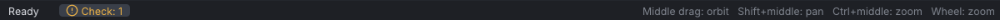

# Control presets

A control preset sets how the mouse moves the camera and which keys run which commands, so VATs
feels like a program you already know. There are four: **Industry (Maya-style)**, **Blender**,
**QAvimator** and **Second Life**. Industry is the default.

> Related articles: [[Keyboard shortcuts]], [[Preferences]], [[Interface]]

## Usage

### Choosing a preset

Open **Edit → Preferences...** (**Ctrl+,**) and pick one under **Navigation & hotkeys**. The change
applies at once and is saved. The status bar shows `Controls: <preset>`, and its right end shows the
mouse controls of the new preset. **Help → Controls** lists the keys of the active preset. Keys you
changed in **Edit → Keyboard Shortcuts...** stay; **Clear** under the preset drops them.

To try a preset for one session, start VATs with `--preset`; see [[Command line]].

*The right end of the status bar with the Blender preset. Each preset shows its own line here.*

### Worked example: switch to Blender and key a frame

[Open the example](example:first-wave.vat) and select **mElbowRight**, then:

1. Press **Ctrl+,** and pick **Blender** under **Navigation & hotkeys**. The status bar reads
   `Controls: Blender` on the left, and on the right
   `Middle drag: orbit   Shift+middle: pan   Ctrl+middle: zoom   Wheel: zoom`.
2. Press **Up**: in Blender, **Up** is **Next Key**, so the frame box reads **Frame 10**. (In
   Industry, **Up** selects the parent bone and **.** is **Next Key**.)
3. Press **I**, Blender's **Set Key**. The status bar says `Keyed 1 item(s) at frame 10`.
4. Press **Ctrl+Z** to take the key back, then pick **Industry (Maya-style)** again in Preferences.
   The status bar reads `Controls: Industry (Maya-style)` and its right end shows
   `Alt + drag: left orbit, middle pan, right zoom    Wheel: zoom`.

### Mouse, per preset

| | Industry (Maya-style) | Blender | QAvimator | Second Life |
|---|---|---|---|---|
| Orbit | **Alt + left drag** | **Middle drag** | **Left drag** on empty space | **Alt + click**, then drag sideways; **Ctrl + Alt + drag** |
| Pan | **Alt + middle drag** | **Shift + middle drag** | **Shift + left drag** on empty space; **middle drag** | **Ctrl + Alt + Shift + drag**; **middle drag** |
| Zoom | **Alt + right drag**; wheel | **Ctrl + middle drag**; wheel | **Alt + left drag** on empty space; wheel | **Alt + click**, then drag up or down; wheel (towards the focus) |
| Focus | **F** (Frame Selected) | **Num .** | **F** | **Alt + click** on the body, a prop or the ground |
| Snap while dragging | hold **Ctrl** | hold **Ctrl** | hold **Ctrl** | **G** toggles snapping |

In every preset:

- Click a bone to select it; click the same spot again for the bone underneath.
- Drag a box from empty space to select every shown bone inside it; see [[#Box selection]].
- **Shift+click** adds to the selection, except on an FK bone in QAvimator, where **Shift** + drag turns
  the bone.
- Double-click a limb bone to switch its limb between IK and FK.
- Right-click a bone for its body-part menu.
- **Esc** or a right-click during a drag cancels it.
- The mouse wheel zooms.
- **Num 5** switches the view between perspective and orthographic ([[Interface#Orthographic view]]).

### Box selection

A left drag that starts on empty space (off the gizmo, the bones and the IK controls) draws a thin rectangle in the
theme's accent colour; the bones whose joints fall inside light up while you drag, and the release selects them. It
works with the Select, Move, Rotate and Scale tools, in perspective and orthographic views, and takes only the
bones shown (groups hidden under **Show** in the **Bones** tab stay out). A click without a drag still clears
the selection, **Esc** or a right-click during the drag cancels it, and it is not an undo step, as no selection is.
The modifiers count as held when you let go.

| | Industry (Maya-style) | Blender | QAvimator | Second Life |
|---|---|---|---|---|
| Box | **Drag** | **Drag**; or **B**, then drag from anywhere | **Ctrl + drag** | **Drag** |
| Replace the selection | no modifier | no modifier | **Ctrl** only | no modifier |
| Add | **Ctrl + Shift** | **Shift** (a **B** box adds without it) | **Shift**, pressed once the box is started | **Shift** |
| Remove | **Ctrl** | **Ctrl** | – | **Ctrl** |
| Toggle | **Shift** | – | – | – |

- **Blender:** **B** with the pointer over the viewport arms a box: a crosshair follows the pointer and the next
  left drag draws the box even over a bone or the gizmo. **Esc** or a right-click disarms it. With audio loaded,
  **B** keeps marking a beat instead ([[Audio track]]).
- **QAvimator:** a plain drag on empty space still orbits and **Shift** + drag still pans, so the box starts with
  **Ctrl** alone; press **Shift** during the drag to add instead of replacing.
- **Second Life:** as the build tools' drag-select. **Ctrl** + drag on empty space removes; on the gizmo, **Ctrl**
  still turns it into the rotation rings.

### Industry (Maya-style)

The default. Camera moves need **Alt**; **Q**, **W**, **E** and **R** pick the Select, Move, Rotate
and Scale tools; **S** sets a key. **Alt+V** also plays and **Alt+.** and **Alt+,** also step frames.
**Alt+W** or **Alt+H** resets the hip position.

### Blender

- The camera uses the middle button. On a mouse or tablet without one, tick **Emulate 3-button mouse
  (Alt + left-drag = middle-drag)** in [[Preferences]]; **Alt + left drag** then orbits, with
  **Shift** to pan and **Ctrl** to zoom.
- **I** sets a key, **Alt+I** deletes it; **W**, **G**, **R** and **S** pick the Select, Move, Rotate and
  Scale tools; **A** selects all; the number pad sets views; **Alt+G** or **Alt+H** resets the hip
  position.

With the pointer over the viewport and a bone, IK control or static prop selected, **G** starts a
modal move and **R** a modal rotation that follow the mouse without a button held:

- **X**, **Y** or **Z** locks to that world axis; the same key again locks to the bone's own axis; a
  third time frees it.
- **R** again, during a rotation, rotates freely (trackball).
- Hold **Ctrl** to snap the rotation.
- A left click, **Enter** or **Space** confirms; a right-click, **Esc** or **Ctrl+Z** cancels.

The bottom left of the viewport shows the axis and the amount while the move runs. With the pointer
outside the viewport, **G** and **R** only pick the tool.

### QAvimator

- Drags on empty space move the camera; a click on empty space (without dragging) clears the
  selection.
- **Shift**, **Ctrl** or **Alt** + drag on a bone turns one rotation channel: Y, X or Z.
- **Ctrl+A** is **Save As...**, as in QAvimator, so **Select All** is **Shift+A**.
- **Ctrl+0** also frames everything, **Page Up** and **Page Down** zoom, **F9** to **F12** recall the
  four [[Keyboard shortcuts#Camera views|camera views]] and **Shift+F9** to **Shift+F12** store them.

### Second Life

For people used to the Second Life build tools. VATs starts in the **Move** tool; **Q**, **W**, **E**
and **R** pick the Select, Move, Rotate and Scale tools as in Industry, and **A** frames everything.

- Hold **Ctrl** to switch the gizmo to rotation, **Ctrl+Shift** to scale (static props only).
- **G** toggles snapping; the step is **Rotation snap (G)** in [[Preferences]].
- **Esc** resets the camera instead of clearing the selection.
- **Reset Hip Position** is **Alt+H** only: **Alt+W** belongs to the camera.

#### The camera, as in world

The camera works as the Second Life viewer's own (Firestorm's too): the same moves, speeds and limits.

- **Alt + click** focuses on the exact point you clicked: the skin of the body, another actor, a prop
  or the ground. The camera stays where it is and turns to it over 0.4 s. Clicking a worn prop focuses
  on its wearer, as with an attachment in world. A click on the empty sky changes nothing, and the
  drag that follows moves nothing.
- Keep the button down and drag. Sideways orbits round the focus, a full turn across the width of the
  view; up zooms in and down zooms out, 1% a pixel. With **Ctrl** as well (**Ctrl+Alt**) the drag
  orbits: sideways round, up and down over. With **Ctrl+Shift** as well it pans, three times the
  distance to the focus across the view. **Ctrl+Alt+click** and **Ctrl+Alt+Shift+click** focus too.
  The modifiers count as they are held during the drag, and nothing moves until the pointer has gone
  4 pixels.
- The camera never passes through the focus. Zooming in on a person stops a little in front of them,
  by the same rule as in world: their body box (0.45 m deep, 0.6 m wide, as tall as they are), less how
  far the focus sits off its middle, plus 11 cm. Alt+click the nose and zoom in hard: the camera stops
  about 13 cm in front of it; orbit round and it keeps outside the head.
- The wheel zooms towards the focus, a fourth root of two a click, and stops 0.5 m from a person, 2 cm
  from a prop, 15 cm from the ground. It does nothing while the camera is swinging to a new focus.
- The farthest is 240 m, and one step never goes more than four times as far out.
- The camera stays at least 0.5 m above the ground; it still looks at the focus.
- The view has the viewer's 60 degree lens.
- Keys, with the pointer anywhere: **Alt+Left** / **Alt+Right** (or **Alt+A** / **Alt+D**) orbit 90
  degrees a second; **Alt+Up** / **Alt+Down** (or **Alt+W** / **Alt+S**) zoom, the distance to the
  focus a second; **Alt+Page Up** / **Alt+Page Down** (or **Alt+E** / **Alt+C**) and
  **Ctrl+Alt+Up** / **Ctrl+Alt+Down** (or **W** / **S**) orbit up and down; **Ctrl+Alt+Shift** with the
  arrows or **A D W S** pans 5 m a second. A tap nudges: a key starts at 5% of its speed and reaches
  all of it in a quarter of a second.
- **Esc** puts the camera back and its focus on the avatar.

Not the same as in world: the pointer stays visible and stops at the edge of the screen, where the
viewer hides it and keeps it in the middle; a middle drag also pans; and a person is clicked by the
skin you see rather than by their collision shapes.

### Graph editor navigation

| Industry (Maya-style) | Blender | QAvimator | Second Life |
|---|---|---|---|
| **Alt + left** or **Alt + middle drag** pans, **Alt + right drag** zooms, **middle drag** moves keys | **Middle drag** pans (or **Alt + left** with emulation), **Ctrl + middle drag** zooms | **Middle drag** pans | **Ctrl + Alt + drag** or **middle drag** pans, **Alt + drag** zooms |

The wheel zooms the graph in every preset. See [[Graph editor]].

## Configuration

The preset is stored as `preset` in `settings.json` (`industry`, `blender`, `qavimator` or
`secondlife`); see [[Preferences#Settings file]].

Keys can be changed one by one in **Edit → Keyboard Shortcuts...**, with a search that finds every
number pad key; see [[Keyboard shortcuts#Changing shortcuts]]. Your keys stay over whichever preset is
active; the mouse controls always follow the preset.

## Troubleshooting

### A key does nothing

The key belongs to another preset, or a text field has the keyboard. Open **Help → Controls** to see the keys of
the active preset. While a text field is being edited, only **Ctrl** shortcuts for **New**,
**Open...**, **Save**, **Save As...**, **Export SL .anim...**, **Quit**, **Undo**, **Redo**,
**Preferences...** and **Graph Editor** reach VATs; click the viewport to give the keys back.

### Alt + drag moves the whole window

Some Linux desktops use **Alt + drag** (or **Super + drag**) to move windows. Change the window
manager's modifier, or use the Blender preset without emulation.

## See also

- [[Keyboard shortcuts]]
- [[Preferences]]
- [[Graph editor]]

Category: Interface
