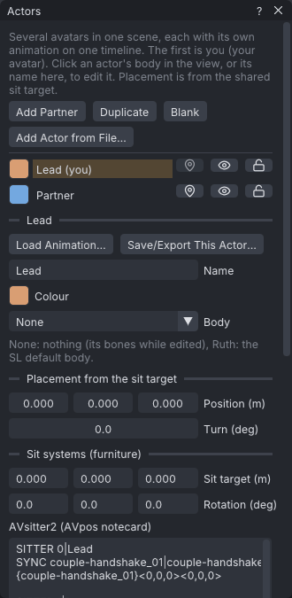
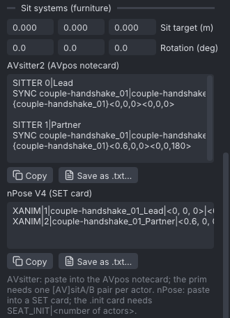
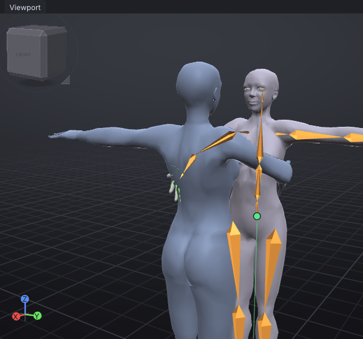

# Couples and groups

A couples or group animation is a set of animations, one per avatar, made to play together on one
piece of furniture or pose ball: a dance for two, a hug, a group photo. VATs keeps all the avatars
("actors") in one project on one timeline, so you develop their animations together with synced
playback. It places each one relative to the shared sit target and exports a file per actor plus a note
with the sit-target values.

> Related articles: [[Hold and bind]], [[Export to Second Life]], [[Props]], [[Mesh bodies]], [[Keys and timeline]]

> **Note:** In the viewer your own avatar is the first actor, and it plays that actor's animation whichever
> actor you edit. The other actors are drawn around it on your screen only, with the body you choose for
> them; they are never other people's avatars. See [[VATs Editor (viewer)]].

## Usage

### Add actors

Open **Tools → Actors (Couples and Groups)...**. A project starts with one actor. Add another with:

- **Add Partner**: a mirrored copy of the current actor's animation, 0.6 m in front of it and facing
  it;
- **Duplicate**: a copy of the current actor's animation, 0.8 m to its side;
- **Blank**: an actor with no keys, 0.8 m to the side;
- **Add Actor from File...**: an actor with the animation of a file, 0.8 m to the side (see
  [[#Load an animation into an actor]]).

Each new actor gets its own colour and the current actor's **Body**, so actors added to a plain project
start with **None** and draw nothing until you choose a body. Cross-actor binds are not copied.


*Two actors. The highlighted row is the actor being edited; the three buttons on each row are **Place**, **Shown** and **Unlocked**. Below the list: the edited actor's name, colour, body, placement and the bind to another actor.*

### Your avatar

The first actor in the list is your avatar and shows **(you)** after its name. In the viewer it is the
avatar you wear, and it keeps playing its own animation while you edit another actor. It also decides
which actor may bake on the **Your avatar** bake shape (see [[#Export]]). To make another actor your
avatar, right-click its name and choose **Make This Your Avatar**: it moves to the top of the list. This
is one undo step.

### Choose the actor to edit

Click an actor's body in the view, or its name in the **Actors** window; an actor with the body **None**
draws nothing, so choose it by name. Everything then works on that actor: the Bones list, the bone overlay
and the gizmos, the timeline, the graph, **Properties**, keys, undo, the [[Pose library]] and the
[[Motion capture]] recording. The status bar says which actor it is, for example **Editing Partner**. The
other actors are shown dimmed in their colour. A locked actor cannot be chosen.

In the viewer, clicking your own avatar's bones goes back to editing your actor.

The three icon buttons at the end of each row act on the other actors; hover one for its name:

- **Place** (a map pin) shows a gizmo on that actor in the view. The Move tool moves it; the Rotate tool
  turns it about the vertical axis.
- **Shown**/**Hidden** (an open eye, or a crossed-out eye) shows whether the actor is drawn in the view;
  click it to hide or show the actor.
- **Unlocked**/**Locked** (an open or a closed padlock) shows whether the actor is locked; click it to
  lock or unlock. A locked actor cannot be chosen or placed by accident.

Right-click an actor's name for **Load Animation...**, **Save This Actor as Project...**, **Export This
Actor as .anim...**, **Make This Your Avatar** and **Delete Actor**. Deleting an actor removes binds from
other actors to it as well. With one actor left, the project is an ordinary single-avatar project.

### Load an animation into an actor

Each actor is one animation. To work on animations you already have in tandem, load one into each actor:

- right-click the actor's name and choose **Load Animation...**, or select the actor and press **Load
  Animation...** under its name;
- drag a `.anim` from the **Inventory**'s **Animations** section onto the actor's name, or onto its body in
  the view; a project from the **Projects** section can be dropped on the name too;
- **Add Actor from File...** makes a new actor with the file's animation.

The file can be a `.anim`, a [[BVH]] on the Second Life skeleton, or a project (`.vat`); a project with
several actors asks which one to load. Loading replaces only that actor's animation, as one undo step. When
the actor already has keys, VATs asks first.

The actor keeps its props, [[Audio track|audio track]], export settings and placement; only the
animation is replaced. **Add Actor from File...** with a project's actor also takes that actor's name,
colour, body and placement.

All actors share one timeline (below), so the loaded animation follows the scene's timing, as when you
insert a `.anim` from the Inventory:

| Differs | What happens |
|---|---|
| Frame rate | The animation is retimed to the scene's frame rate. Keys keep their timing, as **Keep Timing** does in the **Frame rate** field. |
| Longer | The scene grows to the animation's length, for every actor. |
| Shorter | The scene keeps its length; the animation holds its last pose after its last key. |
| Loop | The scene's **Loop** and loop points apply. |
| Binds | Binds to actors this project doesn't have are left out. |

The status bar says what changed, for example "Loaded Hug_B.anim into Partner; retimed from 24 to 30 fps,
keys keep their timing; the scene now lasts 90 frames (was 60)".

### Save or export one actor

Right-click the actor's name, or press **Save/Export This Actor...** under it:

- **Save This Actor as Project...** writes a project with that actor's animation, props and export
  settings alone;
- **Export This Actor as .anim...** writes its `.anim` with its own bake shape and settings, as
  **Export SL .anim** would write it.

### Set up the active actor

Below the list, under the actor's name:

| Field | Meaning |
|---|---|
| **Name** | Used in the exported file names. Press **Enter** to apply. |
| **Colour** | The tint when the actor is not being edited. |
| **Body** | How the actor looks: **None** (the default: nothing but its [[Props|props]], and its bones while you edit it), **Ruth** (the Second Life default body), or one of your [[Mesh bodies]]. Saved in the project. In the app the actor you edit shows **Ruth**, or the body chosen under **View** when it has **None** or a mesh body; in the viewer your avatar's actor is the avatar you wear. Projects made before may show another Linden body by name. |

Under **Placement from the sit target**, **Position (m)** and **Turn (deg)** set where the actor stands
relative to the shared point, which stands for the pose ball or the furniture's sit target in Second Life.

### Share the timeline

All actors share the frame rate, length, **Loop** and the loop points; changing them on one actor changes
them on all. Priority, ease, hand pose and expression are set per actor.

### Touch another actor

To keep a hand of one actor on another actor (holding hands, a hand on a shoulder):

1. Select the point that should follow, such as the active actor's hand.
2. Under **Contact with another actor**, choose **Other actor** and **Their bone**. **Their bone** starts on the
   partner's **mChest**; its list groups the bones as **View → Bones** does (body, hands, face, ...), and typing in
   the box at its top narrows it to the names that contain the text.
3. Press **Bind Selected Point to This Bone from Here**.

The bind works like any other pin (see [[Hold and bind]]); release it later with **Release from Here**.
It is baked into the exported file. Binds follow one level: an actor bound to a second actor that is
itself bound to a third follows the second actor's own animation only.

To line a contact up by eye, pin the partner's pose as a ghost: **View → Onion Skin → Ghost Other Actor at
Frame** and the actor's name draws that actor's pose at the current frame in violet, and it stays while you
move to other frames or switch to posing the other actor (see [[Onion skin#Pinned ghosts]]).

**Look at Partner**, below the bind, keys the active actor's head and eyes to look between the eyes of the
**Other actor** on every frame, as one undo step (see [[Face animation#Look at partner]]).

### Export

**File → Export SL .anim...** writes one `.anim` per actor, loaded ones included, each baked with that
actor's own bake shape and key reduction. The **Your avatar** bake shape applies to your avatar's actor
only; the others bake on SL Default, unless **Use Your avatar for every actor** is on (viewer only). Naming, the folder and the mirrored copy come from the actor you export from. The
actor's name goes where the pattern has `[ACTOR]`, or at the end of the name when it has none:
`Hug_01_Lead.anim`, `Hug_01_Partner.anim`.

VATs also writes `<name>_placement.txt` beside the files. For each actor it gives the offset, the
rotation and a ready-made line for a sit script:

```
llSitTarget(<0.600, 0.000, 0.000>, llEuler2Rot(<0.0, 0.0, 180.00> * DEG_TO_RAD));
```

The note ends with the lines for AVsitter2 and nPose V4, the same as in [[#Sit systems (AVsitter and nPose)]].

With **Also export for heights** on (see [[Export to Second Life#Export for other heights]]), every actor is
exported at each height, `Hug_01_Lead_H175.anim` and so on, and a pin on the other actor is solved against that
actor at the same height. SL seats an avatar by its hips, and the hips of a taller body stand higher, so the note
gets a section per height: for each actor the lift, how much higher its hips stand on that body than on its bake
shape (about `-0.11 m` for 1.75 m on SL Default, `+0.22 m` for 2.15 m), the offset raised by it, and the AVsitter2 and
nPose V4 lines with the height's pose and animation names (`Hug_01_H175`, `Hug_01_Lead_H175`) and the raised
positions. Seat each height's files with its own lines, and hands and feet meet where they did in VATs. The
**Sit systems (furniture)** section in the **Actors** window shows the lines without a height only.

### Sit systems (AVsitter and nPose)

Furniture usually seats avatars with AVsitter2 or nPose, which read each sitter's position and rotation from
a notecard. The **Actors** window has a **Sit systems (furniture)** section, below the placement, with those
lines for every actor, ready to paste:


*The handshake example's lines: Partner sits 0.6 m in front of Lead, turned 180°.*

| Field | Meaning |
|---|---|
| **Sit target (m)** | Where the shared sit target is from the furniture's root prim, in metres. Press **Enter** to apply. |
| **Rotation (deg)** | The sit target's rotation in the root prim, in degrees, as the build window shows it. Press **Enter** to apply. |

Both are saved in the project, the same for every actor; a change is one undo step. With both at 0 the lines
give each actor's placement as it is.

Under each format, **Copy** puts its lines on the clipboard, and **Save as .txt...** writes them to a text
file. The pose name is the export name without the actor (`Hug_01`), and the animation names are the export
names without `.anim` (`Hug_01_Lead`), from the actor you edit, as [[#Export]] writes them.

For AVsitter2, paste into the `AVpos` notecard. Each actor gets a `SITTER` section, counted from 0, with a
`SYNC` pose, so the actors play together:

```
SITTER 0|Lead
SYNC Hug_01|Hug_01_Lead
{Hug_01}<0,-0.3,0.5><0,0,90>

SITTER 1|Partner
SYNC Hug_01|Hug_01_Partner
{Hug_01}<0,0.3,0.5><0,0,-90>
```

The prim needs one `[AV]sitA` and `[AV]sitB` pair per actor. AVsitter shows at most 23 characters of a pose
name, so VATs cuts longer names to 23.

For nPose V4, paste into a `SET` card. Each actor is a seat, counted from 1:

```
XANIM|1|Hug_01_Lead|<0, -0.3, 0.5>|<0, 0, 90>
XANIM|2|Hug_01_Partner|<0, 0.3, 0.5>|<0, 0, -90>
```

The `.init` card needs `SEAT_INIT|2`, with the number of actors. nPose V4 has no `ANIM` line; the `XANIM`
line replaces it.

Positions are in metres from the root prim, rotations in degrees, turned into a rotation X first, then Y,
then Z, as `llEuler2Rot` does. With a tilted **Rotation**, an actor's turn can show up in all three angles:
that is the same rotation. Numbers are rounded as the systems write them when you dump their settings:
AVsitter to 3 decimals for positions and 1 for rotations, nPose to 3 and 2.

### Animating on real furniture (viewer)

In the [[VATs Editor (viewer)]], sit on the furniture before you open the editor: the editor leaves you seated
on it. The **Actors** window then has a **Your seat** section above **Sit systems (furniture)**:

- **You sit on** the object's name (known once you have checked it, below), your avatar's **Offset from its
  root** in metres and **Rotation** in degrees: where you sit, in the root prim's frame, as sit systems place you.
- **Use as the Sit Target** makes that the **Sit target** and **Rotation** above, so the AVsitter and nPose lines
  seat your actor (the first) exactly where you sit now; your other actors keep their placement around it. One
  undo step.
- **Place on Furniture Point**, then a click on the furniture: the selected hand, foot or other bone goes to the
  point you clicked. A limb in [[IK]] (or a selected IK handle) gets its target keyed there at this frame; any
  other bone is held there with a [[Hold and bind|world pin]] from this frame. **Esc** cancels. Only that one
  point is read from the furniture, never its shape. A click off the furniture says so and keeps waiting.
- **Settle on Furniture** drops each selected bone and IK handle straight down onto the furniture, from 30 cm
  above it to 1 m below. It works only on furniture you created every part of: **Check Whether You Made It**
  finds out, by selecting the furniture as the viewer's **Edit** does to read who created each part (the
  viewer's own export rule), then deselecting it. Otherwise place points by clicking.

The app has no in-world furniture: type the sit target's offset there instead.

### Worked example: a handshake

[Open the example](example:couple-handshake.vat): two actors, **Lead** (you) and **Partner**, placed as
**Add Partner** places them, 0.6 m apart and facing each other. Each brings its right hand forward by
frame 15 and holds it there. **Partner** has the body **Ruth**; **Lead** has **None**, so it shows the body
chosen under **View**.


*Frame 15: Lead, with its bones drawn, and Partner tinted in its colour.*

1. Go to frame 15. In the **Actors** window, **Lead (you)** is highlighted: you are editing Lead.
2. Select **mWristRight** in the **Bones** list, or click Lead's right wrist in the view.
3. Under **Contact with another actor**, keep **Other actor** on **Partner**, open **Their bone**, type `wristr` and
   choose **mWristRight**, then press **Bind Selected Point to This Bone from Here**. The status bar says
   "mWristRight now follows Partner's mWristRight", and **Properties → Bone** reads **Pinned to mWristRight
   from frame 15**.
4. Click **Partner** in the **Actors** window and drag its **Turn (deg)**: as Partner turns, Lead's hand
   stays on Partner's wrist. Press **Ctrl+Z** to put Partner back (**Place Actor** is one undo step).
5. **File → Export SL .anim...** writes one `.anim` per actor and `<name>_placement.txt`, whose
   **Partner** entry ends with the sit-target line shown above.

## Tips and tricks

- Start all the actors' animations at the same moment in-world; their lengths and loop points already
  match.
- Add the furniture as a [[Props|prop]] to check the placement against it.

## Troubleshooting

### Avatars sit at the wrong height in-world

Second Life does not seat an avatar exactly at the sit target; sit scripts usually correct the height,
often by about 0.4 m. The right value depends on the avatar and the script. Check in-world and adjust Z.

### Only one avatar sits at its offset

`llSitTarget` works in the frame of the prim that holds it. For several avatars, use one sit target per
linked prim, or move each seated avatar to its offset with `llSetLinkPrimitiveParamsFast`
(`PRIM_POS_LOCAL` and `PRIM_ROT_LOCAL` on the avatar's link number).

### The animations drift apart

They were started at different times. Start them together, from one script.

### "Finish the current edit first"

A drag or text edit is still open. Release the mouse or press **Enter**, then try again.

## See also

- [Second Life Wiki: llSitTarget](https://wiki.secondlife.com/wiki/LlSitTarget)
- [AVsitter2: The AVpos notecard](https://avsitter.github.io/avsitter2_avpos.html)
- [nPose V4: Notecard contents](https://github.com/nPoseTeam/nPose-V4/wiki/NC-Contents)

Category: Animating
