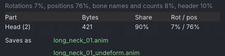
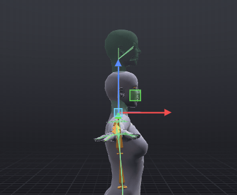
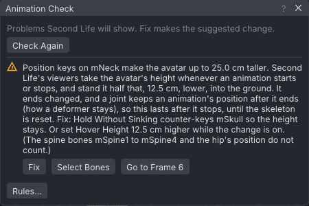

# Deformers

A deformer is an animation whose position keys reshape the avatar: a long neck, a taller body, a tiny one.
Second Life keeps an animated bone's position after the animation stops, so the shape stays on until something
moves the bones back. Every viewer also takes the avatar's height from some of those positions, which sinks a
wearer made taller into the ground; the **Deformer** export options and the [[Animation check]] deal with that.

> Related articles: [[Animation check]], [[Export to Second Life]], [[Skeleton]], [[Target ghost]]

The word has two meanings. In Second Life a deformer is the animation described here, often sold to fit a mesh
body or change proportions, with an *undeformer* that puts the bones back. In 3D packages a deformer is a modifier
that bends a mesh's vertices (a lattice, a bend, a twist); a Second Life animation cannot carry one.

## Why wearers sink

Three things in every Second Life viewer add up:

- A bone keeps the position an animation gave it after the animation ends. That is how a deformer stays on.
- Whenever an animation starts or stops on an avatar, the viewer works out the avatar's height from the positions
  of `mTorso`, `mChest`, `mNeck`, `mHead`, `mSkull` and the left leg (`mHipLeft`, `mKneeLeft`, `mAnkleLeft`,
  `mFootLeft`), animated positions included. `mSkull` counts √2 times, times the head's scale.
- The region keeps the avatar's centre where the shape's own height puts it, and the viewer stands the avatar half
  its height below that centre. A body made taller by *d* stands *d* / 2 lower, into the ground; a shorter one
  floats *d* / 2 above it.

So a neck made 1.37 m longer sinks the wearer 69 cm, for everyone who sees them, from the next time an animation
starts or stops until the skeleton is reset. The height never reads `mSpine1` to `mSpine4`, the hip's position or
the right leg, and moving a bone sideways changes nothing.

## Usage

### Choose a way out

| Option | What it does | Use it when |
|---|---|---|
| **End at rest** | Adds a frame after the last with every moved bone back at its rest position. | The shape is meant only while the animation plays: a gag, a stretch that snaps back. Not for loops. |
| **Hold without sinking** | Adds `mSkull` position keys that keep the height as it was on every frame. | The shape is meant to stay on: a deformer someone wears. |
| **Also export an undeformer** | Writes a second, short animation that puts the same bones back. | Whatever stays on needs a way back: give it with the deformer. Also the way back from a looping deformer. |
| Build it on the spine | Move `mSpine1` to `mSpine4` instead of `mTorso` and `mChest`. | A longer torso or body. Nothing to counter: the height never reads the spine. |

**Hold without sinking** with an undeformer is the usual pair for a deformer that stays on. **End at rest** with
**Hold without sinking** keeps the feet on the ground while it plays and leaves nothing behind.

The three options are in the export settings (the **Export SL .anim** dialog, the **Export** panel and
**Properties → Export**), shown once a bone other than the hip has position keys: **End at rest** and **Hold without
sinking** under **Clean Up → Deformer**, **Also export an undeformer** under **Also Write**. They change the exported file only, not the project, and are saved
with the project. The upload size meter and the [[Animation check]] count them.

*The **Deformer** options, as the tutorial below leaves them.*

### End at rest

**End at rest** adds one frame (1/30 s at 30 fps) after the last one. On it, every bone other than the hip that
has position keys and is off its rest position on the last frame is keyed at rest. The curves up to the old last
frame keep their shape. The hip is left alone: the viewer puts its position back itself when the animation ends.

A looping animation stops wherever it is when it is stopped, so the rest frame plays only if it runs to its end;
the export warns about this. Pair a looping deformer with an undeformer.

### Hold without sinking

**Hold without sinking** keys `mSkull`'s height on every frame so that the avatar's height stays at rest height:
the skull goes down by the growth ÷ (√2 × head scale), and up by as much for a body made shorter. The neck stays
long; only the skull, a small bone at the top of the head, moves. The keys are linear and within 0.2 mm of the
exact value.

The same keys go into the project, where you can see and edit them, with **Fix** on the Animation Check's finding
**Position keys that make the avatar taller** (its tooltip is **Hold Without Sinking (mSkull, head scale N)**).
The export option works them out again at each export, so later edits stay covered; keys made by the fix have to
be made again after you change the stretch (the check tells you).

- **Head scale**: the head's scale on the **Bake shape**; **SL Default**'s is `0.925`. In the viewer with
  **Bake shape: Your avatar**, your worn avatar's own. The line under the check box says which, for example
  `Counters for a head scale of 0.925 (the bake shape's)`. With no bake shape to take it from, `1`.
- **`mSkull`'s own keys** are kept and the counter-move added to them. When `mSkull`'s own keys are all that change
  the height, nothing is done, since countering them would undo them: the export says so, and the check's finding
  has no **Fix**.
- **The 5 m limit**: Second Life plays positions up to 5 m from the parent bone. A growth of more than about 7 m
  would need the skull further down; it stops at the limit, and the export warns with how far the wearer still
  sinks.

> **Note:** Anything rigged to `mSkull`, such as system hair, moves with it. Attachments stay: the Skull attachment
> point hangs on `mHead`, and in testing in Second Life, head attachments stayed on the head.

> **Warning:** The counter is exact for one head size. A wearer whose head scale differs sinks or floats by the growth
> × (1 − their head scale ÷ the one used) ÷ 2: for a neck 1.37 m longer, a head of `1` against SL Default's `0.925`
> is about 5 cm.

### The undeformer

**Also export an undeformer** writes `<name>_undeform.anim` beside the animation, for example
`long_neck_01_undeform.anim`; **Saves as** lists it. It holds every bone of the deformer that has position keys,
the hip aside and the `mSkull` counter-keys included, at its rest position, at the same priorities, 0.5 s long, with
no eases and no rotation keys. Play it after the deformer: the bones go back, and the viewer takes the height again
when it stops.

Rest is the skeleton's own position (SL Default), or your avatar's joint positions with **Bake shape: Your avatar**.
**Also save to Animations library** copies it too.

> **Note:** In the viewer, **Upload Animation...** uploads the undeformer after its deformer, each with its own price
> confirmation. The viewer's **Reset Skeleton** (right-click your avatar) also puts every bone back.

### Build height on the spine

`mSpine1` and `mSpine2` sit between the hip and `mTorso`, `mSpine3` and `mSpine4` between `mTorso` and `mChest`.
Moving them up makes the body longer above them, and the height never reads them, so the wearer does not sink and
nothing needs countering. When position keys on `mTorso` or `mChest` make the avatar taller, the check's finding
says so. There is no spine bone above the chest: a longer neck needs **Hold without sinking**.

## Tutorial: a neck that stays long

A deformer that stretches the neck over one second and keeps it long, without sinking the wearer.

### 1. Open the example

[Open the example](example:deformer-start.vat) [Show the target](target:deformer-long-neck.vat)

The example is one second long and keys only `mNeck`'s position, at rest on frame 0. The target shows the long neck
in green.

> **Why:** A deformer keys only the bones it reshapes, so the wearer's AO keeps moving the rest of the body.

### 2. Stretch the neck

1. Drag the playhead to frame 30, the last one.
2. In the **Bones** tab, type `neck` in **Filter bones...** and click **mNeck**. (From the side, the outstretched
   hands cover the neck in the view, so a click there picks a thumb.)
3. Choose **View → Camera → Right** to see the neck from the side, press **F** (**Frame Selected**) to bring it to
   the middle, and pick the **Move Tool** (**W**).
4. Drag the blue arrow up until the head sits in the green head, about a quarter of a metre. The readout beside the
   gizmo shows the height as you drag.

*The blue arrow on **mNeck** at frame 30: the head rises into the target's.*

Frame 30 is keyed. Play it: the neck grows over the second.

> **Check:** about `0.25` in the third **Offset (m)** field of **Properties**; anything from `0.20` to `0.30` reads
> the same.

### 3. See what Second Life would do

The status bar shows **Check: 1**. Click it (or choose **Tools → Animation Check...**): the neck makes the avatar
taller, and the message says how far every viewer would stand the wearer into the ground.

*The finding for a neck 25 cm longer: the wearer would stand 12.5 cm into the ground, for good.*

### 4. Export it without the sink

1. Choose **File → Export SL .anim...**. Under **Clean Up → Deformer**, tick **Hold without sinking**, and under
   **Also Write** tick **Also export an
   undeformer**. The finding clears: the check counts the export as it will be written.
2. Type a **Name**, such as `long_neck`, and press **Export .anim**. It writes `long_neck_01.anim` and
   `long_neck_01_undeform.anim`.

[Open the finished example](example:deformer-held.vat)

> **Why:** The export option leaves the project as you made it and works the counter-keys out again at every export.
> Use the check's **Fix** instead when you want to see the `mSkull` keys, or edit them by hand.

### Check your result

In Second Life, play `long_neck_01`: the neck grows over a second and stays long, and your feet stay on the ground
(within the head-size warning above). Play `long_neck_01_undeform`: the neck goes back, and your feet still stay on
the ground.

## Troubleshooting

### The wearer still sinks

- **A deformer played before the fix is still on.** A bone keeps its last position: play the undeformer, or use the
  viewer's **Reset Skeleton**, then play the new file.
- **A different head size.** The counter is exact for the head scale it names; see the warning in
  [[Deformers#Hold without sinking]].
- **The 5 m limit.** The export warns when `mSkull` cannot go down far enough.
- **Leg position keys.** Second Life's height counts the left hip's position with the wrong sign, so moving `mHipLeft`
  sinks or lifts the wearer in a way no counter-key matches. Keep deformers off the legs; the check's **Hip and leg
  position keys** rule flags them.

### System hair moves

System hair is rigged to `mSkull`, which **Hold without sinking** moves. Use **End at rest** instead, or build the
height on the spine.

### The shape stays after the animation stops

That is how position keys play in Second Life. Tick **End at rest** for a shape that should last only while it plays
(it does not help a looping animation), or play the undeformer.

## See also

- [[Animation check]]
- [[Export to Second Life]]
- [[Skeleton]]

Category: Second Life
