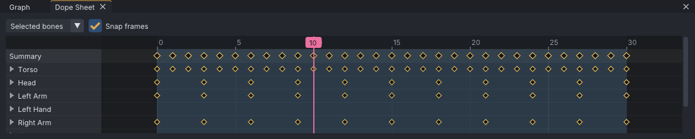

# Dope sheet

The dope sheet shows when things are keyed, without the values: one row of key diamonds per body part,
opening out to one row per bone, under a summary row with every keyed frame. It is the place to retime:
move, stretch, copy and delete keys across many bones at once.

> Related articles: [[Graph editor]], [[Keys and timeline]], [[Time editing]]

*The walk example with every bone selected: the Summary row gathers the keys of all the rows below it.*

## Usage

### Opening the dope sheet

The **Dope Sheet** panel is a tab beside **Graph**, at the bottom. Click its tab to bring it to the
front. **View → Dope Sheet** shows or hides it; its **×** closes it until **View → Dope Sheet** or the
next start of VATs.

The drop-down at the top is the graph's own: **Selected bones** shows the bones and [[IK]] controls that
are selected, plus the keyed IK target and pole of every limb with a selected bone (so a leg's keys and its
foot's move together); **All animated bones** adds every animated bone. Changing it in one panel changes it in the
other. **Snap frames** is shared with the graph too.

### Reading the rows

| Row | Shows |
|---|---|
| **Summary** | every frame that holds a key on any bone listed below it |
| A body part (**Torso**, **Head**, **Left Arm**, **Left Hand**, ...) | every frame that holds a key on any bone of that part |
| A bone or control (opened part) | that bone's keys, any channel |

Click a body part's name (or its arrow) to open it into one row per bone; click again to close it. Parts
come in skeleton order, torso first. A pin's offset track goes with its joint's part, an IK control
(**Left Arm IK**) with its limb, after the bones. An attachment point is a part of its own; a track VATs
can't place is under **Other**.

A diamond stands for all the keys at that frame in its row: rotation and position channels together.
Selected keys are yellow. Hover a diamond to see its row, frame and how many keys it stands for.

[[Hold and bind|Pins]] show as light blue bands across the rows of the bones they hold, from the frame
the pin starts to the frame it is released, as in the graph.

Double-click a row's name, or an empty part of a row, to select that row's bones (and IK controls) in
the viewport. The **Summary** row selects all of them.

### Selecting keys

- **Click** a diamond to select every key it stands for. **Shift+click** adds them, or removes them when
  they are all selected; **Ctrl+click** removes them.
- **Drag across empty space** to box-select: every key in the rows and frames the box touches. Hold
  **Shift** to add to the selection, **Ctrl** to remove.
- Clicking empty space clears the selection.

The selection is the graph editor's: keys picked in the dope sheet are picked in the graph, and the
other way round. Keys on curves the graph is not showing (after picking rows in its channel list, or an IK
pole's curves while the target is selected) drop out of the selection once the **Graph** tab is shown.

### Moving and stretching keys

- **Drag** a selected diamond to move the selection in time (**Move Keys**, one undo step). Values do not
  change. With **Snap frames** ticked the keys stay on whole frames; no key goes below frame 0.
- With two or more selected keys on different frames, a box with a handle on each side surrounds them.
  Drag the left handle to stretch or squeeze the keys about the rightmost one, the right handle about the
  leftmost (**Scale Keys**). Dragging a handle past the other side reverses the keys in time.
- When the selected keys run from frame 0 to **Last frame**, **Last frame** and the loop points scale with them,
  as **Edit → Time → Stretch Range...** moves them; the tooltip says `Scale to <n> frames: Last frame and the loop
  go along`.
- With **Snap to Beats** on (the [[Audio track]]), the dragged edge lands on a beat within 3 frames. The beat grid
  shows in the dope sheet as on the timeline.
- **Esc** during a drag puts the keys back.

Keys that land on the frame of an unselected key replace it, as in the graph.

### Tangents, deleting, copying

- **Right-click** a diamond (or empty space, with keys selected) for **Auto**, **Spline**, **Plateau**,
  **Linear**, **Flat**, **Stepped** and **Delete Keys**. A right-click on an unselected diamond selects it
  first. See [[Graph editor#Shaping curves: tangents]] for what each tangent does.
- **Delete** with the mouse over the dope sheet deletes the selected keys.
- **Ctrl+C** and **Ctrl+V** with the mouse over the dope sheet copy and paste keys, as in the graph:
  pasting puts the earliest copied key at the current frame and keeps the spacing. The clipboard is the
  graph's, so keys copied in one panel paste in the other.

### Navigating

| Do | To |
|---|---|
| Click or drag in the ruler | move the current frame |
| Wheel | zoom time about the pointer |
| **Shift+wheel** | scroll the rows |
| Middle drag, or **Alt+drag** | pan in time |
| **Frame All** key (**A**, Industry) over the dope sheet | fit the time range to the curves the graph shows, or the whole clip when it shows none |
| **Frame Selected** key (**F**, Industry) over the dope sheet | fit the time range to the selected keys |

The dope sheet and the graph share one time range: zooming or panning one moves the other. The status bar
shows the dope sheet's mouse controls while the pointer is over it.

## Tips and tricks

- To slow a whole section down, box-select its keys in the **Summary** row and drag the right scale
  handle.
- Copy a gesture's keys from the **Summary** row and paste them further along to repeat it.
- Switch to **All animated bones** to retime the whole animation, whatever is selected.

## Troubleshooting

### The dope sheet is empty

No bone is selected and the drop-down says **Selected bones**. Select bones, or pick **All animated
bones**.

### A diamond won't move

Only selected keys move. Click the diamond first, then drag it; a Shift- or Ctrl-click that deselected it
leaves nothing to drag.

## App and viewer

The dope sheet is the same in the app and in the [[VATs Editor (viewer)]].

## See also

- [[Graph editor]]
- [[Keys and timeline]]
- [[Motion paths]]

Category: Animating
