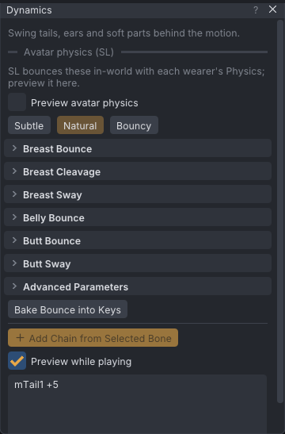

# Dynamics

Dynamics makes a chain of bones swing and settle behind the animation: tails, ears, hair, and soft-body
jiggle on collision volumes. VATs simulates the chain, then bakes the motion into ordinary keys, because
Second Life plays keys, not physics.

> Related articles: [[Ragdoll]], [[Skeleton]], [[Keys and timeline]]

## Usage

Open the window with **Tools → Dynamics...**. Each chain is listed by its first bone and the number of
bones after it (for example `mTail1 +5`), with **(baked)** after chains that hold a bake. The settings
and buttons below the list apply to the selected chain.

### Adding a chain

1. Select the first bone of the chain, for example `mTail1`. Tail, wing and face bones are hidden by
   default; show them from the **View** menu (for example **View → Bones → Show Tail Bones**, see [[Skeleton]]).
2. Click **Add Chain from Selected Bone**. VATs picks a preset from the bone's name: **Jiggle** for a
   collision volume, **Ears** for a bone with `Ear` in its name, otherwise **Tail**. The chain starts
   with every bone down the first-child path from the selected bone, and takes the bones that fan out from
   the same point as a bone on that path: a chain from `mWing2Left` swings `mWing4FanLeft` beside the tip.
3. Adjust the settings (see Configuration below), or press **Tail**, **Ears**, **Jiggle** or **Overlap**
   to load another preset. A preset changes the physical settings and keeps **Bones**.

The button is disabled until a joint or a collision volume is selected. Attachment points cannot swing.

**Overlap** suits follow-through on a limb or the spine: the chain lags behind and settles with little
swing back and no droop. To delay a chain's own keys instead of simulating it, see [[Overlap]].

*A six-bone tail chain. Click it in the list to see its settings and buttons.*

### Soft-body jiggle

Select a collision volume such as `BELLY`, `BUTT`, `LEFT_PEC` or `RIGHT_PEC` (show them with **View →
Show Collision Volumes**) and add a chain. A collision volume is one point that moves, not a chain of
bones, so it has no **Bones** setting and is baked as position keys.

To bounce them as SL's avatar physics does, use **Avatar physics (SL)** at the top of the window and **Tools →
Avatar Physics Preview**: see [[Rig any model#Preview the bounce]].

### Parts on spare chains

A mesh body whose scarf, ponytail or skirt rides a spare SL chain ([[Rig any model#Put a scarf on a spare chain]])
lists it at the top of the window under **Parts on spare chains**: `scarf, left wing`. SL has no physics for rigged
mesh, so keys on those joints are the only way the part moves in-world.

1. Pick how it swings: **scarf** lags and hangs, **hair** springs back sooner, **cape** is heavy and slow, **tail**
   swings the most. VATs guesses from the part's name.
2. With a looping clip, leave **Match the loop** ticked: the loop is simulated twice first, so the swing ends where it
   starts. Untick it to simulate the clip once from frame 0.
3. Press **Animate scarf from Body Motion**. VATs adds a chain on the part's joints (or sets up the one it added
   before) and bakes it over the whole clip, as one undo step. Only those joints get keys; `mWing4Fan` beside the
   wing's last joint is left out.

Play the clip to check it, then fine-tune the chain like any other and **Re-bake**. Whatever animates those joints at a
higher priority in-world wins over your keys, and worn Bento wings or a tail with animations of their own fight them.

### Previewing

**Preview while playing** is ticked when the window opens; play the clip. Chains that are not baked yet are
simulated during playback. When playback stops or you scrub, the view shows the keyed pose.

### Baking

- **Bake** simulates the whole clip and writes the chain's motion as keys, as one undo step. The button
  then reads **Re-bake**.
- **Re-bake** starts again from the keys the chain had before the first bake, so you can change the
  settings and bake again as often as you like.
- **Unbake** puts back the keys the chain had before baking.
- **Remove** deletes the chain and puts back its pre-bake keys.
- **Bake All** bakes every chain at once. It appears when there are two chains or more.

Baked keys are thinned: keys that don't change the motion are left out, with at most two seconds between
keys.

## Configuration

| Setting | Range | Default | Tail | Ears | Jiggle | Overlap | Effect |
|---|---|---|---|---|---|---|---|
| **Bones** | 1 to the chain's depth | whole chain | | | 1 | | how many bones down the chain are simulated |
| **Stiffness** | 0–1 | 0.25 | 0.08 | 0.2 | 0.12 | 0.3 | how hard the chain pulls back to the animated pose |
| **Damping** | 0–1 | 0.2 | 0.12 | 0.25 | 0.08 | 0.35 | how quickly swinging calms down |
| **Drag** | 0–0.5 | 0.02 | 0.03 | 0.02 | 0 | 0.02 | air resistance: slows all motion, not only the swing |
| **Gravity** | 0–3 g | 0 | 0.3 | 0.1 | 0 | 0 | pull downwards, in multiples of Earth's gravity |
| **Radius** | 0–0.15 m | 0.02 | 0.03 | 0.01 | 0 | 0.02 | how far the chain keeps from the body's collision volumes; where the animation itself goes closer, it keeps as far as the animation does |
| **Bend limit** | 0–180° | off (0) | off | off | off | off | how far each bone may bend away from its animated pose, relative to its parent; off lets it swing freely |

The simulation runs at 120 steps per second, whatever the clip's frame rate. However high **Stiffness** or low
**Damping** is set, no bone turns more than 720° a second faster than the animation turns it, so extreme settings
swing hard but never flail. A looping clip (see
[[Loop tools]]) is simulated around the loop twice before recording, so the end of the baked loop matches
its start.

## Worked example: a tail that swings

[Open the example](example:dynamics-tail.vat): a four-second loop in which the hips turn 35° to each
side, with a **Tail** chain already added on `mTail1` and not yet baked.

1. Choose **View → Bones → Show Tail Bones**, so the tail is drawn, then **Tools → Dynamics...**. The list shows
   `mTail1 +5`: the chain runs from `mTail1` through five more bones to `mTail6`. Click it: the settings
   read the Tail preset, **Stiffness** 0.08, **Damping** 0.12, **Drag** 0.03, **Gravity** 0.3 g,
   **Radius** 0.03 m, with **Bones** at 6.
2. Play (**Preview while playing** is ticked). The tail lags behind each turn of the hips and swings back
   through the middle; stop, and it snaps to the keyed pose.
3. Press **Bake**. The status bar says "Baked mTail1 to keys", the list reads `mTail1 +5  (baked)` and
   the button now reads **Re-bake**. Scrub: the tail keeps swinging without the preview, because the
   motion is keys now. Select `mTail1` at frame 0: **Properties → Bone** says "Keyed at this frame".
4. Change a setting, for example **Stiffness** to 0.02, and press **Re-bake**. The bake starts again from
   the unkeyed tail, so settings can be tried as often as you like. **Unbake** puts the unkeyed tail
   back.

For a longer worked example, with every setting compared side by side, wings, jiggle and export, see
[[Dynamics: tails, ears and hair]] and the tutorials after it.

## Tips and tricks

- Use **Radius** to keep a tail out of the legs; the chain is pushed out of every collision volume by
  that distance, or as far as the animation keeps it where that is less. A volume the animated bone is inside
  (ears in the head) is not an obstacle.
- Use **Bend limit** to keep a soft chain from folding: at 30° no bone bends more than 30° from its animated pose.
- Lower **Stiffness** and **Damping** for a lazy, heavy swing; raise both for a short, springy one.
- Bake last: bake after the body motion is final, since the bake follows the animation it was baked from.
  Re-bake after changing the body.

## Troubleshooting

### Add Chain from Selected Bone is disabled

No bone is selected, or the selected item is an attachment point. Select a joint or a collision volume.

### The chain doesn't move in the preview

**Preview while playing** is off, the clip is not playing, or the chain is baked. Baked chains play their
keys; **Unbake** to preview the simulation again.

### The loop pops at the wrap

The loop points changed after baking. Re-bake the chain.

## See also

- [[Ragdoll]]
- [[Loop tools]]
- [[Overlap]]
- [[Idle layer]]
- [[Project file format#dynamics]]

Category: Motion
