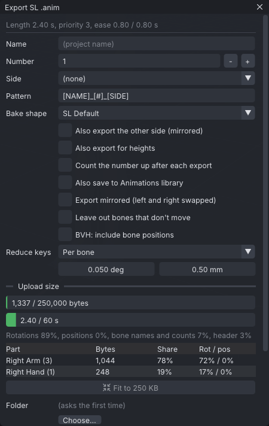

# Export to Second Life

VATs writes Second Life animations as `.anim` files, the viewer's own binary format, and as BVH for
other tools. An `.anim` keeps everything VATs can animate: attachment points, moved bones, per-bone
priorities and constraints. You upload the file from any Second Life viewer, or from inside the viewer
with the [[VATs Editor (viewer)]].

> Related articles: [[Animation check]], [[Animation priority]], [[Anim format]], [[BVH]], [[Couples and groups]], [[Mesh bodies]]

## Usage

### Export an .anim

1. Set the clip's length, loop, priority and ease in **Properties → Animation** (see
   [[Animation priority]]).
2. Choose **File → Export SL .anim...** (**Ctrl+E**). The **Export SL .anim** dialog opens. The same
   settings are also in **Properties → Export**.
3. Check the **Saves as** line, then press **Export SL .anim**.

The first export asks for a folder when none is set (**Folder** shows `(asks the first time)`): a save
dialog offers the **Saves as** name. Its folder becomes the export **Folder**. Keep the name offered, or type
another: a typed name becomes the **Name**, with **Pattern** `[NAME]` and no **Side**, so that exact file is
written (a mirrored export still ends in `_mirrored`, and several actors or clips still add theirs). After
that, **Export SL .anim** writes straight to the folder; **Choose...** changes it. The status bar reports
the files written, how many were replaced, and a summary of bones, length, priority, bytes, any
attachment points that move or rotate, how many unmoving position channels were left out (see
[[Export to Second Life#Positions that do not move]]), and, with **Leave out bones that don't move** on, how
many bones were left out.

The export settings are saved with the project, and each change to them is an undo step.

*The top line sums up the clip; **Saves as** shows the file name the settings produce.*

### Worked example

[Open the example](example:graph-basics.vat), the arm wave from the [[Graph editor]] page, and press
**Ctrl+E**.

1. The top line reads "Length 2.40 s, priority 3, ease 0.80 / 0.80 s". **Name** is empty and the project
   is an untitled copy, so **Saves as** shows `Animation_01.anim`.
2. Type `Wave` in **Name**: **Saves as** becomes `Wave_01.anim`. Set **Side** to **Right**:
   `Wave_01_Right.anim`.
3. Press **Export SL .anim** and pick a folder when asked. The status bar says "Exported Wave_01_Right.anim
   to <folder>: 4 bones, 2.40 s, priority 3, 1337 bytes": the four keyed bones of the right arm, and
   nothing else, are in the file. [[Anim format#Worked example: the size of a file|Anim format]] shows
   where the 1337 bytes come from.
4. Set both **Reduce keys** fields to `0` and export again. The status bar now says "(1 replaced)" and
   the file is larger, with a key on all 73 frames of every bone.

### Name the files

| Field | Meaning |
|---|---|
| **Name** | The animation name. Empty uses the project file name, or `Animation` for an unsaved project. |
| **Number** | 0–999, written with at least two digits (`01`). |
| **Side** | **(none)**, **Left** or **Right**. |
| **Pattern** | Default `[NAME]_[#]_[SIDE]`. Tokens: `[NAME]`, `[#]`, `[SIDE]`, `[ACTOR]`, `[CLIP]`. |

VATs removes the characters `\ / : * ? " < > |`, collapses doubled separators (`__` becomes `_`) and
trims separators from the ends, so an empty side leaves no stray underscore: `Wave_01.anim`.

- **Also export the other side (mirrored)** writes a second file with the sides swapped:
  `Wave_01_Left.anim` and `Wave_01_Right.anim`. With **Side** at **(none)**, the mirrored file gets
  `_mirrored` appended.
- **Count the number up after each export** adds 1 to **Number** after each successful `.anim` export,
  so the next export does not replace the last one.
- **Also save to Animations library** copies each exported `.anim` into the **Inventory**'s Animations
  library as well ([[Project library]]).
- **Export mirrored (left and right swapped)** swaps the sides in the exported file only; the project is
  unchanged.
- **Also export for heights** writes every file again for avatars of other heights, with the height at the end
  of the name: `Wave_01_H175.anim`. See [[Export to Second Life#Export for other heights]].

With several [[Clips]], the export settings are the current clip's, the dialog's top line names the clip, and
every name includes the clip: `[CLIP]` is the clip's name, and a pattern without `[CLIP]` gets `_` and the name at
the end. **Export All Clips (.anim)**, under **Every clip** in the dialog and in the **File** menu, exports every
clip with its own settings into the current clip's folder; see [[Clips#Export every clip]].

### Choose the bake shape

IK, pins and dynamics are baked into plain keys at export. **Bake shape** sets the body they are baked
against, whatever the view shows:

- **Your avatar** (the [[VATs Editor (viewer)]] only): positions fitted to the head and body you wear now; other
  heads may look different. See [[Export to Second Life#Your avatar]];
- **SL Default** and **SL Default (Male)**;
- **Mesh body:** and the body name, for each body in the inventory. A mesh body uses the joint positions it was
  rigged to (see [[Mesh bodies]]).

### Export for other heights

An animation baked on one body puts hands and feet in the wrong place on a much shorter or taller one: a hand
pinned to a table floats above it or sinks into it. **Also export for heights**, under **Also export the other
side (mirrored)**, writes the animation again for each height you choose, baked on a body of that height, so IK
and pins are solved again on it and the contacts hold.

- Ticking it adds three heights: `1.75 m`, `1.95 m` and `2.15 m`. Each row has a list with those presets and
  **Custom**, which shows a field from `1.40` to `2.40 m`. **Remove** takes a row away and **Add Height** adds
  one: two or three heights, each with its name ending (`_H175`) beside it.
- Heights are as Firestorm's shape editor shows them: the viewer's body size (the Z of `llGetAgentSize`) plus
  0.195 m. SL Default is `1.88 m`, SL Default (Male) `1.97 m`.
- Each body is SL Default, or SL Default (Male) when **Bake shape** is **SL Default (Male)**, with its shape's
  **Height** slider moved until it is that tall, and **Leg Length** after that once **Height** is at its end.
  They reach from about `1.41` to `2.32 m` (`1.50` to `2.40 m` male); a height beyond that is made as close as
  they allow. Other bake shapes (a mesh body, **Your avatar**) get the female body, and position keys are written
  from its default joint positions.
- The file names end in the height in centimetres, after everything else: `Wave_01_Right_H175.anim`, and with
  **Also export the other side (mirrored)** each height gets its mirrored copy, `Wave_01_Left_H175.anim`.
  **Saves as** lists every file.
- **Export SL .anim** and **Upload Animation...** write every height; BVH export and **Export This Actor as
  .anim...** write none. An imported `.anim` you have not edited still goes out as it came in; its height files
  are baked anew.
- **Upload size** and [[Preview as SL plays it]] measure the file without a height.

In a [[Couples and groups|couple or group]] every actor is exported at each height, and a pin on the partner is
solved against the partner at that height too. The placement note then gives each height's seat offsets; see
[[Couples and groups#Export]].

### Your avatar

In SL, a position key in an animation replaces the bone's position, including the position a mesh head or
body gives that bone. With **SL Default**, a moved bone is written at the default avatar's position plus the
move, so a mesh head with its own face (a furry muzzle) is pulled towards the default face. With **Your
avatar**, each bone that moves is written at the position it has on the avatar you wear, mesh joint positions
included, plus the move.

- In the viewer, **Your avatar** is the default while the avatar you wear has mesh joint positions, unless the
  project has chosen another shape.
- Only bones whose position moves are written with your avatar's positions. Other bones get no position keys,
  scales are not written, and IK and pins are baked on **SL Default**.
- The positions are read from the viewer at each export and upload. The project saves only the choice
  **Your avatar**, never the positions.
- The animation fits the head and body you wore when you exported it. On another head, bones that move are
  placed where they sit on yours.
- In the standalone app, **Your avatar** is not offered. A project that chose it exports as **SL Default**, and
  **Bake shape** shows `Your avatar (viewer only: SL Default here)`.
- In a [[Couples and groups|couple or group]], **Your avatar** is for the actor you are editing, the one your
  avatar shows. Another actor whose **Bake shape** is **Your avatar** bakes on **SL Default** instead, unless **Use
  Your avatar for every actor** (the viewer only, under **Bake shape**) is on; then every actor bakes against your
  worn avatar.

### Positions that do not move

A bone other than the hip whose position stays within the position tolerance of **Reduce keys** (default
`0.50 mm`; exactly zero when it is `0`) on every frame gets no position keys. Such keys would move nothing
on the default avatar, but in SL they pin the bone to the exported position and override a mesh head's or
body's own joint positions. A bone keyed only by such positions is left out of the file. The hip keeps its
position keys; they are an offset from standing. BVH export applies the same rule with the default tolerance.

### Bones that don't move

With **Leave out bones that don't move** on, a bone other than the hip whose rotation stays within the rotation
tolerance of **Reduce keys** (default `0.050 deg`) of its rest on every frame gets no rotation keys, so other
animations still move it: a face take then leaves the blinks of your AO or face HUD alone on the bones it didn't
move. A bone left with nothing to write is left out of the file. Off (the default), every bone you keyed is
written, holding it where the animation has it. BVH export is not affected.

### Reduce keys

VATs samples every bone at every whole frame, then removes keys that the viewer's interpolation
reproduces within a tolerance. The first and last frames, the frames where you set keys, and a key at least
every 60 frames are always kept. **Reduce keys** has two modes, chosen in its list:

- **Per bone** (the default): two fields, rotation (default `0.050 deg`) and position (default `0.50 mm`).
  Each bone keeps the keys its own rotation and position need to stay within them. Set both fields to `0` to
  keep a key on every frame.
- **Anywhere on the body**: one field, a distance (default `1.00 mm`, from `0.05` to `50 mm`). Keys go while no
  point of the body ends up further than that from your animation, in the world, as SL plays the file.

A key left out of a shoulder moves the whole arm, while one left out of a finger moves only the fingertip. **Per
bone** allows every bone the same angle, so it keeps too many finger keys or loses too much at the hand.
**Anywhere on the body** measures a bone's difference by how far it moves the farthest point below it (at least
0.1 m away, so fingertips, eyes and attachment points count too), and shares the distance out down each chain
from the hip: each bone gets the distance divided by the number of rotation and position tracks on the longest
chain through it, so the differences down to a fingertip add up to no more than the distance (plus the file's
rounding, under 0.2 mm). For the same largest difference it usually keeps fewer keys than **Per bone**. It picks keys by splitting each stretch at its
frame of largest difference until every frame is within its share (the Ramer–Douglas–Peucker method).

[[Export to Second Life#Positions that do not move]] and **Leave out bones that don't move** use the **Per
bone** tolerances in either mode.

To see what the reduced file looks like when it plays, use **View → Preview as SL Plays It**
([[Preview as SL plays it]]).

### Check the upload size

Under **Reduce keys**, **Upload size** measures the file the export would write, as you edit:

- a bar with its size against `250,000` bytes (SL refuses a file of 250,000 bytes or more) and one with its
  length against 60 seconds; each is green, amber from 90% of the limit, and red over it;
- the share of the file taken by rotation keys, position keys, bone names and key counts, and the header;
- the body parts that cost the most, up to eight, with each part's bones in brackets, its bytes, its share of
  the file, and the share of its rotation and position keys. Face bones count as **Face** and attachment points
  as **Attachment points**, whatever they are attached to.

VATs measures again when something that goes into the file changes, at most four times a second, and not
while the left mouse button is held down.

**Fit to 250 KB** is available while the file is over the size limit or longer than 60 seconds. It raises
both **Reduce keys** tolerances by half again, step by step, starting from the current values (at least
`0.050 deg` and `0.50 mm`) and going no further than `5 deg` and `50 mm`, until the file is under 250,000
bytes. With **Anywhere on the body** it raises that distance instead, the same way, from at least `0.50 mm` up to
`50 mm`, and leaves the **Per bone** values as they are. When it fits, the new tolerances become **Reduce keys** (one undo step, `Fit to 250 KB`), and a line
gives the size and the largest difference between the fitted file and your animation, in the world, in
millimetres and degrees, with the bones where they occur. The [[Preview as SL plays it|SL preview]] table shows
the differences bone by bone.

The keys you set are always kept, so an animation keyed on most frames, such as motion capture, can stay over
the limit at `5 deg` and `50 mm` (or `50 mm` anywhere on the body), and an animation over 60 seconds never fits. Then **Split into Parts...**
appears: it saves the animation as consecutive projects beside this one, `<name>_part1.vat`,
`<name>_part2.vat` and so on, each under 60 seconds and the size limit, each starting where the previous one
ends. Each part is fitted as [[Retargeting#Fit SL's limits]] fits a clip, which may also lower its frame rate
and leave out face, finger and toe bones. Parts from an earlier split are listed first and replaced (kept as
`.bak`) only after **Replace Them**. Save the project first; a project with more than one actor cannot be
split.

### Export BVH

**File → Export BVH (Animated Bones)...** writes the animated bones and their parents; **File → Export BVH
(All Bento Bones)...** writes every Bento bone, keyed or not. The **Export** section has the same two
buttons under the same names. BVH cannot carry attachment points,
per-bone priorities or constraints; see [[BVH#Export]].

### Upload

In a standard Second Life viewer, choose **Build → Upload → Animation**, pick the `.anim` file, and
confirm the fee. In the viewer, the [[VATs Editor (viewer)]] uploads directly with **File → Upload Animation...**:
every file Export would write, the mirrored copies and heights included, each with the viewer's price
confirmation. **Upload All Clips...** does the same for every clip of a project with several [[Clips]].

> **Warning:** Uploading costs L$ and cannot be undone. Test on the Aditi beta grid, where uploads are
> free, or preview the animation in the viewer first.

## Configuration

| Setting | Default | Where |
|---|---|---|
| Pattern | `[NAME]_[#]_[SIDE]` | **Properties → Export** |
| Number | `1` | **Properties → Export** |
| Bake shape | **SL Default**; in the viewer **Your avatar** while you wear mesh joint positions | **Properties → Export** |
| Use Your avatar for every actor | off (the viewer only) | **Properties → Export** |
| Leave out bones that don't move | off | **Properties → Export** |
| Reduce keys | **Per bone**: `0.05` degrees, `0.5` mm; **Anywhere on the body**: `1` mm | **Properties → Export** |
| Also export for heights | off; ticked: `1.75`, `1.95`, `2.15` m | **Properties → Export** |
| BVH: include bone positions | off | **Properties → Export** |

All of these are stored in the project, not in the preferences.

## Troubleshooting

> **Tip:** **Tools → Animation Check...** finds most of the problems below before you export, and
> offers a fix for each; see [[Animation check]].

### Export refuses the animation

VATs checks each file with the same rules the viewer uses when it reads an `.anim`. A file the viewer
would reject gets a **Cannot export** message and is not written:

- `the animation is longer than 60 seconds; SL will not play it` (**Properties → Animation** already
  shows `over SL's 60 s limit`);
- `the file is N bytes; SL accepts animations under 250000 bytes`;
- `nothing is keyed`.

Shorten the clip, raise **Reduce keys**, or remove keys from bones that do not move. **Fit to 250 KB** under
**Upload size** raises **Reduce keys** for you, and splits the project into parts when that is not enough
(see [[Export to Second Life#Check the upload size]]). For long motion capture, [[Retargeting#Fit SL's limits]]
can split the clip into parts.

### Exported with warnings

The file is written, and the message lists what the viewer may do differently. Examples: `loop in is
after loop out`, `some positions are further than 5 m and were clamped`, and `track "X" matches no bone
and is not exported`. **Upload Animation...** shows the same warnings as **Uploading with warnings**;
cancel at the price question to stop an upload.

### The face of a mesh head is pulled out of shape in-world

Face bones carry position keys made on the default head. In the viewer the export warns `N face bones carry
position keys while a mesh head is worn; they will pull it towards the default face (set Bake shape to Your
avatar)`. Set **Bake shape** to **Your avatar** and export or upload again, or record the face with **Move face
bones** off (see [[Face tracking]]).

### A bone does not play in-world

Another animation with a higher priority controls that bone. Raise the priority of the clip or of that
bone; see [[Animation priority]].

### Ease values are ignored

With **Loop** off, an ease in plus ease out longer than the animation gives the warning `ease in + ease
out is longer than the animation`. The `.anim` keeps the values as written; a BVH upload scales both
down to fit. Shorten the ease times.

### The mesh body poses differently in-world

The animation was baked against a different shape. Set **Bake shape** to the body you wear.

## See also

- [[Animation check]], problems to fix before upload
- [[Anim format]], the byte layout VATs writes
- [Second Life Wiki: Animation](https://wiki.secondlife.com/wiki/Animation)
- [Second Life Wiki: Aditi](https://wiki.secondlife.com/wiki/Aditi), the beta grid

Category: Second Life
