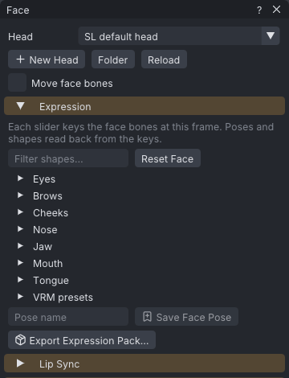

# Face animation

The **Face** window animates the Bento face bones by hand: sliders for the 52 ARKit face shapes and the VRM
presets, [[Lip sync]], a layer that adds blinks, eye darts and a look-at target, and a tool that turns the head or
eyes towards a target. Everything is written as ordinary bone keys through the same face table as
[[Face tracking]]. **Export Expression Pack...** turns expressions into a set of short face-only animations for an
expression HUD.

> Related articles: [[Face tracking]], [[Lip sync]], [[Pose library]], [[Couples and groups]], [[Keys and timeline]]

## Usage

Open the window with **Tools → Face...**. It has four sections: **Expression**, **Lip Sync** (see [[Lip sync]]),
**Blinks, Eye Darts and Look-At**, and **Look At**.

*The **Face** window with the SL default head.*

> **Note:** Face bones only show in Second Life on a mesh head rigged to the Bento face bones.

### Setting an expression

1. Move the playhead to the frame to key.
2. Open a group (**Eyes**, **Brows**, **Cheeks**, **Nose**, **Jaw**, **Mouth**, **Tongue**, **VRM presets**)
   and drag a slider (0–1). **Filter shapes...** shows only the shapes whose name contains the text.
3. The face bones the slider moves are keyed at the frame while you drag. One drag is one undo step.

Only the bones the slider moves get keys, each moved by the slider's change from the value it has now. Bones the
slider does not touch keep their keys. **Reset Face** keys every face bone at rest at the frame.

The project stores bone keys only, never slider values. When you change frame, undo, or edit the face bones
another way, the sliders are read back from the keys (see [[#Reading sliders back]]).

### Saving a face pose

Type a name under the sliders and click **Save Face Pose**. The pose goes to **Inventory → Poses** with the kind
`face`, and applies like any pose, mirrored too (see [[Pose library]]). It holds every face bone's rotation at the
frame and, with **Move face bones** on, the offsets of the bones the table moves.

### Exporting an expression pack

**Export Expression Pack...**, under **Save Face Pose**, writes one short `.anim` per expression, ready for an
expression HUD: each moves the face bones only, eases in and out, and is named by one pattern.

1. Tick the expressions: the **Starter set** (all ticked at first) and any of **Your face poses** (the face poses
   in **Inventory → Poses**, unticked at first).
2. Set the **Files** settings (see [[#Expression pack]]). **Saves as** shows the first name and how many follow.
3. Click **Export to Folder...** and choose a folder. Files of the same name there are replaced. The status bar
   says how many were exported, and which expressions were left out because they move nothing.
4. In the viewer, **Upload All...** uploads every file under its name instead; the viewer asks to confirm the
   price of each.

Each file keys only the face bones its expression moves, so other animations, such as an AO's blinks, still move
the rest. A held expression holds its face from the first frame to the last. The files are exported with the
project's **Export** settings, as **Export SL .anim** would: the **Bake shape** (with **Your avatar**, your
mesh head's joint positions), and the key reduction.

> **Note:** With **Move face bones** off, an expression that only moves bones has nothing to key: it is greyed
> out in the **Starter set** (**frown** and **sad** on the SL default head), and a face pose's offsets are left
> out. In the viewer, the dialog warns as the Face window does when your mesh head has its own face joint
> positions and **Bake shape** is not **Your avatar**.

### Blinks, eye darts and a look-at target

The layer is off until you click **Add Layer**. It changes no keys until you bake.

1. Set the blinks, the eye darts and the look-at target (see [[#Configuration]]).
2. Click **Bake**. The eyes (`mEyeLeft`, `mEyeRight`, `mFaceEyeAltLeft`, `mFaceEyeAltRight`), the eyelids and,
   with a look-at target and **Head turns** above 0, `mHead` get keys on every frame, reduced to within
   0.1°. One undo step.
3. **Re-bake** starts again from the keys those bones had before the first bake, so it can be run after
   changing any setting. **Clear** puts those keys back and removes the layer.

The layer is saved with the project. **Seed** decides the random pattern: the same seed always bakes the same
blinks and darts. **New Seed** picks another.

### Looking at something

**Look At** keys the selected bones to face a target on every frame of **Frames**, like **Follow Target**.

1. Select the head, the eyes, or both. Select the head and the eyes together to turn both; the head is
   turned first.
2. Choose the target under **Look at** and set **Max turn** and **Weight**.
3. Click **Look at Target**. One undo step.

Each bone's forward axis turns towards the target from its animated rotation, keeping its roll. With
**Weight** 1 it points straight at the target, within 1°, unless **Max turn** stops it first.

### Look at partner

In a [[Couples and groups|couple or group]], **Tools → Actors (Couples and Groups)...** has **Look at Partner**
under **Contact with another actor**. It keys the edited actor's head and eyes to look between the eyes of
the actor chosen in **Other actor**, on every frame: the head turns half-way (at most 60°), the eyes the rest
(at most 30°). One undo step.

## Configuration

### Head and Move face bones

| Setting | Default | Effect |
|---|---|---|
| **Head** | **SL default head** | the face table the sliders, the layer and [[Face tracking]] use |
| **Move face bones** | off | also key face-bone offsets; the same setting as in **Motion Capture** |

With **Move face bones** off, shapes that only move bones (most brow, cheek, smile and lip shapes) are greyed
out, because they have nothing to key.

VATs ships one head, **SL default head** (`data/retarget/face-arkit.json`). Your own heads are JSON files in
the `faces` folder of the data folder (see [[Projects and files#Data folders]]):

- **New Head** copies the current head's table into that folder as `my head.json` (`my head 2.json`, ...)
  and chooses it.
- **Folder** shows the folder.
- **Reload** reads the folder and the chosen table again after you edit them.

The format is the one described in [[Face tracking#The face table]].

> **Note:** In the viewer, when your mesh head has its own face joint positions, **Move face bones** is on
> and **Bake shape** is not **Your avatar**, the window warns that the moves will pull the head towards the
> default face. See [[Export to Second Life#Your avatar]].

### Layer

| Setting | Range | Default | Effect |
|---|---|---|---|
| **Seed** | 0 and up | 1 | the random pattern |
| **Blinks** | on/off | on | blink with both eyes |
| **Every** | 0.5–20 s | 2–6 s | the time from one blink to the next, at random in the range |
| **Blink length** | 0.1–0.6 s | 0.25 s | from the lids starting to close to open again |
| **Eye darts** | on/off | on | saccades: quick jumps of the eyes between still moments |
| **Hold** | 0.2–4 s | 0.8 s | the typical time the eyes rest between darts |
| **Eye limit** | 1–30° | 10° | no dart takes the eyes further than this from where they look |
| **Look at** | Nothing, A point, A prop, The camera, Another actor | Nothing | the target |
| **Head turns** | 0–1 | 0.30 | the share of the turn towards the target the head takes; the eyes turn the rest |
| **Head limit** | 0–90° | 45° | the head turns at most this far from straight ahead |

A blink closes the lids over the first 30 % of its length, holds them shut for 15 %, and opens them over the
rest. It uses the table's `eyeBlinkLeft` and `eyeBlinkRight` shapes at full weight, so a head with its own table
blinks by its own amounts. The lids also follow the eyes' pitch by the table's eyelid fractions.

Eye darts follow Lee, Badler and Badler, "Eyes Alive" (SIGGRAPH 2002): the size of a dart falls off
exponentially (a mean of 6.9°), and a dart of A degrees lasts 25 ms + 2.4 ms × A. The hold between darts is
log-normal around **Hold**. Darts go straight up, down or sideways twice as often as diagonally.

Towards a look-at target the eyes turn at most 30° from straight ahead.

### Expression pack

| Setting | Range | Default | Effect |
|---|---|---|---|
| **Prefix** | text | Face | the start of every file name |
| **Priority** | 0–6 | 4 | the files' priority; above the body animations the face should win over |
| **Length** | 0.5–10 s | 2 s | how long a held expression lasts |
| **Ease in**, **Ease out** | 0–2 s | 0.30 s | the files' ease in and out |
| **Hold until stopped (loop)** | on/off | on | held expressions loop until the HUD stops them; off: they play once |
| **Also save to Animations library** | on/off | off | also copy each file to **Inventory → Animations** |

Every file is named `<prefix>_<expression>`: the expression's name in lower case, with anything but letters and
digits as one `_`, so **wink L** becomes `Face_wink_l.anim`. A second expression of the same name gets `_2`,
`_3`, ... Names are cut to 63 characters, Second Life's limit for inventory names.

The starter set, as ARKit weights (see [[Face tracking#The face table]]); Left/Right means both sides:

| Expression | Face shapes | Motion |
|---|---|---|
| **smile** | mouthSmileLeft/Right 0.6, cheekSquintLeft/Right 0.2 | held |
| **big smile** | mouthSmileLeft/Right 1, cheekSquintLeft/Right 0.5, eyeSquintLeft/Right 0.3, mouthUpperUpLeft/Right 0.3, jawOpen 0.15 | held |
| **frown** | mouthFrownLeft/Right 0.8, browDownLeft/Right 0.4 | held |
| **surprise** | browInnerUp 1, browOuterUpLeft/Right 1, eyeWideLeft/Right 0.8, jawOpen 0.35 | held |
| **wink L** | eyeBlinkLeft 1, cheekSquintLeft 0.4, mouthSmileLeft 0.3 | held |
| **wink R** | eyeBlinkRight 1, cheekSquintRight 0.4, mouthSmileRight 0.3 | held |
| **angry** | browDownLeft/Right 1, eyeSquintLeft/Right 0.4, noseSneerLeft/Right 0.5, mouthFrownLeft/Right 0.4 | held |
| **sad** | browInnerUp 0.9, mouthFrownLeft/Right 0.7, mouthShrugLower 0.3 | held |
| **blink loop** | eyeBlinkLeft/Right 1 | a 4 s loop: one blink at 2 s, shut from 2.08 to 2.12 s and open again by 2.25 s |
| **idle breathing** | jawOpen 0.06, cheekPuff 0.1, noseSneerLeft/Right 0.15 | a 4 s loop: to the face by 2 s and back |
| **kiss** | mouthPucker 1, mouthFunnel 0.3, eyeSquintLeft/Right 0.2 | held |
| **tongue out** | tongueOut 1, jawOpen 0.35 | held |

The blink and breathing loops always loop, whatever **Hold until stopped (loop)** says. A face pose is held, with
the rotations (and, with **Move face bones**, the offsets) it was saved with; bones at rest in it are left out.

### Looping clips

With **Loop** on, the frames before loop-in and the loop itself are generated separately. Each ends with the
eyes back where they look and no blink running, and blinks stay at least the shortest **Every** time apart
across the loop's seam, so the loop joins cleanly. Frames after loop-out get no blinks or darts.

### Targets

| Target | Where it is |
|---|---|
| **A point** | **Point**, in avatar space (X forward, Y left, Z up, metres). **Use the Selected Bone's Position** takes the selected bone's position at the current frame. |
| **A prop** | the origin of the chosen prop; a prop on a bone moves with the animation |
| **The camera** | where the camera is when you bake |
| **Another actor** | **Their bone** of the chosen actor, or between their eyes, on every frame |

### Look At tool

| Setting | Range | Default | Effect |
|---|---|---|---|
| **Frames** | 0 to the last frame | the whole clip | the frames keyed |
| **Max turn** | 0–90° | 60° | each bone turns at most this far from straight ahead |
| **Weight** | 0–1 | 1 | how far from the animation towards the target |

## Reading sliders back

The sliders show the shape weights (0–1) whose keys come closest to the face bones' keys at the frame, found by
a least-squares fit that prefers fewer shapes. Limits:

- Shapes that move the same bones the same way cannot be told apart; the sliders show one of the combinations.
- **VRM presets** read back as the ARKit shapes they stand for, so a preset slider returns to 0 once the frame
  changes.
- With **Move face bones** off, shapes that only move bones read back as 0.
- Keys no combination of shapes makes, for example an eyelid turned by hand past a shape's range, read back as
  the nearest combination. Moving a slider then moves those bones by the slider's change, without a jump.
- While the sliders still give the keys at the frame, they stay as you set them.

## Tips and tricks

- Bake the layer last, after the head animation is done: re-baking starts from the keys before the first bake,
  so head keys set after a bake with a look-at target are replaced.
- For a couple, use **Look at Partner** for a steady gaze, or the layer with **Another actor** as the target
  for a gaze with blinks and darts.
- Save the expressions you use often as face poses and apply them at the frames you need; tick them in
  **Export Expression Pack...** to make HUD animations of them.
- Set the pack's **Priority** above your AO's (often 3 or 4 for faces), or the AO's face keys win.

## Troubleshooting

### A slider is greyed out

The shape only moves face bones. Turn on **Move face bones**, or use a shape that turns bones.

### The window shows "my head.json: ..."

The head's table could not be read. Fix the JSON and click **Reload**, or choose **SL default head**.

### The eyes do not look at the target

The eyes turn at most 30° from straight ahead. Raise **Head turns**, or use **Look At** on the head first.
Another actor's target also needs that actor in the scene; with no actor chosen the layer bakes looking ahead
and says so.

## See also

- [[Face tracking]]
- [[Lip sync]]
- [[Pose library]]
- [[Couples and groups]]
- [[Project file format#face_layer]]

Category: Animating
