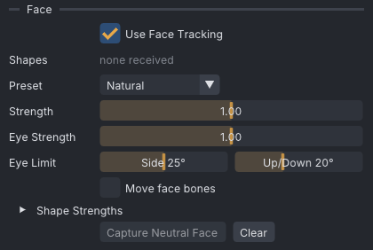

# Face tracking

Face tracking turns the blendshapes a tracking app sends into motion of the Bento face bones: jaw, lips,
eyelids, brows, cheeks and tongue, plus the eyes. It is part of [[Motion capture]] and works with
iFacialMocap, VTube Studio and Live Link Face on an iPhone, Rokoko Face Capture through Rokoko Studio, and
VMC apps that send blendshapes.

> Related articles: [[Motion capture]], [[Skeleton]], [[Mesh bodies]]

## Usage

The face settings are in the **Face** section of **Tools → Motion Capture...**. **Use Face Tracking** is
on by default. **Shapes** shows how many blendshapes the sender sends, or **none received**.

*The **Natural** preset: **Strength** and **Eye Strength** at 1, **Eye Limit** 25° to the side and 20° up or down, **Move face bones** off. **Shapes** reads **none received** until a sender with blendshapes is connected.*

> **Note:** Face bones only show in Second Life on a mesh head rigged to the Bento face bones. On a
> system head or an unrigged head, a face take has no visible effect.

### Connecting iFacialMocap

1. Install iFacialMocap on an iPhone or iPad with Face ID, on the same Wi-Fi as the computer.
2. Set **Source** to **iFacialMocap (iPhone)**. The port changes to `49983` and **Allow Other Devices**
   is on.
3. Click **Listen**.
4. Type the address the iFacialMocap app shows into **Phone address**.
5. Press **Connect to iPhone**. The status bar shows **Asked the iPhone to start streaming**, and the app
   starts sending to this computer.

iFacialMocap sends the face and the head. **Head from iPhone** (on by default) keys the head's turn from
its head tracking; untick it to keep the head from another take. The same tick is there for VTube Studio
and Live Link Face.

### Connecting VTube Studio

VTube Studio is free, and its face stream needs no paid upgrade. Only the iPhone and iPad version can
stream to a computer; the Android version cannot.

1. Install VTube Studio on an iPhone or iPad with Face ID, on the same Wi-Fi as the computer, and open it.
2. Set **Source** to **VTube Studio (iPhone)**. The port changes to `21413` and **Allow Other Devices**
   is on.
3. Click **Listen**.
4. Type the phone's address into **Phone address**. On the phone it is under **Settings → Wi-Fi**, in
   the details of your network.
5. Press **Connect to iPhone**. VATs asks the phone for its tracking, and asks again every 3 seconds
   while it listens; the phone keeps streaming as long as it hears these requests. **Stop Listening**
   stops them.

VTube Studio sends the 52 ARKit shapes, the head's turn and both eyes. Any free port works in **Port**:
VATs tells the phone which one to send to.

> **Note:** Built from VTube Studio's published format and tested with a simulated phone only, not yet
> with a real iPhone. If the head or eyes turn the wrong way, please report it.

### Connecting Live Link Face

Live Link Face is Epic Games' free iPhone app. VATs reads its **Live Link (ARKit)** mode, not the
MetaHuman Animator mode.

1. Set **Source** to **Live Link Face (iPhone)**. The port changes to `11111` and **Allow Other Devices**
   is on.
2. Click **Listen**.
3. In Live Link Face, choose **Live Link (ARKit)**. In its settings, under Live Link, add a target with
   the address under **Your computer** and port `11111`.

The app sends the 52 ARKit shapes and the head and eye turns. When a packet does not fit the ARKit
format, the window says **Live Link Face: a packet did not fit. Set the app to Live Link (ARKit).**

> **Note:** Built from public descriptions of the format and tested with a simulated phone only, not
> yet with a real iPhone. The head and eye angles are read as radians; if the head turns far too little
> or too much, or the wrong way, please report it.

### Rokoko Face Capture

Rokoko Face Capture on an iPhone streams through Rokoko Studio. With **Source** set to **Rokoko Studio
Live** (see [[Motion capture#Connecting Rokoko Studio]]), an actor's face arrives with its body, and an
actor with only a face is used when no actor has a body. Streaming the face from Studio needs Rokoko's
Pro plan. Tested with a simulated Studio stream only.

### VMC apps

VMC apps that send blendshapes, such as VSeeFace with a perfect-sync model, need no extra step. ARKit
names are used directly; the VRM names (`a`, `i`, `u`, `e`, `o` and the other VRM expressions) are
converted to ARKit shapes first.

### Other phone apps

These face apps send a protocol VATs already receives. Their steps come from the apps' own settings and
have not been checked with VATs on a real phone yet.

| App | Phone | Price | VATs **Source** |
|---|---|---|---|
| **Waidayo** | iPhone or iPad with Face ID | free | **VMC protocol** |
| **AndroidMoCap** | Android 11 or later | free | **VMC protocol**, or **iFacialMocap (iPhone)** in its iFacialMocap mode |
| **MeowFace** | Android | pay what you want | **iFacialMocap (iPhone)** |

**Waidayo** (iPhone) sends ARKit ("perfect sync") shapes and the head over VMC:

1. In VATs, set **Source** to **VMC protocol**, port `39539`, tick **Allow Other Devices** and click
   **Listen**.
2. In Waidayo, set the VMC send address to the address under **Your computer** and the port to `39539`.

**AndroidMoCap** tracks 52 ARKit shapes and the gaze with the phone's front camera. Either send VMC as for
Waidayo, or switch the app to its iFacialMocap mode and follow [[Face tracking#Connecting iFacialMocap]]
with the Android phone's address.

**MeowFace** sends the iFacialMocap protocol: follow [[Face tracking#Connecting iFacialMocap]] with the
phone's address. It is no longer maintained and crashes on Android 13 and later; prefer AndroidMoCap.

### Setting the neutral face

Relax your face and press **Capture Neutral Face**. Your resting expression becomes the rest pose: each
shape then counts only from its resting value, so a face that rests with the mouth slightly open does not
record an open jaw. **Clear** drops the neutral face.

### Recording the face alone

Tick **Face Only** in the **Record** section to record only the face bones (and the head from an iPhone)
over the animation already there. See [[Motion capture#Recording a take]].

### Face cam

**View → Face Cam** shows a face driven by your tracking in a borderless cutout, for a stream or a video call:
only the head is drawn, on a see-through background. Drag it anywhere to move it, drag its bottom-right corner to
resize it, and right-click it for **Close Face Cam** (or untick the menu item). It is not saved.

- The face is the Second Life default body's head (Ruth), in your shape: in the viewer, your own avatar's shape
  sliders; in the app, SL's default shape. Your worn mesh head is not drawn: the editor never reads a worn mesh's
  own data.
- It follows the head turn, the eyes and the face bones the tracking moves, and shows blinks, an open mouth, a
  smile, a frown and a kiss with the head's own expressions (the default head is not rigged to the face bones, so
  these carry the expression): `eyeBlinkLeft` and `eyeBlinkRight`, `jawOpen`, `mouthSmileLeft` and
  `mouthSmileRight`, `mouthFrownLeft` and `mouthFrownRight`, `mouthPucker`.
- While it shows, the tracking moves only the face cam: your avatar (in the viewer, your in-world avatar) keeps
  its own pose and motions. Recording a take still works as usual.
- With nothing streaming it shows the resting face and **No tracking: Tools > Motion Capture**.

## Configuration

| Setting | Range | Default | Effect |
|---|---|---|---|
| **Preset** | Natural, Subtle, Expressive | Natural | sets **Strength** and the shape strengths together |
| **Strength** | 0–2 | 1 | scales every shape |
| **Eye Strength** | 0–2 | 1 | how far the eyes follow the tracked gaze |
| **Eye Limit** Side | 5–45° | 25° | the farthest the eyes turn left or right |
| **Eye Limit** Up/Down | 5–45° | 20° | the farthest the eyes turn up or down |
| **Shape Strengths** | 0–2 per shape | 1 | scales one shape, for example `jawOpen` |
| **Move face bones** | on or off | off | moves face bones as well as turning them; see [[Face tracking#Moving face bones]] |

The presets: **Natural** is strength 1; **Subtle** is 0.6; **Expressive** is 1.35, with `jawOpen` held at
1.1. After strengths are applied, each shape weight is limited to 0–1.5.

The face settings, the neutral face included, are saved in `settings.json` and come back at the next
start. A saved **Move face bones** keeps its saved value.

### Moving face bones

**Move face bones** is off by default, because most SL heads are mesh heads with their own face joint
positions. Off, a take turns the face bones only (jaw, eyes, eyelids and the other turning shapes); the smiles,
brows, cheeks and most lip shapes, which move bones, are lost. On, a take moves face bones as well, by the
table's amounts. Only bones a shape moved during the take get position keys; the others keep rotations only,
so the mesh head keeps its own positions there.

To upload moving face bones for a mesh head, export from the [[VATs Editor (viewer)]] with **Bake shape** set
to **Your avatar**: the moved bones are written at your head's own positions plus the moves (see
[[Export to Second Life#Your avatar]]).

### Eyes and eyelids

The eyes turn `mEyeLeft`/`mEyeRight` and `mFaceEyeAltLeft`/`mFaceEyeAltRight` together. The eye angles
come from the sender when it sends them (the iFacialMocap, VTube Studio and Live Link Face eye values, or the VMC `LeftEye` and `RightEye`
bones); otherwise they come from the `eyeLook` shapes. The eyelids follow the eyes up and down: the upper
lid follows 40 % of the eye's pitch and the lower lid 15 %.

### The face table

The mapping from the 52 ARKit shapes to face-bone rotations (degrees) and offsets (metres) is the data
file `data/retarget/face-arkit.json`, made for the SL default head. The right side mirrors the left. The
presets, the VRM names and the eyelid fractions are in the same file. VATs reads it when the Motion
Capture window first opens.

For another head, make your own table with **New Head** in **Tools → Face...** and choose it under **Head**
there; face tracking then uses it too (see [[Face animation#Head and Move face bones]]). **Move face bones** is
the same setting in both windows.

## Tips and tricks

- Capture the neutral face again whenever you move the phone or change the light.
- Lower **Eye Limit** when a mesh head's eyes show white at the edges.
- To tame one shape, for example a jaw that opens too far, lower it in **Shape Strengths** instead of
  lowering **Strength**.

## Troubleshooting

### Shapes shows none received

The sender sends no blendshapes. For a VMC app, use a model with blendshapes and switch on the app's
blendshape sending. For Rokoko Studio, the actor needs a face from Rokoko Face Capture.

### The iPhone does not start sending

**Connect to iPhone** needs VATs to be listening and a **Phone address**. Check the address the app
shows, the same Wi-Fi on both devices and the firewall line of the setup checklist (see
[[Motion capture#The setup checklist]]). Live Link Face has no **Connect to iPhone**: check the target
address and port in the app, and that it is in **Live Link (ARKit)** mode.

### The face looks tense at rest

The resting face records as an expression. Press **Capture Neutral Face** with a relaxed face.

### A mesh head is pulled out of shape

With **Move face bones** on, the smiles, brows, cheeks and most lip shapes move face bones. Exported with
**Bake shape** at **SL Default**, those bones are placed on the Second Life default head's face, so a mesh head
with its own face joint positions, such as a furry or stylised head, is pulled towards it in-world. Export from
the viewer with **Bake shape** set to **Your avatar**, or record with **Move face bones** off: the jaw, eyes,
eyelids and the other turning shapes still work, and the head keeps its shape.

### The window shows "data/retarget/face-arkit.json is missing"

The face table was not found in VATs' data folder. Reinstall VATs (see [[Installation]]).

## See also

- [[Face animation]]
- [[Motion capture]]
- [[VATs Editor (viewer)]]
- [ARKit blend shape locations](https://developer.apple.com/documentation/arkit/arfaceanchor/blendshapelocation)

Category: Motion
