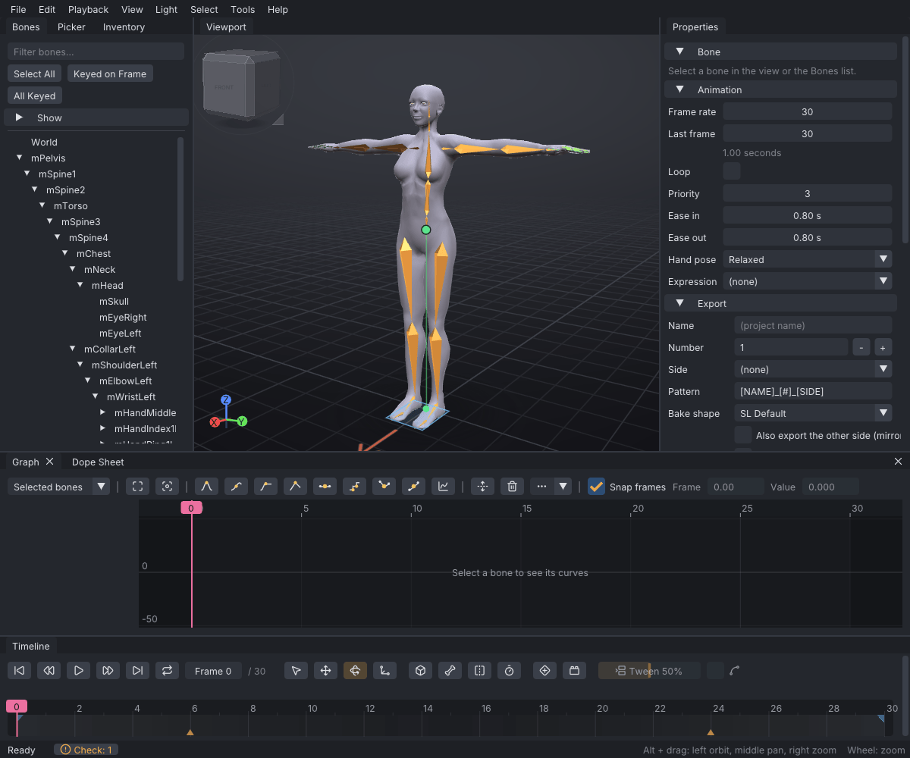
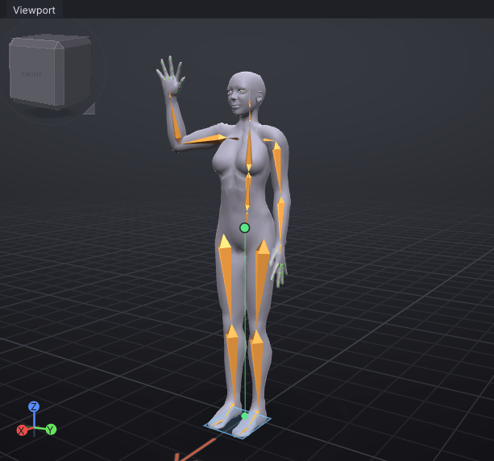
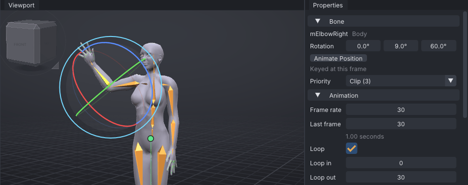
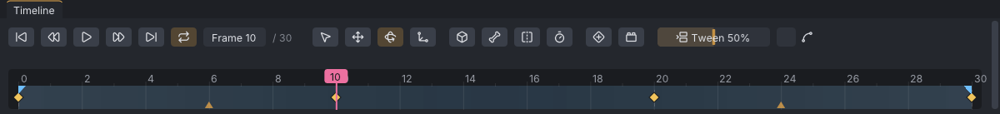
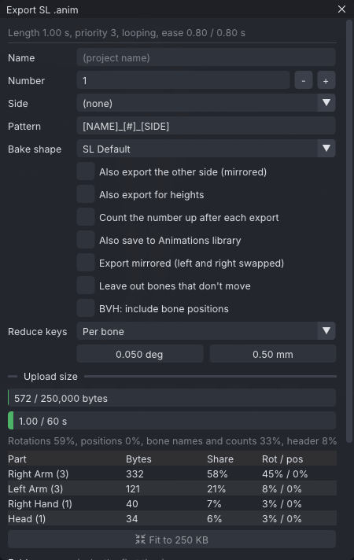

# First steps

A tutorial for a first session: start VATs, pose the avatar with a starter pose, key a one-second wave
of the forearm, loop it, play it, save the project and export a `.anim` file that Second Life
accepts. It uses the default Industry (Maya-style) controls; other presets change the keys, not the
steps. Every value is given, so your result can be checked against the shipped example at the end.

> Related articles: [[Installation]], [[Interface]], [[Keys and timeline]], [[Export to Second Life]]

## What you will make

The **Waving** starter pose keyed at frame 0, then the right forearm swung out at frame 10, in at
frame 20 and back to where it started at frame 30, looping. That is 31 frames at 30 frames per
second: one second in-world. The finished project is [Open the example](example:first-wave.vat);
open it at any point to compare.

## Usage

### 1. Start VATs

Run `bin/vats` (Linux) or `bin\vats.exe` (Windows); see [[Installation]]. On the first start the **Welcome to
Viewport Avatar Toolset** window shows what is new. Close it with its **×**; clear **Show this at startup** to
stop it opening, and **Help → Welcome** brings it back.

*A new document: an untitled animation, frames 0 to 30 at 30 frames per second, with the **Rotate**
tool active.*

The frame box on the **Timeline** reads **Frame 0**, and **Properties → Animation** shows
**Frame rate** 30 and **Last frame** 30. The status bar along the bottom says what the last command
did on the left, and shows the mouse controls of the active preset on the right.

If you know Maya, Blender, QAvimator or the Second Life build tools, pick the matching preset in
**Edit → Preferences... → Navigation & hotkeys** first; see [[Control presets]]. The rest of this
page gives the Industry keys.

### 2. Look around

- **Alt + left drag** orbits, **Alt + middle drag** pans, **Alt + right drag** or the wheel zooms.
- **F** frames the selected bone; **A** frames the whole avatar.
- Click a face of the cube at the top left of the viewport to look from that side; **1** is the
  front view.

### 3. Pose frame 0 with a starter pose

1. Check that the frame box reads **Frame 0**; if not, press **Home**.
2. Open the **Inventory** tab (beside **Bones**), scroll down to **Starter poses** and click
   **Waving**. Or right-click empty space in the viewport and choose **Poses → Starter poses →
   Waving**.

The right arm rises with the hand open, the status bar says `Applied Waving at frame 0`, and an
amber diamond appears at frame 0 in the timeline: the pose has keyed eight bones on this frame.
**Ctrl+Z** undoes it if you clicked the wrong pose.

*Frame 0 after **Waving**.*

### 4. Select the forearm

Click the right forearm in the viewport (the avatar's right, on the left of the screen). It turns
bright and the rotation gizmo appears around the elbow. You can also find it in the **Bones** tab:
type `Elbow` into **Filter bones...** and click **mElbowRight**.

**Properties → Bone** now shows **mElbowRight**, **Rotation** `0.0°  9.0°  91.0°` and
**Keyed at this frame**. The third value, Rotate Z, is the one the wave moves.

### 5. Key the swing

1. Click frame **10** in the timeline strip (or press **Right** ten times). The frame box reads
   **Frame 10**.
2. In **Properties → Bone → Rotation**, double-click the third box (`91.0°`), type `60` and press
   **Enter**. The forearm swings outwards, a diamond appears at frame 10, and the section says
   **Keyed at this frame**.

*Frame 10: Rotate Z typed as 60. The rings of the gizmo do the same by dragging.*

3. Click frame **20** and set the third box to `110`: the forearm swings in, towards the head.
4. Click frame **30** and set it to `91`, the value it had at frame 0, so the loop closes without a
   jump.

Typing a value or dragging a gizmo ring keys the bone on the current frame by itself; **S**
(**Set Key**) is only needed to key a bone without changing it. Hold **Ctrl** while dragging a ring
to turn in 5° steps.

*Four keys, the playhead at frame 10 and, after the next step, the loop band from 0 to 30.*

### 6. Loop it

Tick **Loop** in **Properties → Animation** (or press the **Loop** button in the timeline's play
controls, two arrows chasing each other). **Loop in** 0 and **Loop out** 30 appear under it, the
band between them is tinted in the timeline, and the exported file will repeat until it is stopped.
See [[Loop tools]] for loops that do not close on their own.

### 7. Play it

Press **Space** to play and again to pause. **Home** and **End** jump to the start and the end,
**.** and **,** to the next and previous key, and dragging in the timeline strip scrubs. The forearm
should swing out, in and back once a second. If it does not, compare your keys with the example:
select **mElbowRight** and press **.** three times; the third **Rotation** box should read `60.0°`,
`110.0°` and `91.0°` at frames 10, 20 and 30.

### 8. Save the project

Press **Ctrl+S** and name the file `first-wave`; VATs adds `.vat`. The status bar says
`Saved first-wave.vat`, and the title bar shows the file name, with `*` after it whenever there are
unsaved changes. See [[Projects and files]] for autosave and backups.

### 9. Export for Second Life

1. Press **Ctrl+E** (**File → Export SL .anim...**). The **Export SL .anim** window opens with
   `Length 1.00 s, priority 3, looping, ease 0.30 / 0.30 s` at the top, the export settings, and
   **Saves as** `first-wave_01.anim`: the project's name, the **Number** and the **Pattern**
   `[NAME]_[#]_[SIDE]`.
2. Press **Export SL .anim**. The first time, a save dialog asks where to write the file; the folder
   you choose becomes the project's export **Folder**, and later exports write straight into it. Keep the name it
   offers here (a name typed there becomes the export **Name**).
3. The status bar says `Exported first-wave_01.anim: 8 bones, 1.00 s, priority 3, 572 bytes`.

*The export window for the wave. **Reduce keys** drops the frames a straight line already
reproduces, which is why a 31-frame wave is 572 bytes.*

See [[Export to Second Life]] for every setting, and [[Animation priority]] before you upload: at
priority 3 the wave overrides most stands and walks on the arm.

### 10. Upload

In your viewer, **Build → Upload → Animation...** and pick `first-wave_01.anim`. Preview it in the
upload window before paying. In the [[VATs Editor (viewer)|VATs Editor]], the export window has an
**Upload Animation...** button that uploads the file directly.

> **Warning:** Uploading costs L$ and cannot be undone. Check the file in the viewer's preview or on
> the Aditi beta grid first.

## Check your work

[Open the example](example:first-wave.vat). It opens as an untitled copy of the tutorial's result:

1. Select **mElbowRight** and press **.**: the frame box reads **Frame 10** and the third
   **Rotation** box `60.0°`. Two more presses give `110.0°` at frame 20 and `91.0°` at frame 30.
2. **Properties → Animation** shows **Loop** ticked, **Loop in** 0 and **Loop out** 30.
3. **Ctrl+E** shows `Length 1.00 s, priority 3, looping, ease 0.80 / 0.80 s`.

Your own project should read the same. The example's export folder is empty, so its first export
asks for a folder too.

## Tips and tricks

- The status bar at the bottom left says what the last command did, for example
  `Keyed 1 item(s) at frame 10`.
- A greyed menu item says why it is unavailable when you hover over it, for example
  `Select a bone first`.
- Right-click a bone in the viewport for its body-part menu: poses, clips, mirroring and resets for
  that part.
- **Ctrl+Z** undoes and **Ctrl+Y** redoes every edit to the animation, not camera moves or selection.

## Troubleshooting

### Typing a value does nothing

The box is a drag control: dragging changes it, and a double-click (or **Ctrl+click**) opens it for
typing. Press **Enter** to commit; **Esc** cancels.

### The arm jumps when the loop restarts

The key at frame 30 differs from the key at frame 0. Set the third **Rotation** box at frame 30 back
to `91`, or select **mElbowRight** at frame 0, **Ctrl+C**, go to frame 30 and **Ctrl+V**
(**Paste Pose**).

### The whole avatar moved instead of the forearm

The selection was another bone, or the **Move** tool was active. Click the forearm again and press
**E** for the **Rotate** tool; **Ctrl+Z** puts the pose back.

## See also

- [[Tutorials]]: the next lessons, starting with [[Your first pose]]
- [[Interface]]
- [[Keyboard shortcuts]]
- [[Posing]]
- [[Export to Second Life]]

Category: Getting started
Order: 3
