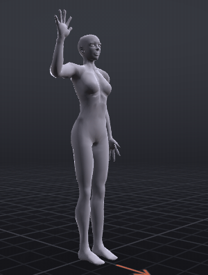
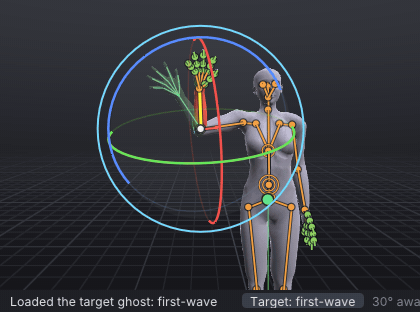
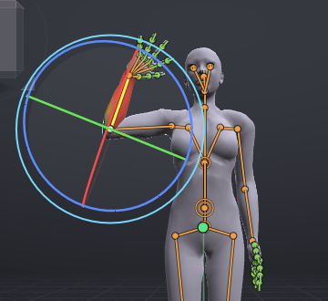

# First steps

A tutorial for a first session, about 15 minutes: start VATs, put the avatar in a wave with a starter pose, swing
the forearm and the hand with the mouse, loop it, play it, save the project and export a `.anim` file that Second
Life accepts. You never type an angle: a green ghost of the finished wave shows where each drag should end.

> Related articles: [[Installation]], [[Interface]], [[Target ghost]], [[Keys and timeline]], [[Export to Second Life]]

## What you will make

*The finished wave: one second, looping.*

The **Waving** starter pose, then the right forearm swung out at frame 10 and in at frame 20, the hand carried a
little further each way, and the first pose again at frame 30 so the loop joins. That is 31 frames at 30 frames per
second: one second in-world. The finished project is [Open the example](example:first-wave.vat); open it at any point
to compare.

## Usage

### 1. Start VATs

Run `bin/vats` (Linux) or `bin\vats.exe` (Windows); see [[Installation]]. The first time, the **Welcome to Viewport
Avatar Toolset** window opens; its **First Steps** button opens this page in the **Help** window (**F1** opens it any
time). Close the Welcome window with **Close**.

*A new document: an untitled animation, frames 0 to 30 at 30 frames per second.*

The status bar along the bottom says what the last command did on the left, and shows the mouse controls on the
right. VATs starts with the **Second Life** controls, the camera you know from the viewer. If you know Maya, Blender
or QAvimator, you can pick their controls in **Edit → Preferences... → Navigation & hotkeys** (see
[[Control presets]]); this page gives the Second Life ones.

> **Tip:** Keep the Help window beside the avatar while you work: drag its title bar to the side of the screen.

### 2. Look around

The view is a camera you move without changing the animation:

| To | Do (Second Life controls) |
|---|---|
| Orbit round the avatar | **Alt + click** the body, keep the button down and drag sideways |
| Zoom | The mouse wheel, or **Alt + click** and drag up or down |
| Look from the front, the side | **1** (front), **3** (side), with the pointer over the view; or click a face of the cube at the top left |
| Fit the whole avatar | **A** |
| Put the camera back | **Esc** with nothing selected |

> **Tip:** Camera moves are not edits, so **Ctrl+Z** never undoes them. Lost? Press **Esc**, then **1**.

### 3. Pose frame 0 with a starter pose

1. Check that the timeline's frame box reads **Frame 0**; if not, press **Home**.
2. Right-click empty space in the view and choose **Poses → Starter poses → Waving**. (The same poses are in the
   **Inventory** tab, beside **Bones**, under **Starter poses**.)

The right arm rises with the hand open, the status bar says `Applied Waving at frame 0`, and a diamond appears at
frame 0 on the timeline: a **key**, the pose stored at that frame. **Ctrl+Z** undoes it if you picked the wrong pose.

*Frame 0 after **Waving**.*

### 4. Show the target

[Show the target](target:first-wave.vat)

The button above loads the finished wave as a see-through green **ghost** over your avatar. It follows the frame you
are on, so at each step it shows where the arm should be, and the status bar gains a **Target: first-wave** button
(click it to hide the ghost and show it again). At frame 0 the ghost sits inside your avatar, because your pose is
already the first one. See [[Target ghost]].

### 5. Swing the forearm out at frame 10

1. Press **1** with the pointer over the view, so you look at the avatar from the front.
2. Click the right forearm (the avatar's right, on the left of the screen). It turns bright, and the status bar and
   **Properties** say `mElbowRight · Right Forearm`: Second Life's name for the bone, then the plain one.
3. Press **E** for the **Rotate** tool (or click its button on the timeline bar, the arrows round a dot). Rings appear
   round the elbow: red, green and blue, and a pale ring outside them.
4. Click **10** on the timeline's ruler. The frame box reads **Frame 10**, and the green ghost's forearm leans out,
   away from the head.
5. Put the pointer on the **blue** ring, the one that circles the forearm face-on; it turns yellow under the pointer.
   Press, and drag along the ring away from the head. The forearm follows.
6. Let go when the forearm lies inside the ghost's forearm. With the forearm selected, the status bar shows how far it
   still is from the ghost, for example `4° away`; anything in green (under 5°) is a match.

*Press on the blue ring and drag along it. Overshot? Drag back; nothing is final until it looks right.*

Dragging a ring keys the bone on the current frame by itself: a diamond appears at frame 10, and the status bar says
`Rotated mElbowRight at frame 10`. Missed and turned the wrong thing? **Ctrl+Z** and try again; the drag is one undo
step.

> **Check:** the third **Rotation** box in **Properties → Bone** reads about `60°` (it was `91°`). Anything from 55°
> to 65° looks the same.

### 6. Let the hand follow

A hand is loose on the wrist: when the forearm stops, the hand carries on a little. The ghost's hand is bent further
out than its forearm.

1. Click the right hand (or press **Down**, **Select → Select Child**, to go from the forearm to the bone below it).
   The status bar says `mWristRight · Right Hand`.
2. Drag its **blue** ring outwards until the hand sits in the ghost's hand.

> **Why:** A hand that keeps exactly in line with the forearm looks like a board on a stick. Parts that hang on others
> (a hand, a tail, hair) arrive late and swing past where the part above them stops. Animators call this
> *follow-through*; [[Tutorials|later tutorials]] build on it.

### 7. Swing in at frame 20

1. Click **20** on the ruler. The ghost's forearm now leans in, past the head.
2. Click the forearm, drag its blue ring towards the head until it fills the ghost.
3. Click the hand and drag its blue ring the same way, into the ghost's hand.

*Frame 20 matched. The timeline has diamonds at 0, 10 and 20.*

> **Check:** the forearm about `115°`, the hand about `24°`, on the third **Rotation** box.

### 8. Close the loop at frame 30

A loop must end exactly where it begins, or the arm jumps each time it starts again. Copy frame 0 to frame 30:

1. Press **Esc** to select nothing (a copy with nothing selected takes the whole pose).
2. Press **Home** to go to frame 0, and with the pointer over the view press **Ctrl+C** (**Edit → Copy Pose**). The
   status bar says `Copied 8 items (the whole pose)`.
3. Press **End** to go to frame 30 and press **Ctrl+V** (**Edit → Paste Pose**). The status bar says
   `Pasted the pose at frame 30`.

*Four keys; after the next step, the loop band runs from 0 to 30.*

### 9. Loop it and play it

1. Press the **Loop** button in the timeline's play controls (two arrows chasing each other), or tick **Loop** in
   **Properties → Animation**. The band from frame 0 to 30 is tinted, and the exported file will repeat until it is
   stopped. See [[Loop tools]] for loops that do not close on their own.
2. Press **Space** to play and again to stop. The forearm swings out, in and back once a second, the hand flopping
   after it, and the green ghost moves with it. Click the **Target:** button in the status bar to hide the ghost and
   watch yours alone.

**Home** and **End** jump to the start and the end, **.** and **,** to the next and previous key, and dragging in the
ruler scrubs.

### 10. Save the project

Press **Ctrl+S** and name the file `first-wave`; VATs adds `.vat`. The status bar says `Saved first-wave.vat`, and
the title bar shows the name, with `*` after it whenever there are unsaved changes. See [[Projects and files]] for
autosave and backups.

### 11. Export for Second Life

1. Press **Ctrl+E** (**File → Export SL .anim...**). The **Export SL .anim** window opens with
   `Length 1.00 s, priority 3, looping, ease 0.30 / 0.30 s` at the top, the export settings, and **Saves as**
   `first-wave_01.anim` at the foot.
2. Press **Export .anim**. The first time, a save dialog asks where to write the file; the folder you choose becomes
   the project's export **Folder**, and later exports write straight into it.
3. The status bar says `Exported first-wave_01.anim` with the number of bones, the length, the priority and the size
   in bytes.

*The export window for the wave. A one-second wave is well under a kilobyte.*

**Priority** 3 is what a gesture like a wave wants: it plays over the arms of an AO's stands and walks. See
[[Animation priority]] before you upload anything that should win over more, and [[Export to Second Life]] for every
setting.

### 12. Upload

In your viewer, **Build → Upload → Animation...** and pick `first-wave_01.anim`. Preview it in the upload window
before paying. In the [[VATs Editor (viewer)|VATs Editor]], the export window has an **Upload Animation...** button
that uploads the file directly.

> **Warning:** Uploading costs L$ and cannot be undone. Check the file in the viewer's preview or on the Aditi beta
> grid first.

## Check your result

Play yours with the target showing: the avatar and the ghost should move together, the green never pulling ahead or
behind by more than a hand's width. Then [Open the example](example:first-wave.vat), which opens as an untitled copy of
the tutorial's result, and compare:

- The timeline has keys at 0, 10, 20 and 30; **Properties → Animation** shows **Loop** ticked, from 0 to 30.
- **Ctrl+E** shows `Length 1.00 s, priority 3, looping, ease 0.30 / 0.30 s`.

The example's export folder is empty, so its first export asks for a folder too.

## Tips and tricks

- Clicking a bone selects it in every preset; a greyed menu item says why it is unavailable when you hover over it,
  for example `Select a bone first`.
- Right-click a bone in the view for its body-part menu: poses, mirroring, binding and resets for that part.
- Hold **Ctrl** while dragging a ring to turn in steps (in the Second Life controls, **G** turns stepping on and off).
- **Ctrl+Z** undoes and **Ctrl+Y** redoes every edit to the animation, not camera moves or selection.
- The **Rotation** boxes in **Properties → Bone** take typed values too (double-click one). Use them to check a drag,
  or when you need an exact angle.

## Troubleshooting

### The whole arm moved instead of the forearm

The **Move** tool was active (the Second Life controls start with it), so the drag pulled the hand and the arm
followed. **Ctrl+Z**, press **E** for the **Rotate** tool, and drag a ring.

### The forearm twists instead of swinging

You dragged the red or green ring, or the inside of the ball, which turns freely. **Ctrl+Z**, look from the front
(**1**) and drag the blue ring: it is the one that turns yellow as the pointer reaches it.

### There is no green ghost

Press **Show the target** in step 4 again, or check that the status bar's **Target:** button is not dimmed (a click
shows the ghost). The ghost hides inside your avatar wherever your pose already matches it.

### The arm jumps when the loop restarts

Frame 30 differs from frame 0. Do step 8 again: **Esc**, **Home**, **Ctrl+C** over the view, **End**, **Ctrl+V**.

### Ctrl+V pasted keys somewhere else

The pointer was over the **Graph** panel, where **Ctrl+C** and **Ctrl+V** copy and paste keys. **Ctrl+Z**, move the
pointer over the view and paste again.

## See also

- [[Tutorials]]: the next lessons, starting with [[Your first pose]]
- [[Interface]]
- [[Posing]]
- [[Keyboard shortcuts]]
- [[Export to Second Life]]

Category: Getting started
Order: 3
