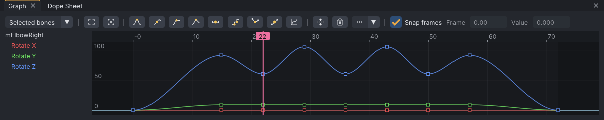
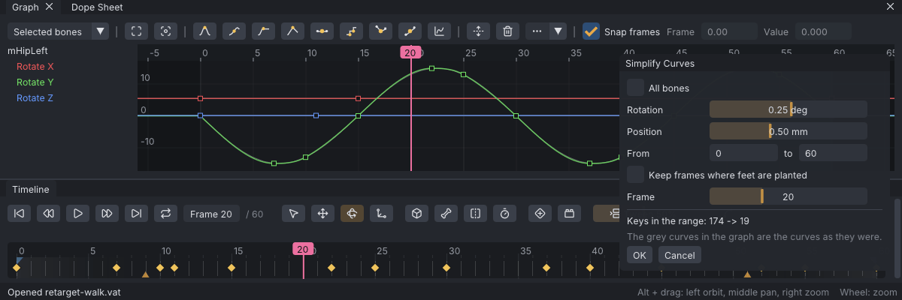

# Graph editor

The graph editor shows the curves behind the keys: how each rotation and position channel of a bone changes over time. Use it to shape the motion between keys, fix timing, and change how keys ease in and out.

> Related articles: [[Keys and timeline]], [[Posing]], [[Hold and bind]], [[Control presets]]

## How the curves work

### Channels and units

Every animated bone has up to six curves, one per channel. Each curve is a list of keys (a frame and a value), and the curve between the keys is what the bone does.

- **Rotate X**, **Rotate Y** and **Rotate Z** are angles in degrees, relative to the bone's rest pose. They are applied X first, then Y, then Z, about the parent's axes. A bone with no keys on a channel reads 0 there.
- **Translate X**, **Translate Y** and **Translate Z** are offsets from the bone's rest position, in metres.
- **IK / FK Blend** runs from 0 to 1. At 0.5 or more the limb follows its [[IK]] target. Its keys are **Stepped**, so the limb switches cleanly on a frame.
- **Pole X**, **Pole Y** and **Pole Z** place the IK pole, the point the elbow or knee aims at.

The graph draws X in red, Y in green and Z in blue; the pole curves use lighter shades of the same colours, and **IK / FK Blend** is white. The frame axis runs along the top. Frames before 0 and after the last frame are shaded, and a loop range is tinted.

*The elbow in the arm-wave example at frame 22: Rotate Z (blue) dips to 60° three times between frames 15 and 57.*

[Open the example](example:graph-basics.vat) to explore these curves: the right arm rises, waves three times from the elbow, and comes down. Select **mElbowRight** to see them.

### Posing writes keys to the curves

Rotating a bone in the viewport keys all three rotation channels on the current frame. VATs turns the new rotation into the three angles closest to the curve's current values. This keeps the curves continuous, so a bone turned past 180° reads 190°, not −170°.

Curves imported from other tools may not follow this rule. There a bone can flip by 360° between two keys even though the pose looks the same; **Euler Filter** finds and removes those jumps. When **Rotate Y** is near ±90°, X and Z turn about the same axis (gimbal lock). The pose is still right, but the X and Z curves can look odd there.

### Between and beyond the keys

Each key sets how the curve runs to the next key:

| Segment | Curve |
|---|---|
| **Stepped** | Holds the key's value until the next key |
| **Linear** | A straight line to the next key |
| All other tangent types | A smooth curve shaped by the two keys' handles |

Before the first key a curve holds the first key's value, and after the last key it holds the last key's value.

**Auto**, **Spline**, **Plateau**, **Linear** and **Flat** handles are automatic: VATs recalculates them whenever a neighbouring key moves, is added or is deleted. Dragging a handle freezes it where you leave it. Normally the other handle turns to stay in line; after **Break**, each handle moves on its own. **Unify** lines a broken pair up again and keeps both frozen. To make a frozen handle automatic again, press one of the automatic tangent buttons.

With **Tools → Loop Tools → Loop-Aware Tangents** on and **Loop** on, the **Auto**, **Spline** and **Plateau** keys at **Loop in** and **Loop out** take their slope across the seam, and each curve's loop is drawn again, faintly, before **Loop in** and after **Loop out**; see [[Loop tools#Loop-aware tangents]].

### What reaches Second Life

A `.anim` file does not store curves. On export VATs samples every bone on every whole frame, including [[IK]] and [[Hold and bind|pins]], and Second Life plays straight lines between the keys it keeps. **Reduce keys** in **Properties → Export** drops each key that the straight line through its neighbours already reproduces, within 0.05° and 0.5 mm by default. It always keeps the first frame, the last frame and every frame where your curves have a key, and never leaves more than 60 frames between two keys. See [[Export to Second Life#Reduce keys]].

What this means for the curves:

- The curve's shape between whole frames never reaches SL. A key moved to a fraction of a frame (with **Snap frames** off) plays in VATs, but SL only sees the whole frames around it.
- A smooth ease survives as a run of short straight segments, one per frame at most.
- A **Stepped** key holds exactly: the jump to the next value happens within one frame.

## Usage

### Opening the graph

**View → Graph Editor** (**Ctrl+G**) shows or hides the **Graph** panel.

The list on the left shows the curves of the selected bones. The drop-down above it switches between **Selected bones** and **All animated bones**. Each bone lists its channels:

| Channel | Meaning |
|---|---|
| **Rotate X**, **Rotate Y**, **Rotate Z** | The bone's rotation |
| **Translate X**, **Translate Y**, **Translate Z** | The bone's position: shown for the hips, attachment points and bones with position keys |
| **IK / FK Blend** | For a selected [[IK]] target: whether the limb follows IK or its rotation keys |
| **Pole X**, **Pole Y**, **Pole Z** | For a selected IK pole: where the elbow or knee points |

Click a row to show only that channel; **Shift+click** or **Ctrl+click** adds or removes rows. A pinned point also lists its pin offset curves, marked **(pin)**. With nothing selected the graph reads "Select a bone to see its curves".

### The toolbar

The buttons along the top show icons only; hover one for its name, its key in your [[Control presets|preset]] where it has one, and what it does. From left to right, after the drop-down:

| Button | Icon |
|---|---|
| **Frame All** | four corner brackets |
| **Frame Selected** | four corner brackets round a dot |
| **Auto**, **Spline**, **Plateau**, **Linear**, **Flat**, **Stepped**, **Break**, **Unify** | a small drawing of each curve shape (see the table in "Shaping curves: tangents" below) |
| **Ease** | a rising curve on two axes; opens the easing presets (see "Easing presets" below) |
| **Fit Values** | two arrows pointing away from a line |
| **Delete** | a bin |
| **More** | three dots and an arrow; a drop-down with **Euler Filter**, **Filter Curves...** (a funnel), **Flip Time**, **Flip Values**, under **Tag keys** the key tags **Extreme**, **Breakdown**, **Hold** and **No Tag** for the selected keys (see [[Keys and timeline#Blocking and key tags]]) and, under **Snapshot curves**, **Snapshot** (a camera), **Swap** (two arrows) and **Clear** (an eraser) (see "Buffer curves" below) |

Then **Snap frames** and the **Frame** and **Value** boxes. The toolbar is one row down to a window about 1200 pixels wide; narrower, it wraps.

### Selecting and moving keys

- **Click** a key to select it. **Shift+click** toggles a key in the selection; **Ctrl+click** removes one. Clicking the same spot again cycles through keys stacked on top of each other.
- **Drag across empty space** to box-select.
- **Drag** selected keys to move them in time and value. Hold **Shift** while dragging to lock the move to one direction.
- **Esc** during a drag cancels it.
- With **Snap frames** ticked, keys stay on whole frames while moving and scaling.
- The **Frame** and **Value** boxes show the earliest selected key; typing a new value moves the whole selection by the same amount.

### Scaling keys

With two or more keys selected, a box with eight handles appears around them. Drag a side handle to stretch the keys in time or in value; drag a corner to do both. This is one undo step (**Scale Keys**).

### Adding and deleting keys

- **Double-click** a curve to add a key on it at that point (**Insert Key**). The curve's shape does not change.
- **Delete** (the bin button, or **Delete** with the mouse over the graph) removes the selected keys.
- **Ctrl+C** and **Ctrl+V** with the mouse over the graph copy and paste keys; pasting puts them at the current frame.

### Shaping curves: tangents

A selected key shows its handles; drag them to shape the curve. The eight buttons after **Frame Selected** set the tangent type of the selected keys. Each shows the shape it makes, with the keys as amber dots:

| Button | Icon | Curve |
|---|---|---|
| **Auto** | a hill, flat on top | Smooth, flat at peaks and valleys |
| **Spline** | a curve rising through a key and swinging past the next | Smooth through the neighbours; can overshoot |
| **Plateau** | a curve rising to a key, then level | Smooth without ever overshooting |
| **Linear** | two straight lines meeting at a key | Straight towards the neighbouring keys |
| **Flat** | a key with a level handle | Level handles: eases in and out of the key |
| **Stepped** | a staircase | Holds the value until the next key |
| **Break** | a key with two handles in a V | Lets each handle move on its own |
| **Unify** | a key with both handles in one slanted line | Lines both handles up again |

### Easing presets

**Ease**, after the tangent buttons, shapes the curve between selected keys with a standard easing curve. Pick **Ease In** (starts slowly), **Ease Out** (ends slowly) or **Ease In-Out** (both), then a shape.

Which part of each curve changes: the segment after each selected key, up to the next key. When a curve has more than one key selected, its last selected key only ends a segment, so selecting two neighbouring keys eases the span between them. A selected key with no key after it changes nothing.

| Shape | How it is made | What it looks like |
|---|---|---|
| **Quad**, **Cubic** | Handles | The value follows t² or t³ (the Out and In-Out versions mirrored) |
| **Sine** | Handles | A quarter of a sine wave |
| **Back** | Baked | Pulls 10% the other way before it goes (In), or overshoots by 10% and settles (Out) |
| **Elastic** | Baked | Wobbles three times around the end value, shrinking, like a spring |
| **Bounce** | Baked | Lands on the end value and bounces three times, each bounce a quarter of the height of the one before |

- **Handles**: the segment's two facing handles become **Break** handles placed to draw the shape; no keys are added and you can still drag the handles. **Ease In** and **Ease Out** of **Quad** and **Cubic** are exact; **Sine** and every **Ease In-Out** are a close fit (within about 1% of the change for **Sine**).
- **Baked**: these shapes can't be drawn with one curve segment, so VATs keys every whole frame inside the segment with **Linear** keys and makes the first key Linear too. Second Life samples every frame, so it plays exactly this shape.

Each use is one undo step, named after the preset (for example **Ease Out Bounce**). The keys you selected stay selected; baked keys are not added to the selection.

### Fixing and flipping curves

These are in the toolbar's **More** drop-down.

- **Euler Filter** removes 360-degree jumps from the rotation curves shown. When there is nothing to fix, the status bar says "Rotation curves are already clean".
- **Flip Time** mirrors the selected keys in time.
- **Flip Values** mirrors the selected keys across zero.

### Filtering curves

**Filter Curves...** (in **More**) calms jitter, such as tracker noise in motion capture, on the curves shown (the rows
selected in the channel list, or all of the selected bones' curves). It opens a dialog in the bottom right
corner:

| Setting | Effect |
|---|---|
| **Filter** | **One-Euro**, **Savitzky-Golay** or **Butterworth** |
| **From** ... **to** | the frames to filter; starts as the selected keys' span, else the loop range when the animation loops, else the whole animation |
| **Frame** | moves the current frame while the dialog is open |

Each filter has its own settings:

| Filter | Setting | Default | Effect |
|---|---|---|---|
| **One-Euro** | **Min cutoff** | `1.50` Hz | the cutoff while a joint is still: lower calms more jitter and lags more |
| | **Speed** | `0.020` per deg/s | how fast the cutoff rises with rotation speed: higher follows quick moves with less lag |
| | **Speed (position)** | `10.0` per m/s | the same for position curves, in metres |
| | **Speed cutoff** | `1.00` Hz | smooths the speed estimate |
| **Savitzky-Golay** | **Window** | ±3 frames | frames fitted either side of each frame |
| | **Degree** | 2 | the fitted polynomial's degree: higher keeps peaks sharper and calms less |
| **Butterworth** | **Cutoff** | `6.0` Hz | motion faster than this is removed |
| | **Sections** | 1 | second-order sections per pass: more cut off more sharply |

- **One-Euro** is a low-pass filter whose cutoff rises with speed: still poses are calmed hard, quick moves
  come through with little lag. It runs forward in time only, so it lags a little.
- **Savitzky-Golay** fits a polynomial over a sliding window; it keeps peaks better than an average.
- **Butterworth** runs forward and then backward, so nothing lags. The cutoff is kept below 0.45 × the
  frame rate.

While the dialog is open the curves, the graph and the 3D view show the result, and a grey ghost shows the
pose before filtering at the current frame (drawn like [[Onion skin|onion-skin]] ghosts, with or without
onion skin on). The table lists each bone's shake before and after: the RMS of the jerk (the third
difference of its curves), in deg/s³, and in m/s³ for position curves. **OK** (or **Enter**) applies the
filter as one undo step (**Filter Curves**); **Cancel** (or **Esc**) puts the curves back.

Each curve is sampled once per frame, and its keys between **From** and **to** are replaced by one key per
frame. The curve outside the range keeps its shape. The ends of the range are padded by reflection, so a
curve heading somewhere keeps heading there. When the animation loops and the range lies inside the loop,
the whole loop is filtered as one cycle, so the loop's end still meets its start (a whole turn or the
hips' travel per cycle is kept).

> **Tip:** Filtering leaves a key on every frame. **Edit → Simplify Curves...** turns them back into a few keys you can edit (see [[#Simplifying curves]]); export's **Reduce keys** also leaves out the ones the motion does not need; see [[Export to Second Life#Reduce keys]].

### Simplifying curves

**Edit → Simplify Curves...** replaces the dense keys of baked, captured or filtered motion (a key on every frame) with a few keys, placed where an animator would put them, so the curves can be edited by hand again. It works on the rotation and position curves of the selected bones (their pin and IK tracks included), or of every bone. It opens a dialog in the bottom right corner:

*mHipLeft in the retarget-walk example: 174 keys in the range become 19.*

| Setting | Default | Effect |
|---|---|---|
| **All bones** | on when nothing is selected | off: only the tracks selected when the dialog opened |
| **Rotation** | `0.25` deg (0.01–5) | how far a rotation curve may move from where it was, at any whole frame |
| **Position** | `0.50` mm (0.05–20) | the same for position curves, such as the hips' travel |
| **From** ... **to** | the whole animation | the frames to simplify; keys outside stay as they are |
| **Keep frames where feet are planted** | off | every curve keeps a key on the frames where a foot plants and where it lifts (the foot contacts [[Retargeting#Clean up foot sliding|Tools → Clean Up Foot Sliding]] finds, with its default settings); greyed when there are none |
| **Frame** | | moves the current frame while the dialog is open |

The dialog shows how many keys the range has before and after, live. While it is open, the curves, the graph and the 3D view show the result, and the curves as they were are the grey [[#Buffer curves]]. **OK** (or **Enter**) applies it as one undo step (**Simplify Curves**); **Cancel** (or **Esc**) puts the curves back.

How the keys are chosen, per curve:

1. The ends of the range keep a key, and so does every turn (a peak or a dip) where the curve reverses by more than the tolerance. Reversals smaller than the tolerance, such as tracker jitter, are not turns.
2. Between two turns, where the curve bends like an S rather than running straight, the steepest frame (the inflection) keeps a key.
3. The curve is refitted with Bezier segments between those keys. A segment that misses a whole frame by more than the tolerance first gets **Free** handles on the curve's own slope; if it still misses, it gets a key at the frame it misses most, and the fit repeats. Keys that fit with **Auto** tangents keep them.

Every whole frame of the range stays within the tolerance of the curve as it was. Frames in between may differ a little more; export samples whole frames only.

The rotation of a bone whose Y rotation comes within 5° of ±90° anywhere in the range (a knee bent past a right angle, for example) is fitted as a rotation instead: near this gimbal lock the X and Z curves swing wildly while the bone turns smoothly, so its three curves get keys on the same frames and the tolerance is how far the bone turns from where it was.

Some curves are left as they are, and the dialog lists them:

- curves with **Stepped** keys in the range;
- curves the fit would not give fewer keys, such as curves that are already hand-keyed.

> **Tip:** Filter jittery motion first: jitter larger than the tolerance is real motion to the fit, and keeps many keys.

### Buffer curves

**Snapshot** keeps a copy of every curve of the animation and draws it in grey under the live curves, for the channels shown, until **Clear**. **Swap** exchanges the live curves and the grey ones, as one undo step, so you can go back and forth between two versions. A new snapshot replaces the old one; **New** and **Open** clear it, and it is not saved with the project.

**Euler Filter**, **Simplify Curves...**, **Bake** and **Re-bake** in the [[Dynamics]] window, and the [[Loop tools]] (**Make Loop Seamless**, **Remove Hip Travel (In Place)**, **Add Travel Forward**, **Start Cycle at Frame**) take a snapshot before they change the curves, so the curves as they were stay in view.

### Navigating

**Frame All** fits every shown curve, **Frame Selected** fits the selected keys, and **Fit Values** fits only the height. With the mouse over the graph, the view's **Frame Selected** and **Frame All** keys (**F** and **A** in the Industry preset) act on the graph.

The mouse wheel zooms about the cursor; with **Shift** it zooms values only, with **Ctrl** time only. Panning and drag-zooming follow your control preset, and the status bar shows the hint while the mouse is over the graph:

| Preset | Pan | Zoom |
|---|---|---|
| Industry | **Alt+left** or **Alt+middle** drag | **Alt+right** drag, wheel |
| Blender | Middle drag (with **Emulate 3-button mouse**: also **Alt+left** drag) | **Ctrl+middle** drag, wheel |
| QAvimator | Middle drag | Wheel |
| Second Life | **Ctrl+Alt+drag** or middle drag | **Alt+drag**, wheel |

In the Industry preset only, a middle drag with keys selected moves them.

### Pins in the graph

A [[Hold and bind|pin]] shows as a band over the frames it covers. Drag its start or its end to change when the pin starts (**Move Pin Start**) or is released (**Move Pin Release**). Click a band to select it and press **Delete** to delete the pin.

## Tips and tricks

- Block out a performance with **Stepped** keys, then select them all and press **Auto** once the timing is right.
- Use **Plateau** on keys where a limb must stop without drifting past its pose.
- A bone that suddenly spins between two keys usually has a 360° jump: run **Euler Filter**.
- Run **Euler Filter** before **Filter Curves...** on imported motion: filtering across a 360° jump bends the curve through it.
- After **Filter Curves...** or a bake, **Simplify Curves...** and [[Motion quality]] show what each step did to the key count, the shake and the size.
- **All animated bones** with **Frame All** is a quick way to see the timing of the whole animation.

## Troubleshooting

### The graph is empty

No bone is selected, or the selected bones have no keys. Select a keyed bone, or switch the drop-down to **All animated bones**.

### A curve overshoots between two keys

**Spline** and **Auto** tangents can swing past the key values on uneven spacing. Select the keys and press **Plateau** or **Linear**.

### The middle mouse button pans instead of moving keys

In every preset except Industry, the middle button is used for panning. Drag the keys with the left button instead.

## See also

- [[Dope sheet]]
- [[Keys and timeline]]
- [[Motion quality]]
- [[Keyboard shortcuts]]
- [[VATs Editor (viewer)]]

Category: Animating
