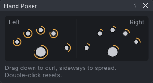

# Hand poser

The hand poser is a small **Hand Poser** window for curling and spreading fingers by dragging one dot per finger, instead of rotating each finger joint. It keys the Bento finger bones at the current frame, for both hands.

> Related articles: [[Posing]], [[Pose library]], [[IK]], [[Skeleton]]

## Usage

### Opening the poser

Press **H** (**Tools → Hand Poser**), or right-click a hand bone and choose **Show Hand Poser**. The **Hand Poser** window has a **Left** half and a **Right** half, each with a dot for **Pinky**, **Ring**, **Middle**, **Index** and **Thumb**, and a palm dot, **All fingers**. It opens beside the view, over the panel to its right (or left) when there is room,
else in the view's bottom-right corner, so it covers none of the avatar. Hover a dot to see its name and how far the
finger is curled (`Left Index  45° curl`). The bottom line repeats the controls: "Drag down to curl, sideways to spread. Double-click resets."

*The **Hand Poser** window. From the outside in, the small dots are the pinky, ring, middle and index fingers and the thumb; the large one is the palm.*

### Curling and spreading

- **Drag a dot down** to curl that finger.
- **Drag a dot sideways** to spread the finger.
- **Drag the palm dot** to curl and fan the four fingers together (the thumb is left alone).
- **Double-click** a dot to reset that finger, or the palm dot to reset the four fingers.

Each drag is one undo step (**Pose Fingers**; a reset is **Reset Fingers**). The drag keys every joint of the finger at the current frame, so a curl bends all three joints. The dot springs back when you let go, but a ring round it keeps the curl: it fills clockwise as the finger curls, full at 270° (a fist), and turns blue when the finger bends back. The status bar says it too, for example `Posed Left Index: curled 60°`.

With **Tools → Respect Joint Limits** on, a finger stops where a finger stops: at the body's [[Joint limits]] for it, or where the body sets none, at the usual human range (about 90° at each joint toward the palm, none back at the middle and end joints). A long drag no longer folds a finger through the back of the hand.

### Built-in shapes

For ready-made shapes (fist, point, peace, OK, grips and more), use the starter hand poses in the [[Pose library]]: click one for the left hand, **Shift+click** for the right.

### Worked example: straightening one finger of a fist

[Open the example](example:hand-poser-fist.vat): the left hand is keyed in the **Fist** starter shape at frame 0, the right hand in **Relaxed**.

1. Press **H**. The **Hand Poser** window opens beside the view.
2. In the **Left** half, double-click the **Index** dot (the fourth small dot from the left). The left index finger straightens; the other fingers stay curled.
3. Click **mHandIndex1Left** in the **Bones** tab (under **mWristLeft**): **Rotation** reads `0.0°`, `0.0°`, `0.0°` and **Keyed at this frame**. The reset keyed all three joints of the finger back to rest.
4. In the **Right** half, drag the **Index** dot down a little: the right index curls, every joint of it. **Edit → Undo** (**Pose Fingers**) puts it back in one step.

## Tips and tricks

- Show the hand bones (**View → Bones → Show Hand Bones**) to see the result on the skeleton while you drag.
- Start from a starter shape, then adjust single fingers with the dots.
- To copy one hand to the other, select the finger bones and press **M** (**Edit → Mirror Bone to Other Side**); see [[Mirror, flip and reverse]].

## Troubleshooting

### Dragging a dot does nothing

The finger is in IK at this frame, and the IK overrides the dots. The status bar says so, for example "Left Index is in IK here, so the IK overrides these dots. Switch it to FK (K) to pose it by hand." Select a bone of that finger and press **K**.

### The Hand pose field did not change the fingers

**Properties → Animation → Hand pose** is different from the hand poser: it picks one of Second Life's built-in hand shapes (Relaxed, Fist, Point and so on), which the viewer applies on top of the animation. It does not move the finger bones in VATs.

## See also

- [[Pose library]]
- [[Posing]]

Category: Animating
