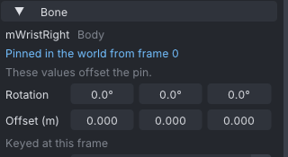
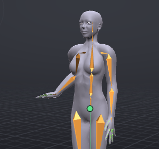
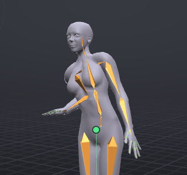

# Hold and bind

Pins keep a point in place while the rest of the body moves. **Hold in World** keeps a point still in the world, for example a drink set down on a table; **Bind** makes a point follow another bone, keeping the distance and angle it had when you bound it, for example a hand kept on a two-handed grip.

> Related articles: [[IK]], [[Skeleton]], [[Graph editor]], [[Props]]

## Usage

### What can be pinned

- **Attachment points** (Right Hand, Left Hand, Chest and so on). Whatever someone wears on the point moves with it in Second Life. Show them with **View → Bones → Show Attachment Points**.
- **The ends of limbs**: a wrist, an ankle, a fingertip, a hind foot or a wing tip. The pin holds the end through the limb's [[IK]], so the whole arm or leg bends to keep it on its target. See "Pinning hands and feet" below.
- **Other bones**, such as the spine or the head. The pin moves just that bone.

### Holding a point in the world

1. Go to the frame where the point should stop moving.
2. Select the point.
3. Choose **Tools → Hold in World from Here**, or right-click an attachment point and choose **Hold in World from Here**.

From that frame on, the point stays where it is. The status bar says, for example, "mWristLeft is held in place from frame 20".

### Binding a point to another bone

1. Go to the frame where the binding should start.
2. Select the bone the point should follow.
3. **Shift+click** the point itself, so it is selected second.
4. Choose **Tools → Bind to Selected Bone from Here**. An attachment point's right-click menu offers **Bind to** *bone* **from Here** when two items are selected.

The status bar confirms, for example "Right Hand now rides mWristLeft".

### Releasing and deleting

- **Tools → Release from Here** ends the pin at the current frame. From there the point follows its own bone again, starting from wherever it is.
- **Tools → Delete Pin** removes the pin completely.

Both need the pinned point selected, at a frame the pin covers; otherwise they are greyed out with "The selected point is not pinned here".

### Seeing and editing pins

- A pinned point is light blue in the **Bones** tab, with **[pinned]** after its name.
- In the [[Graph editor]], a pin is a band over the frames it covers. Drag its start or its end to change when the pin starts or is released. On the timeline, a pinned point's offset keys show as diamonds.
- While a point is pinned, moving it keys its **offset** from the pin instead of breaking the pin. **Properties → Bone** shows "These values offset the pin." The offset curves appear in the graph as *bone* **(pin)**.

*A held wrist in **Properties**: the blue line names the pin, and the fields below it edit the offset from it.*

### Pinning hands and feet

A pin on the end of a limb holds it through IK: the shoulder and elbow, or the hip and knee, bend to keep the hand or foot on its target, and no bone is stretched or slid. The limb keeps bending the way it was bent when you pinned it. A limb already in IK is held the same way; the pin takes over its target while it lasts.

If the target moves further away than the limb can reach, the limb straightens and points at it; the hand or foot falls short instead of coming off.

### Follow Target (Bake)

**Tools → Follow Target (Bake)...** makes one bone or point follow another over a frame range by writing a key on every frame, instead of a pin.

1. Select the bone to follow, then **Shift+click** the bone or point that follows it.
2. Choose **Tools → Follow Target (Bake)...**.
3. Set **From frame** and **To frame**.
4. Leave **Keep the current offset** ticked to keep today's distance and angle, or untick it to snap onto the target, orientation included.
5. Press **Bake**.

Use it when you want ordinary keys that you can then edit by hand; delete keys where the point should fly free.

### Worked example: a hand on a table while the body leans

[Open the example](example:hold-hand-on-table.vat): 30 frames. At frame 0 the avatar stands with the right hand flat on a table at its side, and **mWristRight** is held in the world from frame 0. Over the 30 frames the body leans towards the table: **mTorso** turns from 0° to 20° on X and **mPelvis** slides 5 cm that way and 2 cm down. Nothing on the right arm is keyed after frame 0.

*Frame 0: the hand rests on the table.*

*Frame 30: the body has leaned, the hand has not moved, and the elbow has bent to allow it.*

1. Click **mWristRight** in the **Bones** tab: it is light blue with **[pinned]** after its name, and **Properties → Bone** says **Pinned in the world from frame 0**.
2. Scrub from 0 to 30. The hand stays on its spot while the shoulder comes closer to it; the elbow bends more and more. Click **mTorso** at frame 30: **Rotation** reads `20.0°`, `0.0°`, `0.0°`. Click **mPelvis**: **Offset (m)** reads `0.000`, `-0.050`, `-0.020`.
3. Go to frame 15, click **mWristRight** again, and choose **Tools → Release from Here**. The status bar says "mWristRight follows its own bone again from frame 15". Scrub to 30: the hand now leans along with the body, because from frame 15 the arm follows its rotation keys, which were set at the release to the pose it had then.
4. **Edit → Undo** restores the hold to the end.

To make the same thing yourself, pose the hand on the table at the first frame, select **mWristRight**, choose **Tools → Hold in World from Here**, then animate the torso and hips; the arm looks after itself.

## Tips and tricks

- **Passing a drink**: wear the glass on the **Right Hand** attachment point and animate the two hands meeting. At the frame they meet, select `mWristLeft`, **Shift+click** the **Right Hand** point, then **Bind to Selected Bone from Here**. From there the glass travels with the left hand.
- **A two-handed weapon**: pose both hands on the grip with the elbows bent. At the first frame select `mWristRight`, **Shift+click** `mWristLeft`, and bind. Animate only the right arm; the left hand stays on the grip.
- **Planted feet**: select `mAnkleLeft`, **Hold in World from Here**, then lower the hips. The knee bends and the foot stays planted.
- For walks whose feet slide, **Tools → Clean Up Foot Sliding...** plants the feet automatically, on both legs or only on the legs of the selected bones.
- Pin the feet before a big reach: an IK target with a **Pull** moves the hips when it is dragged out of reach, and pinned feet stay on their spots while the hips go (see [[IK#Full-body reach]]). **Tools → Auto-Balance...** holds planted feet still with leg IK while it moves the hips over them (see [[Balance]]).
- Pins are baked into ordinary keys on export, so the uploaded animation plays them exactly as you see them.

## Troubleshooting

### Bind to Selected Bone from Here is greyed out

It needs exactly two items selected: the bone to ride first, then the point to pin. The hint reads "Select the bone to ride, then Shift-click the point to pin".

### A pinned hand drifts away from its target

The target is out of the arm's reach, so the arm straightens and the hand falls short. Move the body closer, or release the pin for those frames.

### Moving a pinned point doesn't break the pin

That is intended: the move is keyed as an offset from the pin. To end the pin, use **Release from Here** or **Delete Pin**.

## See also

- [[IK]]
- [[Props]]
- [[Couples and groups]]

Category: Animating
