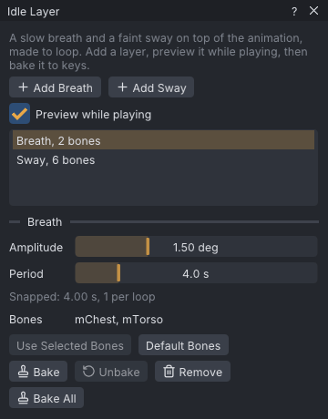

# Idle layer

An idle layer adds a slow breath or a faint sway on top of the animation, so a held pose or a stand
doesn't look frozen. The motion is made to loop cleanly, and you bake it into ordinary keys when it looks
right.

> Related articles: [[Dynamics]], [[Loop tools]], [[Overlap]]

## Usage

Open the window with **Tools → Idle Layer...**. Each layer is listed as **Breath** or **Sway** with the
number of bones it moves, with **(baked)** after layers that hold a bake. The settings and buttons below
the list apply to the selected layer.

*A breath and a sway on a standing loop, not baked yet.*

[Open the example](example:idle-stand.vat): Relaxed Stand held for a 4-second loop with a breath layer and a
sway layer. Tick **Preview while playing** and play it.

### Adding a layer

- **Add Breath** adds a breath: `mChest` tilts back a little and `mTorso` rises, then both settle again,
  once per period. Every bone of a breath layer except `mTorso` tilts; `mTorso` only rises.
- **Add Sway** adds a sway: each bone turns slowly on all three axes, following smooth random curves
  (gradient noise). It starts on `mChest`, `mTorso`, `mHead`, `mPelvis`, `mCollarLeft` and
  `mCollarRight`.

Layers add to the keys the bones already have; a layer never replaces them.

### Choosing the bones

The **Bones** line lists the bones the layer moves. Select bones in the view or the bone list, then press
**Use Selected Bones**. **Default Bones** puts back the set the layer started with. Face bones (`mFace...`),
eye bones (`mEye...`), attachment points and collision volumes are always skipped. Both buttons are
disabled while the layer is baked; **Unbake** first.

### Previewing

Tick **Preview while playing** and play the clip. Layers that are not baked yet play on top of the
animation. When playback stops or you scrub, the view shows the keyed pose. Bones in a limb that uses
[[IK]] are left out of the preview, because IK overrides their keys once baked.

### Baking

- **Bake** writes the layer onto its bones' keys, as one undo step, and the button then reads **Re-bake**.
  A breath writes position keys on `mTorso` and leaves its rotation keys alone.
- **Re-bake** starts again from the keys the bones had before the first bake, so you can change
  **Amplitude**, **Period** or **Seed** and bake again.
- **Unbake** puts back the keys the bones had before baking.
- **Remove** deletes the layer and puts back its pre-bake keys.
- **Bake All** bakes every layer at once. It appears when there are two layers or more.

Baked layers stack in list order. Baking, unbaking or removing one layer bakes the other baked layers
again on top of it, so layers that share a bone can be baked and unbaked in any order.

Baked keys are sampled on every frame and thinned to within 0.01 degrees (0.02 mm for the rise), with at
most two seconds between keys.

## Configuration

| Setting | Range | Breath | Sway | Effect |
|---|---|---|---|---|
| **Amplitude** | 0–5 degrees | 1.5 | 1.0 | Breath: how far the chest tilts back, and how many millimetres `mTorso` rises. Sway: the largest turn any bone makes. |
| **Period** | 0.5–20 s | 4.0 | 5.0 | Breath: seconds per breath. Sway: roughly the seconds between changes of direction. |
| **Seed** | any whole number | | 1 | Sway only: which random curves. The same seed always gives the same keys. |

### Looping

The period is snapped so a whole number of periods fits the loop: the line under **Period** shows the
snapped length and how many fit, for example `Snapped: 4.00 s, 3 per loop`. With **Loop** off, it fits
the whole clip instead. The sway's random curves also close up at the loop's length, so the pose at
loop-out is exactly the pose at loop-in and the loop has no seam.

Phase 0 is at loop-in: a breath starts from the keyed pose there.

## Tips and tricks

- Keep **Amplitude** low. One or two degrees reads as alive; more reads as wobbling.
- `mPelvis` turns the whole body, feet included. Take it out of a sway with **Use Selected Bones**, or run
  **Tools → Clean Up Foot Sliding...** after baking.
- Two sway layers with different seeds and periods (one slow, one faster and smaller) look less regular
  than one.
- Set the loop points before baking. Re-bake after changing them.

## Troubleshooting

### A bone doesn't move after baking

The bone is in a limb that uses IK (the spine IK drives `mTorso` and `mChest`), so IK overrides its keys.
Switch the limb to FK, or leave that bone out of the layer.

### The loop pops at the wrap after baking

The loop points or the clip length changed after baking. **Re-bake** the layer.

## See also

- [[Dynamics]]
- [[Loop tools]]
- [[Project file format#idle]]

Category: Motion
