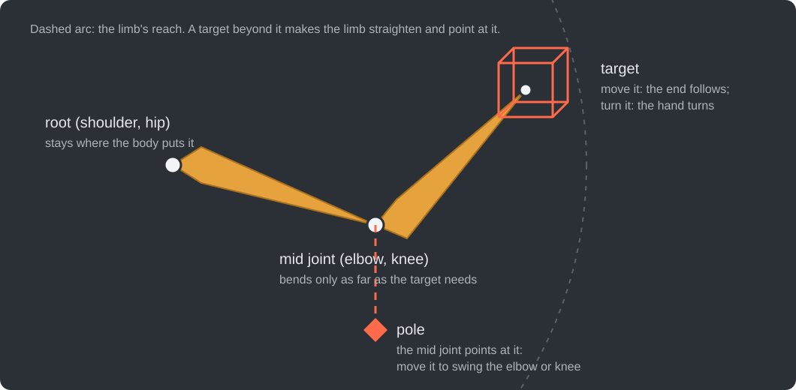
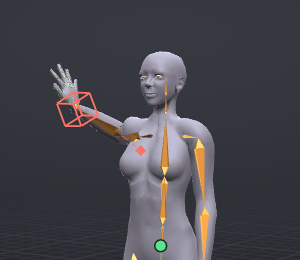
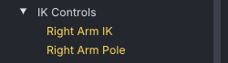

# IK

IK (inverse kinematics) poses a limb by its end: place the hand or foot and the arm or leg bends to reach it. VATs has IK for the arms, legs, fingers, spine, hind legs and wings, and you can switch each limb between IK and FK (bone-by-bone rotation) at any frame without the limb jumping.

> Related articles: [[Posing]], [[Hold and bind]], [[Balance]], [[Graph editor]], [[Keys and timeline]]

## Usage

### The chain, the target and the pole

*Two bones, one target, one pole.*

An IK limb is a chain of two bones between three joints. The **root** (the shoulder or hip) stays where the body puts it. The **end** (the wrist or ankle) goes to the **target**: move the target and the end follows; turn it and the hand or foot turns. The **mid joint** (the elbow or knee) bends about its hinge exactly as far as the target needs, and it points at the **pole**, so the pole decides which way the limb bends. The limb can reach anywhere up to the two bone lengths from the root; a target further away makes it straighten and point at the target, without stretching.

### Limbs with IK

| Limb | Bones | Pole |
|---|---|---|
| Left Arm, Right Arm | shoulder, elbow, wrist | yes |
| Left Leg, Right Leg | hip, knee, ankle | yes |
| Left/Right Thumb, Index, Middle, Ring, Pinky | the three finger joints | yes |
| Spine | `mTorso`, `mChest`, ending at `mNeck` | no |
| Left Hind Leg, Right Hind Leg | `mHindLimb1`–`3` | yes |
| Left Wing, Right Wing | `mWing1`–`3` | yes |

The tail and the face have no IK.

### Switching a limb to IK

1. Select a bone of the limb, for example the wrist.
2. Press **K** (**Tools → Switch IK / FK**, or the **IK / FK** button on the timeline bar). The limb switches to IK from the current frame, matched to its current pose so it does not jump.
3. A **target** box appears at the end of the limb, and for limbs with a pole, a small **pole** marker that shows which way the elbow or knee points. The target is selected.
4. With the **Move** tool, drag the target to place the hand or foot; with **Rotate**, turn it. Move the pole to swing the elbow or knee.

*The right arm in IK: the target cube on the wrist, and the pole diamond joined to the elbow by a dashed line.*

**Double-clicking** a bone of a limb also switches it. The status bar confirms, for example "Left Arm is now IK from frame 12".

### Switching back to FK

Select the limb (a bone, the target or the pole) and press **K** again. From that frame on the limb follows its rotation keys again; at the switch it is matched to the IK pose, so there is no jump.

### Keying IK

Moving the target or pole keys it at the current frame, like any bone. **S** (Set Key) with a target or pole selected keys both the target and the pole.

### Full-body reach

A hand target dragged further than the arm reaches normally leaves the hand short. Give the target a **Pull** and the body goes after it instead.

1. Select the target (**Left Arm IK**, **Right Leg IK** and so on). **Properties → Bone** shows the target's name and a **Pull** slider, 0 to 1, 0 by default. Arms and legs have it; fingers and the spine do not.
2. Set **Pull**, for example `1`. It is saved with the project, per target.
3. Drag the target out of reach with the **Move** tool and let go.

When you let go of an arm's target past the arm's full length, the spine leans towards it first, up to 30°, through the spine's own IK solve, as far as it takes to bring the shoulder within reach. What is still missing after the lean, times **Pull**, moves the hips straight towards the target. With **Pull** `1` the hand reaches the target; with `0.5` the hips go half the remaining way and the hand stops short by the rest. A leg's target skips the lean and moves only the hips. The status bar says, for example, "Hips moved 12.4 cm to reach".

The result is ordinary keys at the current frame: rotation keys on `mTorso` and `mChest` (or the **Spine** target when the spine is in IK) and a position key on `mPelvis`, in the same undo step as the drag. Feet held by [[Hold and bind|pins]] stay where they are while the hips move; feet that are not pinned travel with the hips. A target within reach, a rotate drag and **Pull** `0` change nothing but the target.

### IK Controls in the Bones tab

The **Bones** tab lists every limb that uses IK under **IK Controls**, as **Left Arm IK** and **Left Arm Pole** and so on. Click one to select it. A limb whose IK is off at the current frame is marked **(FK)** and drawn dimmer.

*The **IK Controls** group of the **Bones** tab.*

### IK in the graph

Select a target to see its curves in the [[Graph editor]]: **IK / FK Blend**, which records where the limb switches between IK and FK, and the target's **Translate** and **Rotate** channels. Select a pole to see its **Pole X/Y/Z** channels.

### Worked example: reaching with the right arm

[Open the example](example:ik-reach.vat): the right arm is in IK from frame 0, with the upper arm out to the side and the forearm up. The target is keyed at frame 0 and again at frame 24, 12 cm further in towards the head and 8 cm higher. The **Bones** tab lists **Right Arm IK** and **Right Arm Pole** under **IK Controls**.

1. Scrub from 0 to 24: the hand follows the target and the elbow bends further to let it. The shoulder and elbow have no keys after frame 0; the IK poses them.
2. Go to frame 12, click **mElbowRight**, and press **K**. The status bar says "Right Arm is now FK from frame 12" and the target cube disappears.
3. Scrub to 24: the hand no longer moves. From frame 12 on the arm follows its rotation keys, and the switch keyed the pose it had at that moment, so there was no jump.
4. **Edit → Undo** puts the arm back in IK.

## Tips and tricks

- Use IK for feet on the ground and hands on objects; use FK for swinging arms and free gestures.
- To keep a hand or foot still while the body moves, pin it instead of keying the target on every frame: see [[Hold and bind]]. A pin on the end of a limb drives the limb through IK.
- IK is baked into ordinary rotation keys on export, so the uploaded animation looks exactly as it does in VATs. The `.anim` format has no IK of its own.
- **Select → Select All** also selects the targets and poles of limbs that are in IK.

## Troubleshooting

### "Select a bone of an arm, leg, wing, finger or the spine"

**K** was pressed with no limb bone selected, or with a bone that belongs to no limb (the head, the tail, a face bone). Select a bone of one of the limbs listed above.

### The elbow or knee flips to the other side

The pole decides which way the joint bends. Move the pole out on the side the elbow or knee should point to, and key it where the flip happens.

### The hand stops short of the target

The target is further away than the limb can reach. The limb straightens and points at the target; it does not stretch. Bring the target closer, move the body, or give the target a **Pull** so the body follows it (see [[IK#Full-body reach]]).

## App and viewer

> **Note:** In the viewer the IK handles and poles are drawn on your avatar in the world and drag the same
> way. See [[VATs Editor (viewer)]].

## See also

- [[Hold and bind]]
- [[Balance]]
- [[Posing]]
- [[VATs Editor (viewer)]]

Category: Animating
