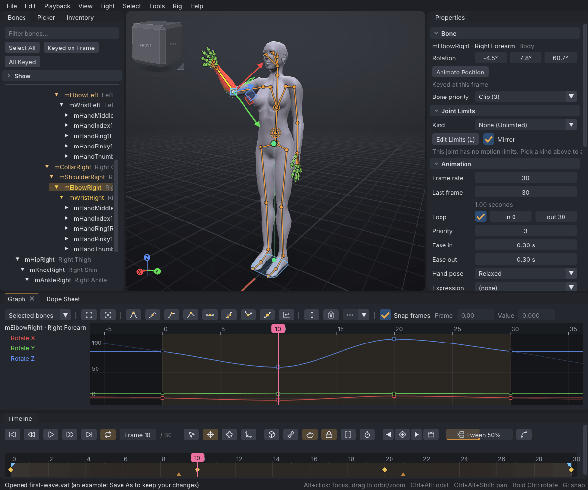
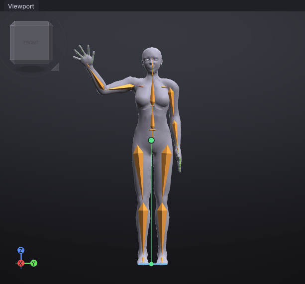
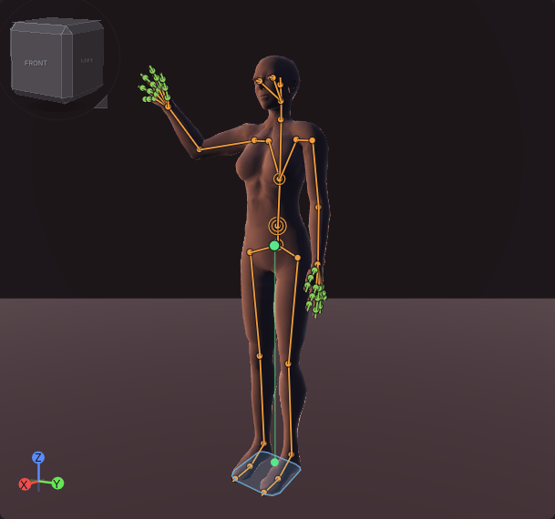

# Interface

The VATs window is a menu bar, seven docked panels and a status bar. Panels can be dragged by their
tabs to other places, stacked as tabs, or pulled out as floating windows; VATs remembers the layout
between sessions.

> Related articles: [[First steps]], [[Control presets]], [[Keyboard shortcuts]], [[Preferences]]

*The default layout, with the [[First steps]] example open at frame 10 and **mElbowRight** selected.*

## Layout

| Panel | Default place | Holds |
|---|---|---|
| **Bones** | left | the skeleton as a list, with a filter box and selection buttons |
| **Picker** | left, a tab beside **Bones** | joint dots and bone lines over the avatar or its silhouette, on four pages (**Body**, **Hands**, **Face**, **Extras**); labels that select whole groups; selection sets folded under it; see [[Picker]] |
| **Inventory** | left, a tab beside **Bones** | projects, animations, mesh bodies, props, poses and clips |
| **Viewport** | centre | the avatar, the gizmo, the view cube |
| **Properties** | right | the selected bone or prop, the animation settings, the export settings |
| **Graph** | bottom | the curve editor |
| **Dope Sheet** | bottom, a tab beside **Graph** | the keyed frames per body part and bone |
| **Timeline** | bottom, under **Graph** | play controls, the frame box, tool buttons and the frame ruler |

The **status bar** runs along the bottom of the window. On the left it shows what the last command
did, how many items are selected when there is more than one, **Ortho** while the view is
orthographic, **Target:** and the target's name while a [[Target ghost]] is loaded (with how far the selected bone
is from it), and **Check: N** when the [[Animation check]] has found problems. On the right it shows the mouse
controls of the active [[Control presets|control preset]], or the graph's or dope sheet's controls while
the pointer is over the **Graph** or **Dope Sheet** panel.

The title bar shows the project's file name (`Untitled` before the first save), `*` while there are
unsaved changes, and the VATs version.

## Usage

### Bones

- **Filter bones...** narrows the list to bones whose names contain the text.
- **Select All** selects every visible bone; **Keyed on Frame** selects the bones with a key on the
  current frame; **All Keyed** selects every bone with a key anywhere in the animation.
- **Show** (closed by default) picks which groups of bones are listed and drawn, and has
  **Collision Volumes**. The same switches are in **View → Bones**.

A bone with a key on the current frame is listed in amber, a bone animated anywhere in tan, and
attachment points in green. See [[Skeleton]].

### Inventory

**Filter by name...** at the top narrows every section to the items whose names contain the text. Then:

- **Projects** and **Animations**: your `.vat` and `.anim` files, from the library folders, recent
  projects and folders you add ([[Project library]]).
- **Bodies**: your [[Mesh bodies]].
- **Poses** (your poses and clips) and **Starter poses**: the [[Pose library]].
- **Meshes** and **Starter props**: the prop library ([[Props]]).

Click a section's title to fold it away; VATs remembers which sections you folded, next time too.

Drag or double-click an item to use it; right-click it for the rest.

### Viewport

- Click a bone to select it. Clicking the same spot again selects the bone underneath.
- **Shift+click** adds a bone to the selection; a click on empty space clears it (see [[Posing]]).
- Right-click a bone for its body-part menu.
- **Esc** or a right-click during a drag cancels the drag.
- The cube at the top left turns the view: click a face to look from that side, or drag the cube to
  orbit.
- The axis marker at the bottom left shows the world axes.
- **View → Camera → Orthographic** (**Num 5** in every [[Control presets|control preset]]) switches between
  perspective and an orthographic view, and back. See [[Interface#Orthographic view]].

### Orthographic view

An orthographic view has no perspective: parts of the body the same size look the same size however
far from the camera they are, and parallel lines stay parallel. Use it to check symmetry, a pose's
silhouette, or where a hand is against the body, from **Front**, **Right** or **Top**.

*The [[First steps]] example at frame 10, **Front** and orthographic.*

- **View → Camera → Orthographic** or **Num 5** turns it on; the menu item is ticked and the status bar shows
  **Ortho**. The same key or item turns it off. The camera keeps its place and its direction.
- At the orbit target the view is as tall as the perspective view, so turning it on keeps the framing.
  Zoom (the wheel, drag zoom, **Zoom In** / **Zoom Out**) makes the view taller or shorter; **Frame
  Selected** and **Frame All** fit it as they fit the perspective view.
- With the view orthographic, the view cube's faces and **Top** look exactly along the axis: **Top**
  looks straight down (a plan), not from 86° as in perspective. Orbiting from there tilts back to 86°.
- Clicks, the gizmo, bone markers and onion-skin ghosts use the same projection, so what you click is
  what you see.
- The floor grid is edge-on in **Front**, **Back**, **Left** and **Right**, so it does not show there.
- **Reset Camera** keeps the view orthographic.

> **Note:** The orthographic view is not yet available in the [[VATs Editor (viewer)|viewer]]; there
> **Num 5** says `This view has no orthographic mode yet`.

Sections, each of which can be collapsed:

- **Bone** (or **Prop** when a prop is selected): the selection's values and options.
- **Animation**: **Frame rate**, **Last frame**, **Loop**, **Loop in** and **Loop out**, **Priority**,
  **Ease in** and **Ease out**, **Hand pose** and **Expression**. See [[Keys and timeline]],
  [[Animation priority]] and [[Loop tools]].
- **Export**: file naming, folder, bake shape and export buttons. See [[Export to Second Life]].

### Graph

The curve editor for the selected bones. Close it with the **×** on its tab; **Ctrl+G** (**View →
Graph Editor**) shows or hides it. See [[Graph editor]].

### Dope Sheet

The keys of the selected bones as diamonds, one row per body part, with a summary row on top; it shares
its key selection, copied keys and time range with the graph. Close it with the **×** on its tab;
**View → Dope Sheet** shows or hides it. See [[Dope sheet]].

### Timeline

From left to right: the play controls, the frame box and the last frame, the tool buttons, the axes
button, **IK / FK**, **Mirror**, **Retime**, **Set Key** and the **Tween** slider. Below them is the frame ruler
with the keys, the loop and ease markers, any retime markers and, when loaded, the [[Audio track]]. See
[[Keys and timeline]].

*The timeline of the [[First steps]] example: amber diamonds are keys, the small triangles at 6 and
24 the ease markers, and the band from 0 to 30 the loop.*

The play controls are icons only; hover one for its name and key:

| Button | Icon |
|---|---|
| **Go to start** | a bar, then a triangle pointing left |
| **Previous key** | two triangles pointing left |
| **Play / pause** | a triangle pointing right; two bars while playing |
| **Next key** | two triangles pointing right |
| **Go to end** | a triangle pointing right, then a bar |
| **Loop** | two arrows chasing each other; highlighted while **Loop** is on |

The other buttons show an icon and their name: **Select** (an arrow pointer), **Move** (four arrows),
**Rotate** (a circling arrow), **Scale** (a corner with a dot), the axes button (**Local** with a box,
**World** with a globe, **Gimbal** with three axes), **IK / FK** (a bone), **Mirror** (two halves either side of
a dashed line), **Retime** (a stopwatch) and **Set Key** (a diamond with a plus). Their keys are in the tooltips.
The active tool is highlighted. The **Tween** slider shows a bar between two boxes, or a curve through two points
while **Relax** is ticked; **Blend** shows two overlapping circles. When the **Timeline** panel is too narrow for
the names (a window about 1200 pixels wide), these buttons and **Relax** show their icons only, so the **Tween**
slider and **Blend** stay in view.

### Menus

| Menu | Holds |
|---|---|
| **File** | **New**, **Open...**, **Open Recent**, **Save**, **Save As...**, the imports (BVH, SL `.anim`, retarget, prop / mesh, audio), the exports (`.anim`, BVH, **Export Listing Media...**: see [[Listing media]]), **Quit** |
| **Edit** | **Undo**, **Redo**, keys, resets, copy and paste pose, **Save Clip of Selected Bones...**, **Time**, mirror and flip, **Reverse Animation**, **Simplify Curves...**, **Preferences...** |
| **Playback** | play, frame and key stepping, start and end |
| **View** | **Camera** (view directions, **Orthographic**, framing and zoom, **Reset Camera**, **Camera Views**), **Graph Editor**, **Dope Sheet**, **Reset Layout**, **Bones** (the bone group switches, **Show Collision Volumes**, **Bones in Front (X-ray)**), **Centre of Mass**, **Onion Skin**, **Target Ghost**, **Motion Path**, **Treadmill**, **Reference...** (a picture behind the avatar: [[Reference images]]), **Preview as SL Plays It**, **Face Cam**, **Body** |
| **Light** | the lighting presets **Flat Noon**, **Three-Quarter Key**, **Rim / Back**, **Dusk** and **Night**, **Studio (Default)**, and **Plain Backdrop**: a grey wall and floor behind the actor that turn with the camera. They are for looking at the animation only; nothing is saved |
| **Select** | **Select All**, **Select Keyed on Frame**, **Select All Keyed**, **Select None**, parent, child and siblings |
| **Tools** | the four tools, the axes, IK and pins, **Clean Up Foot Sliding...**, **Loop Tools**, **Hand Poser**, **Dynamics...**, **Idle Layer...**, **Overlap...**, **Auto-Balance...**, **Jump Arc...**, **Ragdoll...**, **Face...**, **Actors (Couples and Groups)...**, **Motion Capture...**, **Split Dance at Beats...**, **Animation Check...**, **Motion Quality...** |
| **Help** | **Help Contents**, **Tutorials**, **Controls**, **Welcome**, **About Viewport Avatar Toolset** |

Choosing a command in a menu closes it, sub-menus and all; so does **Esc** or a click anywhere outside it. Settings
inside a menu, such as the **Onion Skin** sliders or **Treadmill → Custom speed**, keep it open while you change them.

Every slider in VATs drags from where its value is: press anywhere on it and move the mouse, and a click alone
never changes it. Double-click it (or **Ctrl+click**) to type a value, then **Enter**; hold **Shift** while
dragging to go faster and **Alt** to go slower. A slider's tooltip waits until you let go.

Every **Tools** item has an icon, the same as its button where it has one:

| Tools item | Icon |
|---|---|
| **Select Tool**, **Move Tool**, **Rotate Tool**, **Scale Tool** | the tool buttons' arrow pointer, four arrows, circling arrow and corner |
| **Cycle Local / World / Gimbal Axes** | three axes |
| **Switch IK / FK** | a bone |
| **Follow Target (Bake)...** | a crosshair in a circle |
| **Hold in World from Here**, **Bind to Selected Bone from Here**, **Release from Here**, **Delete Pin** | a pin, a chain link, a crossed-out pin, a bin |
| **Clean Up Foot Sliding...** | an anchor |
| **Loop Tools** | two arrows chasing each other, as **Loop**; inside it **Make Loop Seamless** (an infinity sign), **Remove Hip Travel (In Place)** (an arrow down to a dot), **Start Cycle at Frame** (a turning arrow), **Find Best Loop Points...** (a magnifier), **Fit Loop to Beats...** (a two-way arrow), **Loop-Aware Tangents** (a curve through two points) |
| **Hand Poser** | a hand |
| **Dynamics...** | an atom |
| **Idle Layer...**, **Overlap...**, **Auto-Balance...**, **Jump Arc...** | wind, waves, a balance scale, a rabbit |
| **Make Transition...** | boxes with an arrow at the end, beside **Tween**'s at the start |
| **Ragdoll...** | a line falling to the right |
| **Face...**, **Actors (Couples and Groups)...**, **Clips (AO Sets)...** | a smile, two people, a clapperboard |
| **Motion Capture...** | a dot in a circle, as its **Record** button |
| **Split Dance at Beats...** | scissors |
| **Animation Check...**, **Motion Quality...**, **Priority Planner...** | a shield with a tick, a gauge, a numbered list |

*The **Dusk** preset with **Plain Backdrop** on.*

A menu item that cannot be used now is greyed; hover over it to see why. The key shown beside an item
is the key in the active preset.

### Help windows

- **Help → Help Contents** (**F1**) opens this help: contents, search and every page.
- **Help → Tutorials** opens the [[Tutorials]] page: the lessons in order, beginner first.
- **Help → Controls** lists the mouse controls and every key of the active preset.
- **Help → Welcome** reopens the start window.
- **Help → About Viewport Avatar Toolset** shows the version, licence and credits.

The **Help** window opens floating. To keep it beside your work, drag its title bar onto a panel,
such as **Properties**, and drop it on the centre of the docking target: it becomes a tab there and
stays there the next time you open it. Drag the tab out again to float it. While it is docked, **F1**
or **Help → Help Contents** brings its tab to the front. In a narrow panel the contents list hides
behind a **Pages** button, which shows search and the page list in place of the page; picking a page
or pressing **Page** goes back to the page.

### Worked example: find a key with the panels

[Open the example](example:first-wave.vat), the wave from [[First steps]], and use each panel once:

1. **Bones**: type `Elbow` into **Filter bones...**. The list shrinks to the two elbows and the bones
   above them, both elbows in amber because they have a key on frame 0; click **mElbowRight**.
2. **Viewport**: the rotation gizmo appears around the elbow. Press **F** to frame it.
3. **Properties → Bone**: **Rotation** reads `0.0°  9.0°  91.0°` and **Keyed at this frame**.
4. **Timeline**: press **.** (**Next key**). The frame box reads **Frame 10**, the playhead sits on
   the second diamond, and **Rotation** now reads `0.0°  9.0°  60.0°`.
5. **Graph**: the blue **Rotate Z** curve dips to 60 under the playhead and rises to 110 at frame 20.
6. **Status bar**: the left end says `Opened first-wave.vat (an example: Save As to keep your changes)`
   until the next command; the right end shows the mouse controls of your preset.

## Configuration

- Colour theme, interface size and gizmo size: see [[Preferences]].
- **View → Body** picks the avatar drawn in the viewport: **SL Default**, **SL Default (Male)**,
  **Female**, **Male**, **Skeleton Only**, or a mesh body from your library.
- **View → Camera → Camera Views** recalls and stores four camera positions; see
  [[Keyboard shortcuts#Camera views]].

VATs keeps the panel layout in `layout.ini` in the data folder. See
[[Projects and files#Data folders]]. **View → Reset Layout** goes back to the default layout, with
every panel docked where it starts on the first run.

## Troubleshooting

### A panel is missing

Only **Graph** and **Dope Sheet** can be closed; **Ctrl+G** brings the graph back and **View → Dope
Sheet** the dope sheet. The other panels can be moved or undocked but
not closed, so a missing one is hidden behind another tab or pushed to a thin edge. **View → Reset
Layout** puts every panel back where it starts on the first run and shows the closed ones again.

### Text is too small or too large

Change **Interface size** in [[Preferences]]. VATs also follows the display scale set in the
operating system.

## See also

- [[Control presets]]
- [[Keyboard shortcuts]]
- [[Preferences]]

Category: Interface
