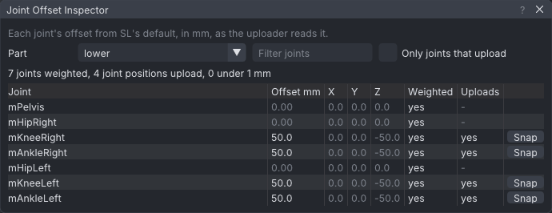

# Joint offset inspector

The Joint Offset Inspector lists, for the mesh body shown, where each joint sits in the file against
Second Life's default, in mm, exactly as the mesh uploader reads it. It says which positions SL will
apply, which are float noise from an export, and snaps noise back to the default with one click.

> Related articles: [[Rigging for SL without add-ons]], [[Mesh bodies]], [[Skeleton]]

## Usage

*A test body bound with its knees 5 cm and its ankles 10 cm lower: four joint positions upload, each 50 mm from its own parent.*

Open it with **Rig → Joint Offset Inspector...**, or from **Joint Offset Inspector...** in the export
window. It reads the body shown (**Inventory → Bodies**); with several parts, **Part** picks one. The
list holds every joint the part binds or weights; type in **Filter joints** to find one, and tick **Only
joints that upload** to see just the positions SL will apply.

The columns:

| Column | Meaning |
|---|---|
| **Joint** | The SL name. A collision volume (`BELLY`, `LEFT_PEC`) is fitted mesh's; hover for what the file did with it. Click a row to select the joint in the view. |
| **Offset mm** | How far the joint's translation in the file is from SL's default, parent-relative, as the uploader compares it. Amber: between 0.1 and 1 mm, most likely noise. Grey: SL ignores it. |
| **X Y Z** | The offset's parts, in SL's axes (X forward, Y left, Z up), mm. |
| **Weighted** | Some vertex is weighted to the joint. |
| **Uploads** | **yes**: SL applies the position (over 0.1 mm, and the joint is in the skin's joint list). **under 0.1 mm**: SL ignores it. **not listed**: the joint is neither weighted nor moved enough, so it is left out of the file's joint list. **yes (noise)**: it uploads but looks like noise. |
| **Snap** | Moves the joint's bind position to SL's default. Its vertices stay where they are, so the mesh is skinned from there, as SL would show it without the position. |

The line above the table counts the weighted joints, the positions that upload and those under 1 mm;
**Snap All Under 1 mm** snaps the noise in one go.

The numbers follow the export window's options: with **Joint positions** off, or **Bind pose only**,
nothing uploads; **mPelvis offset** decides whether `mPelvis` is written.

### Parent-relative

The uploader compares each joint node's own translation to the default, not the joint's place in the
world. A knee bound 5 cm lower shows 50 mm; the ankle under it, bound 5 cm lower too, shows 0 mm, since
it did not move relative to its knee. A joint that shows 0.4 mm under a parent that shows 0.4 mm the
other way did move, by 0.8 mm relative to its parent, and both count.

### What a snap does

A snap edits the part as loaded, for this session: the mesh file is not touched, and the view follows
(the body's shape drops the offset). Re-import the body to undo. A snapped joint keeps its bind
rotation, so a mesh bound in an A-pose still skins correctly.

## Troubleshooting

### Every joint shows an offset of a few mm

The rig was not built on SL's rest positions, or its unit is off (a rig in centimetres declaring metres
scales every offset). Compare a few joints with `avatar_skeleton.xml`; if the whole skeleton is shifted
the same way, the pelvis moved: see **mPelvis offset** in [[Rigging for SL without add-ons#Check and
export]].

### A joint I moved shows "not listed"

Its offset is under 0.1 mm (SL would ignore it anyway), or **Joint positions** is off in the export
window. Moved joints over 0.1 mm are always listed, weighted or not.

### The list is empty

No body is shown, or the part is not rigged. Import the mesh as a body and double-click it.

Category: Reference
