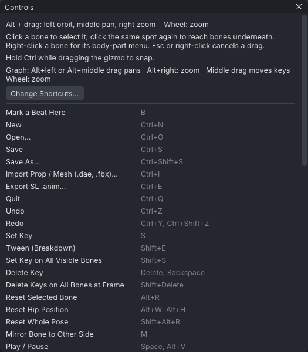
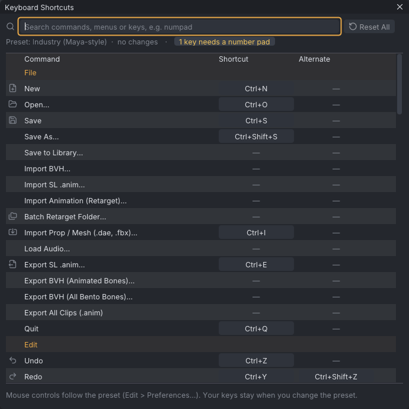

# Keyboard shortcuts

Every key VATs uses, for each of the four [[Control presets]]. The tables are generated from the
app's own action list and preset overrides, so they match what **Help → Controls** shows.
Every command is also in the menus, including the many that have no key. Any command can have keys of
your own; see [[#Changing shortcuts]].

> Related articles: [[Control presets]], [[Preferences]], [[Interface]]

## Reading the tables

- Where an action has two keys, both work; the first is the one the menus show.
- A dash means the action has no key in that preset.
- **Num** keys are on the number pad.
- Keys are for the viewport and panels. While a text field is being edited, it keeps every key except
  the **Ctrl** shortcuts for **New**, **Open...**, **Save**, **Save As...**, **Export SL .anim...**,
  **Quit**, **Undo**, **Redo**, **Preferences...** and **Graph Editor**.
- Mouse controls differ more than keys between presets; see [[Control presets#Mouse, per preset]].


*The same list inside the app: **Help → Controls** shows only the commands that have a key in the
active preset.*

### Worked example: step through keys in two presets

[Open the example](example:first-wave.vat), which has keys on frames 0, 10, 20 and 30:

1. In the Industry preset, press **.** three times. The frame box reads **Frame 10**, **Frame 20**,
   then **Frame 30**; **Home** returns to **Frame 0**.
2. Switch to Blender in **Edit → Preferences...** and press **Up** three times: the same three
   frames, because **Next Key** is **Up** there (see the Playback table). **Shift+Left** is Blender's
   **Go to Start**; **Home** frames everything instead.
3. Press **Ctrl+,** and pick **Industry (Maya-style)** again.

## Keys

### Files

| Action | Industry (Maya-style) | Blender | QAvimator | Second Life |
|---|---|---|---|---|
| New | Ctrl+N | Ctrl+N | Ctrl+N | Ctrl+N |
| Open... | Ctrl+O | Ctrl+O | Ctrl+O | Ctrl+O |
| Save | Ctrl+S | Ctrl+S | Ctrl+S | Ctrl+S |
| Save As... | Ctrl+Shift+S | Ctrl+Shift+S | Ctrl+A | Ctrl+Shift+S |
| Import Prop / Mesh (.dae, .fbx)... | Ctrl+I | Ctrl+Alt+I | Ctrl+I | Ctrl+I |
| Export SL .anim... | Ctrl+E | Ctrl+E | Ctrl+E | Ctrl+E |
| Quit | Ctrl+Q | Ctrl+Q | Ctrl+Q | Ctrl+Q |

> **Note:** In the [[VATs Editor (viewer)|viewer]], **Quit** is **Close Editor**: it closes the editor and
> leaves the viewer running.

### Editing

**Mark a Beat Here** works only while an [[Audio track]] is loaded.

| Action | Industry (Maya-style) | Blender | QAvimator | Second Life |
|---|---|---|---|---|
| Undo | Ctrl+Z | Ctrl+Z | Ctrl+Z | Ctrl+Z |
| Redo | Ctrl+Y, Ctrl+Shift+Z | Ctrl+Shift+Z, Ctrl+Y | Ctrl+Shift+Z, Ctrl+Y | Ctrl+Y, Ctrl+Shift+Z |
| Set Key | S | I | S | S |
| Set Key on All Visible Bones | Shift+S | Shift+I | Shift+S | Shift+S |
| Tween (Breakdown) | Shift+E | Shift+E | Shift+E | Shift+E |
| Delete Key | Delete, Backspace | Alt+I, Delete | Delete, Backspace | Delete, Backspace |
| Delete Keys on All Bones at Frame | Shift+Delete | Shift+Delete | Shift+Delete | Shift+Delete |
| Reset Selected Bone | Alt+R | Alt+R | Alt+R | Alt+R |
| Reset Hip Position | Alt+W, Alt+H | Alt+G, Alt+H | Alt+W, Alt+H | Alt+H |
| Reset Whole Pose | Shift+Alt+R | Shift+Alt+R | Shift+Alt+R | Shift+Alt+R |
| Copy Pose | Ctrl+C | Ctrl+C | Ctrl+C | Ctrl+C |
| Paste Pose | Ctrl+V | Ctrl+V | Ctrl+V | Ctrl+V |
| Mirror Bone to Other Side | M | M | M | M |
| Flip Pose | – | Ctrl+Shift+V | – | – |
| Mark a Beat Here | B | B | B | B |

> **Note:** In the Second Life preset, and in the [[VATs Editor (viewer)|viewer]], **Alt+W** moves the
> camera, so **Reset Hip Position** is **Alt+H** there.

### Playback

| Action | Industry (Maya-style) | Blender | QAvimator | Second Life |
|---|---|---|---|---|
| Play / Pause | Space, Alt+V | Space | Space, Alt+V | Space, Alt+V |
| Next Frame | Right, Alt+. | Right | Right, Alt+. | Right, Alt+. |
| Previous Frame | Left, Alt+, | Left | Left, Alt+, | Left, Alt+, |
| Next Key | . | Up | . | . |
| Previous Key | , | Down | , | , |
| Go to Start | Home | Shift+Left | Home | Home |
| Go to End | End | Shift+Right | End | End |

### Tools

| Action | Industry (Maya-style) | Blender | QAvimator | Second Life |
|---|---|---|---|---|
| Select Tool | Q | W | Q | Q |
| Move Tool | W | G | W | W |
| Rotate Tool | E | R | E | E |
| Scale Tool | R | S | R | R |
| Cycle Local / World / Gimbal Axes | O | , | O | O |
| Switch IK / FK | K | K | K | K |
| Hand Poser | H | H | H | H |
| Toggle Snapping | – | – | – | G |

### View

| Action | Industry (Maya-style) | Blender | QAvimator | Second Life |
|---|---|---|---|---|
| Front | 1 | Num 1, 1 | 1 | 1 |
| Back | Ctrl+1 | Ctrl+Num 1, Ctrl+1 | Ctrl+1 | Ctrl+1 |
| Right | 3 | Num 3, 3 | 3 | 3 |
| Left | Ctrl+3 | Ctrl+Num 3, Ctrl+3 | Ctrl+3 | Ctrl+3 |
| Top | 7 | Num 7, 7 | 7 | 7 |
| Orthographic | Num 5 | Num 5 | Num 5 | Num 5 |
| Frame Selected | F | Num . | F | F |
| Frame All | A | Home | Ctrl+0, A | A |
| Zoom In | – | – | Page Up | – |
| Zoom Out | – | – | Page Down | – |
| Reset Camera | – | – | – | Esc |
| Graph Editor | Ctrl+G | Ctrl+G | Ctrl+G | Ctrl+G |

### Camera views

Each slot stores the camera's target, direction and distance. **Store Camera View** saves the slot
both in the project and in your settings; **Camera View** uses the project's slot, or the settings'
slot when the project has none, so stored views carry over to new projects. Outside QAvimator the
slots are in **View → Camera → Camera Views** only. An empty slot says `Camera view N is empty: store it first`.

| Action | Industry (Maya-style) | Blender | QAvimator | Second Life |
|---|---|---|---|---|
| Camera View 1 | – | – | F9 | – |
| Store Camera View 1 | – | – | Shift+F9 | – |
| Camera View 2 | – | – | F10 | – |
| Store Camera View 2 | – | – | Shift+F10 | – |
| Camera View 3 | – | – | F11 | – |
| Store Camera View 3 | – | – | Shift+F11 | – |
| Camera View 4 | – | – | F12 | – |
| Store Camera View 4 | – | – | Shift+F12 | – |

### Selection

| Action | Industry (Maya-style) | Blender | QAvimator | Second Life |
|---|---|---|---|---|
| Select All | Ctrl+A | A | Shift+A | Ctrl+A |
| Select Keyed on Frame | Ctrl+Shift+A | Ctrl+Shift+A | Ctrl+Shift+A | Ctrl+Shift+A |
| Select None | Esc | Esc | Esc | – |
| Select Parent | Up, [ | [ | Up, [ | Up, [ |
| Select Child | Down, ] | ] | Down, ] | Down, ] |
| Next Sibling | Shift+] | Shift+] | Shift+] | Shift+] |
| Previous Sibling | Shift+[ | Shift+[ | Shift+[ | Shift+[ |
| Box select (drag from empty space) | Drag | Drag, or B then drag | Ctrl+drag | Drag |
| Box: add to the selection | Ctrl+Shift+drag | Shift+drag | Ctrl+drag, then Shift | Shift+drag |
| Box: remove from the selection | Ctrl+drag | Ctrl+drag | – | Ctrl+drag |
| Box: toggle | Shift+drag | – | – | – |

See [[Control presets#Box selection]].

### Windows

| Action | Industry (Maya-style) | Blender | QAvimator | Second Life |
|---|---|---|---|---|
| Keyboard Shortcuts... | – | – | – | – |
| Preferences... | Ctrl+, | Ctrl+, | Ctrl+, | Ctrl+, |
| Help Contents | F1 | F1 | F1 | F1 |
| Controls | – | – | – | – |

## Changing shortcuts

**Edit → Keyboard Shortcuts...** gives any command keys of your own, on top of the active preset. The
**Change Shortcuts...** buttons in **Help → Controls** and in **Edit → Preferences...** open it too.


*The Industry preset with no changes. A key sits on a key cap; an empty slot shows a dash.*

- **Search** filters as you type, by command name, menu or key: `view`, `ctrl+s`, `num`. Every word
  must match. Type `numpad` to list every key on the number pad, which keyboards without one cannot
  press; the line under the search box counts them (**7 keys need a number pad** in Blender) and a click
  on it runs the same search. Number pad keys are shown in amber.
- Commands are grouped by the menu that holds them, in menu order. **Timeline (right-click)** is the
  timeline's own menu.
- Each command has two keys, **Shortcut** and **Alternate**. Both work; the menus show the first.
- To change one, click it: it reads **Press a key...**. Press the key, with **Ctrl**, **Shift** or
  **Alt** if you want them. **Esc** cancels, **Backspace** clears the slot, a click elsewhere cancels.
  **Esc** and **Backspace** on their own can't be set here; with a modifier they can.
- When another command has the key, **Shortcut in use** names it and its menu. **Replace** gives the key
  to the new command and takes it from the other; **Cancel** leaves both as they were.
- A changed command has a bar in the accent colour at its left and a reset button at its right, which
  gives it the preset's keys back; hover over its name to see them. **Reset All** resets every command.
- A change is saved at once, and the menus, tooltips, the status bar and **Help → Controls** show it.
  The keys in the tables on this page are the presets' own.

The [[Graph editor]], [[Dope sheet]] and timeline keys are the same commands (**Delete Key**, **Frame
Selected**, **Frame All**...), so a change here applies there too.

### Worked example: orthographic view without a number pad

**Orthographic** is **Num 5** in every preset.

1. Open **Edit → Keyboard Shortcuts...** and type `numpad`. **View** lists **Orthographic** with
   **Num 5** in amber.
2. Click **Num 5** and press **Ctrl+5**. The key reads **Ctrl+5**, the row gets the accent bar, and
   the status bar says `Orthographic: Ctrl+5`.
3. Close the window and press **Ctrl+5**: the status bar says `Orthographic view`; press it again for
   `Perspective view`. **View → Camera → Orthographic** now shows **Ctrl+5**.
4. To undo it, click the reset button at the right of the row.

### Presets and your keys

Your keys replace the preset's keys for those commands only, and stay when you switch presets. Under
**Navigation & hotkeys**, **Edit → Preferences...** says how many commands keep your own keys, with
**Clear** to drop them all. Mouse controls always follow the preset.

### Keys that can't be changed

- The keys inside a running operation, below: Blender's **X**, **Y**, **Z** during **G** and **R**, the
  tween's keys, **Esc** to cancel a drag.
- The Second Life preset's held **Ctrl** and **Ctrl+Shift** and its **Alt** camera keys (arrows, **Page Up**,
  **Page Down**, **A**, **D**, **W**, **S**, **E**, **C**).
- Mouse controls, which belong to the preset.

### In settings.json

Changed commands are kept as `key_overrides` in `settings.json` (see [[Preferences#Settings file]]),
both keys of each, `""` for none:

```
"key_overrides": {
	"view_ortho": ["Ctrl+5", ""],
	"save": ["", ""]
}
```

Keys use Dear ImGui's key names: `A`, `5`, `F9`, `Keypad5`, `KeypadDecimal`, `Period`, `LeftBracket`,
`LeftArrow`, `PageUp`, `Delete`, `Space`; modifiers `Ctrl+`, `Shift+`, `Alt+`, `Super+`. Case does
not matter. A name that is not a key leaves that command on the preset's keys.

> **Note:** In the [[VATs Editor (viewer)|viewer]] your keys are saved in the viewer's own copy of
> `settings.json`, apart from the app's. The viewer does not pass number pad digits and **Num .** to the
> editor as number pad keys, and keeps its camera keys (**Alt** with the arrows, **Page Up**, **Page
> Down**, **A**, **D**, **W**, **S**, **E**, **C**) and **Alt+Shift+U**: a command on one of those keys
> does nothing there, so give it another key.

## Modal keys

These keys work only inside a running operation:

- Blender preset, during a **G** move or **R** rotation over the viewport: **X**, **Y**, **Z**,
  **R**, **Ctrl**, **Enter**, **Space**, **Esc**; see [[Control presets#Blender]].
- Second Life preset: hold **Ctrl** to rotate, **Ctrl+Shift** to scale props. The camera keys, as in the
  Second Life viewer: **Alt+Left** / **Alt+Right** (or **Alt+A** / **Alt+D**) orbit, **Alt+Up** /
  **Alt+Down** (or **Alt+W** / **Alt+S**) zoom, **Alt+Page Up** / **Alt+Page Down** (or **Alt+E** /
  **Alt+C**) and **Ctrl+Alt+Up** / **Ctrl+Alt+Down** (or **W** / **S**) orbit up and down,
  **Ctrl+Alt+Shift** with the arrows or **A D W S** pans, **Esc** resets the camera; see
  [[Control presets#Second Life]].
- Any drag in the viewport: **Esc** cancels it.
- An open menu: **Esc** closes it, sub-menus and all, and does nothing else.
- **Tween (Breakdown)** (**Shift+E**, every preset): move the mouse left or right, **Ctrl** for 10%
  steps, then a left click, **Enter** or **Space** keys it and a right-click, **Esc** or **Ctrl+Z**
  cancels; see [[Keys and timeline#Tweening between keys]].

## Troubleshooting

### A shortcut does nothing

- The key belongs to another preset: open **Help → Controls** for the active one.
- You gave the key to another command, or took it away, in **Edit → Keyboard Shortcuts...**: search for
  the key there.
- A text field has the keyboard: click the viewport.
- The command cannot run now, for example **Set Key** with nothing selected. The menu item is greyed;
  hover over it for the reason.
- The desktop or window manager uses the key itself (for example **Alt + drag**, **F11** or
  **Ctrl+Alt+arrows** on some Linux desktops).

## See also

- [[Control presets]]
- [[Graph editor]] for the graph's own keys

Category: Reference
