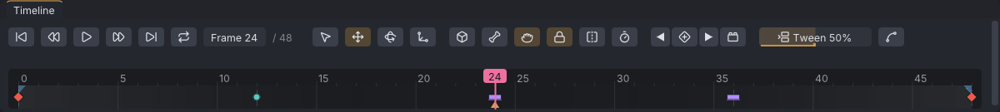
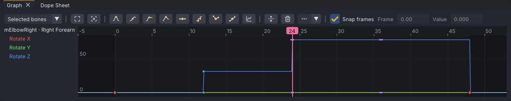

# Keys and timeline

An animation is a set of keys: poses stored at particular frames, which VATs interpolates between. The timeline at the bottom of the window shows where the keys are, plays and scrubs the animation, and carries the loop, ease and range markers.

> Related articles: [[Posing]], [[Graph editor]], [[Time editing]], [[Loop tools]], [[Animation priority]]

## Usage

### Setting keys

1. Move the playhead to a frame: click or drag in the timeline, type in the **Frame** box, or use **Left** / **Right**.
2. Pose the avatar. Moving or rotating a bone keys it at that frame; there is nothing else to press.
3. Move to another frame and pose again.

Other ways to key (Industry keys; see [[Keyboard shortcuts]] for the other presets):

| Command | Key | What it does |
|---|---|---|
| **Edit → Set Key** | **S** | Keys the selected bones, pins and IK controls as they are now |
| **Edit → Set Key on All Visible Bones** | **Shift+S** | Keys every bone that is shown |
| **Edit → Tween (Breakdown)** | **Shift+E** | Keys an in-between pose; see [[Keys and timeline#Tweening between keys]] |
| **Edit → Delete Key** | **Delete**, **Backspace** | Deletes the selected bones' keys at this frame |
| **Edit → Delete Keys on All Bones at Frame** | **Shift+Delete** | Deletes every bone's key at this frame |

The **Set Key** button on the timeline bar does the same as **S**. In the Blender preset, **I** sets a key and **Alt+I** deletes one.

### Tweening between keys

The **Tween** slider on the timeline bar, right of **Set Key**, keys the selected bones at the playhead with a pose part of the way between their previous key and their next key: **0%** is the previous key's pose, **100%** the next key's, and the slider runs from **-20%** to **120%** to push past either key. Each bone uses its own neighbouring keys.

- Rotations turn along the shortest arc between the two poses (quaternion slerp), then take the Euler angles closest to the curve at the playhead, so a curve that has turned several times stays on its turn.
- Positions, and the pins' offsets, move in a straight line.
- A limb in IK is keyed through its IK control: with a bone of that limb selected, or its IK control, the control's target and pole are tweened instead of the bones. The IK/FK switch itself is not changed.
- A bone with no key before or after the playhead is left alone, and the status bar says so.

Press **Relax** next to the slider (it stays lit while on) to work on existing keys instead: the slider then pulls the selected bones' keys at the playhead toward the curve their neighbouring keys would make without them. **0%** leaves the key as it is and **100%** puts it on that curve. It needs a key at the playhead and another key on the same bone.

Instead of the slider, press **Shift+E** and move the mouse left or right; the bottom left of the viewport shows the amount. Hold **Ctrl** for 10% steps. A left click, **Enter** or **Space** keys it; a right-click, **Esc** or **Ctrl+Z** cancels. The drag starts from the slider's last value.

Each use, a slider drag or a **Shift+E** drag, is one undo step, **Tween**. Double-click the slider (or **Ctrl+click** it) to type a value; **Enter** keys it as a drag would, even when the value is the one already shown.

The keys a tween sets are tagged **Breakdown** (see below). **Relax** leaves tags as they are.

### Blocking and key tags

Pose-to-pose animation starts with *blocking*: the key poses on stepped keys, each held until the next, so the timing reads before anything is smoothed.

- **Blocking** on the timeline bar, right of **Set Key** (the square icon), or **Edit → Blocking**: while it is on, every new key is **Stepped**. Keys that already exist keep their interpolation, and keys that only move (a graph drag, **Insert Frames...**) are not changed. The change is part of the same undo step as the key. Blocking is not saved; it is off in every new session.
- **Edit → Convert Blocking to Spline**, also in the timeline's right-click menu: every key of the animation gets the **Auto** tangent, except the IK/FK switches, which stay stepped. Each pair of neighbouring **Hold** keys on a rotation curve becomes a *moving hold*: when the second key is within 1° of the first, it is set 1° from the first, towards the key after the pair (or onwards from the key before it when the pair ends the curve), never past that key, and the two keys' facing handles are **Plateau**, so the curve drifts between them instead of stopping dead. Positions are not drifted. It is one undo step and turns **Blocking** off.

A key can carry a tag that says what it is for. Tags change nothing in the export; they are drawn on the timeline and in the [[Graph editor]] by shape and colour:

| Tag | Mark | Meaning |
|---|---|---|
| **Extreme** | red diamond | a key pose, the furthest point of a move |
| **Breakdown** | teal circle | an in-between; keeps its share of the time when a neighbouring key moves |
| **Hold** | violet bar | a held pose; a pair of them drifts on **Convert Blocking to Spline** |

Untagged keys keep their usual marks. Where keys with different tags share a timeline column, the mark shows **Hold** over **Breakdown** over **Extreme**.

To tag keys:

- **Edit → Tag Keys Here**, or the timeline's right-click menu → **Keys → Tag Keys Here**: **Extreme**, **Breakdown**, **Hold** or **No Tag** for every key of the selected bones, pins and IK controls at the current frame.
- In the graph, select keys, then **More → Tag keys**: the same four for the selected keys.

A **Breakdown** key that is not selected keeps its place in proportion when a key around it moves in the graph. The keys it measures from are the nearest keys either side that are not Breakdowns: a Breakdown a quarter of the way from 0 to 20 moves to 7 when the key at 20 is dragged to 28. With **Snap frames** on it lands on the nearest whole frame. A Breakdown with no such key on one side stays where it is. Only moving keys does this; scaling, **Flip Time** and the time-editing commands move Breakdowns like any other key.

*A blocked arm: Extremes at 0 and 48, a Breakdown at 12 and a Hold pair at 24 and 36.*

*The same keys in the graph: stepped, as **Blocking** keys them.*

[Open the example](example:blocking-arm.vat)

In the example, select **mShoulderRight** and use **Edit → Convert Blocking to Spline**: the arm moves smoothly and drifts from frame 24 to 36 instead of stopping.

### Reading the timeline

- A faint tick marks every frame that has a key on any bone.
- A diamond marks each key of the selection (bones, their pins and IK controls). The primary bone's diamonds are brighter and larger. A tagged key has its tag's mark instead (see [[Keys and timeline#Blocking and key tags]]).
- In the **Bones** tab, a bone with a key on this frame is amber, and a bone animated anywhere is tan.
- **Properties → Bone** says **Keyed at this frame** or **Not keyed at this frame** for the primary bone.

*The timeline with **mHead** selected: its keys at 0, 8 and 16 as diamonds, the loop band from **Loop in** 0 to **Loop out** 16, and the ease triangles at the ends.*

### Moving through time

| Command | Key (Industry) |
|---|---|
| **Playback → Play / Pause** | **Space** |
| **Playback → Next Frame** / **Previous Frame** | **Right** / **Left** |
| **Playback → Next Key** / **Previous Key** | **.** / **,** |
| **Playback → Go to Start** / **Go to End** | **Home** / **End** |

**Next Key** and **Previous Key** jump between the keys of the selection. The same commands sit on the timeline bar as icons; hover one for its name and key, or see [[Interface#Timeline]] for what each icon looks like.

### Length and frame rate

In **Properties → Animation**:

- **Frame rate** is frames per second, 1–120 (30 by default). When you change it, VATs asks what to keep:
  - **Keep Frame Numbers**: keys stay on their frames, so the animation plays faster or slower.
  - **Keep Timing**: keys move so everything happens at the same second.
- **Last frame** sets the length, 0–3600 (30 by default). The length in seconds is shown underneath, in red with "over SL's 60 s limit" past 60 seconds.

### Looping

Tick **Loop** in **Properties → Animation**, or press the **Loop** button on the timeline bar (two arrows chasing each other, after **Go to end**; highlighted while looping). The loop is the frames between **Loop in** and **Loop out**, shown as two flags on the timeline:

- Drag a flag to move it; press on the flag itself. Dragging a flag never turns **Loop** on or off, and a **Shift+drag** (a range) or **Ctrl+drag** (the audio) starting on a flag does its own job instead.
- **Alt+drag** inside the loop band moves both flags together.

Second Life plays the part before **Loop in** once, then repeats the loop. For tools that fix loop seams and walk cycles, see [[Loop tools]].

### Easing in and out

**Ease in** and **Ease out** (seconds, 0–10 in 0.05 s steps) blend the animation in from whatever the avatar was doing, and out again at the end. Type them in **Properties → Animation**, or drag the small triangles at the ends of the timeline.

### Picking a frame range

**Shift+drag** along the timeline to mark a range; it shows as a yellow band. A plain click clears it. Ranges are used by [[Time editing]], **Edit → Save Clip of Selected Bones...** ([[Pose library]]) and the graph's keys.

### Retime markers

The **Retime** button on the timeline bar (a map pin, after **Mirror**) turns on retime markers: **double-click** the ruler to drop one, then drag it to stretch or squash the keys since the marker before it, with everything after it moving along. **Edit → Time → Retime Markers** does the same. See [[Time editing#Retiming with markers]].

### Priority, hand pose and expression

The rest of **Properties → Animation** sets values stored in the exported `.anim`:

- **Priority** (0–6): see [[Animation priority]]. Above 4 the panel warns that some viewers treat it as 4.
- **Hand pose**: one of Second Life's built-in hand shapes, which the viewer applies on top of the animation. This is not the same as posing the finger bones; see [[Hand poser]].
- **Expression**: one of Second Life's built-in facial expressions.

### Worked example: a three-key nod

[Open the example](example:keys-head-nod.vat): 24 frames at 30 fps, **Loop** ticked from 0 to 16, and **mHead** keyed at frames 0, 8 and 16 with **Rotation** Y at 0°, 15° and 0°.

1. Click **mHead** in the **Bones** tab. Its three keys show as diamonds on the timeline.
2. Press **.** (**Next Key**) twice: the playhead jumps from 0 to 8, then 16. At frame 8, **Properties → Bone** reads **Rotation** `0.0°`, `15.0°`, `0.0°` and **Keyed at this frame**.
3. Type `4` in the **Frame** box: **Rotation** reads `7.5°` on Y and **Not keyed at this frame**. That value is interpolated, halfway between the keys either side.
4. In **Properties → Animation**, set **Last frame** to `32`: the line under it reads **1.07 seconds**, and the ruler grows to 32; the keys and the loop flags stay where they were.

## Tips and tricks

- **Select → Select Keyed on Frame** selects the bones keyed at the current frame, so **S** re-keys just those.
- Block out with **Blocking** on, tag the key poses, then **Convert Blocking to Spline** when the timing works.
- Scrubbing with audio loaded plays short snippets of the sound; see [[Audio track]].
- To move or stretch keys on many bones at once, use the [[Dope sheet]]; to see the arc a hand or foot
  travels between keys, turn on a [[Motion paths|motion path]].

## Troubleshooting

### The animation is refused by Second Life for being too long

Second Life rejects animations longer than 60 seconds. The seconds under **Last frame** turn red past that; shorten the clip or lower the frame count, or cut a dance into parts with **Tools → Split Dance at Beats...** ([[Time editing#Split a dance]]).

### Moving a loop flag turned looping on

That is intended: a loop flag only means something with **Loop** ticked. Untick **Loop** to turn it off again; the flags keep their frames.

## See also

- [[Graph editor]]
- [[Dope sheet]]
- [[Onion skin]]
- [[Motion paths]]
- [[Export to Second Life]]

Category: Animating
