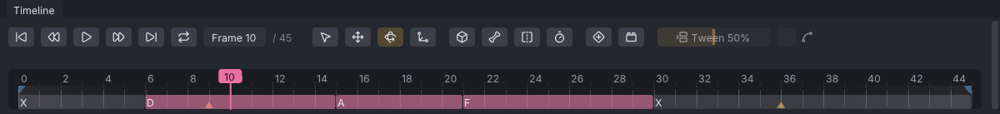

# Lip sync

**Lip sync** keys the jaw and lips to speech. It works out mouth shapes either from the loaded audio or from a
file made by Rhubarb Lip Sync, then keys them onto the face bones as ARKit shapes through the face table, like
the sliders in [[Face animation]]. The shapes show on the timeline, where you can drag them to nudge the timing.

> Related articles: [[Face animation]], [[Audio track]], [[Face tracking]], [[Keys and timeline]]

## Usage

Open **Tools → Face...** and expand **Lip Sync**.

> **Note:** Most mouth shapes in the SL default head's table only move face bones. With **Move face bones** off
> (the Face window's setting), lip sync turns the jaw and nothing else. See [[Face animation#Head and Move face bones]].

### From the audio

1. Load the speech with **File → Load Audio...** (see [[Audio track]]).
2. Set **Frames** to the frames to key. **Timeline Range** takes the range **Shift**+dragged on the timeline.
3. Click **Lip Sync from Audio**. One undo step.

The button is greyed out, with the tooltip "Load an audio file first (File > Load Audio...)", until an audio
file is loaded. The status bar says how many mouth shapes were found, for example "Lip sync from the audio: 9
mouth shapes on frames 0 to 90".

The loudness opens the jaw on every frame, and the vowel picks one of three mouths: **open**, **rounded** or
**wide** (see [[#How the audio is read]]). Silence is **X**, the mouth at rest.

### From Rhubarb Lip Sync

[Rhubarb Lip Sync](https://github.com/DanielSWolf/rhubarb-lip-sync) is a free program (MIT licence) that
recognises the speech and writes a mouth shape for each moment. VATs does not include it: run it yourself, then
import what it writes.

1. Run Rhubarb on the speech, as JSON or TSV:
   ```
   rhubarb -f json -o mouth.json speech.wav
   ```
2. Set **Frames**, then click **Import Rhubarb...** and choose `mouth.json` (or the `.tsv`). One undo step.

Rhubarb's times count from the start of the audio file, so each shape lands where that moment of the audio sits
on the timeline: the audio's **Start (s)** is added when an audio track is loaded. Each shape starts on the frame
nearest its time, and the shape already running at the first frame of **Frames** starts there. When the cues run
past the last frame, the status bar says so; lengthen the animation and import again for the rest.

### Nudging the shapes on the timeline

After a lip sync, the timeline shows a bar for each mouth shape, just under the loop flags, labelled with its
name (or its first letter when the bar is narrow). **X** bars are grey.


*The worked example: D from frame 6, A from 15, F from 21, and rest again from 30.*

- Hover a bar's left edge to see "Mouth shape D from frame 6: drag to nudge".
- Drag the edge left or right. It stays between its neighbours, and the playhead follows it, so in the app a scrub
  snippet of the audio plays where it lands.
- Let go: the lip sync is keyed again with the new timing. One undo step, **Nudge Mouth Shape**.

### Keying again and removing

- Running **Lip Sync from Audio** or **Import Rhubarb...** again first takes the previous lip sync out, then keys
  the new one.
- **Remove Lip Sync** takes the lip sync's moves out of the keys and removes the bars. One undo step.
- The Lip Sync section shows what is keyed, for example "5 mouth shapes on frames 0 to 45".

### What gets keyed

- The face bones that any mouth shape of `lip-shapes.json` moves get a key on every frame of **Frames**: the
  jaw, and with **Move face bones** the lips, the lip corners, the upper cheeks and the tongue. Other bones (eyes,
  lids, brows) keep their keys.
- The mouth is added to what those bones already do, so a smile keyed first stays under the speech.
- The frame just before and just after **Frames** get a key with the value they had, so the motion outside the
  range stays as it was.
- The keys go into the exported `.anim` like any others; the sound does not (see [[Audio track]]).

## Configuration

### Settings

| Setting | Range | Default | Effect |
|---|---|---|---|
| **Frames** | 0 to the last frame | the whole animation | the frames keyed |
| **Quietest** | −12 to −48 dB | −30 dB | sound this far below the loudest 20 ms keeps the mouth shut; the loudest opens it fully |

### Mouth shapes

`data/retarget/lip-shapes.json`, in the program's data folder, maps each mouth shape to ARKit face shapes
(0–1). Edit it to change how wide a shape opens; **Reload** in the Face window reads it again.

| Shape | Mouth | Face shapes |
|---|---|---|
| **X** | rest | none |
| **A** | closed: P, B, M | mouthClose 0.3, mouthPressLeft/Right 0.4 |
| **B** | slightly open, teeth together: K, S, T, EE | jawOpen 0.12, mouthStretchLeft/Right 0.3 |
| **C** | open: EH, AE | jawOpen 0.35, mouthSmileLeft/Right 0.15, mouthLowerDownLeft/Right 0.3 |
| **D** | wide open: AA | jawOpen 0.7, mouthLowerDownLeft/Right 0.4 |
| **E** | slightly rounded: AO, ER | jawOpen 0.3, mouthFunnel 0.4 |
| **F** | puckered: UW, OW, W | jawOpen 0.1, mouthPucker 0.8, mouthFunnel 0.3 |
| **G** | teeth on the lower lip: F, V | jawOpen 0.05, mouthRollLower 0.6, mouthUpperUpLeft/Right 0.2 |
| **H** | tongue up: L | jawOpen 0.3, tongueOut 0.15 |
| **open** | from the audio | jawOpen 0.8 |
| **rounded** | from the audio | jawOpen 0.8, mouthFunnel 0.5, mouthPucker 0.5 |
| **wide** | from the audio | jawOpen 0.8, mouthSmileLeft/Right 0.4, mouthStretchLeft/Right 0.3 |

A–H and X are Preston Blair's mouth shapes, as Rhubarb names them. **open**, **rounded** and **wide** are scaled
by the loudness on each frame, so their jaw follows the sound. A weight may also name one of the head's VRM
presets (`aa`, `ou`, ...), as the sliders do.

## How the audio is read

- **Loudness**: the audio is mixed to mono and cut into 20 ms windows; each window's RMS (root mean square) is
  compared with the loudest window's, in dB. The loudest gives 1, **Quietest** and below give 0, linearly in
  between; a frame under 0.05 counts as silent (**X**). Each frame takes the window its time falls in.
- **Vowel**: on a frame with sound, a 30 ms piece around it is resampled to about 10 kHz, and a linear
  prediction (LPC) fit by the Levinson–Durbin recursion (Rabiner and Schafer, *Digital Processing of Speech
  Signals*, 1978) gives the shape of its spectrum. Its first two peaks are the formants F1 and F2:
  - F2 of 1600 Hz or more: **wide** (as in "ee": 270 / 2290 Hz),
  - otherwise F1 of 600 Hz or more: **open** (as in "ah": 730 / 1090 Hz),
  - otherwise **rounded** (as in "oo": 300 / 870 Hz).
- A vowel that lasts a single frame is taken as noise and keeps the one before.

The limits are set for adult speech. Children's voices, and many women's, have higher formants, so an "oh" can
read as **open** and an "ah" as **wide**; Rhubarb does better on those.

## Worked example

[Open the example](example:lip-sync.vat): 45 frames at 30 fps with a short word imported from Rhubarb Lip Sync
(X, then D at 0.2 s, A at 0.5 s, F at 0.7 s, X at 1.0 s), keyed on the SL default head without **Move face
bones**, so only the jaw moves.

1. Play it: the jaw drops at frame 6, closes at 15, opens a little at 21 and rests from 30.
2. Drag the left edge of the **D** bar from frame 6 to frame 9 and let go. The jaw now opens at frame 9; **Ctrl+Z**
   puts it back.
3. Open **Tools → Face...** and in **Lip Sync** click **Remove Lip Sync**. The jaw stays shut on every frame: the
   keys are as they were before the lip sync.

## Tips and tricks

- Key the expression first (a smile, raised brows), then lip sync over it: the mouth is added to the face.
- Rhubarb recognises closed lips and consonants (A, B, G, H), which the audio analysis cannot; use the audio for
  quick background talk and Rhubarb for close-ups.
- To start a word a little early, as animators often do, drag its shape one or two frames left.

## Troubleshooting

### Only the jaw moves

**Move face bones** is off, and the lip shapes only move bones. Turn it on in the Face window and key again. On a
mesh head with its own face joint positions, see [[Face animation#Head and Move face bones]] first.

### "Load an audio file first"

**Lip Sync from Audio** needs the audio loaded, not only its path in the project. Load it with **File → Load
Audio...**; see [[Audio track#Troubleshooting]] when the project cannot find it.

### "Could not read the Rhubarb file"

The file is not Rhubarb's JSON (with `mouthCues`) or TSV (a time and a shape A–H or X on each line). Export it
again with `-f json` or `-f tsv`.

### The mouth is off after changing the head, the table or the timing

**Remove Lip Sync** and nudging take the moves out with the head and `lip-shapes.json` as they are now, and at the
frames they were keyed on. After changing the head, editing the table, or inserting or removing frames with
[[Time editing]], undo back or remove the lip sync before the change, or key it again over the whole range.

## App and viewer

Both work the same way. In the viewer, the audio track plays through the viewer's sound (see [[Audio track]]).

## See also

- [[Face animation]]
- [[Audio track]]
- [[Project file format#lip_sync]]

Category: Animating
