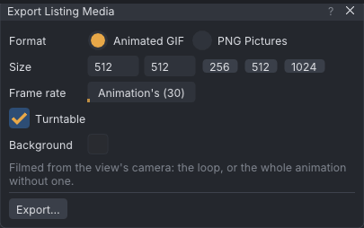

# Listing media

**File → Export Listing Media...** films the animation for a Marketplace listing or a preview: an animated GIF
that loops, or numbered PNG pictures to finish in your own editor. The camera can turn once round the avatar
while it plays.

> Related articles: [[Export to Second Life]], [[Reference images]], [[Command line]]

## Usage

### Exporting

1. Frame the avatar in the view: the export films from the view's camera, at the size you choose.
2. **File → Export Listing Media...** opens the **Export Listing Media** window. Pick the settings below.
3. **Export...** asks where to save. The status bar then says what it wrote, for example "Wrote dance_listing.gif
   (30 frames at 512 x 512)".

The window does not answer until every frame is rendered and written. Afterwards the view, the playhead and the
camera are as they were.

### Settings

| Setting | What it does |
|---|---|
| **Format** | **Animated GIF**, or **PNG Pictures**: `name_0001.png`, `name_0002.png`, ... beside the name you save as, on a clear (transparent) background |
| **Size** | Width and height in pixels, 16 to 2048; **256**, **512** and **1024** set a square. 512 x 512 at first |
| **Frame rate** | Pictures a second; at 0 (the first setting) it reads **Animation's (30)** and uses the animation's own. A GIF plays at most 50, and each frame's delay is rounded to hundredths of a second so the total stays on time |
| **Turntable** | The camera goes once round the view's target over the whole export, so a looping GIF turns without a jump. On at first |
| **Background** | The GIF's background colour (a GIF has no soft transparency) |

The export covers the loop (from **Loop in** to **Loop out**, leaving out the last frame, which is the first
again) or, without a loop, the whole animation to its last frame, at most 1200 pictures. It films the avatar
(or the mesh body), the other actors and the props, lit by the studio light; the ground, the bones, the
[[Reference images|reference image]] and the **Light** menu's presets are left out.

### The GIF

Each frame has its own palette of up to 256 colours, chosen from that frame's pixels, without dithering. Smooth
shading can show bands; a background close to the avatar's colours keeps the palette for the avatar. The GIF
loops forever.

### From the command line

`vats walk.vat --listing walk.gif --screenshot shot.png` writes the GIF with the first settings above and
quits; see [[Command line]].

## Troubleshooting

### "Nothing to film"

The body is **Skeleton Only**. Pick a body in **View → Body** first.

### "Could not write ..."

The folder does not exist or cannot be written. Save somewhere else.

> **Note:** Listing media is in the app only. In the [[VATs Editor (viewer)|VATs Editor]] use the viewer's own
> snapshot tools.

Category: Import and export
