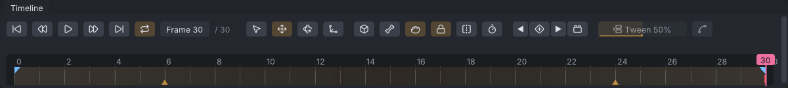
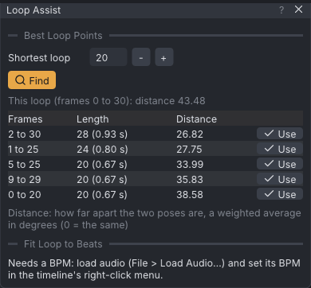
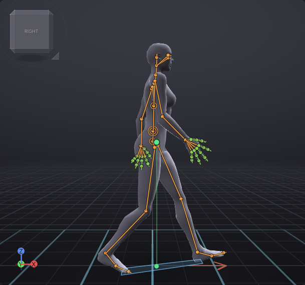

# Loop tools

The loop tools fix the usual problems of looping animations: a pop where the loop wraps round, a walk that travels forward when it should walk in place, and a cycle that starts on the wrong pose. They also find where a take loops best, fit a loop to the music's beats, and show a walk on a treadmill at Second Life's speeds. They are in **Tools → Loop Tools** (the treadmill in **View → Treadmill**) and work on the loop range, or on the whole animation when **Loop** is off.

> Related articles: [[Keys and timeline]], [[Graph editor]], [[Audio track]], [[Retargeting]], [[Motion capture]]

## Usage

The top line of **Tools → Loop Tools** shows the range the tools will work on, for example "Frames 0 to 30 (loop)" or "Frames 0 to 30 (whole clip)". Each command is one undo step.

### Finding a seam

With **Loop** on, a red tick on the timeline at **Loop out** means some channels jump where the loop wraps round (more than 0.5° for a rotation, or 1 mm for a position). Hover the tick for the list: up to 8 channels with the size of the jump, "and N more" past that, and "Tools > Loop Tools > Make Loop Seamless fixes them".

*The red tick at frame 30: this loop pops when it wraps round.*

### Making a loop seamless

Choose **Tools → Loop Tools → Make Loop Seamless**. Every channel is made to end exactly where it starts (a rotation may end a whole number of turns away), with the same slope at both ends, so the loop has no pop and no kink. The status bar says "Loop made seamless on N channels", or "The loop was already seamless".

**Blend** (0–15 frames) sets how the correction is made:

- **end key only** (0): only the value at **Loop out** changes.
- 1–15 frames: the last frames ease into the start pose, so the correction is spread out instead of bending the curve sharply at the end.

### Walking in place

**Tools → Loop Tools → Remove Hip Travel (In Place)** takes the forward and sideways travel out of the hips over the loop while keeping their sway and height. The status bar reports what it removed, for example "Removed hip travel: 1.20 m/s forward, 0.02 m/s sideways (1.20 m/s)". That speed is the one an AO's walk should match.

**Add Travel Forward** does the reverse: set the speed in the field beside it (−5 to 5 m/s, 1.00 by default) and press the button to make the hips move forward at that speed.

### Starting the cycle on another pose

Scrub to the frame that should begin the loop, for example a contact pose, then choose **Tools → Loop Tools → Start Cycle at Frame N**. The loop is turned in time so it starts on that pose; the motion itself doesn't change. It is greyed out unless the current frame is inside the loop, not on its first or last frame.

### Finding the best loop points

**Tools → Loop Tools → Find Best Loop Points...** opens the **Loop Assist** window. Set **Shortest loop** (20 by default) and press **Find**. VATs compares the pose at every frame with the pose at every frame at least that far later: each joint's rotation and how fast it is turning, with the hips and legs counting most and the fingers and face least. The best pairs are listed, up to 8:

| Column | What it shows |
|---|---|
| **Frames** | Loop in and loop out, for example "4 to 34" |
| **Length** | Frames and seconds, for example "30 (1.00 s)" |
| **Distance** | How far apart the two poses are, a weighted average in degrees; 0 means the same pose |

*The loop walk's best loop points. Its own loop, 0 to 30, is not listed: frame 30 is deliberately off (see the
worked example below), so 2 to 30 matches better.*

With **Loop** on, the window also scores the loop you have. When it already joins as well as any candidate, or
within half a degree, it says so in green above the list, `This loop (frames 0 to 120) already joins cleanly`, and
the status bar says `This loop already joins cleanly`: there is nothing to fix, and a candidate is only for looping
a different part. Otherwise a grey line gives its distance, to compare with the list.

Press **Use** on a row: **Loop** turns on with those loop points, and VATs asks whether to make the loop seamless as well (**Make Seamless** or **Not Now**). Each is one undo step. The list is from the last **Find**; press it again after editing.

### Fitting a loop to the beat

With an [[Audio track]] that has a **BPM**, **Tools → Loop Tools → Fit Loop to Beats...** opens the same window at **Fit Loop to Beats**. Set **Beats** (8 by default). The window shows the length that number of beats needs, for example "4 beats at 100.0 BPM: 2.400 s, 72 frames at 30 fps", and the loop's length now.

A loop has a whole number of frames, so it can end slightly off the beat. The window says by how much: "Each loop ends 16.7 ms after the beat: a whole frame off after 2 loops" (128 BPM, 8 beats, 30 fps), or "At 120 frames every loop ends on the beat". It also names a frame rate from 10 to 60 fps at which every beat falls on a whole frame, for example "At 32 fps every beat falls on a whole frame" for 128 BPM; change it under **Properties → Animation → Frame rate**.

**Stretch to N Frames** stretches or squashes the keys of the loop to that length; later keys move with its end. It is greyed out when the loop already has that length. Without a BPM the window says so; set it in the timeline's right-click menu (see [[Audio track#Audio settings]]).

### Loop-aware tangents

**Tools → Loop Tools → Loop-Aware Tangents** (a check mark) makes the keys at **Loop in** and **Loop out** take their slope across the seam, as if the loop went on: the key before **Loop out** counts as the key before **Loop in**, and the key after **Loop in** as the key after **Loop out**. The loop then plays through the seam without a kink. It applies to keys with **Auto**, **Spline** or **Plateau** tangents, on curves keyed at both loop points with a key between them, while **Loop** is on. A rotation that ends a whole turn from where it starts carries on turning across the seam.

While it is on, the [[Graph editor]] draws each curve's loop repeated faintly before **Loop in** and after **Loop out**.

It is saved with the project: on for new projects and imported animations, off for projects saved before it existed. Turning it on or off is one undo step.

### Walking on a treadmill

**View → Treadmill → Show Treadmill** draws blue lines on the ground around the avatar that scroll backwards at the chosen speed while the animation plays or you scrub, like a treadmill under a walk that stays in place. Choose the speed in the same menu:

*The loop walk on the treadmill, from the right.*

| Speed | m/s |
|---|---|
| **SL Walk** | 3.20 |
| **SL Run** | 5.13 |
| **SL Crouch Walk** | 2.00 |
| **SL Fly** | 16.00 |
| **Custom** | 0.1–30 (the **Custom speed** slider under it), 1.50 by default |

These are Second Life's default speeds on level ground, from [Second Life Wiki: Default Avatar Movement Speeds](https://wiki.secondlife.com/wiki/Default_Avatar_Movement_Speeds). The speed and the treadmill are not saved.

Second Life moves an avatar much faster than people walk: its 3.20 m/s walk is more than twice a real walk's
1.4 m/s. A walk whose feet should keep pace with the ground there needs a longer, quicker stride than real life
(the loop walk example takes 1.6 m strides, two a second).

Under **The cycle**, the menu measures the walk from its soles, eight times a frame (a foot is down while the lowest of its heel, ball and toe tip is within 3 cm of the ground):

- **Stride**: how far the body moves in one cycle, in metres.
- **Cycle**: the loop's length divided by the number of steps one foot takes in it, in seconds.
- **Implied speed**: how fast the body moves over the part of the sole that is on the floor (heel, ball or toe tip, within 1.5 cm of it), the middle value over the time it is down, and what share of the treadmill's speed that is. Touch-down and lift-off are found between frames, so the reading does not jump when a stretch moves them. At 100% the feet stay on the treadmill's lines.

"No foot contacts found" means neither foot comes to rest near the ground.

**Match Cycle to Speed**:

- **Stretch Time** stretches or squashes the loop so its implied speed is the treadmill's. The stride stays; the steps get faster or slower. The loop is a whole number of frames, so it lands on the nearest one: within about 1% of the speed when that length fits, otherwise up to half a frame off (about 3% on a 16-frame loop). The status bar says the speed it landed on. The item names the new length before you click it, for example **Stretch Time: 24 to 18 frames**; it is one undo step. Keys land between whole frames, and stay there whatever **Snap frames** says: Second Life plays the curves at whole frames, so the motion is as stretched, while rounding the keys would move the foot contacts and miss the speed by up to 18% on the wiki's walks and run.
- **Scale Hip Travel** is for a walk whose hips move forward: it makes them travel at the treadmill's speed. The timing stays, so planted feet slide by the difference; **Tools → Clean Up Foot Sliding...** plants them again. It is greyed out when the hips do not travel.

Each is one undo step.

> **Note:** In the viewer the treadmill's lines are drawn in the world, on the ground under your avatar, on your screen only.

### Testing as your walk (viewer)

In the [[VATs Editor (viewer)]], **Tools → Loop Tools → Test as My Walk** (or **Test as My Run**) lets you walk
your avatar for real with the animation as its walk. The app has no such command.

- The editor lets your avatar go: it stands up if the editor sat it down, and your usual movement keys (**W**,
  **A**, **S**, **D**, the arrows, **Page Up**, **Page Down**, **E**, **C**, **F** and **Space**, without **Ctrl**
  or **Alt**) walk it. The camera follows you again. Other keys stay the editor's.
- Whenever the region walks you (or runs you), your animation plays as that walk on your screen, from its first
  frame, at its own priorities on the joints it keys, as [[VATs Editor (viewer)]] shows it.
  Neither the default walk nor your AO's walk starts meanwhile. Standing, your AO's or the default stand plays.
- Other residents see your ordinary walk: nothing new is sent to the region, and your AO asks for no walk of its
  own while the test runs.
- With a mesh body swapped in under **View → Body**, the body walks in your avatar's place, posed by your walk
  and your stand, unless **View → Body → Keep in Real-Avatar Modes** is off (see
  [[VATs Editor (viewer)]]).

The **Test as My Walk** window shows:

| Line | Meaning |
|---|---|
| **Walking** / **Standing** | whether your animation plays now |
| **Ground speed** | how fast your avatar moves over the ground, m/s, averaged while you walk |
| **Stride**, **cycle** | the cycle as the treadmill measures it, and the speed it walks at |
| **Suggested rate** | ground speed / the cycle's speed: at 1.00x the feet keep pace; above, they slide backwards; below, forwards |

**Match Cycle to This Speed** stretches or squashes the loop so the cycle walks at the ground speed you walked
at, as **Stretch Time** does for the treadmill; one undo step. **Stop** (or the window's close button, or the menu
item again) ends the test: the editor holds your avatar again, sat down where it stands, and every other motion
stops.

## Worked example: a walk made seamless and in place

[Open the example](example:loop-walk.vat): one second of walking at 30 fps with **Loop** on from frame 0 to 30: two strides at Second Life's walking speed, 3.2 m/s, the left heel striking at frames 0, 15 and 30. The hips travel 3.2 m forward, and frame 30 does not quite match frame 0 on the legs.

1. Hover the red tick at frame 30 on the timeline. The tooltip lists four channels: `mHipLeft rot_y (+5)`, `mHipRight rot_y (-5)`, `mKneeLeft rot_y (+5)` and `mPelvis pos_x (+3.2)`. The last one is the travel: the hips end 3.2 m from where they start.
2. Choose **Tools → Loop Tools → Remove Hip Travel (In Place)**. The status bar says "Removed hip travel: 3.20 m/s forward, 0.00 m/s sideways (3.20 m/s)". Select **mPelvis** and open the [[Graph editor]]: **Translate X** is now flat at 0 while **Translate Y** keeps its sway. Hover the tick again: only the three rotation channels are left.
3. Leave **Blend** at **end key only** and choose **Tools → Loop Tools → Make Loop Seamless**. The status bar says "Loop made seamless on 3 channels" and the red tick is gone.
4. Play. The avatar walks on the spot, and the loop wraps at frame 30 without a pop. Select **mHipLeft**: in the graph, **Rotate Y** reads −24° at frame 0 and −24° at frame 30, where it was −19°.

The walk now plays in place at Second Life's walking speed: tick **View → Treadmill → Show Treadmill** with **SL Walk**, play, and the planted feet move back with the lines. **The cycle** reads a stride of about 1.6 m in 0.50 s, at about 102% of the treadmill's speed.

## Tips and tricks

- On walks and runs, run **Remove Hip Travel** first and **Make Loop Seamless** after it.
- Run **Make Loop Seamless** before **Start Cycle at Frame N**: on a loop that isn't seamless, the old seam moves into the middle of the cycle.
- On motion capture and retargeted clips, which have a key on every frame, a **Blend** of several frames spreads the correction instead of bending only the last frame.
- After fixing a seam, check the curves at **Loop in** and **Loop out** in the [[Graph editor]]; the ends should meet with the same slope.
- To mark which part of the clip loops, drag the loop flags on the timeline; see [[Keys and timeline#Looping]].
- On a motion capture take, **Find Best Loop Points**, **Use**, then **Make Seamless** gives a first loop in three clicks.
- For a dance, fit the loop to 4, 8 or 16 beats, and pick the frame rate the window suggests before stretching, so the loop never drifts off the music.

## Troubleshooting

### The red seam tick stays after Make Loop Seamless

A key at **Loop in** or **Loop out** was changed after the fix, or the loop flags were moved. Hover the tick to see which channels jump, and run **Make Loop Seamless** again.

### Remove Hip Travel reports 0 m/s

The hips have no position keys, or they end where they start. The walk already stays in place.

### The treadmill's lines slide under the feet

The cycle's implied speed is not the treadmill's: compare them under **The cycle** in **View → Treadmill**, then use **Stretch Time**, or pick a closer speed.

### Start Cycle at Frame N is greyed out

The current frame is outside the loop, or on its first or last frame. Scrub to a frame inside the loop.

## See also

- [[Keys and timeline]]
- [[Time editing]]
- [[Audio track]]
- [[Onion skin]]

Category: Animating
