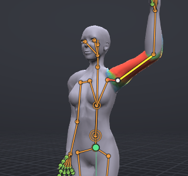

# Mirror, flip and reverse

VATs can copy a pose from one side of the body to the other, swap the two sides, and play a whole animation backwards. Mirroring and flipping work on the pose at the current frame; reversing works on the whole animation.

> Related articles: [[Posing]], [[Time editing]], [[Pose library]], [[Export to Second Life]]

## Usage

### Mirroring one side onto the other

- **Edit → Mirror Left to Right** copies the left side's pose onto the right side at the current frame.
- **Edit → Mirror Right to Left** does the opposite.

Both key the mirrored bones at the current frame, including IK targets and poles of mirrored limbs. Only bones that are animated on one side or the other are touched. The status bar confirms, for example "Mirror Left to Right at frame 12".

### Flipping the pose

**Edit → Flip Pose** swaps the two sides at the current frame: the left arm takes the right arm's pose and the other way round, and bones in the middle (spine, neck, head) are mirrored in place, so a head turned left turns right. The key is **Ctrl+Shift+V** in every preset.

### Mirroring selected bones

**Edit → Mirror Bone to Other Side** (**M**) keys the selected bones' mirrored pose onto their partners on the other side, at the current frame. A bone in the middle, such as the head, is mirrored onto itself.

A body part's right-click menu has the same for the whole part: **Mirror Left Arm to Right Arm** and so on.

Position keys are mirrored too where the bone has them, and always for attachment points.

To mirror as you pose, turn on **Mirror** on the timeline bar; see [[Posing#Mirror while posing]].

### Mirroring over time

- **Paste Range Mirrored** pastes a copied frame range with left and right swapped. See [[Time editing]].
- Saved poses and clips can be applied mirrored from the [[Pose library]] (**Apply mirrored**).

### Flipping the whole animation

**Edit → Flip Animation** swaps left and right on every key of the animation, as **Flip Pose** does on one frame:
animate a wave with the right hand, flip it, and the left hand waves. Pins, IK and per-bone priorities change sides
with their bones. It is one undo step; the status bar says "Flipped the whole animation: left and right swapped on
every key". To keep both versions, flip only the export instead (**Export mirrored**, see the tips below).

### Reversing the animation

**Edit → Reverse Animation** makes the whole animation play backwards: every key moves to the mirror frame (frame *f* becomes *last frame − f*), the handles and tangents are reversed with it, and the loop points and pins are flipped in time. The status bar says "The animation now plays backwards".

To reverse just some keys, select them in the [[Graph editor]] and choose **More → Flip Time**.

### Worked example: mirroring a raised arm

[Open the example](example:mirror-arm.vat): at frame 0 the left arm is raised and flexed, **mShoulderLeft** at **Rotation** `35.0°`, `0.0°`, `0.0°` and **mElbowLeft** at `60.0°`, `0.0°`, `0.0°`. The right arm hangs in the Relaxed Stand pose.

*Frame 0 of the example, before mirroring.*

1. Choose **Edit → Mirror Left to Right**. The status bar says "Mirror Left to Right at frame 0" and both arms are now raised.
2. Click **mShoulderRight** in the **Bones** tab: **Rotation** reads `-35.0°`, `0.0°`, `0.0°`. Click **mElbowRight**: `-60.0°`, `0.0°`, `0.0°`. Under the mirror, the X and Z angles change sign and Y keeps it.
3. **Edit → Undo**, then **Edit → Flip Pose**: now the right arm is raised and the left hangs. Undo again to get back to the start.

## Tips and tricks

- To make a left-handed and a right-handed version of one animation, you don't need two projects: tick **Also export the other side (mirrored)** under **Also Write** in the export settings, or **Export mirrored (left and right swapped)** to export only the swapped version. See [[Export to Second Life]].
- Pose one side of a symmetrical pose, then **Mirror Left to Right** instead of posing both sides.
- A walk's second step is the first step flipped: key the first contact pose, go half a cycle later, paste the pose and **Flip Pose**.
- Every command here is one undo step.

## Troubleshooting

### Mirror left to right left some bones unchanged

Mirroring only touches bones that are animated on at least one side. Key the bone first (**S**), then mirror.

### A reversed animation has keys missing past the end

Keys beyond the last frame have no place in the reversed timeline, so VATs cuts the curves at the last frame before reversing. Set **Last frame** to cover every key before you reverse.

## See also

- [[Posing]]
- [[Time editing]]
- [[Export to Second Life]]

Category: Animating
