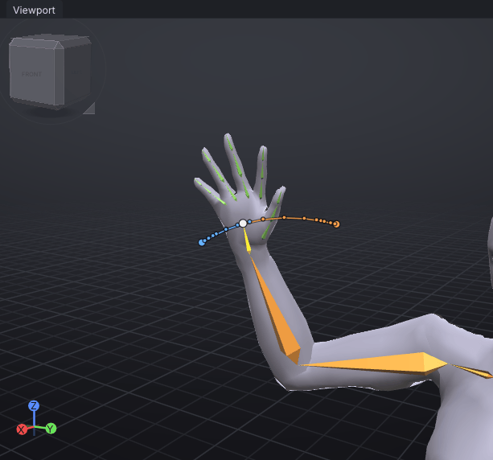

# Motion paths

A motion path draws the line a bone's tip travels through the frames around the current frame, with a dot
per frame, so you can see arcs and spacing at a glance. The part of the path before the current frame is
cool (blue) and the part after it warm (orange), like the [[Onion skin]] ghosts.

> Related articles: [[Onion skin]], [[Keys and timeline]], [[IK]], [[Dope sheet]]

## Usage

### Showing a path

Select one or more bones, then tick **View → Motion Path → Show Motion Path**. Each selected bone gets a
path through the position of its tip (the end of the bone as the view draws it) at every whole frame. A
selected [[IK]] target gets the path of its limb's end bone: the wrist, the ankle, the fingertip.

*The [[First steps]] wave at frame 14 with **mWristRight** selected: frames 4 to 24.*

- Small dots are frames; bigger dots are keyed frames. A frame counts as keyed when it holds a key on the
  bone, on a bone above it (whose keys move it too), on their pins, or on an IK control that ends on or
  above it.
- The white dot is the current frame.
- The path is the full pose, with IK and pins, so what it shows is where the tip really goes.

The path follows edits at once: move a key in the [[Graph editor]], the [[Dope sheet]] or the timeline and
the path changes with it. It also follows the playhead while the animation plays.

### Worked example: the arc of a wave

[Open the example](example:first-wave.vat), select **mWristRight** and tick **View → Motion Path → Show
Motion Path**.

1. Type `14` in the **Frame** box. The path runs from frame 4 (blue end) to frame 24 (orange end) through
   the white dot at 14.
2. Tick **Frame Numbers**. The keyed frames on the path get their numbers.
3. Tick **Whole Clip**. The path covers frames 0 to 30; **Before** and **After** grey out.

### Moving an IK target from its path

When a keyed dot belongs to the end bone of a limb that is in IK at that frame, hovering it says **Drag:
move the Left Arm IK target at frame N**. Drag the dot to move the limb's IK target at that frame, in the
plane facing the camera; the limb follows and the path redraws. Releasing is one undo step (**Move Motion
Path Key**); **Esc** during the drag puts it back. Pins are not moved this way; move them in the
[[Graph editor#Pins in the graph|graph]].

## Configuration

All settings are in **View → Motion Path**:

| Setting | Values | Default | What it does |
|---|---|---|---|
| **Show Motion Path** | on / off | off | Draws the paths of the selected bones |
| **Whole Clip** | on / off | off | Covers every frame from 0 to the last frame |
| **Before** | 1–60 frames | 10 | Frames before the current frame; greyed out with **Whole Clip** |
| **After** | 1–60 frames | 10 | Frames after the current frame; greyed out with **Whole Clip** |
| **Frame Numbers** | on / off | off | Numbers the keyed frames along the path |

The path stops at frame 0 and at the last frame. The settings last until VATs quits; they are not saved
with the project.

## Troubleshooting

### No path appears

Check that **Show Motion Path** is ticked and that a bone or an IK target is selected. A bone that doesn't
move over the frames shown draws all its dots in one place.

### A keyed dot can't be dragged

Only keyed dots on a limb's end bone, at frames where that limb is in IK, can be dragged. Switch the limb
to IK first (**K** in the Industry preset), or move the bone with the gizmo.

## App and viewer

The path is drawn through the view's projection, so the [[VATs Editor (viewer)]] draws it over the world
the same way, and dragging a dot works there too.

## See also

- [[Onion skin]]
- [[Dope sheet]]

Category: Animating
