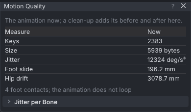

# Motion quality

**Tools → Motion Quality...** puts numbers on how clean an animation is: how much it shakes, how far
planted feet slide, how far the hips drift per loop, how big the pop at the loop seam is, and how many keys
and bytes it takes. After a clean-up tool it shows the numbers before and after that step, so you can see
what the tool did.

> Related articles: [[Graph editor]], [[Motion capture]], [[Loop tools]], [[Retargeting]], [[Export to Second Life]]

## Usage

### Reading the numbers

Open the window with **Tools → Motion Quality...**. With no clean-up step in the undo history it shows
the animation as it is now, in a **Now** column.

*The retarget-walk example: a walk that travels forward, so its hips drift 3 m.*

| Measure | Unit | What it is | Tool that lowers it |
|---|---|---|---|
| **Keys** | keys | every key of every curve in the animation | **Edit → Simplify Curves...** ([[Graph editor#Simplifying curves]]) |
| **Size** | bytes | the size of the `.anim` export writes, with the project's export settings (**Reduce keys**, bake shape) | **Fit to 250 KB** ([[Export to Second Life#Check the upload size]]) |
| **Jitter** | deg/s³ | the RMS over the bones of each bone's shake: the jerk (third difference) of its three rotation curves together, frame 0 to the last frame | **Filter Curves...** ([[Graph editor#Filtering curves]]) |
| **Foot slide** | mm | how far the ankles move along the ground while a foot is planted, summed over every foot contact | **Tools → Clean Up Foot Sliding** ([[Retargeting#Clean up foot sliding]]) |
| **Hip drift** | mm | how far `mPelvis` travels along the ground (X and Y) from loop in to loop out, or over the whole animation when **Loop** is off | **Remove Hip Travel (In Place)** ([[Loop tools]]) |
| **Seam jump** | deg | the largest rotation jump from loop out back to loop in; a whole turn is no jump | **Make Loop Seamless** ([[Loop tools]]) |
| **Seam jump (position)** | mm | the largest position jump there, the hips' travel included | **Make Loop Seamless**, **Remove Hip Travel (In Place)** |

The seam rows are shown only when the animation loops. Foot contacts are found as **Clean Up Foot
Sliding** finds them with its defaults: an ankle within 5 cm of its lowest point and moving slower than
0.3 m/s for at least 3 frames. The line under the table gives how many it found.

**Jitter per Bone** opens a table of each bone's jitter, in deg/s³, for bones with rotation curves.

### Before and after a clean-up

After one of these steps, the window shows **Before**, **After** and **Change** (in per cent) for it, and
names the step:

- **Tools → Clean Up Foot Sliding**
- **Bake** or **Re-bake** in [[Dynamics]], [[Idle layer]], [[Ragdoll]] and [[Face animation]]
- **Filter Curves...** and **Simplify Curves...**
- **Fit Loop to Beats** and **Fit to 250 KB**
- **Make Loop Seamless** and **Remove Hip Travel (In Place)**

The before and after come from the undo history: the window shows the latest of these steps that
**Undo** would take back, even after other edits. Undo that step and the window shows the one before it,
or the animation now when there is none. **New** and **Open** clear the history, and with it the
comparison. In a couple or group scene, only the active actor's steps count.

> **Note:** Measuring exports the animation and evaluates every frame. With no step to compare, the window
> measures again after each edit, which can take a moment on long takes; close the window when you don't
> need it.

## Tips and tricks

- A typical clean-up of a capture: **Filter Curves...** (Jitter falls), **Clean Up Foot Sliding** (Foot
  slide falls), then **Simplify Curves...** (Keys fall). Check each change here before the next step.
- A **Change** that rises is worth a look: a bake adds keys, and filtering a planted foot can make it
  slide again.

## See also

- [[Graph editor]]
- [[Motion capture]]
- [[Loop tools]]
- [[Animation Check]]

Category: Motion
