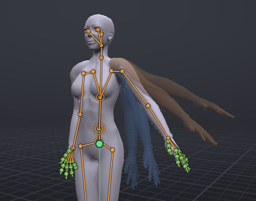

# Onion skin

Onion skinning draws faint ghosts of the pose a few frames before and after the current frame, so you can judge arcs and spacing without scrubbing back and forth. Earlier ghosts are cool (blue) and later ones warm (orange); nearer ghosts are stronger.

> Related articles: [[Keys and timeline]], [[Graph editor]], [[Posing]], [[Target ghost]]

## Usage

### Showing ghosts

Tick **View → Onion Skin → Show Ghosts**. The ghosts appear around the body at the current frame and follow the playhead as you scrub.

Ghosts are see-through and can't be clicked, so they never get in the way of selecting bones. They hide while the animation plays.

*Frame 6 of a 12-frame arm swing with two ghosts each side, every 2 frames: blue for frames 2 and 4, orange for 8 and 10.*

### Worked example: reading an arm swing

[Open the example](example:onion-arm-swing.vat): the left arm swings out and up over 12 frames, keyed at 0 and 12. **Show Ghosts** is on, with **Before** 2, **After** 2 and **Every** 2, saved in the project.

1. Type `6` in the **Frame** box. Two blue ghosts trail the arm (frames 2 and 4) and two orange ones lead it (8 and 10); the nearer pair is stronger.
2. Tick **View → Onion Skin → Keyed Frames Only**. Only two ghosts remain, at the keys: the arm down at frame 0 and up at frame 12. **Every** greys out.
3. Set **View → Onion Skin → Before** to 0. The blue ghost goes; the orange one at frame 12 stays.
4. Go to frame 12: no ghosts at all, since there is nothing after the last frame and **Before** is 0.

### Pinned ghosts

A pinned ghost stays in the view, in violet, until you remove it: a pose to come back to, or a target to
match. The **Pinned Ghosts** part of **View → Onion Skin** has:

- **Pin Ghost at This Frame**: the pose at the current frame, listed as `Frame 12`.
- **Ghost Other Actor at Frame** (with two or more actors): another actor's pose at the current frame, at its
  place, listed as `Bob, frame 12`. See [[Couples and groups]].
- The pinned ghosts, each with a remove button, and **Remove All Pinned Ghosts** when there are two or more.

**Show as Ghost** on a pose in the [[Pose library]] adds a third kind, listed as `Pose` and its name: your
pose at the current frame with the saved pose put on it, following the playhead.

Pinned ghosts show whether **Show Ghosts** is on or not, and while the animation plays. **Bones Only** applies
to them too. Each is drawn from the animation as it is now, so it follows your edits and undo. They are not
saved with the project and not part of undo: opening or starting another project clears them, and so does
closing the program. A ghost of an actor that has been removed or renamed is not drawn. Another actor's ghost is drawn in the edited actor's body.

### Target ghost

The target ghost is another animation, a project or a `.anim`, drawn in green over your avatar at the same frame:
a pose to match by eye while you drag. The status bar says how far the selected bone is from it. Load one with
**View → Target Ghost → Load Target...**, or with a help page's **Show the target** button. Unlike the onion
ghosts it plays along while the animation plays. See [[Target ghost]].

## Configuration

All settings are in **View → Onion Skin**:

| Setting | Values | Default | What it does |
|---|---|---|---|
| **Show Ghosts** | on / off | off | Draws the ghosts |
| **Before** | 0–5 | 2 | Ghosts before the current frame |
| **After** | 0–5 | 2 | Ghosts after the current frame |
| **Keyed Frames Only** | on / off | off | Puts the ghosts on keyed frames instead of evenly spaced frames |
| **Every** | 1–10 frames | 1 | Frames between ghosts; greyed out with **Keyed Frames Only** |
| **Bones Only** | on / off | off | Draws the ghosts as bones instead of the body |

With **Keyed Frames Only**, the ghosts go on the nearest frames that hold a key on any bone. Ghosts stop at frame 0 and at the last frame, except in a looping animation at a frame inside its loop: there they wrap round the loop as it plays, so at the seam you see the frames on both sides of it. Past **Loop out** they go on just after **Loop in**, which has the same pose.

The settings are saved with the project, so each project remembers its own.

## Tips and tricks

- For a walk or run, set **Every** to the number of frames between contact poses to line up the steps.
- **Keyed Frames Only** shows your poses and nothing in between, which suits blocking.
- Turn on **Bones Only** when the ghost bodies overlap too much to read, for example on a pose that hardly moves.
- With **View → Body → Skeleton Only**, the ghosts are always drawn as bones.
- With a mesh body, the ghosts are drawn as that body.

## Troubleshooting

### No ghosts appear

Check that **Show Ghosts** is ticked, that playback is stopped, and that **Before** and **After** are not both 0. At frame 0 there are no earlier ghosts, and at the last frame there are no later ones, unless the animation loops. With **Keyed Frames Only**, an animation with only one key has nothing to show.

### Ghosts look the same as the body

The pose doesn't change around this frame. Raise **Every** to spread the ghosts further apart, or use **Keyed Frames Only**.

## App and viewer

> **Note:** In the viewer the ghosts are bone lines over the world, blue before the current frame and orange
> after, pinned ghosts violet, whatever **Bones only** says. See [[VATs Editor (viewer)]].

## See also

- [[Keys and timeline]]
- [[Target ghost]]
- [[Motion paths]]
- [[Loop tools]]

Category: Animating
