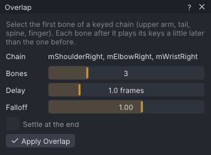

# Overlap

Overlap gives a keyed chain follow-through: each bone after the first plays its own keys a little later
than the bone before it, so an arm, a tail, the spine or a finger moves like a whip instead of all at
once. It edits keys directly, without a simulation; for a simulated swing, use the **Overlap** preset in
[[Dynamics]].

> Related articles: [[Dynamics]], [[Idle layer]], [[Loop tools]], [[IK]]

## Usage

### Applying overlap

1. Open the window with **Tools → Overlap...**.
2. Select the first bone of the chain, for example `mShoulderLeft` for an arm or `mTail1` for a tail.
   The chain runs down the first-child path from it, like a [[Dynamics]] chain; the **Chain** line lists
   its bones.
3. Set **Bones**, **Delay** and **Falloff** (see Configuration below).
4. Press **Apply Overlap**. It is one undo step.

*The waving arm of the [[First steps]] example, ready for overlap down its three bones.*

The first bone of the chain keeps its keys. Bone 2 plays **Delay** frames late, bone 3 twice that, and so
on. A bone with no rotation keys has nothing to delay and is left alone. The delayed bones are sampled on
every frame and baked as linear keys, thinned to within 0.1 degrees, with at most two seconds between
keys. Apply it again to add more delay on top.

### Looping clips

With **Loop** on, frames inside the loop range read their delayed pose round the loop: the start of the
loop shows the end of the loop's motion. Loop-in and loop-out get the same pose, so a seamless loop stays
seamless. Frames before loop-in simply play late.

### Chains with IK

A chain with a bone in a limb that uses [[IK]] is refused, because IK would override the delayed keys.
The window shows which limb, for example `Left Arm uses IK; switch it to FK first`.

## Configuration

| Setting | Range | Default | Effect |
|---|---|---|---|
| **Bones** | 2 to the chain's depth | 3 | how many bones down the chain take part, the selected one included |
| **Delay** | 0.5–3 frames | 1.0 | how many frames later each bone moves than the bone before it; fractions are allowed |
| **Falloff** | 0.25–1.5 | 1.00 | each bone swings this many times as far as the one before, about its average pose; 1 leaves the size alone |
| **Settle at the end** | on or off | off | clips that don't loop: over the last 2 × delay frames each bone eases back to its undelayed pose (with **Falloff** applied), reaching it at the end frame |

**Settle at the end** is disabled with **Loop** on. Without it, a delayed bone at the end frame shows
the pose from **Delay** frames earlier.

## Tips and tricks

- Key the chain as one piece first (every bone moving together), then apply overlap: the delay is what
  turns the stiff swing into follow-through.
- Longer chains want a smaller **Delay**: 1 frame per bone on a 6-bone tail already adds 5 frames at the tip.
- A **Falloff** above 1 makes the tip swing wider than the root, like a whip.

## Troubleshooting

### Apply Overlap is disabled

No bone is selected, the selected bone has no child joint (a chain needs two bones), or a bone of the
chain is in a limb that uses IK. The reason is shown beside the button.

### Nothing changed

The bones after the first have no rotation keys. Overlap only delays keys a bone already has.

## See also

- [[Dynamics]]
- [[Idle layer]]
- [[Loop tools]]

Category: Animating
