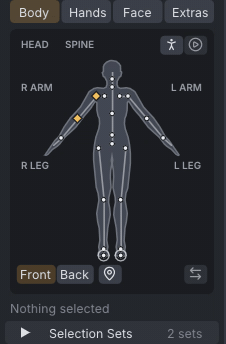
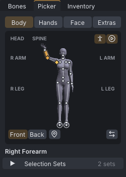
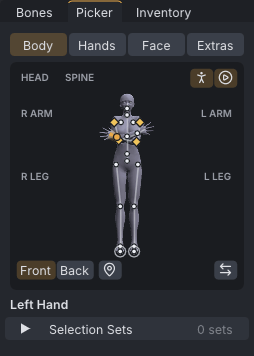
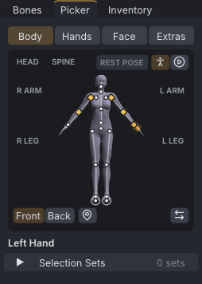
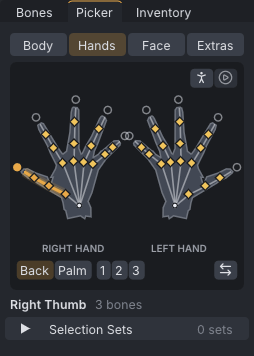
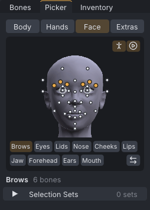
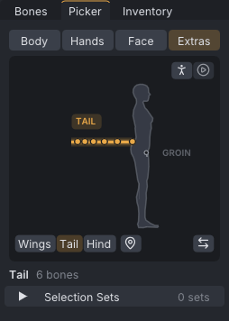

# Picker

The **Picker** tab, beside **Bones**, selects bones by clicking joint dots and bone lines on a chart of the avatar instead of finding their names in a list. Its labels select whole groups (an arm, a leg, a hand, the brows), and selection sets keep groups of bones you select often under a name.

> Related articles: [[Posing]], [[Skeleton]], [[Hand poser]], [[Face animation]]

## Usage

### Pages and views

The buttons at the top choose a page; the buttons in the canvas's bottom-left corner choose its view:

| Page | Views | Shows |
|---|---|---|
| **Body** | **Front**, **Back** | the head, spine, arms (collar to hand) and legs (hip to toes) |
| **Hands** | **Back**, **Palm** | both hands side by side, fingers up: three joints per finger and thumb, and the wrist |
| **Face** | | every face bone, where it meets the face, and a row of feature buttons |
| **Extras** | **Wings**, **Tail**, **Hind** | the wings from behind; the tail and the groin from the avatar's right; the hind limbs from behind its right shoulder |

The avatar faces you: its right side is on your left, as the labels **R ARM** and **L ARM** say. From the **Back** the sides swap. The **Hands** page always shows the right hand on the left, turned fingers up whatever the arm does; **Back** shows the backs of the hands with the thumbs outward, **Palm** the palms with the thumbs inward.

*Frame 24 of the example with **mElbowRight** selected: the forearm in the accent colour, glowing, with a key diamond at each keyed joint.*

The page is framed from your avatar's own joint positions, so a very tall or short shape, a mesh body with its own joint positions, long legs or long arms all fit the canvas with their labels.

### Picking bones

- Each joint has a dot and each bone a line from its joint to the next. **Click** a dot or a line to select that bone; the selection is replaced.
- **Shift+click** adds the bone to the selection, **Ctrl+click** removes it.
- Hover a dot or line to light it white and see its name, for example **Right Shin** over `mKneeRight`.
- Where dots lie on top of one another (crossed arms, the eye and the mesh-head eye, a wing's tip and its fan), a ring marks the spot and the tooltip names the next bone under it. **Click again** on the same spot to select that one; each click takes the next, round to the first.
- A plain click on empty canvas clears the selection.
- **Swap Sides** (the two arrows in the bottom-right corner) selects the same bones on the other side instead.

On the **Face** page a dot sits where its bone meets the face, not at its pivot (the six lip bones all turn around the same point). The lids show just above and below the eye, and the jaw between the lower lip and the chin. The teeth, tongue and **Jaw Shaper** are inside the mouth and have no dot: the **Mouth** button selects them.

### Selecting groups

The labels on the canvas and the buttons under it select a whole group. Hover one to light every bone it selects.

| Where | Click | Selects |
|---|---|---|
| **Body** | **HEAD**, **SPINE**, **R ARM**, **L ARM**, **R LEG**, **L LEG** | the neck and head; the pelvis, torso and chest; collar to hand; hip to toes |
| **Hands** | a circle past a fingertip | that finger's three joints |
| **Hands** | **RIGHT HAND**, **LEFT HAND** | all fifteen finger joints of that hand |
| **Hands** | **1**, **2**, **3** | that joint of every finger on both hands: the knuckles, the middle joints, the fingertip joints |
| **Face** | **Brows**, **Eyes**, **Lids**, **Nose**, **Cheeks**, **Lips**, **Jaw**, **Forehead**, **Ears**, **Mouth** | both sides of that feature |
| **Extras** | **WINGS**, **TAIL**, **GROIN**, **HIND LIMBS** | that group |

A plain click replaces the selection, **Shift+click** adds the group, **Ctrl+click** removes it.

The **Bones** tab's **Show** list has the same for its groups: each row gives the group's number of bones and a select button (the arrow). A group that is hidden is shown first; **Shift** adds, **Ctrl** removes.

### States

The dots and lines show what each bone holds at the current frame:

| Look | Meaning |
|---|---|
| accent colour, glowing | selected; the status line under the canvas names it, or the group when a whole group is selected |
| white | under the pointer, or in the group under the pointer |
| yellow diamond | keyed at this frame |
| dashed accent ring and line | the mirror partner of a selected bone while the timeline's **Mirror** is on: it moves too |
| hollow dot, dashed grey line | hidden in **Bones → Show**; selecting it shows its group |
| light blue | pinned at this frame (see [[Hold and bind]]) |
| violet | its limb is in [[IK]] at this frame |

### The backdrop: silhouette or avatar

The two buttons in the canvas's top-right corner choose what the dots are drawn over. Both are remembered.

- **Silhouette** (the standing figure button off, the default): the outline of the Linden body, traced from its mesh and bent to your avatar's proportions. It always shows the rest pose, with the arms lowered and the hands open, so the dots never pile up.
- **Avatar** (the standing figure button on): your body as the view draws it, mesh bodies included, with the dots on its joints. The picture is redrawn when the pose, the frame or the body changes, at most ten times a second while you drag or scrub; while the animation plays it keeps the last picture and catches up when playback stops.
- **Live pose** (the play button, with the avatar): on, the avatar and its dots follow the current pose; off, they stand in the rest pose and **REST POSE** shows beside the buttons. Turn it off when crossed arms or a sitting pose stack the dots.

*The same frame as above on the avatar: the dots sit on the raised arm.*

*Live pose: with crossed arms the hands and forearms lie over the chest; a second click there takes the bone underneath.*

*Rest pose: every dot apart again.*

The **Hands** and **Face** pages show the avatar close up, cut off at the wrist or the neck.

*The right thumb selected with its fingertip circle filled; the relaxed hand pose keys every finger joint.*

> **Note:** In an SL viewer the avatar backdrop needs the viewer to draw the picker's picture. Until it can, the button is greyed out and the Picker shows the silhouette.

### Attachment points and collision volumes

On the **Body** and **Extras** pages the pin button next to the views opens **Points**: tick **Attachment Points** or **Collision Volumes** to add them to the canvas as small squares (green and violet), each at the bone it hangs from. Click one to select it.

### Selection sets

**Selection Sets** is folded into one line under the canvas, with the number of sets in the project. Click it to open it.

1. Select the bones, in the picker, the view or the **Bones** tab.
2. Type a name in the **Set name** box and press **Save Set**. A set with the same name is replaced.
3. Tick **Also save to the library** first to keep a copy for every project.

Click a set to select its bones; **Shift+click** adds them. Bones the skeleton does not have are skipped. Right-click a set for:

- **Select Mirrored**: its bones on the other side.
- **Add Selected Bones** and **Remove Selected Bones**: change the set to include or leave out the bones selected now.
- **Save to Library**: copy the set to the library.
- **Delete Set**.

Saving, changing and deleting a project's set are each one undo step, and the sets are saved with the project. In a [[Couples and groups|group scene]] each actor has its own sets.

Library sets are listed under **Library** once there is one. Click one to select its bones; right-click for **Select Mirrored**, **Add to Project** and **Delete from Library**. They are kept in `selection_sets.json` beside the pose library, and changes to them are not undone by **Undo**.

[Open the example](example:blocking-arm.vat)

The example has two sets, **Right Arm** and **Head and Neck**.

## Troubleshooting

### The avatar button is greyed out

This program cannot draw the avatar in the Picker (the viewer, until it supports it). The silhouette works the same way.

### The avatar picture lags behind the pose

It is redrawn at most ten times a second, and not while the animation plays. The dots always match the picture shown; stop playback to bring it up to date.

### The dots pile up

A pose that folds the body puts several joints on one spot. Click again on the spot for the bone underneath, turn **Live pose** off, or use the silhouette.

### The Picker tab is missing

The tab opens beside **Bones** the first time. If it was dragged away, drag its title back onto the **Bones** tab. The command line's `--window picker` brings it to the front.

## See also

- [[Posing]]
- [[Skeleton]]

Category: Animating
