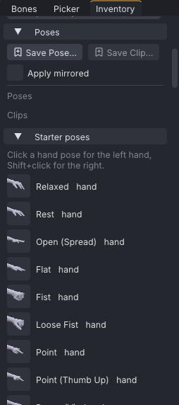
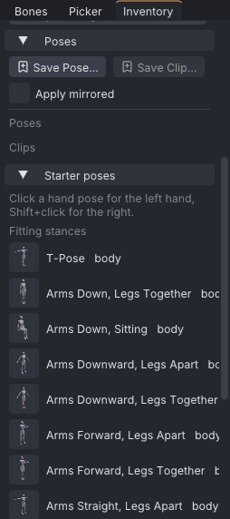

# Pose library

The pose library holds poses and clips you can reuse in any project: your own saved poses and clips, and a set of starter hand and body poses that come with VATs. It lives in the **Poses** and **Starter poses** sections of the **Inventory** tab.

> Related articles: [[Posing]], [[Hand poser]], [[Mirror, flip and reverse]], [[Keys and timeline]], [[Project library]]

## Usage

### Saving a pose

1. Go to the frame with the pose.
2. Select the bones to save, or select nothing to save the whole body.
3. Press **Save Pose...** in the **Poses** section of the **Inventory**, or right-click in the view and choose **Save Pose...**.
4. Type a name and confirm.

A body part's right-click menu also has **Save** *part* **Pose...**, which saves just that part.

**Save Face Pose** in **Tools → Face...** saves the face at the current frame as a pose of the kind `face`,
with the face bones' offsets when **Move face bones** is on (see [[Face animation#Saving a face pose]]).

### Saving a clip

A clip is the keys of some bones over a frame range, for example a head nod or a hand gesture.

1. Select the bones.
2. **Shift+drag** a frame range on the timeline, or select keys in the [[Graph editor]].
3. Press **Save Clip...** in the **Inventory**, or choose **Edit → Save Clip of Selected Bones...**.

**Save Clip...** is greyed out until both are done; its tooltip reads "Select bones, then Shift-drag a frame range on the timeline or select keys in the graph". A body part's right-click menu offers **Save** *part* **Clip** for the picked range.

### Using saved poses and clips

Your items are listed under **Poses** and **Clips**, with a thumbnail where one exists or an icon for the kind; clips carry a small play mark.

- **Double-click** an item to apply a pose, or paste a clip, at the current frame.
- **Drag** an item onto the view to do the same.
- Tick **Apply mirrored** to apply or paste onto the other side (left and right swapped) when you double-click or drag.
- **Right-click** an item for **Apply at This Frame** (or **Paste at This Frame**), **Apply Mirrored** (or **Paste Mirrored**), **Rename...** and **Delete**. A clip also has **Paste, Matching Poses...**, which joins it onto the end of the animation where the poses match (see [[Project library#Inserting with matched poses]]); a pose has **Show as Ghost**.

Applying or pasting is one undo step. If some of a clip's bones don't fit, a **Clip pasted** message lists what was left out.

### Blending a pose after applying it

After a pose goes on (a saved pose, a starter hand or body pose, **Paste Pose** or **Paste onto** a body part), a **Blend** slider appears on the timeline bar for 5 seconds, longer while the pointer is on it. It mixes the applied pose with the pose that was there before, at the frame it was applied to: **0%** is the pose before, **100%** the pose as applied, and up to **150%** pushes past it. Rotations blend along the shortest arc, positions in a straight line, the same as [[Keys and timeline#Tweening between keys|Tween]].

Each drag of the slider is one undo step, **Blend Pose**, after the one that applied the pose. Undo, redo or switching actor removes the slider; after any other edit, touching it removes it instead of blending. Pasting a clip has no **Blend**.

### Showing a pose as a ghost

**Show as Ghost** on a pose's right-click menu (yours or a starter pose) draws the pose in place as a violet
ghost: your pose at the current frame with the saved pose put on it, so a hand pose shows on the body as it
is. It follows the playhead, and nothing is keyed. Use it as a target to pose towards. It is one of the
[[Onion skin#Pinned ghosts|pinned ghosts]], removed from **View → Onion Skin**.

### Making a transition

**Tools → Make Transition...** writes the frames between two poses: from a frame or a saved pose, to a frame.

| Field | What it does |
|---|---|
| **From** | **Frame** and a frame number, or **Library pose** and a pose (your poses, then the starter body poses) |
| **To frame** | The pose the transition ends on; set to the current frame when the window opens from the menu |
| **Frames** | How many frames the transition takes; it ends on **To frame**. **Span From to To** sets it to the gap between the two frames |
| **Ease** | Linear, Quad, Cubic or Sine (default), In-Out |

The window says which frames it writes (`Writes frames 10 to 20, every frame keyed.`). **Make Transition**
removes the keys strictly inside those frames and keys every frame, every track the animation has, turning
along the shortest arc from the start pose to the end pose; positions move in a straight line. A saved pose
goes on at the first frame; a bone only the pose names turns back to rest by **To frame**. IK/FK switches are
left alone. It is one undo step.

> **Note:** Second Life blends whole animations itself, through each one's **Ease in** and **Ease out**. This
> tool builds the frames inside one file.

### Starter poses

The **Starter poses** section lists the poses that ship with VATs, each marked **hand** or **body**.

*The **Poses** and **Starter poses** sections of the **Inventory** tab.*

| Kind | Poses |
|---|---|
| Hand | Relaxed, Rest, Open (Spread), Flat, Fist, Loose Fist, Point, Point (Thumb Up), Peace (V), Thumbs Up, OK, Pinch, Pinch (Loose), Grip (Cylinder), Hold Glass (Stem), Hold Phone, Cup (C-Shape), Claw, Rock (Horns), Call Me, Pistol (Finger Gun), Salute, Wave, Typing, Resting on Surface, Holding Pen, Counting 1 to Counting 5 |
| Body | Relaxed Stand, Hands on Hips, Arms Crossed, Thinking, Waving, Sitting, Contrapposto |
| Body, under **Fitting stances** | T-Pose; Arms Down, Legs Together; Arms Down, Sitting; Arms Downward, Legs Apart; Arms Downward, Legs Together; Arms Forward, Legs Apart; Arms Forward, Legs Together; Arms Straight, Legs Apart; Arms Straight, Sitting; Arms Upward, Legs Apart; Arms Upward, Legs Together |

- **Click** a hand pose to put it on the left hand, **Shift+click** for the right hand.
- **Click** a body pose to apply it at the current frame.
- **Drag** a pose onto the view to apply it.
- **Right-click** a hand pose for **Left Hand**, **Right Hand** or **Both Hands**; right-click a body pose for **Apply at This Frame**. Both have **Show as Ghost**.

Starter poses can't be renamed or deleted.

### Fitting stances

The **Fitting stances** are the reference stances of a pose stand: hold one to fit clothes and mesh on the
avatar, or to check how a rig bends. They are listed together under their own heading in **Starter poses**
(type `fitting` in the filter box to show just them), and in their own **Fitting stances** submenu under the
viewport's right-click **Poses → Starter poses**. From the command line, `--pose body-t-pose` applies one (see
[[Command line]]).

*The **Fitting stances** in the **Inventory**, filtered by `fitting`.*

Every stance is the same on both sides, with the spine and head straight, the eyes forward and both hands in
the **Rest** shape. It keys every body bone and the hip position, so it replaces whatever pose was at the frame.

| Stance | Slug | Arms | Legs |
|---|---|---|---|
| T-Pose | `body-t-pose` | straight out to the sides, palms down | together |
| Arms Down, Legs Together | `body-arms-down-legs-together` | at the sides, palms in | together |
| Arms Down, Sitting | `body-arms-down-sitting` | at the sides, palms in | sitting |
| Arms Downward, Legs Apart | `body-arms-downward-legs-apart` | 45° below level, palms down | apart |
| Arms Downward, Legs Together | `body-arms-downward-legs-together` | 45° below level, palms down | together |
| Arms Forward, Legs Apart | `body-arms-forward-legs-apart` | level in front, palms down | apart |
| Arms Forward, Legs Together | `body-arms-forward-legs-together` | level in front, palms down | together |
| Arms Straight, Legs Apart | `body-arms-straight-legs-apart` | straight out to the sides, palms down | apart |
| Arms Straight, Sitting | `body-arms-straight-sitting` | straight out to the sides, palms down | sitting |
| Arms Upward, Legs Apart | `body-arms-upward-legs-apart` | 45° above level, palms forward | apart |
| Arms Upward, Legs Together | `body-arms-upward-legs-together` | 45° above level, palms forward | together |

- **Together**: the feet under the hips, as the avatar stands at rest.
- **Apart**: the feet about shoulder width apart, flat on the ground.
- **Sitting**: thighs level and knees at 90°, the hips lowered so the feet stay on the ground: the height of
  the starter **Chair**'s seat.

Use the stances with **Arms Down** or **Arms Downward** for sleeves and tops, the **Apart** ones for skirts,
trousers and anything between the legs, **Arms Upward** to see how a top stretches over the shoulders, and the
**Sitting** ones for how a skirt or trousers fold at the hips and knees. The stances are within the
[[Ragdoll]]'s joint limits and pass the [[Animation check]]'s self-contact and ground rules on both the
**Female** and **Male** bodies.

### Worked example: a starter pose between two others

[Open the example](example:pose-library-two-poses.vat): **Relaxed Stand** keyed at frame 0 and **Waving** at frame 24.

1. Type `12` in the **Frame** box. The pose is halfway between the two: the right arm is on its way up.
2. Open the **Inventory** tab, scroll to **Starter poses** and click **Thinking** (a **body** pose).
3. The pose is keyed at frame 12 on every bone it names. Click **mHead** in the **Bones** tab: **Rotation** reads `-4.0°`, `6.0°`, `0.0°` and **Keyed at this frame**. Click **mElbowRight**: its Z reads `132.0°`.
4. Scrub from 0 to 24: stand, think, wave.

## Configuration

The library is one file, `poses.json`, in the `library` folder of VATs' data folder:

| System | Path |
|---|---|
| Linux | `~/.local/share/viewport-avatar-toolset/library/poses.json` |
| Windows | `%APPDATA%\viewport-avatar-toolset\library\poses.json` |

Starting VATs with `--data-dir` moves everything, the library included, to that folder. See [[Preferences]].

## Tips and tricks

- Save a set of hand shapes you use often, then adjust them per shot with the [[Hand poser]].
- A saved clip of the head and neck makes a reusable nod or glance; paste it mirrored for the other direction.
- Save a pose of only the selected bones to layer it over different body poses.
- Shared poses and clips from other people come as `.anim` files in a [[Community content|community folder]]:
  add it with **Add Community Folder...**, then insert them from **Animations** like any animation. They are
  not added to `poses.json`.

## Troubleshooting

### "Pose library damaged"

VATs could not read `poses.json`. It renames the file to `poses.json.corrupt-` followed by a number and starts an empty library, so the damaged file is kept and not overwritten. Restore a backup, or open the renamed file to recover what you can.

### Deleted a pose by mistake

Deleting asks first: "Delete "*name*" from the Inventory? This cannot be undone." Once confirmed, it is gone from `poses.json`; **Edit → Undo** does not bring it back.

## App and viewer

> **Note:** In the viewer the **Inventory** shows plain icons instead of pose and prop thumbnails.

## See also

- [[Hand poser]]
- [[Projects and files]]

Category: Animating
