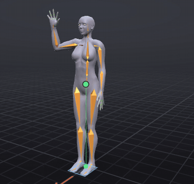
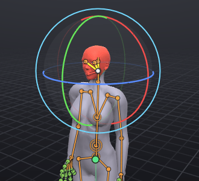
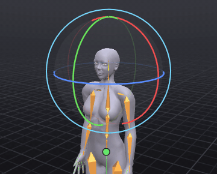
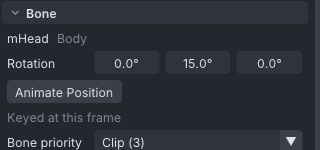
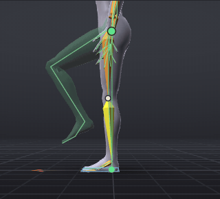

# Posing

Posing is setting the rotation (and sometimes the position) of bones at the current frame. Every move or turn you make in the view is keyed at that frame straight away, so posing and keying are the same step.

> Related articles: [[Skeleton]], [[Keys and timeline]], [[IK]], [[Joint limits]], [[Hand poser]], [[Control presets]]

## Usage

### Selecting bones

- **Click** a bone in the view to select it. Its name shows in **Properties**.
- **Click the same spot again** to reach a bone hidden underneath the first.
- **Shift+click** adds a bone to the selection or removes it. The last bone picked is the *primary* bone: the gizmo sits on it and its keys are drawn brighter on the timeline.
- **Drag a box** from empty space to select every bone whose joint falls inside it. It works with every tool, as
  long as the drag starts off the gizmo and off the bones; the bones inside light up while you drag. Only shown
  bones are taken: groups hidden under **Show** in the **Bones** tab stay out. In the Industry preset **Shift**
  toggles, **Ctrl** removes and **Ctrl+Shift** adds; the other presets are in [[Control presets#Box selection]].
- **Esc** clears the selection (in the Second Life preset, with nothing selected, it resets the camera).
- **Up** / **Down**, or **[** / **]**, walk to the parent or child bone (**Select → Select Parent**, **Select Child**). **Select → Next Sibling** and **Previous Sibling** step sideways.
- In the **Bones** tab, click a name. Picking a bone in the view opens the list at that bone.
- In the **Picker** tab beside it, click a joint dot or bone line on the chart of the avatar; **Shift+click** adds one, and a label such as **R ARM** selects the whole group. Save a selection you use often as a selection set there. See [[Picker]].
- **Select → Select All** (**Ctrl+A** in the Industry preset), **Select Keyed on Frame** (**Ctrl+Shift+A**), **Select All Keyed** and **Select None** select in bulk. **Select All** takes the bones shown, leaving out the eyes unless the face bones are shown (**View → Bones → Show Face Bones**): a key on the eyes fights the viewer's look-at.

Selecting is not an undo step: **Ctrl+Z** takes back edits, not selections.

*A drag from empty space with the Select tool: the bones inside light up, and the release selects them.*

### Moving and rotating

Pick a tool from the timeline bar or the **Tools** menu. The keys below are the Industry preset; see [[Keyboard shortcuts]] for the others.

| Tool | Key | What it does |
|---|---|---|
| **Select Tool** | **Q** | Select only, no gizmo |
| **Move Tool** | **W** | Arrows move along one axis, squares in a plane, the centre in the view plane |
| **Rotate Tool** | **E** | Rings turn around one axis, the outer ring around the view, the inside of the ball freely |
| **Scale Tool** | **R** | Scales static props only; Second Life animations can't scale bones |

*The Rotate tool on **mHead**: the red, green and blue rings turn around X, Y and Z; the pale outer ring turns around the view.*

- **Tools → Cycle Local / World / Gimbal Axes** (**O**), or the button next to the tools, sets the gizmo's axes. **Gimbal** shows the three rotation channels as they are stored.
- With the Rotate tool you can drag a bone directly: it turns around the direction you are looking.
- Hold **Ctrl** while dragging to snap rotations to the step set in [[Preferences]] (**Rotation snap**, 5° by default). In the Second Life preset, **G** turns snapping on and off instead.
- When **Tools → Respect Joint Limits** is on, the Rotate gizmo stops turning when the bone reaches its joint limit. See [[Joint limits]].
- **Esc** or a right-click during a drag puts everything back.

*Dragging the blue Z ring turns **mHead** and keys frame 12; the angle shows beside the gizmo during the drag.*

### Dragging a joint in the air (Auto IK)

With **Auto IK** on (the default), you can pick a hand, foot or any other joint up and put it where you want it: the
bones above it turn to follow, as an arm or leg would. There are two ways to drag:

- **By its dot, with any tool.** Point at a bone near its joint: a white dot appears there and the label says
  **Drag: Auto IK**. Press on the dot and drag. The joint moves across the view, at the depth it started at. A click
  on the dot without dragging only selects the bone.
- **With the Move tool.** Select the bone and drag the gizmo's centre square (across the view), an arrow or a
  plane square.

While you drag, the status bar says which bones follow, for example `Auto IK: mWristLeft pulls 3 bones, from
mCollarLeft`. Roll the mouse wheel up or press **]** to take one more bone up the chain, down or **[** for one fewer;
the drag starts again from where it began with the new chain. When you let go, every bone that turned is keyed at the
frame, as one undo step ("Move mWristLeft (Auto IK)"). They are plain rotation keys, like any others.

Turn it off with **Tools → Auto IK** or the **Auto IK** button (the grabbing hand) on the timeline bar, next to
**IK / FK**; the choice is saved. With it off, the Move tool moves a bone's position, as before. How long each chain
is, what it never takes and how it bends are in [[IK#Auto IK]].

> **Note:** Some joints always move by position with the Move tool: the pelvis, attachment points, collision volumes,
> face bones and any bone whose position is keyed (**Animate Position**).

### Pose by dragging the body

Click and drag directly on the avatar's body in the view to pose it without the gizmo. This works with the **Select**
and **Move** tools; with **Rotate**, pressing a bone and dragging turns it about the view axis instead. A joint's dot
pulls with any tool.

- **Drag any part.** Pointing at the body highlights the bone that owns that surface (from the mesh's skin weights), and dragging pulls the point you pressed, turning that bone and the ones above it with Auto IK. A plain click selects the bone. Gizmo handles win when they are directly under the pointer.
- **Whole-body drag with planted feet.** Dragging the pelvis or torso moves the hips; dragging the chest leans `mTorso` halfway there and the hips take the rest, while the head keeps facing the way it did. Feet on or near the floor (within 5 cm of where the body stands) stay planted: Auto IK turns each leg to keep its foot on its spot, facing the same way. Only legs the shown body has count, so the Linden body never keys `mHindLimb` bones. On a mesh body a foot counts as on the floor by its skin, not its joint, so hooves or paws whose joint sits high still plant. Small markers show on planted feet while dragging. On release, the hips, the leaned spine and the planted legs are keyed as one undo step. Live Mirror leaves a body drag alone.
- **Free move without planting.** Hold **Alt** while dragging the pelvis, torso or chest: the feet go with the body and the legs keep the bend they had when you pressed. In the Second Life and Industry presets (and in the viewer) **Alt** with the click moves the camera, so press first, then hold **Alt** during the drag.
- **Follow-through.** While dragging, loose parts like tails, wings, ears and soft volumes (belly) lag and settle, using the Dynamics solver. This is a live preview; only the dragged bones are keyed on release, and an edit started while they still settle starts from the keys, not the swing. Toggle it under **Tools → Follow-Through While Posing** (on by default). With **Tools → Avatar Physics Preview** on, the belly, butt and breasts bounce as SL's avatar physics does instead ([[Rig any model#Preview the bounce]]).

With [[Joint limits]], a planted leg stops at its limits and the status bar names the joint that stopped it. A leg
already keyed past a limit may stay there while you drag, so its foot does not jump; it can bend back towards the
range, not further out.

### Typing exact values

The **Bone** section of **Properties** shows the primary bone's **Rotation** in degrees around X, Y and Z; type or drag to change it. Every change keys the bone at the current frame; **Ctrl+click** a value and press **Enter** without changing it to key the pose as it is (a hold). **Offset** works the same way. Under it, **Keyed at this frame** or **Not keyed at this frame** tells you whether the values are a key or are interpolated.

*The **Bone** section on a keyed frame. Type into a field to key that value.*

A bone that normally only rotates can also move: press **Animate Position**, then set **Offset (m)**. Positions are in metres.

With a [[Mesh bodies|mesh body]] that has its own bone axes (rig axes), **Rotation** reads the turn about those axes
instead, and **In the body's rig axes** shows under it. Typing there still keys the bone in Second Life's frame; see
[[Mesh bodies#Rig axes]].

### Per-bone priority

The **Bone priority** box in the **Bone** section overrides the animation's priority for this bone alone in the exported `.anim`. **Clip (N)** means the bone uses the animation's priority N; 0–6 sets its own. Higher wins over other animations. See [[Animation priority]].

### The right-click menu

Right-click a bone for its menu:

- **Select**, **Key** and **Reset** the bone.
- The same for its body part (for example **Key Left Arm**), plus **Mirror** it to the other side, **Copy** and **Paste onto** it, and save it as a pose or, with a frame range picked, as a clip.
- **Show Hand Poser**, the IK switch, and the pin commands of [[Hold and bind]].

Right-click empty space for selection commands, **Copy Pose**, **Paste Pose**, **Save Pose...** and your saved **Poses**.

### Resetting and copying

| Command | Key (Industry) | What it does |
|---|---|---|
| **Edit → Reset Selected Bone** | **Alt+R** | Returns the selected bones to their rest pose at this frame |
| **Edit → Reset Hip Position** | **Alt+W** | Keys the hips back to their rest position (only when the hips have position keys) |
| **Edit → Reset Whole Pose** | **Alt+Shift+R** | Resets every bone at this frame |
| **Edit → Copy Pose** | **Ctrl+C** | Copies the pose of the selected bones, or the whole pose when nothing is selected |
| **Edit → Paste Pose** | **Ctrl+V** | Pastes it at the current frame |

**Ctrl+C** and **Ctrl+V** follow the pointer: over the **Graph** or the **Dope Sheet** they copy and paste keys,
anywhere else the pose. With no pose copied, **Ctrl+V** says which clipboard is loaded: `Nothing to paste: Ctrl+C
over the viewport copies the pose; over the Graph or Dope Sheet it copies keys`, or, after copying keys, `Copied keys,
not a pose: paste them with the pointer over the Graph or Dope Sheet`.

For mirroring, see [[Mirror, flip and reverse]].

### Worked example: keying a head turn

[Open the example](example:posing-head-turn.vat): the Relaxed Stand pose held for 24 frames, with **mHead** keyed straight ahead (`0`, `0`, `0`) at frame 0 and nowhere else.

1. Type `12` in the **Frame** box on the timeline bar.
2. Click **mHead** in the **Bones** tab. **Properties** says **Not keyed at this frame**.
3. In **Properties → Bone**, set **Rotation** to `0`, `0`, `30`.

The head turns to the avatar's left, **Properties** now says **Keyed at this frame**, **mHead** turns amber in the **Bones** tab, and a second diamond sits on frame 12 of the timeline. Scrub from 0 to 12: the head turns smoothly from the straight-ahead key to the new one. From 12 to 24 it stays turned: the last key holds.

> **Note:** A bone's only key sets its pose on every frame, before it as well as after. Key the starting pose first when a move should start from rest.

### Worked example: lifting a leg by its ankle

[Open the example](example:posing-leg-lift.vat) [Show the target](target:target-leg-lift.vat): the Relaxed Stand
held over 24 frames and keyed at frame 0 only. The target is the same stand with the left knee lifted high, as in a
march.

*The ankle's dot dragged onto the target ghost's ankle: the thigh swings up and the knee bends.*

1. Drag the playhead to frame 12.
2. **View → Camera → Left**, then zoom in until the legs fill the view.
3. Point at the left ankle, just above the heel: the dot and **Drag: Auto IK** appear.
4. Press on the dot and drag up and forward until the ankle sits on the green ghost's ankle, about a third of the way
   up the shin. The thigh swings up and the knee bends as you go; if you overshoot, drag back. Let go.
5. Click the left thigh (**mHipLeft**): the status bar's **Target** chip turns green once it is within 5°.

Scrub from 0 to 12: the knee rises smoothly from the stand. Only **mHipLeft** and **mKneeLeft** have new keys, both
at frame 12.

> **Check:** about −58° on **mHipLeft**'s Rotation Y and about 86° on **mKneeLeft**'s; anything within 5° reads the
> same.

### Mirror while posing

The **Mirror** button on the timeline bar, next to **IK / FK**, turns live mirroring on and off. While it is on, every gizmo drag (including a direct drag on a bone, an Auto IK drag and the Blender preset's **G** and **R**), every [[Hand poser]] drag or double-click, and every move or turn of an [[IK]] target or pole also keys the partner on the other side, at the same frame, with the mirrored pose. The partner's IK / FK state stays its own.

While it is on, the status bar shows **Mirror on** in purple and the gizmo's centre and outer ring are purple. It is off each time VATs starts.

- A partner gets position keys where either side has them, and always when it is an attachment point.
- A bone in the middle, such as the head or the spine, is its own partner. It poses as usual unless **Mirror centre bones in place** is on in [[Preferences]]: then it is kept symmetric, halfway between your pose and its mirror image, so a nod stays and a turn or sideways lean is cancelled.
- Typing values in **Properties**, pinned points and the QAvimator preset's modifier drags are not mirrored.

### Scratch pose

**Edit → Scratch Pose** turns scratch posing on and off (a tick shows it is on). While it is on, your edits change the pose you see but write no keys to the document: the status bar says "Scratch Pose: nothing is keyed until Set Key", and the **Bones** tab marks each changed bone **(scratch)**. **Undo** steps back through the scratch edits.

- **Set Key** (**S** in the Industry preset) keeps the pose: every channel you changed gets a key at the scratch frame, as one undo step, **Key Scratch Pose**.
- Moving to another frame (scrubbing, playing, stepping to a key), or turning **Scratch Pose** off, asks **Keep scratch pose as keys?**: **Keep**, **Discard** or **Cancel**. **Don't ask again** remembers the answer; **Leaving a scratch pose** in [[Preferences]] asks again.
- With **Only key channels that already have keys** on in [[Preferences]], keeping the pose keys only channels that had keys before, so a bone that was never animated stays unkeyed.
- Saving, exporting, uploading and autosave write the document without the scratch pose.
- Switching to another actor, or a change to the whole scene (the actors, or the frame rate), discards the scratch pose.
- Only the pose at the scratch frame is kept: keys moved in the [[Graph editor]] during a scratch pose are not.

### Propagating a pose

**Edit → Propagate Pose** writes the current pose of the selected bones (with their pin offsets and any selected IK controls) onto their later keys, as one undo step:

| Command | Keys it changes |
|---|---|
| **To Next Key** | Each bone's next key after this frame |
| **To Selected Range** | Every key after this frame inside the frame range picked on the timeline (**Shift+drag**) or spanned by the keys selected in the [[Graph editor]] |
| **To End** | Every key after this frame |

It adds no keys, and keeps each key's frame, interpolation and handles. An IK control's IK / FK state is not changed. With a scratch pose, the scratch pose is keyed first. The status bar says how many keys changed, or "No later keys to change".

## Configuration

Mouse and key behaviour depends on the control preset (Industry, Blender, QAvimator or Second Life), set under **Navigation & hotkeys** in **Edit → Preferences...**. In the Blender preset, **G** and **R** over the view start a Blender-style move or rotate; **X**, **Y** or **Z** lock an axis. In the Second Life preset the Move gizmo is the default, **Ctrl** switches to Rotate and **Ctrl+Shift** to Scale. See [[Control presets]].

## Tips and tricks

- Drag hands and feet by their dots ([[IK#Auto IK|Auto IK]]) instead of rotating each joint; switch a limb to [[IK]]
  when its hand or foot must stay put over many frames.
- Curl fingers with the [[Hand poser]], or apply a starter hand shape from the [[Pose library]].
- Bones are drawn over the body, so one inside it can still be clicked; click the same spot again for the one underneath.

## Troubleshooting

### Reset Hip Position does nothing

The status bar says "The hip has no position keys": the hips were never moved, so there is nothing to reset. **Alt+W** only acts on hips that have position keys.

### A bone jumps when I scrub past a frame

The bone has a key there that you did not mean to set: moving a bone always keys it. Delete the key (**Delete**) or open the [[Graph editor]] to see the curve.

## See also

- [[Picker]]
- [[Keys and timeline]]
- [[Joint limits]]
- [[Interface]]
- [[Keyboard shortcuts]]

Category: Animating
