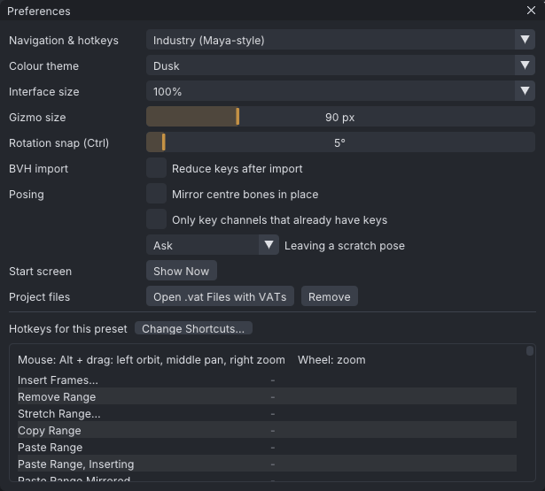

# Preferences

The **Preferences** window holds the settings that belong to you rather than to a project: controls,
look, gizmo, snapping, BVH import and file associations. Every change is saved at once; there is no
OK button.

> Related articles: [[Control presets]], [[Keyboard shortcuts]], [[Projects and files]]

## Usage

Open it with **Edit → Preferences...** (**Ctrl+,** in every preset). Press **Esc** while it has focus,
or its **×**, to close it.

*Preferences as a new installation shows them. The list at the bottom is the active preset's keys.*

### Settings

| Setting | Values | Default | What it does |
|---|---|---|---|
| **Navigation & hotkeys** | **Industry (Maya-style)**, **Blender**, **QAvimator**, **Second Life** | Industry (Maya-style) | The mouse and key scheme; see [[Control presets]]. Choosing **Second Life** also picks the Move tool. |
| **Emulate 3-button mouse (Alt + left-drag = middle-drag)** | on, off | off | Shown only with **Blender**. **Alt + left drag** acts as a middle drag in the viewport and the graph. |
| **Colour theme** | **Dusk**, **Studio Grey** | Dusk | The colours of the panels, viewport and timeline. |
| **Interface size** | 75% to 250% | 100% | Scales text and controls, on top of the operating system's display scale. |
| **Gizmo size** | 50 px to 220 px | 90 px | The size of the move, rotate and scale gizmo. |
| **Rotation snap (Ctrl)** | 1° to 90° | 5° | The step used while **Ctrl** is held during a rotation. With the Second Life preset the row is **Rotation snap (G)**: the step used while snapping is toggled on with **G**. |
| **BVH import → Reduce keys after import** | on, off | off | Drops keys that linear playback reproduces within 0.05 degrees and 0.5 mm. Off keeps a key on every frame. See [[BVH]]. |
| **Posing → Mirror centre bones in place** | on, off | off | With **Mirror** on, posing the head or spine keeps it symmetric: a nod stays, a turn or lean is cancelled. See [[Posing#Mirror while posing]]. |
| **Posing → Only key channels that already have keys** | on, off | off | Keeping a scratch pose keys only the channels that were animated before it. See [[Posing#Scratch pose]]. |
| **Posing → Leaving a scratch pose** | **Ask**, **Keep as keys**, **Discard** | Ask | What moving off a changed scratch pose does. **Don't ask again** in the question sets it. |
| **Start screen → Show Now** | button | | Closes Preferences and opens the Welcome window. |
| **Project files → Open .vat Files with VATs** | button | | Registers `.vat` files with this copy of VATs; **Remove** undoes it. See [[Installation#Opening project files by double-click]]. |
| **In the viewer → Opening the editor → Reset joint positions when the editor opens** | on, off | on | Shown only in the [[VATs Editor (viewer)|viewer]]. Resets your avatar's skeleton on your screen as the editor opens, as the viewer's **Reset skeleton** does: joint positions left by stopped animations go back; your mesh body's own joint offsets stay. Saved as `viewer_reset_joints`. |
| **In the viewer → While the editor is open → Show other avatars** | on, off | off | Shown only in the viewer. Off hides every other avatar, friends too, with their attachments and name tags, on your screen while the editor is open; your own avatar stays. Also **View → Show Other Avatars**. Saved as `viewer_show_others`. |

**Interface size** offers 75%, 100%, 125%, 150%, 175%, 200% and 250%.

### Hotkeys for this preset

The lower part of the window lists the mouse controls and every command of the active preset with its
keys; `-` marks a command without a key. It is the same list as **Help → Controls**, which
shows only the commands that have keys. **Change Shortcuts...** opens **Edit → Keyboard Shortcuts...**
to change them; see [[Keyboard shortcuts#Changing shortcuts]].

### Worked example: change the theme and find it on disk

1. Press **Ctrl+,** and pick **Studio Grey** under **Colour theme**. The panels, viewport and
   timeline change colour at once; there is nothing to confirm.
2. Open `settings.json` (the path is under [[Preferences#Settings file]]) in a text editor. It holds
   the line `"theme": "Studio Grey"`, written the moment you chose it.
3. Pick **Dusk** again: the line now reads `"theme": "Dusk"`.

Every other row works the same way: the file is rewritten on each change, so a setting that does
not survive a restart means the file could not be written (see [[Preferences#Troubleshooting]]).

## Configuration

### Settings saved elsewhere

Some choices are saved in the same file from other places in the app:

| Setting | Where you change it |
|---|---|
| Gizmo axes (`orientation`: local, world or gimbal) | the axes button on the timeline, or **O** (Industry) |
| Body (`body`, `mesh_body`) | **View → Body** |
| Graph shown (`show_graph`) | **View → Graph Editor** (**Ctrl+G**), or the panel's **×** |
| Welcome at start-up (`show_welcome`) | **Show this at startup** in the Welcome window |
| Camera views (`cameras`) | **View → Camera → Camera Views → Store Camera View 1** to **4** |
| Recent files (`recent`, up to 10) | **File → Open Recent**; **Clear Recent** empties it |
| Motion capture and face tracking (`mocap`) | **Tools → Motion Capture...**; see [[Motion capture]] |
| Your own keys (`key_overrides`) | **Edit → Keyboard Shortcuts...**; see [[Keyboard shortcuts#Changing shortcuts]] |

### Settings file

Settings are stored as JSON in `settings.json`:

| System | Path |
|---|---|
| Linux | `$XDG_CONFIG_HOME/viewport-avatar-toolset/settings.json`, normally `~/.config/viewport-avatar-toolset/settings.json` |
| Windows | `%APPDATA%\viewport-avatar-toolset\settings.json` |
| With `--data-dir <dir>` | `<dir>/settings.json` |

A missing, empty or unreadable file gives the defaults. A value out of range is clamped: for example
a gizmo size of 500 loads as 220. Unknown keys are ignored.

### Resetting all preferences

Quit VATs and delete `settings.json`. The next start counts as a first run.

## Troubleshooting

### A preference does not stick

VATs writes `settings.json` on every change. If the folder is read-only or full, the change lasts only
for the session. Check that you can write to the folder in [[Preferences#Settings file]].

## See also

- [[Control presets]]
- [[Projects and files#Data folders]]
- [[Command line]]

Category: Interface
