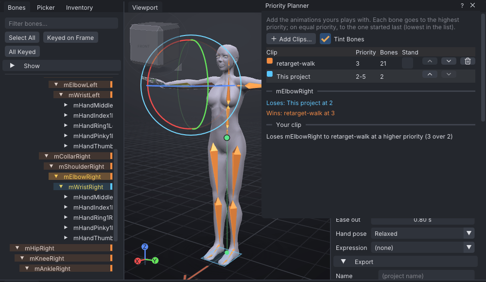

# Priority planner

The priority planner shows which animation moves each bone when yours plays together with others, such as an AO
stand, a dance or a furniture pose. It applies Second Life's rule bone by bone, colours the bones by the
animation that wins them, and lists the bones your clip loses.

> Related articles: [[Animation priority]], [[Animation check]], [[Export to Second Life]]

## Usage

### Open the planner

Choose **Tools → Priority Planner...**. The list starts with **This project**, your clip as it exports: every
bone the exported `.anim` has keys for, at the bone's own priority or the clip's. It follows your edits.

### Add the animations yours plays with

Press **Add Clips...** and pick one or more of your own `.anim` files or `.vat` projects. Each appears in the
list with its name, the range of its priorities (for example `2-5`) and the number of bones it keys. A project
counts as its active actor exported on SL Default, with its own export settings.

The list is in the order the animations started: the top one first, the bottom one last. New clips go in above
**This project**, so yours counts as started last. Use the up and down arrows to change the order, and
**Remove** to take a clip out.

The planner reads names, bones and priorities from files on your computer only. It never reads other avatars.

*The hand hold against a walk at priority 3: the walk takes mElbowRight, the hold keeps mWristRight at 5.*

### Read who wins

Second Life decides each bone on its own:

1. The animation with the highest priority on that bone wins it.
2. On equal priority, the animation started most recently wins: the lowest one in the list.

A bone that no clip keys shows no colour. With **Tint Bones** ticked (the default) and at least one clip added:

- each row of the **Bones** list gets the winning clip's colour, with a bar at its right edge;
- the bones in the view are drawn in that colour;
- the timeline shows a band in the colour of the clip that wins the selected bone, labelled
  `mElbowRight: Dance wins (4)`.

Select a bone to see every clip that keys it, the winner first: `Wins: Dance at 4`, `Loses: This project at 3`.

### Bones your clip loses

Under **Your clip**, the planner lists the bones another clip takes, grouped by that clip:

- `Loses mElbowRight to Dance at a higher priority (4 over 2)`
- `Loses mHead to AO Stand at the same priority (3), started later`

Raise those bones' priority ([[Animation priority#Set a bone's own priority]]), or move **This project** lower in
the list to see what happens when yours starts last. The message reads `Wins every bone it keys.` when nothing is
lost.

### For AO makers

Two warnings appear under **For AO makers**, about any clip in the list:

| Warning | When |
|---|---|
| A stand at priority 4 or more | A clip with **Stand** ticked keys body bones at 4 or higher. It ties with or beats dances and poses at 4, and takes the body back each time the AO restarts it. Stands belong at 3 or below. |
| Face or hands at 5 or 6 | A clip that keys `mPelvis` and a shoulder (a whole-body animation) also keys face or hand bones at 5 or 6. Every other animation's face and hand motion loses those bones. |

**Stand** is ticked when the file name contains "stand" (in any case); tick or untick it by hand.

## Viewer

> **Note:** In the VATs Editor (viewer), **Add Running Animations** adds the animations playing on your own avatar,
> by name and per-bone priority only, in the order they started: the ones the region plays on you (your AO's,
> scripts' and gestures'), named as in your inventory where you have them. The editor's own playback and the sit it
> put you in are left out. The app has no such button. With nothing playing, it reports
> `No animations are running on your avatar`.

In the viewer, **View → As It Plays In-World** goes one step further: your avatar plays your animation live with
your AO and the rest, and a table shows who wins each joint by the same rule (see
[[VATs Editor (viewer)]]). The app has no world to play in; there the planner, with your AO's
and furniture's `.anim` files added through **Add Clips...**, answers the same question.

## Troubleshooting

### My clip loses a bone it should win

The other clip has an equal priority and started later. Move **This project** below it, or raise the bone's
priority by one.

### A bone I keyed is not in This project

It exports without keys: **Leave out bones that don't move** is on and the bone stays at rest. Check the
exported file in [[Preview as SL plays it]].

### Some viewers treat 5 and 6 as 4

The planner uses the priorities as written in the file. See [[Animation priority#Priority 5 or 6 behaves like 4]].

## See also

- [[Animation priority]], how priorities stack per bone
- [Second Life Wiki: Animation Priority](https://wiki.secondlife.com/wiki/Animation_Priority)

Category: Second Life
