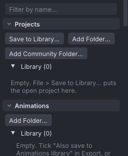

# Project library

The **Projects** and **Animations** sections at the top of the **Inventory** tab list your project files
(`.vat`) and SL animation files (`.anim`) from a library folder in VATs' data
folder and from any other folders you add. Open a project or an animation from there, insert an animation
into the open project, or rename, duplicate and delete the files.

> Related articles: [[Projects and files]], [[Pose library]], [[Community content]], [[Export to Second Life]], [[Interface]]

## Usage

### What is listed

*The two sections on a new installation. Each **Library** group says what fills it.*

Each section has groups, which fold open and closed:

| Group | Section | Files |
|---|---|---|
| **Library** | both | the files in `library/Projects/` or `library/Animations/` in the data folder |
| **Recent** | Projects | the projects of **File → Open Recent** that still exist |
| a folder's name | both | the files in a folder you added with **Add Folder...** or **Add Community Folder...** |

A group's title gives the number of files it shows. Only files directly in the folder are listed, not
those in folders inside it. Hover a folder's group title for its full path.

Each item shows a thumbnail (the middle frame on the current body) or an icon for its kind, the name,
and a second line:

- Projects: length in seconds, frame rate, priority, `loops` when the loop is on, and the number of actors.
- Animations: length in seconds, the number of rotation and position keys, priority, and `loops`.

A file VATs cannot read is listed with a warning sign and `Cannot read:` followed by the reason. Hover an
item for the same details and its path.

### Opening

- **Double-click** a project, or right-click it and choose **Open**, to open it. With unsaved changes,
  VATs first asks `Save changes to <name>?`, as **File → Open...** does.
- **Double-click** an animation, or choose **Open**, to import it as a new project, as **File → Import SL
  .anim...** does.
- **Drag** a project onto the view to open it.

### Inserting an animation

Right-click an animation and choose **Insert into Current Project at This Frame**, or drag it onto the
view. Its keys are pasted at the current frame, the same way a [[Pose library|clip]] is pasted: every bone
the file moves, retimed to the project's frame rate. When the keys run past the last frame, the project
is lengthened to fit. It is one undo step.

**Insert Mirrored** pastes it with left and right swapped. A drag onto the view uses the **Apply mirrored**
tick of the **Poses** section.

### Inserting with matched poses

**Insert, Matching Poses...** on an animation's right-click menu opens the **Match Poses** window instead of
pasting at the current frame. It joins the animation onto the end of the open clip, where the two poses match
best, and blends the join. The **Apply mirrored** tick decides whether it goes in mirrored.

VATs compares the last **Search** frames of the clip with the first **Search** frames of the animation, with the
pose distance [[Loop tools#Finding the best loop points|Find Best Loop Points]] uses (rotations and angular
speed, hips and legs weighted most, plus the hip height). The cut stays at least **Blend** frames before the
clip's end. Pairs that differ by less than 0.001 count as equal, and the later cut wins. The window shows the
result before anything changes:

- `Cut at frame 60, where walk's frame 12 lands.`: the clip plays to frame 60, then the animation from its frame 12.
- `Pose difference`: the distance there, marked `(close)` under 5 and `(far apart)` from 15.
- `Turned -90 degrees, moved 1.20 m`: how far **Align the hips** turns and moves the animation.
- `The clip becomes 120 frames long.`

| Setting | Values | Default | What it does |
|---|---|---|---|
| **Search** | 2–60 frames | 15 | Frames compared at the end of the clip and the start of the animation |
| **Blend** | 0–30 frames | 6 | Frames over which the clip's motion eases into the animation's; 0 is a straight cut |
| **Ease** | Linear, Quad, Cubic, Sine | Sine | The blend's shape, In-Out |
| **Align the hips** | on / off | on | Turns the animation about Z and moves it along the ground so its hips carry on from the clip's; the hip height stays the animation's own. IK targets and pins are not turned with the hips |

**Insert** runs it as one undo step, **Insert, Matching Poses**. Each bone the animation moves loses its keys
after the cut; over the blend it is keyed on every frame, both motions playing, and the animation's own keys
follow. Bones the animation doesn't move keep their keys. With **Align the hips**, **mPelvis** is keyed on
every frame of the inserted part. An IK limb switches between IK and FK at the end of the blend. The clip ends
where the animation ends; loop points past the new end move to it.

> **Note:** Second Life blends whole animations itself, through each one's **Ease in** and **Ease out**
> ([[Export to Second Life]]). **Match Poses** builds one file from several pieces.

A library clip's right-click menu has the same thing as **Paste, Matching Poses...** (see [[Pose library]]).

### Managing files

Right-click an item:

| Item | What it does |
|---|---|
| **Rename...** | asks for a new name; the extension stays. A name already taken in that folder is refused. |
| **Duplicate** | copies the file as `<name> copy`, then `<name> copy 2` and so on. |
| **Delete** | asks `Delete "<file>"? This cannot be undone.` and deletes the file. |
| **Show in Folder** | opens the file's folder in the system's file manager. |

**Rename...**, **Duplicate** and **Delete** only work on files directly inside a listed folder (the two
library folders and the added ones); for other files, such as a recent project stored elsewhere, they are
greyed out. Characters that cannot be in a file name (`/ \ : * ? " < > |`) are left out of a new name.

Renaming the open project's file keeps it open under the new name.

### Saving to the library

- **File → Save to Library...**, or **Save to Library...** in the **Projects** section, asks for a name and
  saves the project as `library/Projects/<name>.vat`. The project then belongs to that file, as after
  **Save As...**. If another project already has that name, VATs asks before replacing it.
- **Also save to Animations library**, in the **Export** section of **Properties** (and the **Export SL
  .anim** window), copies every `.anim` that **Export SL .anim** writes into `library/Animations/`,
  replacing a file of the same name. In an SL viewer the same tick also keeps a copy of each
  **Upload Animation...**. The tick is saved with the project.

### Worked example: put a project in the library and take it out again

[Open the example](example:first-wave.vat), the wave from [[First steps]], then:

1. **File → Save to Library...** opens the **Save to Library** prompt with `Animation` filled in (the
   copy is untitled). Type `first-wave` and press **Save**. The status bar says `Saved first-wave.vat`.
2. Open the **Inventory** tab. **Projects → Library (1)** lists **first-wave** with the line
   `1.00 s, 30 fps, priority 3, loops, 1 actor` and a thumbnail of its middle frame. Hover it for
   the full path, `library/Projects/first-wave.vat` in the data folder.
3. Right-click it and choose **Duplicate**: **first-wave copy** appears beside it and the group
   reads **Library (2)**.
4. Right-click each and choose **Delete**, answering `Delete "first-wave copy.vat"? This cannot be
   undone.` with **Delete**. The status bar says `Deleted first-wave copy`, and once both are gone the
   group reads **Library (0)** again and shows its empty hint. The open project stays open; **Save**
   would write its file again.

### Adding folders

**Add Folder...** in either section lists another folder's files there too, for example your export folder.
Right-click the folder's group title for **Show in Folder** or **Remove Folder from Inventory**; removing
it only takes it off the list, the files stay.

**Add Community Folder...**, under the **Projects** buttons, adds a folder of shared content, such as a clone
of a community repository: its `poses`, `clips` and `animations` folders to **Animations** and its
`projects` folder to **Projects**, each as its own group. See [[Community content]].

### Filtering

**Filter by name...** at the top of the **Inventory** shows only the items whose names contain the text,
ignoring case, in every section: projects, animations, mesh bodies, props, poses, clips and starter poses.
Groups and sections with no match are hidden while filtering. The **×** at the end of the box clears it.

## Configuration

The library folders are in the data folder's `library` folder, beside `poses.json`:

| Files | Linux |
|---|---|
| Projects | `~/.local/share/viewport-avatar-toolset/library/Projects/` |
| Animations | `~/.local/share/viewport-avatar-toolset/library/Animations/` |

On Windows they are under `%APPDATA%\viewport-avatar-toolset\library\`. `--data-dir` and `--library-dir`
move them with the rest of the library; see [[Command line]].

Added folders are kept in `settings.json` as `project_folders` and `anim_folders`
([[Preferences#Settings file]]).

The lists are read again when the **Inventory** gets the focus, when VATs comes back to the front, and after
a save or an export. VATs keeps what it read about each file and reads a file again only when its size or
time has changed.

## Troubleshooting

### A file is missing from the list

Only `.vat` and `.anim` files directly in a listed folder are shown. Files copied in while VATs
was open appear when you click into the **Inventory**.

### "Cannot read:" on an item

The file is damaged or not what its extension says. A project that VATs cannot read also fails to open
with **Could not open project**; an animation fails with **Import failed**. Delete it, or restore a backup
(`.vat.bak` beside the project).

## App and viewer

> **Note:** In an SL viewer the lists work the same, but items show their kind icon instead of a
> thumbnail, and **Show in Folder** depends on the viewer opening a `file://` link.

## See also

- [[Projects and files]]
- [[Export to Second Life]]

Category: Interface
