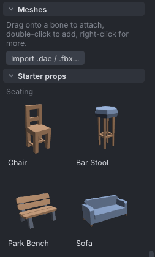
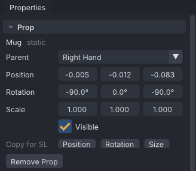
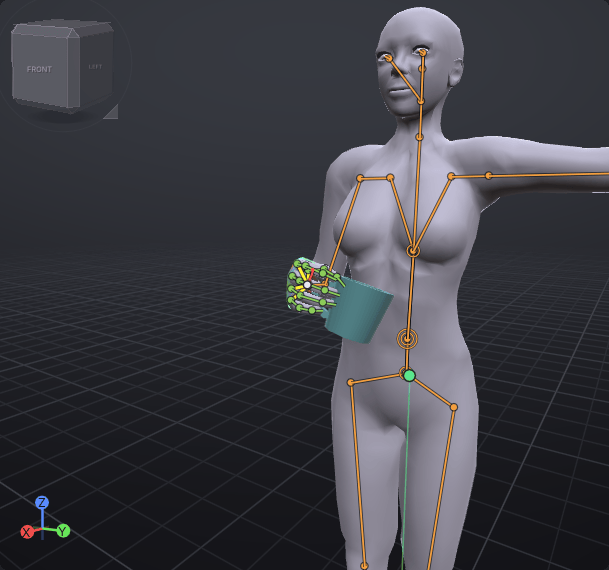

# Props

Props are meshes shown in the scene with the avatar: a cup in the hand, a chair to sit on, a hat, or a
rigged garment. They help you pose against real objects and line up an animation with the furniture it
will play on. Props are saved in the project but are not part of the exported animation.

> Related articles: [[Mesh bodies]], [[Pose library]], [[Projects and files]], [[Export to Second Life]]

> **Note:** In the [[VATs Editor (viewer)]] props work the same and are drawn with the world, on your
> screen only; nothing is rezzed. Attachment-point keys also move what you wear.

## Usage

### Import a mesh

Choose **File → Import Prop / Mesh (.dae, .fbx, .gltf, .glb)...** (**Ctrl+I**; **Ctrl+Alt+I** in the Blender preset),
or press **Import .dae / .fbx...** under **Inventory → Meshes**. VATs reads COLLADA (`.dae`) and FBX
files, adds the mesh to the scene, and adds it to the Inventory so you can use it in other projects.

A message reports the triangle count, whether the mesh is **rigged** or **static**, the scale and up
axis, and anything it skipped: joints that are not SL bones, missing textures and unsupported features.

- A **static** mesh has its own position, rotation and scale, and can be attached to a bone or an
  attachment point.
- A **rigged** mesh follows the avatar and has no transform of its own.

If a rigged mesh covers most of the skeleton, VATs asks whether it is an avatar body; see
[[Mesh bodies]].

### Add a prop from the Inventory

**Inventory → Meshes** shows your imported meshes as a grid of thumbnails, and the **Starter props** section
below it the props that come with VATs, grouped by category. Both come after the poses; fold **Poses** and
**Starter poses** away (click their titles) to bring them up. Hover a thumbnail to see its parent, category and file.

*Starter props ship with VATs, grouped by category; your own imports appear above them.*

- **Double-click** adds the prop at its usual place: the parent and offset it was saved with.
- **Drag** it onto a bone or attachment point in the view to attach it there, or onto empty space to
  place it in the world. A note by the cursor says which: `Attach ... to ...` or `Place ... in the
  world`. A starter prop made for a hand snaps to its grip when you drop it anywhere on that hand,
  fingers included.
- **Right-click** for more:
  - **Add to Scene**, the same as double-click;
  - **Attach to Point**, a submenu of every attachment point;
  - **Attach to** the selected bone (**Attach to Selected Bone (select one first)** when none is
    selected);
  - **Save As Variant**, a new Inventory item from the selected prop in the scene, which must use the
    same mesh;
  - **Save (from Selected Prop)**, **Rename...** and **Delete from Inventory**, for your own items only.

Starter props cannot be renamed, saved over or deleted.

### Starter props

| Category | Props |
|---|---|
| Seating | Chair, Bar Stool, Park Bench, Sofa, Armchair, Double Bed |
| Table | Table |
| Cups | Mug, Tankard, Wine Glass, Cocktail Glass, Wine Bottle, Soda Can |
| Handheld | Phone, Book, Pen, Microphone, Umbrella, Flashlight |
| Weapons | Sword, Round Shield, Bow, Staff, Axe, Knife, Greatsword, Spear, Pistol, Rifle, Shotgun, Magazine |
| Fun | Acoustic Guitar, Ball, Mic Stand |
| Floor | Rug |

Hand-held props sit in the fist of the **Right Hand** point; the Round Shield, the Bow and the Magazine go on
the **Left Hand**. Each one's grip fits a starter hand pose from the [[Pose library]], so apply that pose to the
same hand (**Shift+click** for the right):

| Hand pose | Props |
|---|---|
| **Grip (Cylinder)** | Sword, Greatsword, Knife, Spear, Axe, Staff, Bow, Round Shield, Umbrella, Pistol, Rifle, Shotgun, Magazine, Mug, Tankard, Wine Bottle, Microphone, Flashlight |
| **Hold Glass (Stem)** | Wine Glass, Cocktail Glass |
| **Cup (C-Shape)** | Soda Can |
| **Hold Phone** | Phone |
| **Flat** | Book (lying on the palm) |
| **Holding Pen** | Pen |

Blades and hafts are held just below the guard or near the end of the handle, the blade out of the thumb side;
the guns' grip runs up through the fist with the muzzle along the fingers; cups and tankards are held by the
handle, the bottle by its neck, the shield by its centre grip behind the boss. Two-handed props leave room for
the other hand: the Rifle's wooden handguard, the Shotgun's pump, the Greatsword's grip below the right hand, and
the Spear's shaft half a metre up from the right hand.

### Place a static prop

Click a prop in the view to select it. **Properties → Prop** shows its name and:

*The starter Mug at its grip: **Parent** Right Hand, offset (−0.005, −0.012, −0.083) m from the point, its handle in the fist.*

| Field | Meaning |
|---|---|
| **Parent** | **World**, an attachment point, or a bone. Changing it snaps the prop to the new parent. |
| **Position** | Metres, relative to the parent. |
| **Rotation** | Degrees, relative to the parent. |
| **Scale** | A factor on each axis. |
| **Visible** | Hides the prop without removing it. |

A prop is positioned by the centre of its bounding box, not by the mesh's own origin. Each change is one
undo step. **Remove Prop** takes it out of the scene; the Inventory item stays.

### Sit on a seat

A prop in the world (a starter **Chair**, **Sofa** or **Bench**, or a seat of your own) can be sat on in one step:
press **Sit on This** in **Properties → Prop**, right-click the view and choose **Sit on** *Chair*, or choose
**Tools → Sit on Seat**. At the current frame VATs:

1. applies the **Sitting** starter pose when the avatar is not sitting yet (its thighs point down);
2. drops the hips until the feet reach the floor, and holds both ankles there (**Hold in World from Here**, see
   [[Hold and bind]]);
3. moves the hips until the thighs rest on the seat: the highest surface of the prop straight under them.

The status bar says what moved, for example `Sat on Chair in the Sitting pose: the hips down 45 cm onto the seat at
46 cm, the feet held on the floor`. It is one undo step. The seat must be under the avatar, as a sit target puts it:
a chair beside the avatar is not walked to. Lean the back, rest the hands ([[Hold and bind]]) and set the priority as
in [[A sit pose for furniture]].

### Copy values to and from Second Life

To build the real object in-world with the same placement, use **Properties → Prop → Copy for SL** and
press **Position**, **Rotation** or **Size**. VATs copies an SL vector such as `<0.12000, 0.00000,
0.45000>` to paste into the SL build window.

With a static prop selected, **Ctrl+C** opens a small menu with the same three choices. **Ctrl+V** reads
an SL vector from the clipboard and asks whether to paste it as **Position**, **Rotation** or **Size**.
Pasting a size sets the scale so the prop has that size.

### Worked example: a mug in the hand

[Open the example](example:prop-in-hand.vat): the starter **Mug** on the **Right Hand** attachment point,
with the arm bent to hold it up in front of the stomach and the fingers closed round the handle in **Grip
(Cylinder)**.

1. Click the mug in the view. **Properties → Prop** shows **Mug** (**static**), **Parent** **Right Hand**,
   **Position** `-0.005`, `-0.012`, `-0.083` and **Rotation** `-90.0°`, `0.0°`, `-90.0°`: the grip the starter
   prop was saved with.
2. Press **Copy for SL → Position**. The status bar says "Copied <-0.00500, -0.01200, -0.08300>", and the
   clipboard holds that vector, ready for the build window of a mug worn on the right hand in Second Life.
3. Drag the first **Position** field to the right: the mug slides along the hand. **Ctrl+Z** puts it back
   (**Move Prop** is one undo step).
4. In **Inventory → Meshes**, double-click **Mug** under **Starter props → Cups**: a second mug is added at
   the same grip, over the first. **Remove Prop** takes it out again.

## Tips and tricks

- Use a chair or bed prop with [[Couples and groups]] to check where each actor sits.
- Save a hand-held prop with the right grip as a variant, so each new project gets it in place with one
  double-click.

## Troubleshooting

### Some prop meshes are missing

The project refers to a mesh file that has moved or been deleted. The prop shows as an orange box and
**Properties → Prop** says `Mesh file not found:` with the path. Put the file back at that path, or remove
the prop and import the mesh again. The project still opens and saves. A starter prop is never missing: a
project made on another computer finds this installation's copy through its **Starter props** entry.

### Paste needs an SL vector like `<1.0, 2.0, 3.0>` on the clipboard

The clipboard does not hold a vector. Copy the value from the SL build window, including the angle
brackets.

### A prop does not appear in the animation in-world

Props are not written to the `.anim`. Rez or wear the real object in Second Life.

### Could not add: The mesh file is missing or could not be read

The Inventory item's mesh has moved. Delete the item and import the mesh again.

Category: Import and export
