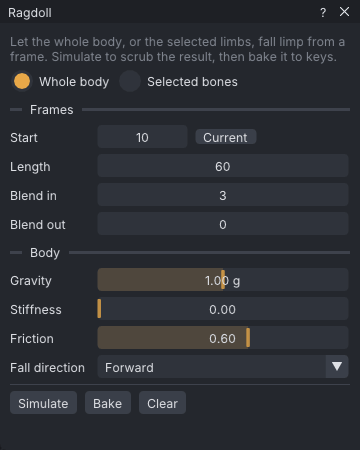

# Ragdoll

The ragdoll lets the whole body, or some limbs, fall limp under gravity from a chosen frame. It collides
with the ground and with props. VATs simulates the fall, lets you scrub it, and bakes it into ordinary
keys.

> Related articles: [[Dynamics]], [[Props]], [[IK]], [[Keys and timeline]]

## Usage

Open the window with **Tools → Ragdoll...**. A clip has at most one ragdoll.

### Setting up a fall

1. Move the playhead to the frame where the fall begins.
2. Click **Set Up Ragdoll**. The fall starts at the current frame and lasts 60 frames, or up to the last
   frame if that is sooner.
3. Choose **Whole body**, or **Selected bones**. For selected bones, select them in the view or the bone
   list, then click **Use the Selected Bones**. Those bones and every ragdoll joint below them fall limp;
   the rest keeps its animation.
4. Set the frames and the body settings (see Configuration below).
5. Click **Simulate**. The fall shows in the view as **Showing the simulated preview**, and you can scrub
   through it. No keys change.
6. Click **Bake** to write the fall as keys, as one undo step.

*Whole body, from frame 10 for 60 frames, with the default body settings.*

### Re-baking and clearing

- **Re-bake** starts again from the keys the clip had before the first bake.
- **Clear** puts back the keys from before the bake and removes the ragdoll.

### Which joints fall

The ragdoll moves the pelvis, torso, chest, neck and head, and on each side the shoulder, elbow, wrist,
hip, knee and ankle. Fingers, face, tail, wings and the other Bento bones keep their animation.

## Configuration

### Frames

| Setting | Range | Default | Effect |
|---|---|---|---|
| **Start** | 0 to the last frame | the playhead at setup | the frame the ragdoll takes over from the animation; **Current** uses the playhead |
| **Length** | 1 to the last frame | 60 | how many frames it falls for |
| **Blend in** | 0–60 frames | 3 | frames to ease from the animation into the fall |
| **Blend out** | 0–60 frames | 0 | frames to ease back to the animation at the end; 0 stays down |

### Body

| Setting | Range | Default | Effect |
|---|---|---|---|
| **Gravity** | 0–2 g | 1.00 g | pull downwards, in multiples of Earth's gravity |
| **Stiffness** | 0–1 | 0 | how hard joints pull towards the animated pose; 0 is limp |
| **Friction** | 0–1 | 0.6 | grip on the ground and on props |
| **Fall direction** | Forward, Back, Left, Right, Random, None | Forward | which way a standing body topples when it goes limp |

**Fall direction** only nudges a standing body whose pelvis falls. A seated, kneeling or lying body
slumps on its own. **Random** is repeatable: the same start frame gives the same fall.

The simulation runs at 480 sub-steps per second. The ground is at height 0. Visible props that are not
rigged collide as solid boxes, sized to their bounds.

## Worked example: a fall from standing

[Open the example](example:ragdoll-fall.vat): a 70-frame clip in which the arms come down by frame 10,
with a whole-body ragdoll already set up from frame 10 for 60 frames.

1. Choose **Tools → Ragdoll...**. **Start** reads 10, **Length** 60, **Blend in** 3, **Gravity** 1.00 g,
   **Stiffness** 0, **Fall direction** Forward.
2. Press **Simulate**. The status bar says "Simulated frames 10 to 70: scrub or play to see it" and the
   window shows "Showing the simulated preview". Scrub: the body stands until frame 10, topples forward,
   and lies still from about frame 43. No keys have changed yet.
3. Press **Bake**. The status bar says "Baked the ragdoll to keys" and the button reads **Re-bake**. The
   timeline now shows keys through the fall, thinned where nothing changes. Select `mPelvis` at frame
   70: **Properties → Bone → Offset (m)** reads 1.027, −0.026, −0.925: the hips came down 0.925 m and
   travelled about a metre forward.
4. Set **Fall direction** to **Back** and press **Re-bake**: the body goes the other way from the same
   standing pose. **Clear** puts the standing clip back and removes the ragdoll.

## Tips and tricks

- For a limp arm on an otherwise animated body, use **Selected bones** with the shoulder joint selected.
- Raise **Stiffness** a little for a collapse that keeps some muscle, for example a faint rather than a
  dead drop.
- Use **Blend out** to get back up: the body eases from where it landed back into the animation.

> **Note:** In the viewer the ragdoll previews on your avatar and lands on the ground only; in-world
> objects are not in its way.

## Troubleshooting

### A limb in IK or pinned during the fall

The window names limbs that are in [[IK]] or held by a pin during the fall. **Bake** switches them to FK over
the fall, from the pose they have, so nothing jumps, and back to IK after it if they were in IK; pins are cut
round the fall. **Clear** puts the IK and the pins back as they were.

### The body lands on air above a prop

Props collide as boxes up to their bounds, so a chair is a block up to the top of its backrest. Rigged
props and hidden props do not collide. Place the fall so the body lands where the box matches the prop,
or hide the prop before you simulate.

### Simulating takes a while

A long fall takes a moment to simulate. Shorten **Length**.

## See also

- [[Dynamics]]
- [[Props]]
- [[Project file format#ragdoll]]

Category: Motion
