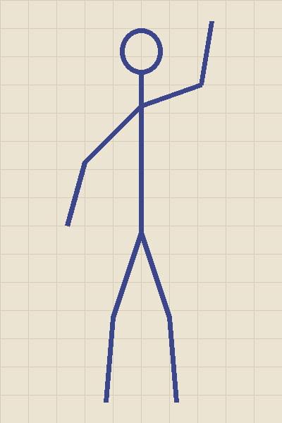
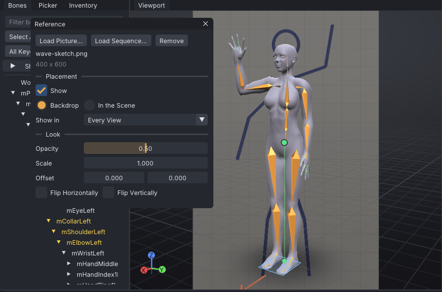

# Reference images

A reference image is a picture, or a numbered sequence of pictures, shown in the view to pose or animate
over: a photo of a pose, a character sheet, or the frames of a video to follow. It shows behind the avatar,
is saved with the project and never goes into the exported `.anim`.

> Related articles: [[Posing]], [[Keys and timeline]], [[Projects and files]], [[Listing media]]

## Usage

### Loading a picture

**View → Reference...** opens the **Reference** window. **Load Picture...** picks a PNG file; it shows as a
backdrop at half opacity and the status bar says "Reference: pose.png". The window shows the file's name and its
size in pixels. Loading another picture replaces the first, and **Remove** takes it out. Loading, removing and
every setting below are one undo step each.

VATs reads PNG only. Save a JPEG or other picture as PNG first, in any image editor or with
`ffmpeg -i photo.jpg photo.png`. Another file shows the message "The reference must be a PNG picture".


*A pose sketch. It ships with this help, as `images/reference-images/wave-sketch.png` in the help's folder, to try
the window with.*


*The sketch as the backdrop at the default half opacity. **Flip Horizontally** would put its raised arm on the
avatar's side.*

### Placement

| Setting | What it does |
|---|---|
| **Show** | Shows or hides the picture without removing it |
| **Backdrop** | Behind everything, fixed to the screen: it stays put while the camera moves. Centred; at scale 1 it is as tall as the view |
| **In the Scene** | A plane standing on the ground 1.5 m behind the avatar, 2 m tall at scale 1, facing the view it is locked to (**Front** with **Every View**). Locked to **Top**, it lies just under the ground with its top towards where the avatar faces. The avatar hides it where it stands in front |
| **Show in** | **Every View**, or one of **Front**, **Back**, **Right**, **Left** and **Top**: the picture then shows only while the camera looks from within 15 degrees of that side, as **View → Camera → Front** and the other view keys put it |

Locking a side-on picture to **Right** and a front-on one to **Front** keeps each out of the way in the other
views.

### Look

| Setting | What it does |
|---|---|
| **Opacity** | 0 (invisible) to 1 (solid); 0.5 at first |
| **Scale** | 0.01 to 100. A backdrop: of the view's height; in the scene: of 2 m |
| **Offset** | Right and up: in view heights for a backdrop, in metres in the scene |
| **Flip Horizontally**, **Flip Vertically** | Mirror the picture; a side view flipped serves the other side |

### Picture sequences

**Load Sequence...** picks any picture of a numbered sequence. VATs takes every file in that folder with the
same name around the last run of digits, in number order: `walk_0001.png`, `walk_0002.png`, ... (`walk_10.png`
comes after `walk_9.png`, and gaps are skipped). The status bar says how many it found, and the window shows
"Picture 12 of 120" as the playhead moves. Files added to the folder later are found when the sequence is loaded
again.

| Setting | What it does |
|---|---|
| **Frame rate** | The rate the pictures were made at; the animation's frame rate when the sequence is first loaded |
| **Starts on frame** | The timeline frame the first picture shows on. Before it the first picture shows; after the last picture, the last one stays. A negative value skips the first pictures |

At timeline frame *f*, the picture shown is number (*f* − start) ÷ the animation's frame rate × the sequence's
frame rate, rounded down (counting from 0). A 24 fps sequence on a 30 fps animation shows picture 24 on frame 30.

Each picture is read from disk when the playhead reaches it, so very large pictures slow playback; 720 pixels
tall is plenty to trace.

### Turning a video into pictures

VATs doesn't read video files. [ffmpeg](https://ffmpeg.org/) turns one into a numbered sequence:

```
ffmpeg -i dance.mp4 -vf fps=30 frames/dance_%04d.png
```

Use the animation's frame rate for `fps=` and each timeline frame gets its own picture. Add `-ss 12 -t 4` before
`-i` to take four seconds from 12 s in, and `scale=-1:720` (`-vf "fps=30,scale=-1:720"`) to make the pictures
720 pixels tall. Then **Load Sequence...** and pick any of them.

### Saving

The project keeps the picture's path, relative to the project where possible (like props), and every setting.
The pictures themselves are not copied: keep them with the project. See
[[Project file format#reference]].

> **Note:** Each actor of a [[Couples and groups|couple or group]] has its own reference, like its own audio
> track: the one shown is the active actor's.

## App and viewer

| | App | Viewer |
|---|---|---|
| Backdrop | behind the avatar and the ground grid | over the world, see-through, under the editor's windows |
| In the Scene | a plane in the view, hidden by the avatar in front of it | a plane in the world, hidden by your avatar and anything else in front of it (before you log in, drawn over the view) |

## See also

- [[Listing media]], to film the finished animation
- [[Posing]]

Category: Animating
