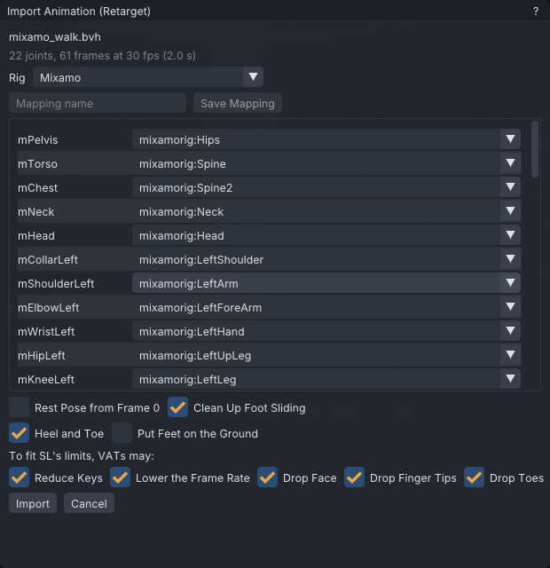

# Retargeting

Retargeting converts a humanoid animation made for another skeleton, such as Mixamo, Unreal or a
motion-capture suit, into a clip on the Second Life skeleton. VATs maps the source bones to SL bones,
corrects for the difference in rest pose, and then trims the result until it fits SL's upload limits.
The converted clip edits and exports like any other.

> Related articles: [[BVH]], [[Export to Second Life]], [[Motion capture]], [[IK]], [[Skeleton]]

## Usage

### Import an animation from another rig

1. Choose **File → Import Animation (Retarget)...** and pick a `.bvh`, `.gltf`, `.glb` or `.fbx` file.
   If the project has unsaved changes, VATs asks to save first.
2. The **Import Animation (Retarget)** dialog shows the file's joint count, frames, frame rate and
   length, and any notes from reading it.
3. Check the **Rig** list. VATs picks the rig whose bone names match best; each entry shows how many
   bones it maps.
4. Check the mapping table, then press **Import**.

The import replaces the current clip, marks the project untitled and modified, and keeps its props. The
report under the buttons starts with **Fits SL's limits** or **Does not fit yet**, followed by the
frame count, frame rate and file size before and after, and each step VATs took.

Change a setting and press **Import Again** to try another result; **Close** keeps the last one.


*A Mixamo walk: 22 joints, 61 frames at 30 fps. Each SL bone lists the source bone it will follow.*

### Worked example: a Mixamo walk

The pictures on this page use `tests/data/mixamo_walk.bvh` from the VATs source tree, a two-second
walk on a skeleton with Mixamo's bone names (`mixamorig:Hips` and so on), Y up, in centimetres; the
script beside it makes the file. Any Mixamo BVH gives the same kind of result.

1. Choose **File → Import Animation (Retarget)...** and pick the file. The dialog reads "22 joints, 61
   frames at 30 fps (2.0 s)". **Rig** shows **Mixamo**; open the list and its entry says "(21 bones)":
   21 SL bones get a source bone. `mixamorig:Spine1` goes unused, because `mChest` takes `Spine2` when
   the file has it, and `mToeLeft` and `mToeRight` read **(none)**, because the file has no
   `LeftToe_End` or `RightToe_End`.
2. Leave **Clean Up Foot Sliding** and the five trades ticked and press **Import**. The report begins
   "Fits SL's limits: 61 frames at 30 fps, 5939 bytes (was 11251)." No trade was needed, so no step is
   listed before the notes: `source up axis: Y`, `hip movement scaled by 0.01124` (centimetres to
   metres, times SL's longer legs), the two toes keeping their rest pose, `Left Leg: 0 heel and 2 toe
   contacts held still`, `Right Leg: 0 heel and 2 toe contacts held still`, `ground: 8.8 cm below the
   floor` and `pelvis lowered by up to 0.4 cm on 61 frames where a leg could not reach`.
3. Press **Close** and play: the avatar walks forward at about 1.5 m/s with the feet planted while they
   carry weight. Select the left leg's IK target: the [[Graph editor]] shows its **IK / FK Blend** curve
   rising to 1 over each contact and back to 0 between them.

[Open the example](example:retarget-walk.vat) to see the result without the source file. The clip has a
key on every frame, as an import does; use **Tools → Loop Tools** ([[Loop tools]]) to take the travel
out and loop it.

### Rigs

| Rig | Source bone names |
|---|---|
| **Mixamo** | `mixamorig:Hips`, `mixamorig:Spine` and so on |
| **CMU / Rokoko BVH** | CMU motion-capture and Rokoko BVH exports |
| **Unreal Mannequin** | Unreal Engine's mannequin skeleton |
| **VRM / Unity Humanoid** | VRM avatars and Unity Humanoid rigs |
| **Blender Rigify (DEF bones)** | the `DEF-` deform bones of a Rigify rig |
| **Manual** | no table; you pick every bone |

Each rig is a JSON table in the app's `data/retarget/` folder, so a new rig needs no rebuild:

```
{
  "name": "My rig",
  "hint": "myrig",
  "mirror": [ ["Left", "Right"] ],
  "bones": {
    "mPelvis": ["Hips"],
    "mChest": ["Spine2", "Spine1"]
  }
}
```

Each SL bone lists the source names to try, in order. Names match without regard to case, and anything
up to the last `:` is ignored, so `Hips` matches `mixamorig:Hips`. `hint` is optional: a source bone
name that contains it gives the table a small lead when VATs picks the best rig. List only the left-side
bones: VATs derives the right side by swapping the words in each `mirror` pair. Every rig table in the
folder appears in the **Rig** list the next time the dialog opens, followed by your saved mappings
([[#Save a mapping]]).

### Map bones by hand

Each row of the table is an SL bone with a list of the source file's bones, or **(none)**. Changing any
row switches **Rig** to **Manual**. Unmapped source bones are dropped.

**Import** is disabled until these bones are mapped: `mPelvis`, `mHead`, `mTorso` or `mChest`, and both
`mShoulder`, `mElbow`, `mHip` and `mKnee`. The dialog lists the missing ones after **Pick source bones
for:**.

### Save a mapping

Type a name in the **Mapping name** field under the **Rig** list and press **Save Mapping**. VATs writes the
mapping as a rig table, `retarget/<name>.json` in the data folder ([[Projects and files#Data folders]]), and
selects it. From then on it appears in the **Rig** list of every import and of **Batch Retarget**, so other files
from the same rig need no hand mapping. Saving under an existing name replaces that file and keeps the old one as
`.bak`. The button is disabled until the mapping is usable, and the field is missing where there is no data
folder.

### Rest pose

VATs compares each source bone's rest orientation with SL's and applies the difference on every frame.
This lets an A-pose source drive SL's T-pose arms without twisting. Y-up sources are turned to SL's Z-up,
and hip travel is scaled by the ratio of SL's leg length to the source's, so the feet cover the right
distance.

The rest pose comes from the file's bind pose. Tick **Rest Pose from Frame 0** when that is wrong or
missing; frame 0 must then be a T-pose or an A-pose.

### Clean up foot sliding

**Clean Up Foot Sliding** (on by default) holds planted feet still with leg IK where the source had them
on the ground. Beside it:

- **Heel and Toe** (on by default): the heel (the ankle) and the toe (`mToeLeft`, `mToeRight`) land and
  leave separately, so a heel-toe roll is held first at the heel, then at the toe. Off, or on a skeleton
  without toe bones, the ankle alone is held.
- **Put Feet on the Ground** (off by default): first moves the hips up or down so the lowest foot touches
  the floor. Use it for a take that floats above the floor or sinks into it.

How it works:

- **Ground.** The ground is the lowest heel or toe over the clip, each measured against its own height
  above the floor in the rest pose. The report gives it, for example `ground: 8.0 cm above the floor`.
- **Contacts.** A heel or toe is down while it is within 5 cm of the ground and moving slower than
  0.3 m/s. It is up again once it is more than 7.5 cm above the ground or faster than 0.6 m/s. Contacts
  shorter than 3 frames are ignored.
- **Holding.** A point that is down is moved onto the ground and held where it landed. When the heel and
  toe are both down, the lower one holds the foot. The toe takes over from the heel where the heel's
  hold has it, so a heel-toe roll does not jump. The foot keeps turning as it was animated. The IK
  blends in over up to 3 frames before each step and out over up to 3 frames after it (fewer when the
  steps are closer together).
- **Out of reach.** Where a leg cannot reach its held foot, the hips come down by the shortfall instead
  of the knee straightening. The knee always keeps at least 3° of bend. The lowering is smoothed: it
  starts up to a third of a second before it is needed and ends up to a third of a second after. The
  smoothing never pushes a foot that is not down below the ground. The report says how far, for example
  `pelvis lowered by up to 2.4 cm on 16 frames where a leg could not reach`.

The result is ordinary leg IK plus `mPelvis` height keys, so export bakes it like any other animation.
A leg that already has IK keys in the range is left as it is and named in the report. One **Ctrl+Z**
undoes the whole clean-up.

The same clean-up is on the menu as **Tools → Clean Up Foot Sliding...**. It opens a window that works
on the current clip. The window shows which legs it works on: both legs, or only the legs of the selected
bones. It shows the current ground height, as `Ground: 8.0 cm above the floor`, and it has the same two
ticks. **Clean Up** runs it and lists the report under **Last clean-up**.

### Fit SL's limits

A retargeted clip often has more keys than an upload allows. Under **To fit SL's limits, VATs may:**,
each ticked trade is tried in this order until the `.anim` is under 250,000 bytes:

1. **Reduce Keys** raises the key reduction tolerance in steps: 0.25°/1 mm, 0.5°/2 mm, 1°/5 mm and
   2°/10 mm.
2. **Lower the Frame Rate** retimes the clip to 24, then 15, then 10 fps.
3. **Drop Face** removes the face bones.
4. **Drop Finger Tips** removes the second and third finger segments.
5. **Drop Toes** removes the toe bones.

All five are ticked by default. The tolerance used is stored in the project's export settings. Untick a
trade and press **Import Again** to try another.

### Retarget a whole folder

Choose **File → Batch Retarget Folder...**. The **Batch Retarget** window takes:

- **Folder**: press **Choose...**. Every `.bvh`, `.fbx`, `.gltf` and `.glb` file directly in it is converted;
  subfolders are not read.
- **Rig**: **Best match for each file** (the default) picks the rig for each file as the import does; or pick
  one rig or saved mapping for every file.
- **Save as**: **Projects (.vat)** or **SL animations (.anim)**.
- The import's own settings: **Rest Pose from Frame 0**, **Clean Up Foot Sliding** and the five trades under
  **To fit SL's limits, VATs may:** ([[#Fit SL's limits]]).

Press **Retarget All**. Each file goes through the same steps as **Import**, and the result is saved as
`<folder>/retargeted/<name>.vat` or `.anim`. When two files share a name (`walk.bvh` and `walk.fbx`), the second
gets its format added: `walk_fbx.vat`. A file that is already there is replaced and kept as `.bak`. The current
project is not touched.

The report table has a row per file:

| Column | Shows |
|---|---|
| **File** | the source file |
| **Saved as** | the file written, or `-` when none was |
| **Fits** | **Yes** when the `.anim` is under SL's limits, **No** when it is not |
| **Size** | the `.anim` size after fitting |
| **Frames** | frames and frame rate, `61 at 30 fps` |
| **Notes** | the rig used and each fitting step, or why the file was skipped: it could not be read, `no rig table matches its bone names`, or `<rig> does not map` and the missing bones |

A project that does not fit is still saved; to split or trim it, import its source file with **File → Import
Animation (Retarget)...** ([[#Split or trim a long clip]]). An `.anim` that does not fit is not written, and the
notes say why. **Open Output Folder** opens the `retargeted` folder.

The first time a batch includes a Mixamo file (a bone name contains `mixamorig`), the window shows a notice under
the buttons, once: Adobe's Mixamo FAQ allows Mixamo animations in commercial projects, but the raw animation
data may not be redistributed as standalone assets. The FAQ is at
`helpx.adobe.com/creative-cloud/faq/mixamo-faq.html`. The notice never stops the batch.

### Split or trim a long clip

When the clip still does not fit, or is over 60 seconds, the dialog shows **Too long or too big for one
upload**:

- **Split into Parts...** cuts the clip into consecutive parts, each under 60 s and the byte limit, and
  saves them as `<source>_part1.vat`, `<source>_part2.vat` and so on beside the source file. Each
  part starts where the previous one ends. If parts with those names exist, VATs lists them; **Replace
  Them** overwrites them and keeps the old files as `.bak`.
- **Trim** keeps only the frame range set in the **from**/**to** field beside it, and reports whether the
  result fits.

## Troubleshooting

### Cannot split: Even two-second parts are over SL's limits

The clip has too many animated bones for any part length. Tick more trades, or trim.

### The arms twist or point the wrong way

The file's bind pose does not match its animation. Tick **Rest Pose from Frame 0** if frame 0 is a
T-pose or an A-pose, and press **Import Again**.

### Import failed: this build has no FBX support

The app was built without FBX (`VATS_FBX=OFF`). Convert the file to glTF or BVH, or use a build with
FBX.

### Only part of the animation came in

A glTF file with several animations: VATs reads the first one, sampled at 30 fps. An FBX file with
several takes: VATs reads the first take and says so in the dialog's notes. Export the wanted animation
on its own from the source tool.

### The spine bends in one place

The source spine drives `mTorso` and `mChest`. The Bento spine bones `mSpine1` to `mSpine4` are not
mapped.

## See also

- [[Motion capture]], which records into VATs directly
- [[Anim format#Size]], how the file size is computed

Category: Import and export
