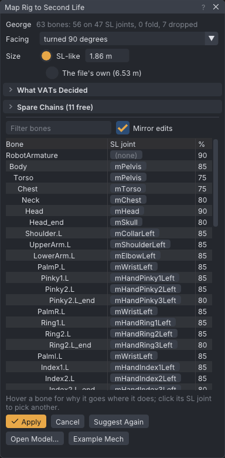
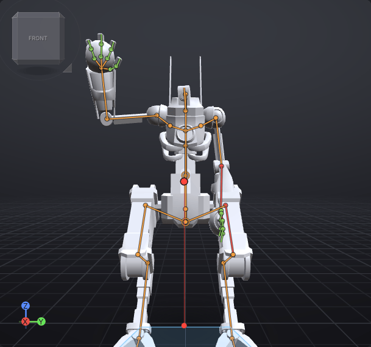

# Rig any model

**Map Rig to Second Life** puts a model rigged to bones of its own (a game character, a creature, a mech from an
asset pack) on Second Life's skeleton. VATs maps each of the model's bones onto an SL joint: the joints stay where the
model has them, and the weights move to the mapped joints. The result is a [[Mesh bodies|mesh body]] you pose with
every tool, and export as a rigged `.dae` the SL uploader takes.

> Related articles: [[Mesh bodies]], [[Rig a model from scratch]], [[Rigging for SL without add-ons]], [[IK]], [[Joint limits]], [[Skeleton]]

A model with no skeleton at all, or one whose own rig you would rather not use, is rigged with markers instead:
[[Rig a model from scratch]].

> **Note:** VATs only maps meshes loaded from your own files. The example mech is George from the Animated Mech
> Pack by Quaternius, released under CC0.

## Usage

These steps use the example mech, so you can follow them before trying a model of your own.

### 1. Load a mech

1. **Rig → Map Rig to Second Life...** (or **Inventory → Bodies → Add Body → Map Rig to Second Life...**).
2. Press **Example Mech**. VATs copies the mech into your library folder (`bodies/mech`) and opens the copy, so the
   mapping you make is saved beside it and the shipped file stays as it is.


*George's 63 bones: 56 on 47 SL joints. Body and Torso share mPelvis; the four palm bones of each hand share the
wrist.*

The view shows the mech as it will be: skinned on SL's skeleton at its own joint positions, turned to face SL's
forward and scaled to an SL avatar's height. The window lists the mech's bones as the file nests them. Each row has
the **SL joint** it maps to and a confidence in **%**; hover a row to read why under the list, and to see the bone
ringed in the view.

- A bone with no SL joint and **no weights**, such as an IK target, a knee pole
  (`PoleTarget.L`) or an `_end` tip, shows **(none)** and is dropped.
- A bone with no SL joint that **carries weights** shows **into** and the bone its weights fold into: its parent's
  joint moves its vertices.
- **What VATs decided** says which way the model faced, how the legs were read and which bones share a joint.

### 2. Fix one mapping

George's back claw, `FootBack.L`, sits on **mFootLeft** with the front claws, so the two cannot bend apart. Give it a
joint of its own:

1. Type `FootBack` in **Filter bones**.
2. Click **mFootLeft** in `FootBack.L`'s row. A list of SL joints opens.
3. Type `mToe` in **Search SL joints** and pick **mToeLeft**.

With **Mirror edits** on, `FootBack.R` goes on **mToeRight** at the same time. Both rows now read **you** for
confidence, and the view updates at once. **Suggest Again** puts every bone back as VATs suggested.

### 3. Apply

Press **Apply**. VATs saves the mapping as `George.rigmap.json` beside `George.dae`, imports the mech as a body in
**Inventory → Bodies** and shows it. From now on the mech loads through its mapping wherever it is read: re-imported,
in a project, or exported.

**Cancel** closes the window and shows the body you had before.

### 4. Pose it

The mech is an ordinary mesh body now:


*The **Waving** pose from the Inventory on the mech: SL's joints at the mech's own shoulders, elbows and wrists.*

- Point at its left ankle, the joint high at the back of the leg, and drag the dot: **Auto IK** swings the leg from
  the hip and bends it at its own knee ([[IK#Auto IK]]).
- Select **mToeLeft** and turn it with the **Rotate** tool: only the back claw moves.
- **Rig → Suggest Joint Limits...** suggests limits for its joints as for any body ([[Joint limits]]).

### 5. Export it

**File → Export Rigged Mesh for SL...** writes the mech as an uploadable rigged `.dae`, with SL's names, its joint
positions, at most 110 joints and no `mRoot`, after the uploader's checks; see
[[Rigging for SL without add-ons#Check and export]].

- The window says **In Second Life it floats 21.0 cm above the ground**: SL works the wearer's height out from the
  mech's own joint positions. **Even out with mSkull** in the findings puts it on the ground
  ([[Rigging for SL without add-ons#Floats or sinks in-world]]).
- Tick **Shape-proof** so the wearer's shape sliders do not stretch it.
- A humanoid modelled in an A-pose: tick **Stand it in SL's rest pose**, so SL animations do not turn its arms too
  far.

Upload it with **Include joint positions** ticked (required), and **Lock scale if joint position defined** with
Shape-proof, to a test grid first ([[Rigging for SL without add-ons#Upload]]).

### Map a model of your own

**Open Model...** takes a rigged `.fbx`, `.gltf`, `.glb` or `.dae`. Importing one as a body
(**Inventory → Bodies → Add Body → Import Body Parts...**) opens this window by itself when half or more of its weighted bones
have no SL name. SL names match exactly, as SL's uploader matches them: `mChest`, LL's aliases such as `hip` or `lThigh`,
or a collision volume such as `BELLY`. A game's `Head`, `Chest` or `L_Hand` is no SL name, so such a model opens here
too. A mapping already saved beside the model is where the window starts.

### Map a four-legged animal

Open a dog, a horse or a fox with **Open Model...**. VATs finds four legs under a level spine and calls it a
quadruped: **What VATs decided** says so, and a **Layout** row appears above **Size**. SL has two ways to rig one:

| Layout | Front legs | Back legs | Use it when |
|---|---|---|---|
| **Front Legs on Arms** (the default) | mCollar > mShoulder > mElbow > mWrist | mHip > mKnee > mAnkle > mFoot | you use quadruped animations made for this layout, the most common in SL |
| **Bento Hind Legs** | mHip > mKnee > mAnkle > mFoot | mHindLimb1..4 | you animate the creature yourself: few SL animations move the hind limbs |

A quadruped needs quadruped animations either way. Human animations and AOs do move the legs, but as arms and legs: a
walk swings the front legs forward and back like arms from SL's rest pose, which has them out level, so they come out
wrong on four legs.

Either way the spine runs level from **mPelvis** at the hips through **mTorso** and **mChest** (where the front legs
hang) to **mNeck** and **mHead**, and the tail goes on **mTail1..6**. Click the other layout to see it at once; your
size and facing stay, and your own joint picks go back to the suggestion.

A first leg bone that runs across the body, from the spine out to the shoulder, becomes **mCollar** with the front
legs on the arms. On a leg SL has no joint for it, so it folds into the pelvis. Animal packs often add a rump or a
second hip bone beside the spine; those fold into **mPelvis** too, and **What VATs decided** lists them.

Birds and fish lie along their spine as well, without four legs. Their mirrored side chains (wings, fins, flippers)
go on **mWing1..4** and **mWing4Fan**; a bird's legs go on SL's legs. The heavier end of the spine is the head, the
lighter one the tail.

### Put a scarf on a spare chain

SL has no joint for a scarf, a ponytail, a skirt or a cape, so their bones fold into the joint they hang from and
cannot move. A model seldom uses all of SL's Bento chains, though, and the uploader takes joint positions: a chain the
model leaves free can carry the part. Its joints go where the part's bones are, and whatever animates that chain moves
the part.

1. Open your model in **Map Rig to Second Life**.
2. Open **Spare chains** above the bone list. It lists SL's spare chains with their joint counts: **free**, **in use**
   by the model's own bones, or holding a part. Hover a chain for its joints and what else moves it in-world.
3. Right-click the first bone of the part in the list (a scarf's first bone, not its weightless root) and choose
   **Use Spare Chain**, then a free chain: **Left wing** for a scarf tail on the left. The chain runs from that bone
   down the one child that carries weights, to where it branches or ends; the menu says how many bones that is.
4. The row now reads `mWing1Left (scarfb)`. Rename what it holds in the **Holds** column of **Spare chains**:
   type `scarf`.
5. A scarf with two tails takes two chains: right-click the other tail's first bone and put it on **Right wing**.
6. **Apply**.

| Chain | Joints | Hangs from in SL | Worn items that also move it |
|---|---|---|---|
| Left wing, Right wing | `mWing1..4` | mChest | Bento wings and their animations |
| Tail | `mTail1..6` | mPelvis | tails and tail animations |
| Left hind limb, Right hind limb | `mHindLimb1..4` | mPelvis | taur and quadruped bodies |
| Groin | `mGroin` | mPelvis | groin attachments |
| Spine 1-2, Spine 3-4 | `mSpine1..2`, `mSpine3..4` | mPelvis, mTorso | (the body hangs from them) |
| Tongue | `mFaceTongueBase..Tip` | mFaceJaw | Bento heads and face animations |
| Left ear, Right ear | `mFaceEar1..2` | the head | Bento heads and ear animations |

- **More bones than joints.** A 14-bone scarf on a 4-joint wing gets its joints spaced evenly along the scarf, and each
  vertex's weight is shared between the two joints either side of where it sits: all on one joint at the middle of
  its stretch, half and half where the next joint is. The scarf bends smoothly instead of in four stiff pieces.
- **Fewer bones than joints.** Each bone takes the next joint at its own head; the rest of the chain stays unused.
- **Your own tail.** A tail with more bones than SL's six folds its last bones into `mTail6`. Right-click its first
  bone and put it on **Tail** again: its weights spread over all six joints.
- **Where it moves from.** A wing hangs from `mChest`, so a scarf tied at the neck on a wing moves with the chest,
  not the neck. **Spare chains** says so under the chain: "Moves with mChest in SL; the model hangs it from mNeck."
  Pick a chain that hangs from the part's own place where you can: a head tuft on the **Tongue** or an ear follows
  the head; on a hind limb it would stay with the hips.
- **Spine 1-2 and 3-4** carry the torso above them: bending them bends the body. Use them only to place a part.

After **Apply**, the reused joints read `mWing2Left (scarf)` in the Bones list, the picker, the graph, the dope sheet,
**Properties** and the status bar; **Properties → Holds** renames the part. They are no longer wings to VATs: Mirror,
Flip Pose and the mirrored export leave their keys alone, and **Suggest Joint Limits** gives each a cone about its own
bone instead of the wing's fold. The `.anim` still names them `mWing2Left`.

To animate the part, see [[Dynamics#Parts on spare chains]]: one click bakes its swing from the body's motion.

### Keep a preset for the next model

Type a name under **Spare chains** (`scarf on wings`) and press **Save as Preset**: the chains, their labels and their
bone names are kept in your library (`spare-presets.json`). On the next model, **Apply Preset** finds the chains by
their bone names, exactly or by their letters alone (`scarfb.003` matches `Scarf_B_03`).

A bone's right-click menu also has **Spare Chain Preset**, with three built-ins that start at that bone: **Scarf on
right wing**, **Ponytail on tail** and **Skirt on hind limbs** (that bone and its mirror-named bone for the other side).
A built-in goes on the side of the body the bone is on: a scarf at the left goes on the left wing.

### Soft-body bones

A game rig's butt, breast, belly and love-handle helpers go on SL's collision volumes rather than folding into the
hips or chest: **BUTT**, **LEFT_PEC** and **RIGHT_PEC**, **BELLY**, **LEFT_HANDLE** and **RIGHT_HANDLE**, and
**UPPER_BACK** and **LOWER_BACK** for back helpers. In SL, fitted mesh and the wearer's avatar physics move these
volumes, and you can key them. A butt bone on one side also carries the top of the thigh: its weight is shared between
**BUTT** at the cheek and **L_UPPER_LEG** or **R_UPPER_LEG** from half way down to the knee, so lifting the leg takes
the lower cheek with it. In VATs the volumes follow their joints, so a pose looks the same as before until you key
them.

## Soft body

The collision volumes a body is weighted to are its soft body in SL: the shape sliders size them, and the wearer's
avatar physics bounces **BELLY**, **BUTT** and the breasts (**LEFT_PEC**, **RIGHT_PEC**). VATs shows them as shells,
shows which flesh each one carries, lets you move flesh between a volume and the joint beside it, and plays SL's
bounce.

### See the shells

Show the mapped body. The volumes it is weighted to appear as see-through shells, clearest at their rims, at SL's real
size and place: the volume's size, the shape's (a bigger **Butt Size** makes a bigger **BUTT**), and its joint's pose.
**View → Bones → Show Collision Volumes** shows or hides them; with no mesh body, it shows all of them. With **Hide
Unused Bones** on, a mesh body shows only the volumes it is weighted to.

Click a shell to select it. Sticks, dots and handles drawn over a shell win the click. With **Collision Volumes in
Front (X-ray)** off, the body hides the shells inside it, and a click on the skin takes the skin's bone.

The **Bones** list has a **Soft body** group: **Butt**, **Left Breast**, **Belly**, **Left Love Handle**, **Upper
Back**, **Left Upper Leg**..., with SL's name beside each. Properties, the status bar, the picker and the view's
hover label use the same names. Keys and the `.anim` keep SL's names.

### See what a volume carries

Hover over a shell or a bone, or select one. The body glows where that joint carries the skin: blue where it carries
a little, through green and yellow, to red where it carries all of it. Turn it off with **View → Bones → Show Weights of
Selected**.

### Share the flesh

Select **Butt** on a mapped body. Properties shows **Share with mHipLeft and mHipRight** and a slider. It moves the
flesh weighted to both **BUTT** and the thighs between them:

- **0**: all of that flesh follows the thighs. Lift a leg and the whole cheek goes with it.
- **0.5**: as the rig split it.
- **1**: all of it follows **BUTT**. The cheek stays with the hips and bounces with SL's avatar physics.

Drag it with a leg lifted and watch the cheek and the glow change. Flesh weighted to only one of them stays where it
is, and every vertex keeps at most four joints. The value is saved in the model's mapping (`"share": {"BUTT": 0.3}`),
so it holds whenever the model loads. Each drag is one undo step.

The joint a volume shares with is the one carrying most of the same flesh. When another joint than the volume's own
carries at least half as much, that one is used: a cheek shares with the thigh rather than the pelvis. A breast
shares with **mChest**. The slider shows only for a model loaded through a mapping.

### Preview the bounce

Turn on **Tools → Avatar Physics Preview**, then play, scrub, or drag the hips. **BELLY**, **BUTT** and the breasts
bounce as SL's avatar physics bounces them, and settle. It is a preview: no key changes. Jump to another frame and
VATs plays the second before it, so the frame shows the bounce it has when the clip plays.

Set it up in **Tools → Dynamics**, under **Avatar physics (SL)**. The presets **Subtle**, **Natural** and **Bouncy**
set everything at once. The tabs are SL's own: **Breast Bounce**, **Breast Cleavage**, **Breast Sway**, **Belly
Bounce**, **Butt Bounce**, **Butt Sway**, each with **Max Effect**, **Spring**, **Gain** and **Damping**, and
**Advanced Parameters** with **Mass**, **Gravity** and **Drag**. The ranges are SL's. A new Physics wearable in SL has
every **Max Effect** at 0, so nothing moves until the wearer raises it.

**Bake Bounce into Keys** writes the bounce as position keys on those volumes, and only on them. You usually do not
want it: SL's avatar physics already bounces them in-world with each wearer's own settings, and baked keys add to
that. Bake for a creature or a move where the bounce belongs to the animation. Baking again starts from the keys from
before the first bake, and **Unbake** in the chain list puts them back.

## Parts and shape keys

Many models are built from several objects (a body, a balaclava, a scarf, a vest) and carry shape keys that switch
features on and off: a body style, a vest without its pouches, closed eyelids, mouth shapes. Blender calls them shape
keys, glTF morph targets and FBX blend shapes. VATs keeps each object as a part you can hide and each shape key as a
slider. Second Life has neither, so **Export Rigged Mesh for SL** writes the mesh as you set it here.

### Hide a part

1. Show the body: double-click it in **Inventory → Bodies**.
2. In **Properties → Body**, open **Parts** (it is under the body in **Inventory → Bodies** too, and **View → Body** lists the parts as well). Each object of the body's files has a checkbox, named as the file names it, for
   example `Balaclava` and `Scarf`. The list shows when the body has two parts or more.
3. Untick **Scarf**. The scarf leaves the view at once.

A hidden part is not drawn and cannot be clicked, and it no longer counts for the floor, **Balance** or the weight
glow. **Show All** ticks every part again. Each click is one undo step.

### Set a shape key

1. Open **Shape Keys**, under **Parts**. The keys are grouped by the start of their names: `Body - Obese` is listed as
   **Obese** under **Body**, and `vrc.v_aa` as **v_aa** under **vrc**. Type part of a name in **Filter shape keys** to
   find one; hover a slider for the full name. **Parts** and **Shape Keys** fold away with a click on their titles,
   and stay as you left them.
2. Drag the **Obese** slider to the right. The body fills out as you drag, and the slider shows the value, 0 to 1.
3. Drag it back to 0 to undo the change, or press **Ctrl+Z**: each drag is one undo step.

One slider drives every object that has a key of that name: a `Body - Obese` key on the body, the vest and the
bandages moves all three together. A key starts at the file's own value; a glTF file can start `Eye - Eyelash ON` at 1.

### What the export keeps

**File → Export Rigged Mesh for SL...** writes the body as it is shown: the hidden parts are left out, and every shape
key is baked into the mesh at its value. The message after the export names both, for example "Hidden parts left
out: Balaclava, Scarf. Shape keys baked in: Body - Obese 100%". The exported `.dae` has no shape keys of its own:
import it again and it looks exactly as it did here. For another variant, change the parts or keys and export again
under another name.

The look is saved with the project, for that body, and in the model's [[#The mapping file|mapping file]], so the
model looks the same the next time you import it. A model rigged to SL's own names gets a mapping file that holds only
its look.

> **Note:** VATs does not draw the textures inside a `.glb` file. A shape key that moves a decal drawn by its texture
> (a mouth, the eyes) shows little in the view, but the export still bakes it.

### Make a face pose from a shape key

Second Life plays bones, not shape keys, so a viseme or an expression made as a shape key reaches SL only as a pose
of the Bento face bones. Right-click its slider and choose **Make Face Pose from This Key**. Only a face key offers it:
one whose motion is mostly on vertices weighted to Bento face bones, not a body or garment key such as
`Body - Emaciated`; its tooltip says **Right-click: make a face pose from it**. VATs finds the face bones'
pose that moves the mesh closest to the key and saves it as a face pose in **Inventory → Poses**, named after the key.
Apply and key it like any face pose, or tick it in **Export Expression Pack...** ([[Face animation#Face poses from
shape keys]]).

The fit can only use the face bones the key's vertices are weighted to. The status bar says how much of the key the
bones explain; under 80% a message says the pose is rough.

## How the suggestion works

VATs looks at the names first, then at the shape of the armature:

- **SL's own names.** A bone already named as an SL joint, or by one of LL's aliases (`hip`, `abdomen`, `lThigh`,
  `lShin`...), goes on that joint at 100 %.
- **Rig tables.** A rig named as Mixamo (or Ready Player Me, which uses Mixamo's names), Rigify, the Unreal mannequin,
  VRM, a CMU/Rokoko skeleton, Daz Genesis 8 or 9, Character Creator, 3ds Max Biped or Rocketbox, MMD, MPFB or
  Auto-Rig Pro maps by the tables in `data/retarget`, the ones [[Retargeting]] uses. A Biped's `Bip01`, `Bip001` or a
  character's own name in front of `L Thigh` all match. When two tables know the names, the one whose joints the
  armature nests the right way wins.
- **Names.** Sides from `.L`, `_l`, `L_`, `Left` and the like (a lone letter counts only beside a separator, so
  `PalmR` is a palm), Daz's `lThighBend` when the rig has an `rThighBend` too, and MMD's 左 and 右; and words for the
  parts: hips or body, spine or torso, chest, neck, head, shoulder or clavicle, upper arm, forearm or lower arm, hand
  or palm, the five fingers, thigh or upper leg, shin, calf or mid leg, foot, toe, tail, wing, ear, eye, jaw. MMD's
  Japanese names are read too, full-width digits and all.
- **Mirrored pairs.** Two chains off one bone that mirror each other across the body are a pair, named or not:
  `Bone.014` and `Bone.017` side by side are a left and a right. Pairs that stand on the floor are legs.
- **Chains.** Each leg is the chain from its thigh (or first leg bone) down to its foot, put on **mHip > mKnee >
  mAnkle > mFoot > mToe** in order: a digitigrade leg (three segments and a foot) fills mHip to mFoot. A twist or roll
  bone, a metatarsal, or a limb bone's second segment (Rigify's `upper_arm.L.001`, Daz's `lShldrTwist`, Unreal's
  `upperarm_twist_01_l` beside the upper arm) takes no joint of its own: it folds into the joint above. Bones a rig
  table placed anchor the chain, so the bones between two of them fill only the joints between, and no joint is taken
  twice. An upright model with a second
  pair of legs puts the back pair on **mHindLimb1..4**, and their common parent on **mHindLimbsRoot**; a lying one
  is a quadruped (see [[Rig any model#Map a four-legged animal]]). Arms are the side chains off the spine, down to
  the hand: a collar when the second bone is the upper arm, then mShoulder, mElbow and the hand on mWrist; palm bones
  side by side all go on the wrist. Fingers follow the hand, by name or in order; a carpal or palm bone before a
  finger folds into the wrist, the finger's last three bones take its three joints, and `Mid` is the middle finger.
- **The spine.** The pelvis is where the legs branch. When the legs hang from a pelvis bone beside the spine (Daz,
  Character Creator, MMD), the hips above both are mPelvis and the legs' pelvis shares it; a 3ds Max Biped hangs its
  legs off its first spine bone, and its pelvis is the bone above. The bone the arms branch from is **mChest**
  whatever its name, because SL's arms hang from mChest; the bones between go on mTorso and mNeck. A Biped hangs its
  clavicles off the neck, though they start lower, on the chest: mChest goes below the neck there, and the neck keeps
  mNeck. A pelvis bone with no weights of its own (a root control) shares mPelvis with the first spine bone, which
  places the joint. When a rig table maps the whole body, its hips and head count wherever they hang: some exports
  hang every bone off the armature's root.
- **Tips.** A chain shorter than its SL chain puts the next SL joint at its last bone's `_end` tip, with no weights:
  a two-bone leg's ankle at the foot, a finger's last joint at its tip, mSkull at the head's tip.
- **Sitting on a joint.** A weighted bone outside the chains that sits on a mapped joint goes on that joint: a
  mech's IK foot that carries the claws joins the foot. It joins only a joint inside the bone it hangs from (a scarf
  off the neck does not join the collar it passes), never one another bone joined that way, and never an eye, which
  turns to look: eyelids stay with the head.
- **The check.** Last, VATs checks the mapping. A bone that is not below the bones of the SL joint above its own, or
  two weighted bones on one joint that do not sit together, show **red**, with a lower confidence; hover the row for
  why. The check runs again as you pick joints.
- **Facing.** The left and right bones say which way the model faces. The toes, a two-legged model's knees, the eyes
  and jaw, and on a lying body its head and tail confirm it, and tell it alone when no names give sides.
  **Facing** turns it by hand.
- **Up.** A glTF file's nodes above the armature count: a `Z_UP` node that turns a Z-up export into glTF's Y up
  stands the model upright.
- **Size.** **SL-like** scales the model to SL's default avatar (1.87 m), or the size you type; **The file's own**
  keeps the size its units give it. An upright model is measured from the floor to the top of its head. A model that
  lies along its spine (four legs, a bird, a fish) is measured by the longer side of its footprint, nose to tail or
  wingtip to wingtip, so an eagle's wingspan is 1.87 m rather than its height; its lowest point is put on the floor.
  A model whose bones all have SL's own names (a part made for SL, such as a devkit's upper body alone) starts on
  **The file's own**: it is at SL's size already, and scaled by its height a part would grow to a whole avatar's.

Several bones on one joint share it: their weights add up on each vertex, and the bone with the most weight places
the joint. Weights still sum to 1 on every vertex, and at most four stay, as in SL.

## The mapping file

`<model>.rigmap.json` beside the model, in UTF-8 JSON:

```
{
	"vats-rig-map": 1,
	"height": 1.865,
	"turn": 1,
	"size": "along the ground",
	"layout": "front legs on arms",
	"bones": {
		"Body": "mPelvis",
		"FootBack.L": "mToeLeft",
		"PoleTarget.L": "",
		"scarfb": "mWing1Left"
	},
	"spares": {
		"WingLeft": {"label": "scarf", "bones": ["scarfb", "scarfb.001", "scarfb.002"]}
	}
}
```

`height` is in metres (`0` keeps the file's own size), `turn` is quarter turns about the vertical, and `bones` names
an SL joint for each bone of the model (`""` folds or drops it). `size` is there for a model that lies along its
spine (its height is then the longer side of its footprint), and `layout` (`"front legs on arms"` or `"bento"`) for a
quadruped. A bone the file does not list keeps the suggestion
when the window opens, and folds or drops when the model is read. `spares` lists the spare chains, each with what it
holds and its bones, root to tip: `WingLeft`, `WingRight`, `Tail`, `HindLeft`, `HindRight`, `Groin`, `Spine12`,
`Spine34`, `Tongue`, `EarLeft` or `EarRight`. Where a spare chain's joints go comes from its bones; their entries in
`bones` only name the joint for the list.

The model's look ([[#Parts and shape keys]]) follows: `"hidden": ["Balaclava", "Scarf"]` lists the parts hidden and
`"shape_keys": {"Body - Obese": 1}` the shape keys set, each only when there is one. A mapping file with an empty
`bones` holds only the look, and the model loads rigged to its own SL names.

## Troubleshooting

### The model faces sideways or backwards

The model had no left and right bones, toes, eyes, jaw, or a head heavier than its tail to tell by. Pick the turn in
**Facing**.

### A creature is huge or tiny

**SL-like** sizes an upright model by its height and a lying one by the longer side of its footprint. Type the size
you want, in metres, next to **SL-like**: a horse is about 2.4 m nose to tail.

### Part of the mesh does not move with a joint

Its bone folds into its parent (the row says **into**). Pick an SL joint for the bone.

### Mapping not saved

The model's folder cannot be written. Copy the model to a folder you can write to, and open the copy.

### An arm or a leg is on the wrong side

Its bones have no side in their names, and VATs could not tell the side from the limb they carry or a mirrored
partner. Pick the joints by hand, with **Mirror edits** off.

### No Parts or Shape Keys under the bodies

**Parts** shows when the body has two objects or more, and **Shape Keys** when one of them has shape keys. A body
exported from VATs has one part and no keys: they were baked in.

### A face key offers no face pose

Right-clicking its slider shows nothing, or **Make Face Pose from This Key** finds nothing to fit: the key moves
vertices that no Bento face bone carries, or that one carries little of, usually because the head is weighted to
**mHead** alone (a model whose face moves by shape keys only has no face weights). Map the model's own lid, brow, jaw or lip bones to SL's face
bones in **Map Rig to Second Life**, or weight the head to them in your modelling program.

### A row is red

The bone looks out of place: hover it to read why. Either it is not below the bones on the SL joint above its own
(an arm on the other side's shoulder), or it shares its joint with a weighted bone it does not sit with (a twist bone
on the elbow). Pick another joint, or **(none)** to fold it into its parent. A four-legged animal whose front legs hang
from its hips shows them red too: SL's arms hang from mChest, so the front legs move with the bone chosen as the chest.

Category: Import and export
