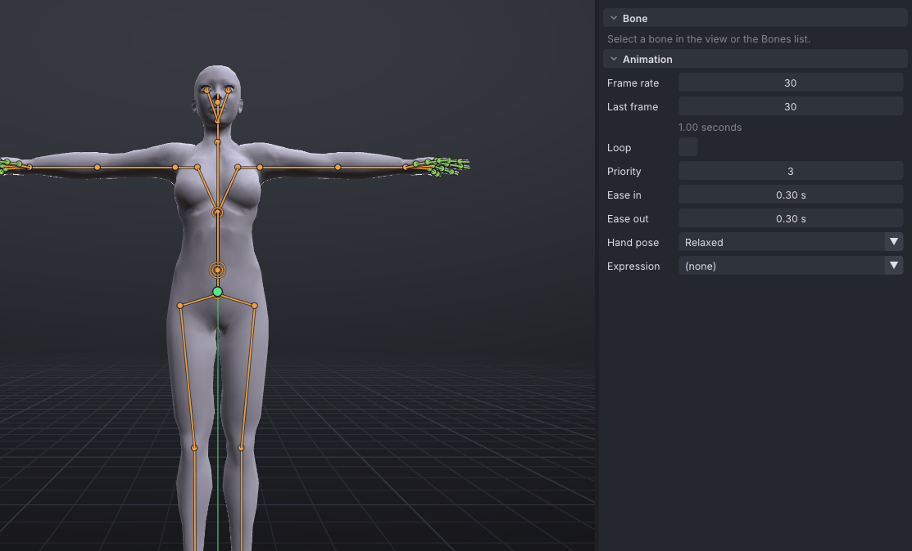
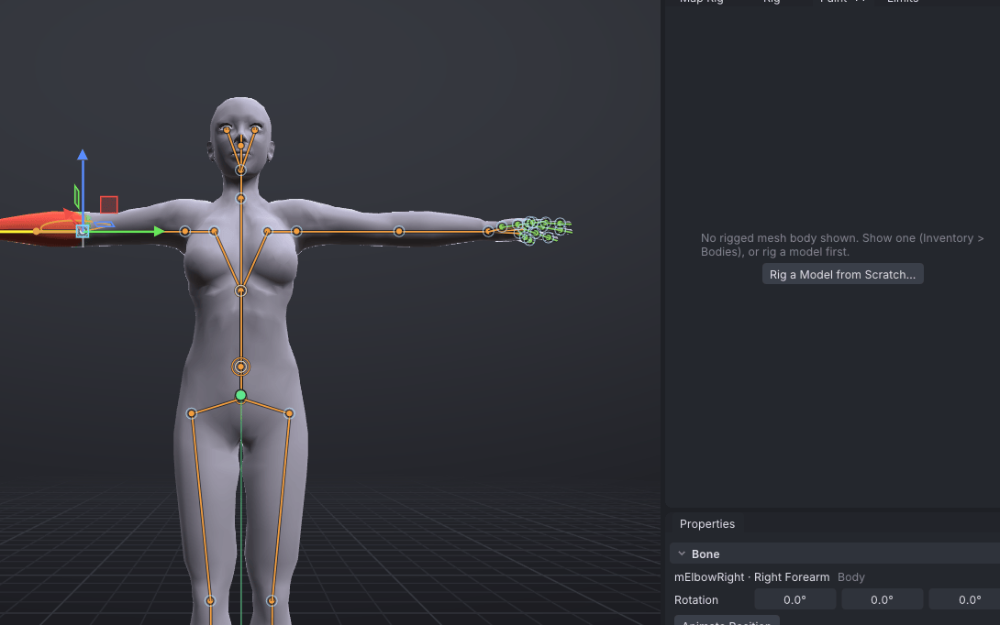

# Rig a model from scratch

**Rig a Model from Scratch** puts Second Life's skeleton into a model that has none: a sculpt, a downloaded statue, a
character whose own rig you do not want. You drag markers onto its joints, VATs fits the rest of SL's skeleton to
them and weights the mesh to the bones, and the model becomes a [[Mesh bodies|mesh body]] you pose, touch up with the
weight brush and export as a rigged `.dae` the SL uploader takes. Creatures are included: tails, wings, hind limbs,
ears and the Bento face.

> Related articles: [[Rig any model]], [[Mesh bodies]], [[Export to Second Life]], [[Rigging for SL without add-ons]]

> **Note:** A model that already has a skeleton of its own is better mapped than rebuilt: see [[Rig any model]]. Rig
> from scratch sets its own skeleton aside. VATs only rigs meshes loaded from your own files; the example mech is
> George from the Animated Mech Pack by Quaternius, released under CC0.

## Usage

These steps use the example mech with its rig left out, so you can follow them before trying a model of your own.

### 1. Open the model

1. **Rig → Rig a Model from Scratch...** (or **Inventory → Bodies → Add Body → Rig a Model from Scratch...**). Importing a
   model with no skeleton through **Import Body Parts** opens the same window on it.
2. Press **Example Mech**. VATs copies the mech into your library folder (`bodies/mech-unrigged`) and opens the copy,
   so the rig you make is saved beside it.

*Green markers are guesses VATs is fairly sure of, yellow and orange less so. White ones are yours.*

VATs stands the model up: it turns it to face SL's forward (**Facing**, guessed from where its feet point), sizes it
to an SL avatar's height (**Size**) and puts its feet on the ground. Then it guesses the markers from the model's
shape: where the legs part, the slimmest points of the arms and legs for the wrists and ankles, where the arm's line
meets the chest for the shoulders. The view names a marker by the SL joint it places when you hover or select it,
and for the guesses to check (amber and red) where their names do not overlap: hover a marker to read a hidden one.
Names stay inside the view. The list says how sure each guess is; hover a row for why.

### 2. Put the markers on the joints

Drag each marker that is off onto the joint, where the limb bends. A marker drops into the middle of the limb under
the pointer, not onto its skin; hold **Shift** to slide it in the view's plane instead.

1. **View → Camera → Front** (or the view cube). Drag the **mElbowLeft** marker to the middle of the mech's elbow.
   With **Mirror** on, the right elbow follows on the other side.
2. **View → Camera → Right**. Check the knees and ankles from the side: the knee marker sits where the leg folds.
3. Let go: SL's skeleton follows. The spine sits between the pelvis (just above the hips) and **neck base**, spaced as
   SL spaces it; the collars sit between the neck and the shoulders; the fingers follow each hand's long axis.

4. A joint without a marker that lands off (a knuckle, the pelvis, a collar): hover it until its name shows, and drag
   it into place. It stays **pinned** there, and the joints below it come along: drag **mHandIndex1Left** and the whole
   index finger moves; drag **mPelvis** and the spine moves while the hips stay on their markers. With **Mirror** on,
   its partner moves too. **Right-click** a pinned joint to let the fit place it again.

While this window holds the rest pose, a drag in the view places joints; it never poses them. Untick **Rest pose** to
pose the model and see the weights bend.

**Guess Again** puts every marker back to VATs' guess.

### 3. Choose the bones it uses

Under **Bones**:

| Box | What it adds |
|---|---|
| **Fingers** | Bento fingers along each hand. Off for a mitten or a paw: the hand moves with the wrist. |
| **Groin** | mGroin, at the **groin** marker. |
| **Tail** | mTail1..6 along the tail, from the **tail tip** marker to where the tail leaves the body. |
| **Wings** | mWing1..4 along each wing, from its **wing tip** to the back. |
| **Hind limbs** | mHindLimb1..4 along a second pair of legs (a taur's), from each **hind foot**. |
| **Ears** | mFaceEar1..2 along each ear, from its **ear tip**. |
| **Face** | The Bento face bones, fitted to the **eye**, **jaw hinge** and **mouth corner** markers. |
| **Fitted mesh** | Shares the weights near SL's collision volumes (belly, butt, chest, arms, legs) with them, so the wearer's shape sliders reshape the mesh. |

Ticking a box adds its markers where VATs guesses them; drag them into place as before. On a new model VATs ticks
**Tail**, **Wings**, **Hind limbs** and **Ears** itself when its shape shows them (something sticking out behind the
hips, spreading out behind the shoulders, a second pair of feet, a head whose top parts into two points), and the
window says which it ticked; untick one it got wrong.

### 4. Check the weights

VATs weights the mesh by *bone heat* every time you let go of a marker or change a box, in the background: each
vertex is warmed by the bone nearest it that it can see, and the warmth spreads over the surface, so the weights
blend smoothly where the limbs bend. The **Weights** section shows the progress and then, per part, what it did.

- Click a bone in the view: its weights glow on the mesh, red where it carries all of it, blue where little.
- Untick **Rest pose** and pose the mech, or play an animation, to see how it bends. Tick it again to place markers.

A model made of several objects (**Weights by part**) weights each one on its own. A part worn over another (a
vest, sleeves, a mask over the face) bends best with what is under it: choose **Copy from** that part, and it takes
the weights of the nearest point of that part's surface. VATs chooses it already for a part that lies close over
another all over.

### 5. Apply

Press **Apply**. VATs saves the rig beside the model (`George.rigmap.json`: the markers, the joints and the weights)
and makes the model a mesh body, shown at once. Reopen it from **Inventory → Bodies**: right-click the body →
**Rig from Scratch...**.

### 6. Touch up the weights

**Rig → Paint Weights...** (the **Paint** tab in the **Rig** workspace) paints the selected bone's weight onto the body
with a brush. It opens with the brush on: **Paint (left drag on the body)** is ticked.

1. Click the bone to paint in the view or the [[Skeleton|Bones list]]: a click on its stick or dot picks it (a drag
   paints), and with no bone picked yet a click on the body picks the bone that carries it there. Its weights glow on
   the body. A click beside the body leaves the bone picked.
2. Choose **Add**, **Subtract** or **Smooth**, the **Radius** and the **Strength**. Hold **Ctrl** while painting to
   do the opposite of Add or Subtract, **Shift** to smooth.
3. Drag on the body. The brush paints only the surface it is on, so the other thigh or the body under a garment is
   left alone; with **Mirror** on, the other side of the body gets the same on the mirrored bone.

While the brush is on, a badge at the top of the view says which bone you are painting; **Esc** turns the brush off.
Paint Weights belongs to the **Rig** workspace: opened from another job's workspace it takes you to Rig, and leaving
Rig for Pose, Animate, Face or Export turns the brush off, so a drag meant to pose never paints; back in Rig it is on
again. In **All** it stays
on wherever you are. Rig a Model from Scratch and Map Rig go to Rig the same way.

Pose the body or play an animation while you paint: the brush paints where you see the mesh. Every vertex keeps at
most SL's four weights, summing to 1. Each stroke is one **Ctrl+Z** and is saved beside the model at once.

Paint Weights works on any rigged mesh body, not only one rigged here: a model you mapped with **Map Rig to Second
Life**, or one already rigged to SL's own names, such as a dev kit body you have the file for. The model file itself
is never changed: the painted weights are kept in the mapping file beside it and laid over the file's own each time
it loads, and the export writes them. If you later change that model's mapping in Map Rig, the painted weights no
longer fit and are dropped (VATs says so); if the model file changes, VATs warns and uses the file's own weights.

### 7. Export it

**File → Export Rigged Mesh for SL...** writes the rigged `.dae` with its joint positions and weights, the parts shown
and the shape keys as you set them, checked against the uploader's rules first; see [[Export to Second Life]] and
[[Rigging for SL without add-ons]]. Upload it with **Include joint positions** ticked.

## Configuration

- **Facing**: which way the model faces, as VATs guessed it or turned by you. Turn it until the model faces you in
  the front view; the markers turn with it.
- **Size**: **SL-like** (1.86 m floor to top of the head, or the height you type) or **The file's own**.

## Tips and tricks

- Model the body in a T-pose or an A-pose, arms away from the body and legs apart: the guesses and the weights are
  best when no limb touches another.
- An A-posed model's arms are rigged as they stand. Tick **Stand it in SL's rest pose** in the export so SL's
  animations do not lower them twice.
- Fingers held apart weigh cleanest. Fingers fused into a mitten: untick **Fingers**.

## Troubleshooting

### A marker is far off

The guess reads the shape, and some shapes mislead it: a long coat hides the legs, a creature has no shoulders where
SL has them. Its row shows orange; drag it to the joint.

### Some vertices follow the wrong bone

Vertices behind a fold or a layer take their weights from around them, and pieces no bone can see at all (claws,
buttons, an eyeball) are warmed by their nearest bones regardless; the **Weights** section counts both. Move the markers so the bones run
down the middle of the limbs, or paint the weights.

### A streamer or a hem sticks straight out

The rig keeps the model's shape at rest: a scarf end or a strap modelled sticking out stays straight, and moves with
the bone it hangs from (VATs does not let it follow a bone that just happens to be near its tip). SL has no bones for
it; to make it swing, rig the model with bones of its own for it and map them onto a spare chain ([[Rig any model]]),
or model it hanging down.

### Painting does nothing

The brush paints the selected bone on the body shown, so select a bone first. Check that **Paint (left drag on the
body)** is ticked: **Esc** and leaving the **Rig** workspace untick it, and opening the window again ticks it. The body
must be rigged: rigged here, mapped with [[Rig any model]], or rigged to SL's own names. A model with no skeleton has
nothing to paint until you rig it.

## See also

- [[Rig any model]]: a model rigged to bones of its own.
- [[Mesh bodies]]
- [[Joint offset inspector]]

Category: Import and export
