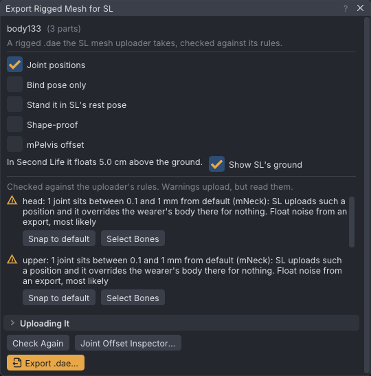

# Rigging for SL without add-ons

VATs takes a mesh rigged to the Second Life skeleton in stock Blender (or any other tool) and writes the
rigged COLLADA file the SL mesh uploader wants, joint positions included, checked against the uploader's own
rules before it is written. No Blender add-on is needed: the rig is an ordinary armature with SL's bone
names, exported as glTF or FBX, and VATs does the part the add-ons used to do.

> Related articles: [[Joint offset inspector]], [[Mesh bodies]], [[Rig any model]], [[Skeleton]], [[Export to Second Life]]

> **Note:** VATs only writes meshes loaded from your own files. Nothing is read from a worn or in-world
> mesh (Third Party Viewer Policy 2.b), and no weights are copied from anyone else's mesh.

## Usage

### Rig the mesh

A model rigged already to bones of its own needs no renaming: map them in **Rig → Map Rig to Second Life...**
([[Rig any model]]) and export it from VATs.

The mesh needs an armature whose bones carry SL's joint names (`mPelvis`, `mTorso`, `mHead`,
`mWristLeft`, ... the names in [[Skeleton]]) and, for fitted mesh, the collision volumes (`PELVIS`,
`BELLY`, `LEFT_PEC`, ...). VATs also takes the viewer's aliases and a prefix before the last `:`, `|` or
`_`, so `Armature_mHead` is `mHead`. Bones VATs cannot name are reported at import and their weights
dropped, so name every bone the mesh is weighted to. `mRoot` is never written.

- **Rest positions.** Each bone's head is the joint's position. Bones where SL has them upload as-is;
  a bone you move in **Edit Mode** uploads as a *joint position* (with **Include joint positions** at
  upload) and moves the wearer's joint there. SL's rest positions are in `avatar_skeleton.xml` in the
  VATs data folder (`data/character`), and the [[Skeleton]] page lists the joints.
- **Bone tails and roll** do not matter to SL: it reads only each joint's position. Point them however
  suits weighting.
- **A-pose or T-pose.** Model in either. A mesh bound in an A-pose skins onto SL's rest skeleton
  through its inverse binds, and its joint positions keep each bone's length along SL's rest axes.
- **Weights.** SL keeps the four heaviest weights on a vertex and normalises them, and so does VATs
  (**Weights → Limit Total** in Blender shows you what stays). Every vertex needs a weight to some SL
  bone.
- **Materials.** One SL face per material, at most 8 per mesh (more become a linkset), each under
  65,534 vertices (corners with their own position, normal and UV).

### Export from Blender

Select the armature and the mesh (or every part of a body), then:

| glTF (**File → Export → glTF 2.0**) | FBX (**File → Export → FBX**) |
|---|---|
| **Format:** glTF Binary (`.glb`) or glTF Separate | **Include → Limit to:** Selected Objects |
| **Include → Limit to:** Selected Objects | **Object Types:** Armature, Mesh |
| **Data → Mesh:** Apply Modifiers, UVs, Normals | **Transform:** Scale 1.00, **Apply Unit** on |
| **Data → Armature:** *Export Deformation Bones Only* **off** | **Armature:** *Only Deform Bones* **off**, *Add Leaf Bones* **off** |
| **Data → Skinning:** Include All Bone Influences (VATs keeps four) | **Bake Animation:** off |
| **Animation:** off | |

Blender 5 has no COLLADA exporter; a `.dae` from an older Blender or another tool imports the same way.
Keep the scene in metres (1 unit = 1 m); a rig modelled in centimetres is measured and brought to metres
on import, and the check says so.

### Import into VATs

1. **Inventory → Bodies → Add Body → Import Body Parts (.dae, .fbx, .gltf, .glb)...** and choose the file, or all
   the parts of a body at once. The mesh does not have to be a body: a creature, a jacket or a tail
   imports the same way ([[Mesh bodies]]).
2. Read **Imported body**: the triangle count of each part, and **weights to an unknown joint** for every
   bone name VATs could not map. A part that is **not rigged to the SL skeleton** was exported without
   its armature, or with none of SL's names.
3. Double-click the body so it is the one shown. The view poses it on its own joint positions.

### Look at the joint positions

**Rig → Joint Offset Inspector...** lists every joint the file binds or weights with its position
against SL's default in mm, whether SL applies it, and whether it looks like float noise from the
export. Read [[Joint offset inspector]] before exporting a body with joint positions: a joint sitting
0.3 mm from default uploads as a real joint position and overrides the wearer's body there for nothing.
**Snap** puts such a joint back on the default.

### Check and export

*A test body with longer legs: the check passes, with a warning about a joint under 1 mm from default.*

1. **File → Export Rigged Mesh for SL...**. The window names the body shown and its parts.
2. Choose what to write:
   - **Joint positions** (on by default): each bound joint where the file bound it. Off: the joints at
     SL's defaults, and the mesh is skinned onto them.
   - **Bind pose only:** for a mesh modelled in another pose (an A-pose) whose bone lengths are SL's.
     No joint positions are written; the inverse binds carry the pose.
   - **Stand it in SL's rest pose:** for an upright humanoid modelled in an A-pose and mapped from its own
     rig ([[Rig any model]]). The joint positions are written with the bones along SL's rest pose (arms out
     level) at the model's own lengths, and the inverse binds carry the A-pose. SL animations are made for
     that rest; without it they turn the arms as far again as the A-pose hangs them.
   - **Shape-proof:** every joint the mesh uses, and every joint above one (**mPelvis** included), gets a
     position, 0.11 mm off SL's default where it sits on it. SL locks a joint's scale against the wearer's
     shape sliders only for a joint the mesh moves over 0.1 mm, so with **Lock scale if joint position
     defined** ticked in the uploader the sliders no longer stretch the mesh. They count toward the 110
     joints.
   - **mPelvis offset:** off by default. The pelvis position changes the wearer's pelvis-to-foot height
     and hover on every animation, so leave it off unless the body needs it; the other joints keep their
     offsets from the pelvis either way.
3. Read the line under the options: **In Second Life it floats 21.0 cm above the ground** (or sinks, or
   stands on it), for the default shape. With **Show SL's ground** ticked, the ground grid is drawn where
   SL will put it under the body while the window is open. See [[#Floats or sinks in-world]].
4. Read the findings. A red item means the uploader would refuse or break the file, and **Export** stays
   disabled until it is fixed; **Fix** applies the one-click fix where there is one. Amber items upload
   but deserve a look; the rest is information (the triangle count, a bound pose, collision volumes).
5. **Export .dae...** and choose where to write it. The message says what was written: meshes,
   triangles, joints listed and how many joint positions, and what to set in the uploader. **Uploading
   it**, under the findings, says the same before you export.

The fixes edit the part as loaded, for this session; the file on disk is never touched. Re-import the
body to start again.

### Upload

1. In the viewer: **Build → Upload → Mesh Model...** and choose the exported `.dae`.
2. **Level of Detail:** the file is the High LOD; let the uploader generate the lower ones, or load your
   own. **Physics:** the lowest LOD is enough for a worn mesh.
3. **Upload options:**
   - Tick **Include skin weight**.
   - Tick **Include joint positions** when VATs wrote any (the export message says). It is required for
     those: without it SL ignores them and skins the mesh onto its default skeleton.
   - Tick **Lock scale if joint position defined** when you exported with **Shape-proof**, so the wearer's
     shape sliders do not stretch the mesh. Without **Shape-proof** it locks only the joints the file
     moved.
   - **Z offset (raise or lower avatar):** leave it at 0, unless the export window says the mesh floats or
     sinks and gives a value for it ([[#Floats or sinks in-world]]). It applies only with **Include joint
     positions** ticked.
   - Leave **Scale** at 1.00.
4. Check the preview with **Skin weights** on: the mesh should sit on the preview avatar as it does in
   VATs. Then **Calculate weights & fee** and **Upload**.

The uploader's own errors, word for word:

| Uploader message | Cause |
|---|---|
| `Skinning disabled due to [COUNT] unknown joints` | Bones with names SL does not know |
| `Rigged to unrecognized joint name [NAME]` | The same, one bone at a time |
| `Skinning disabled due to too many joints: [JOINTS], maximum: [MAX]` | Over 110 joints in one mesh |

VATs checks both before it writes, so either one means the file was changed after export, or another file
was chosen.

> **Tip:** Upload to a test grid first (OpenSim, or Second Life's beta grid Aditi), where uploads cost
> nothing, wear it, and play a stand, a walk and a sit before uploading to the main grid.

### Preview with Local Mesh

Firestorm and the [[VATs Editor (viewer)|SoapStorm viewer]] show a mesh file from disk on a worn rigged
object without uploading it: **Build → Local Mesh**, **Add** the exported `.dae`, select the worn object
to replace and **Apply**. Tick **Apply joint offsets.** to see the joint positions, and **Auto-reload
changed files.** so an export from VATs shows at once. In the VATs Editor the export window has a
**Preview with Local Mesh** button once the viewer provides it (not yet available).

## Format

What the file holds, so the uploader reads it as VATs meant it:

- `Z_UP`, metres, the identity `bind_shape_matrix`: the vertices are written in SL space at the bind
  pose, as VATs holds them.
- Every SL joint as a node with only a `<translate>` (parent-relative), collision volumes under their
  joints. The uploader reads nothing else from a joint node, and applies a translation as a joint
  position when it is over 0.1 mm from the default and the joint is in the skin's joint list.
- The joint list of each mesh: every joint some vertex is weighted to, plus every moved joint with no
  weights (listed so its position uploads), never `mRoot`, at most 110.
- One inverse bind matrix per listed joint, the inverse of where the file bound it. A collision volume's
  carries SL's volume rotation and scale, which the wearer's volume has in-world.
- At most 4 weights per vertex, normalised.
- One `<triangles>` per material, with a phong effect (the base colour, or the texture's file name).

`vats_rig_export <data/character> <out.dae> <files...> [--verify]` does the same from a terminal, and
`--verify` reads the file back and places the joints as the uploader would (within 0.1 mm).

## Troubleshooting

Each finding of the export window, and what to do about it.

### Part is not rigged to the SL skeleton

The file has no skin, or none of its bones has an SL name. Export with the armature selected, and name
the bones as SL does, or map its own bones onto SL's with **Rig → Map Rig to Second Life...**
([[Rig any model]]).

### Over 110 joints in one mesh

SL skins none of a mesh that lists more than 110 joints. The list counts weighted joints and moved
unweighted ones (the message says how many are unweighted). Split the mesh, weight fewer bones, or turn
**Joint positions** off if the moved joints are not meant.

### Weights to unknown joint names

Bones the mesh is weighted to that VATs could not name; their weights were dropped at import and the
vertices keep their other weights. Rename the bones in Blender and export again.

### Vertices with no weights

Vertices with no weight to any SL bone (often those weighted only to an unknown name). SL would put them
at the origin. Weight them in Blender, or **Weight to the nearest bone** gives each 100 % of the nearest
bone the mesh rigs to.

### Joint positions under 1 mm

Joints between 0.1 and 1 mm from default: SL applies such a position, and it overrides the wearer's body
there for nothing. Almost always float noise from an export. **Snap to default** moves them back; the
[[Joint offset inspector]] shows each one.

### Rig scale differs from the measured one

The file declares one unit but its bones measure another against SL's (a creature with its own
proportions, or a rig modelled in centimetres that declares metres). The mesh uploads at the size VATs
shows; check the uploader's preview. A rig in the wrong unit: set the scene unit before exporting.

### Bound in another pose than SL's rest

Information: the mesh was modelled in a pose (an A-pose). The inverse binds carry it and SL skins the
mesh back onto its rest skeleton. With joint positions, each bone keeps its length along SL's rest axes;
**Bind pose only** writes no positions at all.

### mPelvis position

The pelvis was bound away from default. Off (the default), it is not written and the other joints keep
their offsets from it. On, the message says by how much the wearer's pelvis height and hover change.

### Floats or sinks in-world

Every SL viewer works out the wearer's height from the positions of the left leg (**mHipLeft** to
**mFootLeft**), **mTorso**, **mChest**, **mNeck**, **mHead** and **mSkull** (counted 1.41 times), with the
mesh's joint positions applied once it is worn. The region keeps the height of the wearer's shape, and the
viewer stands the mesh half the difference lower, plus the change in leg length. A creature with a level
spine comes to a small height, so it floats; a longer neck makes it sink. **mPelvis**'s position and the
spine bones **mSpine1** to **mSpine4** do not count.

Two fixes:

- **Even out with mSkull** writes an **mSkull** position that brings the height back, so the mesh stands on
  the ground. **mSkull** carries no weights here, so nothing moves on the mesh; the name tag sits higher or
  lower. The fix is not offered when a part is weighted to **mSkull**.
- Or type the value the finding gives into the uploader's **Z offset (raise or lower avatar)**.

The values are for the default shape; a wearer's own shape changes the height the region keeps.

### Arms bound off SL's rest pose

Information: the arms were bound hanging (an A-pose) on joints that keep SL's rest, as a mapped rig is.
SL animations would turn them that far again. Tick **Stand it in SL's rest pose** for an upright humanoid.

### Shape-proof

Information, with **Shape-proof** ticked: how many joints are listed, and how many were moved 0.11 mm only
so they count. Tick **Lock scale if joint position defined** in the uploader.

### Parts on spare chains

Information, for a mapped model with a part on a spare chain ([[Rig any model#Put a scarf on a spare chain]]): the
chain's joints and how far each sits from SL's default. Upload with **Include joint positions**, and tick
**Shape-proof** and **Lock scale if joint position defined** so the wearer's shape sliders do not stretch it. Keys on
those joints at a higher priority win over yours, and worn Bento wings or a tail with animations of their own fight
the part. A warning when joint positions are off: the part would be wrapped round SL's own chain.

### Vertices sharing a position, weighted differently

The uploader keeps one set of weights per vertex position, not per vertex. Two vertices at the same spot
(within 1/100,000 of the model's size) weighted to different bones get the same weights, so touching
plates or lips on different bones tear apart or stick together in-world. Vertices that share a position
and weights, as on a UV seam, are fine. **Nudge apart** moves each extra one along its normal by a few
hundredths of a millimetre.

### Collision volumes

Information: the mesh is fitted mesh, weighted to collision volumes. Their inverse binds carry SL's
volume rotation and scale. A moved volume uploads as a joint position like a joint.

### More than 8 materials

The uploader takes 8 faces per mesh and splits the rest into further meshes, uploaded as a linkset.
Join materials in Blender to keep one mesh.

### Over 65,534 vertices in one material

The uploader's faces are indexed with 16 bits, and it refuses a mesh whose material has more corners
than that (corners with their own position, normal and UV). Split the material, or the mesh.

### The mesh is the wrong size in the uploader's preview

Set **Scale** to 1.00 in the uploader; VATs writes metres. If VATs showed the mesh at the wrong size
too, the file's unit is off: see **Rig scale differs** above.

### The uploader shows the mesh in a heap or stretched

**Include skin weight** is off, or the preview has **Skin weights** unticked. With both on, a mesh that
still looks wrong was bound to bones that are not where SL's are: compare the [[Joint offset
inspector]] with what you meant to move.

Category: Second Life
