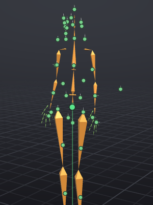

# Skeleton

VATs animates the Second Life avatar skeleton: 133 joints (the classic body plus the Bento hands, face, wings, tail, hind limbs and groin), 47 attachment points and 26 collision volumes. Every bone you key is exported by name to the `.anim`, so what you pose in VATs is what the avatar does in-world.

> Related articles: [[Posing]], [[Mesh bodies]], [[Anim format]], [[Hold and bind]]

## Usage

### Showing and hiding bone groups

Bones are grouped into categories. Show or hide each group from **View → Bones**:

| Menu item | Bones |
|---|---|
| **View → Bones → Show Body Bones** | The classic body: pelvis, torso, neck, head, arms, legs |
| **View → Bones → Show Hand Bones** | The Bento fingers of both hands |
| **View → Bones → Show Face Bones** | The Bento face: brows, eyelids, eyes, nose, cheeks, lips, jaw, tongue |
| **View → Bones → Show Wing Bones** | The Bento wings |
| **View → Bones → Show Tail Bones** | The Bento tail |
| **View → Bones → Show Hind Limb Bones** | The Bento hind legs |
| **View → Bones → Show Groin Bones** | The Bento groin bone |
| **View → Bones → Show Attachment Points** | Chest, Right Hand, Skull and the other attachment points |
| **View → Bones → Show Collision Volumes** | The collision volumes |

Body and Hands are shown by default; the rest are hidden. The **Bones** tab has the same switches in its **Show** section. Hidden bones keep their keys and still play; hiding only stops you picking them in the view.

**View → Bones → Bones in Front (X-ray)** draws the bones over the body so that bones inside the mesh can be clicked.

Some Bento bones fold back on themselves. `mSpine1` goes up from the hips and `mSpine2` comes straight back down,
so each would lie on top of `mPelvis`; `mSpine3` and `mSpine4` do the same over `mTorso`. They are drawn as small
rings at their joints instead: one at the hips' joint, two nested ones where `mTorso` starts and one where `mChest`
starts. Click a ring to select that bone; click the same spot again for the next bone there. Bend one of them and
it is drawn as a bone again. `mFaceEyeAltLeft` and `mFaceEyeAltRight` are rings on the eyes for the same reason.

### Choosing a body

**View → Body** picks the body drawn around the skeleton:

- **SL Default** and **SL Default (Male)**: the Second Life default avatar, as seen in-world.
- **Female** and **Male**: alternative bodies.
- **Skeleton Only**: bones only.
- Any imported mesh bodies, listed under **Mesh bodies**. See [[Mesh bodies]].

The body is only for display. It changes nothing in the exported animation.

### Attachment points

Attachment points are bones too: select, rotate, move and key them like any other bone. Whatever is worn on a point moves with it in Second Life, so an animation can wave a worn sword or pass a worn glass from one hand to the other ([[Hold and bind]]).

*The skeleton with **View → Body → Skeleton Only** and **View → Bones → Show Attachment Points**: each green dot is an attachment point, clickable like a bone.*

A rotation key on an attachment point replaces the point's default rotation, the way Second Life applies it in-world. On export VATs writes the rest rotation combined with your pose, so a worn object sits the same in-world as in VATs.

### Collision volumes

Collision volumes are the shapes Second Life uses for physics and for fitting some clothing. **View → Bones → Show Collision Volumes** draws them so you can check where the body is; they are hidden by default.

## Tips and tricks

- In the **Bones** tab, type in **Filter bones...** to find a bone by name, for example `Wrist` or `Eye`.
- The classic eyes are `mEyeLeft` and `mEyeRight`; the Bento face has its own alternate eyes, `mFaceEyeAltLeft` and `mFaceEyeAltRight`. Mesh heads use one pair or the other, so check which one your head follows.

## Troubleshooting

### A bone can't be clicked

The bone's category is hidden, or it sits inside the body. Turn its group on in **View → Bones**, or switch on **View → Bones → Bones in Front (X-ray)**. Clicking the same spot again selects the next bone underneath.

### A worn object sits at the wrong angle in-world

A rotation key on its attachment point replaces the point's default rotation. Reset the point (**Alt+R**) at the frames where it should keep its normal angle, or delete those keys.

## See also

- [[Interface]]
- [[Posing]]
- [[Mesh bodies]]
- [Second Life Wiki: Bento Skeleton Guide](https://wiki.secondlife.com/wiki/Project_Bento_Skeleton_Guide)

Category: Reference
