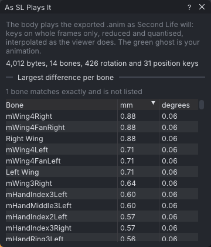

# Preview as SL plays it

**View → Preview as SL Plays It** plays your animation the way Second Life will play the `.anim` you
export: VATs exports it in memory with the project's export settings, reads the bytes back, and the body
plays that file. Your own animation stays in view as a green ghost, and a table lists how far each bone
ends up from where you animated it.

> Related articles: [[Export to Second Life]], [[Onion skin]], [[Anim format]]

## Usage

### Turn the preview on

Tick **View → Preview as SL Plays It**. The **As SL Plays It** window opens, and until you turn the preview
off the body shows the exported file:

- keys on whole frames only: VATs samples every whole frame when it exports;
- the keys **Reduce keys** leaves (see [[Export to Second Life#Reduce keys]]), each rotation and position
  rounded to the 16-bit steps of the file;
- rotations blended between keys the way the viewer blends them (normalised linear blend), positions in a
  straight line, and the first and last key held before and after them;
- bones the file leaves out at rest.

The green ghost is your animation as you made it, drawn as the body, or as bones when **View → Onion Skin →
Bones Only** is on or the body is **Skeleton Only**. The ghost shows while the animation plays too.

The preview is not saved with the project. Closing the **As SL Plays It** window turns it off.

### While you edit

While you drag a bone or a handle in the view, the body shows your edit and the ghost goes away. Nothing is
exported while the left mouse button is held down; when you let go, VATs exports again and the preview comes
back. VATs checks for changes at most four times a second and exports only when something that goes into the
file has changed: keys, pins, timing, priorities or export settings. Props and the audio track are not part of
the file.

> **Note:** Editing works on your animation: a click in the view shows your pose for that moment, so a drag
> starts from it, and the mirror commands and saving a pose take your pose. Only a move or rotate started
> from the keyboard (**G** or **R**, Blender preset) starts from the pose on screen, SL's.

### Read the table

*The loop walk as Second Life plays it: every bone within about a millimetre of the animation.*

**Largest difference per bone** lists each bone with the largest distance (**mm**) and the largest
rotation (**degrees**) between SL's playback and your animation, over every whole frame. Both are measured
in the world, on the body of **Bake shape**, so a bone moved by its parents counts: a fingertip adds up the
differences of the arm above it.

- The table starts sorted by **mm**, worst first. Click **degrees** to sort by rotation instead; click again
  to reverse.
- Bones that differ by less than 0.005 mm and 0.005 degrees are left out, and a line above the table counts
  them.
- Click a bone to select it and go to the frame where its difference is largest (by the column the table is
  sorted on). Hover it to see both frames.

The line above the table gives the file's size in bytes, its bones and its rotation and position keys. An
imported `.anim` you have not edited exports byte for byte as it came in, and the window says `Unchanged
since import: plays the file as it came in`.

## Tips and tricks

- Differences come from **Reduce keys**. Lower the tolerances where the table shows bones you care about,
  and watch the upload size in **Properties → Export** (see [[Export to Second Life#Check the upload size]]).
- With **Reduce keys** set to **Anywhere on the body**, the table's **mm** column stays within the distance you
  set, give or take the file's rounding (under 0.2 mm); see [[Export to Second Life#Reduce keys]].
- The preview plays the file baked on **Bake shape**. The height files of **Also export for heights** are
  not previewed (see [[Export to Second Life#Export for other heights]]).
- Sub-frame keys (after a stretch or a retime) are gone in the export; the table shows what that costs.

## Troubleshooting

### The window says Nothing to play

The animation cannot be exported, for example because it is longer than 60 seconds or nothing is keyed. The
reasons are listed under it.

### The preview does not match in-world

The preview plays your animation alone, fully blended in. In SL, ease in and ease out blend it with what
plays underneath, and animations of higher priority take over the bones they animate (see
[[Animation priority]]).

## App and viewer

> **Note:** In the [[VATs Editor (viewer)|viewer]] the avatar you wear plays the exported file, and the ghost is
> green bone lines over the world. In a [[Couples and groups|couple or group]] the preview plays the actor you
> are editing; while that is another actor, your avatar plays its own animation as usual.

## See also

- [[Export to Second Life]]
- [[Anim format]]

Category: Second Life
