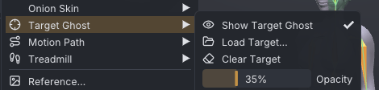
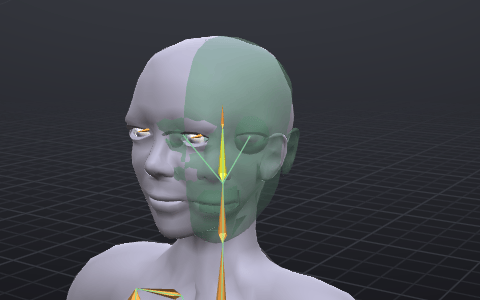
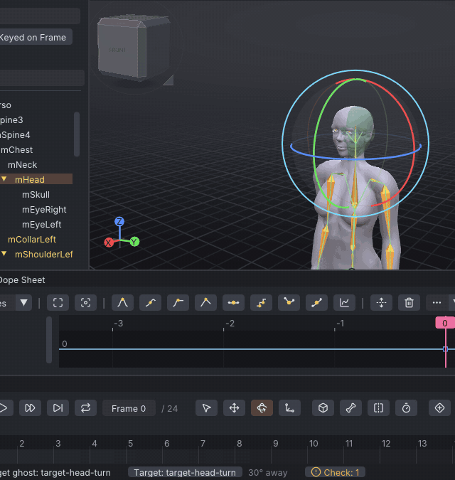

# Target ghost

The target ghost is another animation drawn as a see-through green body over your avatar: the pose you are aiming
for, at the frame you are on. Match it by eye, dragging the gizmo, the keys on the timeline or the handles in the
graph, and the status bar tells you how far the selected bone still is from it. Tutorials use it to show the pose
each step should reach.

> Related articles: [[Onion skin]], [[Posing]], [[Tutorials]]

## Usage

### Loading a target

Choose **View → Target Ghost → Load Target...** and pick a project (`.vat`) or a Second Life animation (`.anim`).
The ghost appears at once, and your open project stays as it is: nothing is added to it and nothing is undone.

From a project the ghost takes the clip that was being edited when it was saved (its active clip, see [[Clips]]),
with that clip's [[Props]]. A project with several actors (see [[Couples and groups]]) gives a ghost for every actor,
each where it stands in that project's scene: the one with the same name as the actor you edit sits on yours (when
your project has no actors, the actor that was being edited when it was saved does), and switching the actor you
edit moves the ghosts with the scene. The status bar's distance is to the matching ghost. A help page's **Show the target**
button loads one of the help's example projects the same way (see [[#In the help]]).

### What the ghost shows

*The target turns the head 30° to the avatar's left; the head still faces front.*

- **Time.** Frame 12 of your animation shows frame 12 of the target, whatever either one's frame rate. Before
  frame 0 and after the target's last frame, the ghost holds its first and last pose.
- **Body.** The ghost is drawn in the body the view uses (**View → Body**, or your [[Mesh bodies|mesh body]]), in
  your avatar's shape. With **Skeleton Only** it is drawn as bones.
- **Bones.** Its bones are thin green lines, for the bone groups **View → Bones** shows (**Show Body Bones**, **Show Hand
  Bones**, ...), face bones left out.
- **Props.** The target's props are drawn see-through in the same green, held or placed as they are there.
- **Playback.** The ghost plays along with your animation, frame for frame, so you can compare timing. The
  [[Onion skin]] ghosts hide while playing; this one does not.
- It is see-through and can't be clicked, so it never gets in the way of selecting bones.

### Matching a pose

Select the bone to match. While the ghost shows, the status bar carries a **Target:** button with the target's
name and, next to it, how far the selected bone is turned from the target at this frame: `30° away`. The number
turns green under 5°.

The distance is the bone's own rotation against its parent, so a bone matches once it is turned right, even when
its parent is not. Work from the hips outward: match the parents first and the children follow them into place.

### Hiding and clearing

- Click the **Target:** button in the status bar, or untick **View → Target Ghost → Show Target Ghost**, to hide
  the ghost and show it again. While it is hidden the button is dimmed.
- **View → Target Ghost → Clear Target** removes it.

The target is not saved with your project and is not part of undo. It stays when you open or start another
project, which is what a tutorial needs (open the example, then show the target, in either order), and goes when
you clear it or close the program.

### Worked example: matching a head turn

[Open the example](example:posing-head-turn.vat) [Show the target](target:target-head-turn.vat)

The project is the Relaxed Stand with **mHead** keyed straight ahead at frame 0; the target is the same pose with
the head turned 30° to the avatar's left.

1. Select **mHead** and pick the **Rotate** tool. The status bar says `30° away`.
2. Drag the blue ring (Z) of the gizmo. The head turns and the distance counts down; drag past the ghost and it
   counts up again.
3. Stop when the head sits inside the ghost's head and the distance is green. **Properties → Bone → Rotation**
   shows a Z value near `30`.

### In the help

Tutorials pair an example with its target, as above: **Open the example** opens the starting project, **Show the
target** shows the pose to reach without touching what you have open.

### From the command line

`--target <file.vat | file.anim>` loads a target when the program starts, as **Load Target...** does. See
[[Command line]].

## Configuration

All in **View → Target Ghost**:

| Setting | Values | Default | What it does |
|---|---|---|---|
| **Show Target Ghost** | on / off | on once a target is loaded | Draws the ghost; greyed out until a target is loaded |
| **Opacity** | 10–90% | 35% | How solid the ghost body and its props are |

The colour is part of the colour theme: a soft green in **Dusk**, a deeper green in **Studio Grey**. Neither
setting is saved: each run starts at 35% with no target.

## Tips and tricks

- To compare timing, show the finished animation as the target and play yours: where yours runs ahead or behind,
  the ghost pulls apart from the body.
- Lower **Opacity** when the ghost hides your avatar's own shape; raise it when it is hard to see against the body.
- The distance only counts rotation. For the hips' position, compare their place with the ghost's by eye, from the
  front and the side.
- A [[Onion skin#Pinned ghosts|pinned ghost]] is a pose of your own animation; the target ghost is someone
  else's. Both can show at once: pinned violet, target green.

Collision volumes the target keys (a baked jiggle on `BELLY`, `BUTT` or the pecs, see [[Dynamics]]) show as small
green rings at the volumes' places, which the body does not show: scrub, and match your volume's bounce to the ring.

## Troubleshooting

### No ghost appears

Check that **View → Target Ghost → Show Target Ghost** is ticked (the **Target:** button in the status bar is not
dimmed). Where the target's pose is the same as yours, the ghost sits inside your avatar and only the green bone
lines show.

### The distance does not show

It shows while the ghost shows and a bone or attachment point is selected; with several selected, it is the last
one you clicked. An IK handle or a prop has none.

### A .anim is refused

**Load Target...** checks a `.anim` as **File → Import SL .anim...** does, and says why it can't be read.

## App and viewer

> **Note:** In the viewer the ghost is drawn in the world the way other actors' bodies are, see-through, in the
> body chosen under **View → Body** (the viewer can't draw a copy of the avatar you wear), with its bones as thin
> green lines. See [[VATs Editor (viewer)]].

## See also

- [[Onion skin]]
- [[Posing]]
- [[Tutorials]]
- [[Command line]]

Category: Animating
